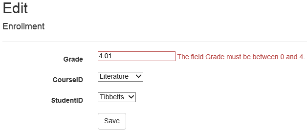
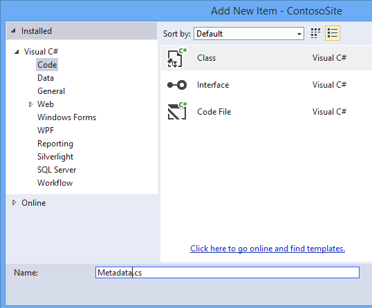
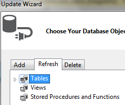

EF Database First with ASP.NET MVC: Enhancing Data Validation
====================
by [Tom FitzMacken](https://github.com/tfitzmac)

> Using MVC, Entity Framework, and ASP.NET Scaffolding, you can create a web application that provides an interface to an existing database. This tutorial series shows you how to automatically generate code that enables users to display, edit, create, and delete data that resides in a database table. The generated code corresponds to the columns in the database table.
> 
> This part of the series focuses on adding data annotations to the data model to specify validation requirements and display formatting. It was improved based on feedback from users in the comments section.

## Add data annotations

As you saw in an earlier topic, some data validation rules are automatically applied to the user input. For example, you can only provide a number for the Grade property. To specify more data validation rules, you can add data annotations to your model class. These annotations are applied throughout your web application for the specified property. You can also apply formatting attributes that change how the properties are displayed; such as, changing the value used for text labels.

In this tutorial, you will add data annotations to restrict the length of the values provided for the FirstName, LastName, and MiddleName properties. In the database, these values are limited to 50 characters; however, in your web application that character limit is currently not enforced. If a user provides more than 50 characters for one of those values, the page will crash when attempting to save the value to the database. You will also restrict Grade to values between 0 and 4.

Open the **Student.cs** file in the **Models** folder. Add the following highlighted code to the class.

[!code[Main](enhancing-data-validation/samples/sample1.xml?highlight=5,15,17,20)]

In Enrollment.cs, add the following highlighted code.

[!code[Main](enhancing-data-validation/samples/sample2.xml?highlight=5,10)]

Build the solution.

Browse to a page for editing or creating a student. If you attempt to enter more than 50 characters, an error message is displayed.

Browse to the page for editing enrollments, and attempt to provide a grade above 4.

For a full list of data validation annotations you can apply to properties and classes, see [System.ComponentModel.DataAnnotations](https://msdn.microsoft.com/en-us/library/system.componentmodel.dataannotations.aspx).

## Add metadata classes

Adding the validation attributes directly to the model class works when you do not expect the database to change; however, if your database changes and you need to regenerate the model class, you will lose all of the attributes you had applied to the model class. This approach can be very inefficient and prone to losing important validation rules.

To avoid this problem, you can add a metadata class that contains the attributes. When you associate the model class to the metadata class, those attributes are applied to the model. In this approach, the model class can be regenerated without losing all of the attributes that have been applied to the metadata class.

In the **Models** folder, add a class named **Metadata.cs**.

Replace the code in Metadata.cs with the following code.

[!code[Main](enhancing-data-validation/samples/sample3.xml)]

These metadata classes contain all of the validation attributes that you had previously applied to the model classes. The **Display** attribute is used to change the value used for text labels.

Now, you must associate the model classes with the metadata classes.

In the **Models** folder, add a class named **PartialClasses.cs**.

Replace the contents of the file with the following code.

[!code[Main](enhancing-data-validation/samples/sample4.xml)]

Notice that each class is marked as a `partial` class, and each matches the name and namespace as the class that is automatically generated. By applying the metadata attribute to the partial class, you ensure that the data validation attributes will be applied to the automatically-generated class. These attributes will not be lost when you regenerate the model classes because the metadata attribute is applied in partial classes that are not regenerated.

To regenerate the automatically-generated classes, open the ContosoModel.edmx file. Once again, right-click on the design surface and select **Update Model from Database**. Even though you have not changed the database, this process will regenerate the classes. In the **Refresh** tab, select **Tables** and **Finish**.

Save the ContosoModel.edmx file to apply the changes.

Open the Student.cs file or the Enrollment.cs file, and notice that the data validation attributes you applied earlier are no longer in the file. However, run the application, and notice that the validation rules are still applied when you enter data.

>[!div class="step-by-step"]
[Previous](customizing-a-view.md)
[Next](publish-to-azure.md)