Getting Started with Entity Framework 6 Code First using MVC 5
====================
by [Tom Dykstra](https://github.com/tdykstra)

[Download Completed Project](http://code.msdn.microsoft.com/ASPNET-MVC-Application-b01a9fe8) or [Download PDF](http://download.microsoft.com/download/0/F/B/0FBFAA46-2BFD-478F-8E56-7BF3C672DF9D/Getting%20Started%20with%20Entity%20Framework%206%20Code%20First%20using%20MVC%205.pdf)

> > [!NOTE] 
> > 
> > A newer version of this tutorial series is available: [Get started with ASP.NET Core and Entity Framework Core using Visual Studio 2015](https://docs.asp.net/en/latest/data/ef-mvc/intro.html).
> 
> 
> The Contoso University sample web application demonstrates how to create ASP.NET MVC 5 applications using the Entity Framework 6 and Visual Studio 2013. This tutorial uses the Code First workflow. For information about how to choose between Code First, Database First, and Model First, see [Entity Framework Development Workflows](https://msdn.microsoft.com/en-us/library/ms178359.aspx#dbfmfcf).
> 
> The sample application is a web site for a fictional Contoso University. It includes functionality such as student admission, course creation, and instructor assignments. This tutorial series explains how to build the Contoso University sample application. You can [download the completed application](https://code.msdn.microsoft.com/ASPNET-MVC-Application-b01a9fe8).
> 
> A Visual Basic version translated by Mike Brind is available: [MVC 5 with EF 6 in Visual Basic](http://www.mikesdotnetting.com/Article/241/MVC-5-with-EF-6-in-Visual-Basic-Creating-an-Entity-Framework-Data-Model) on the Mikesdotnetting site.
> 
> ## Software versions used in the tutorial
> 
> 
> - [Visual Studio 2013](https://www.microsoft.com/visualstudio/eng/2013-downloads)
> - .NET 4.5
> - Entity Framework 6 (EntityFramework 6.1.0 NuGet package)
> - [Windows Azure SDK 2.2](https://go.microsoft.com/fwlink/p/?linkid=323510) (optional)
>   
> 
> The tutorial should also work with [Visual Studio 2013 Express for Web](https://www.microsoft.com/visualstudio/eng/2013-downloads#d-2013-express) or Visual Studio 2012. The [VS 2012 version of the Windows Azure SDK](https://go.microsoft.com/fwlink/p/?linkid=323511) is required for Windows Azure deployment with Visual Studio 2012.
> 
> 
> ## Tutorial versions
> 
> For previous versions of this tutorial, see [the EF 4.1 / MVC 3 e-book](https://social.technet.microsoft.com/wiki/contents/articles/11608.e-book-gallery-for-microsoft-technologies.aspx#GettingStartedwiththeEntityFramework4.1usingASP.NETMVC) and [Getting Started with EF 5 using MVC 4](../../older-versions/getting-started-with-ef-5-using-mvc-4/creating-an-entity-framework-data-model-for-an-asp-net-mvc-application.md).
> 
> ## Questions and comments
> 
> Please leave feedback on how you liked this tutorial and what we could improve in the comments at the bottom of the page. If you have questions that are not directly related to the tutorial, you can post them to the [ASP.NET Entity Framework forum](https://forums.asp.net/1227.aspx), the [Entity Framework and LINQ to Entities forum](https://social.msdn.microsoft.com/forums/en-US/adodotnetentityframework/threads/), or [StackOverflow.com](http://stackoverflow.com/).
> 
> If you run into a problem you can't resolve, you can generally find the solution to the problem by comparing your code to the completed project that you can download. For some common errors and how to solve them, see [Common errors, and solutions or workarounds for them.](advanced-entity-framework-scenarios-for-an-mvc-web-application.md)

## The Contoso University Web Application

The application you'll be building in these tutorials is a simple university web site.

Users can view and update student, course, and instructor information. Here are a few of the screens you'll create.

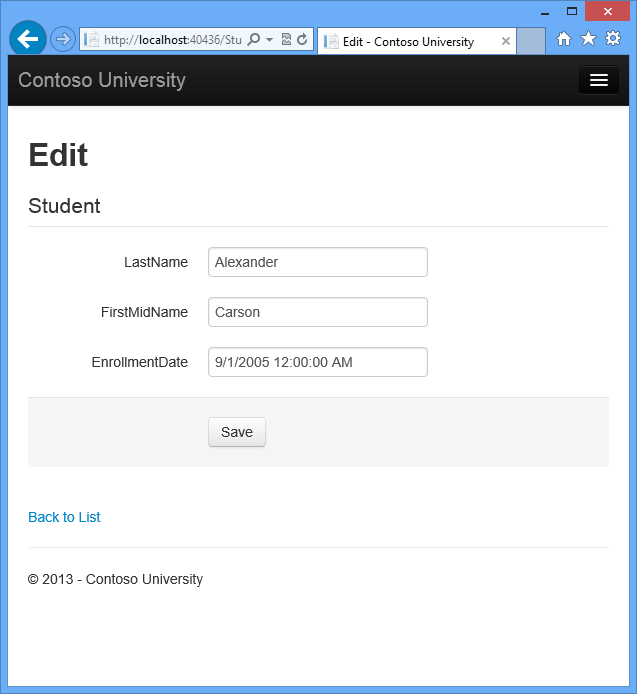

The UI style of this site has been kept close to what's generated by the built-in templates, so that the tutorial can focus mainly on how to use the Entity Framework.

## Prerequisites

See **Software Versions** at the top of the page. Entity Framework 6 is not a prerequisite because you install the EF NuGet package as part of the tutorial.

## Create an MVC Web Application

Open Visual Studio and create a new C# Web project named "ContosoUniversity".

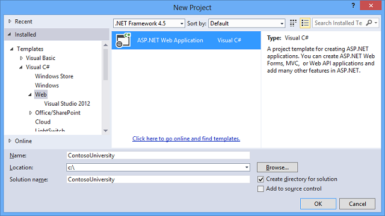

In the **New ASP.NET Project** dialog box select the **MVC** template.

If the **Host in the cloud** check box in the **Microsoft Azure** section is selected, clear it.

Click **Change Authentication**.

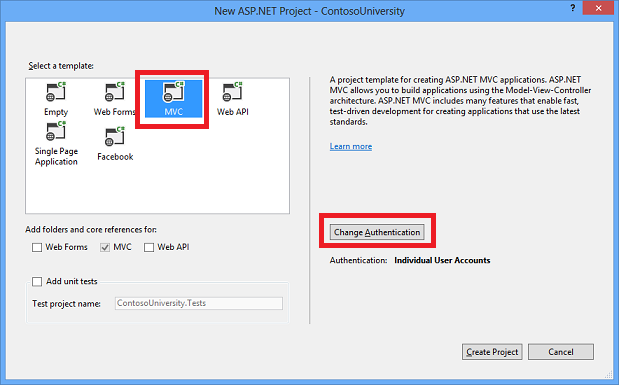

In the **Change Authentication** dialog box, select **No Authentication**, and then click **OK**. For this tutorial you won't be requiring users to log on or restricting access based on who's logged on.

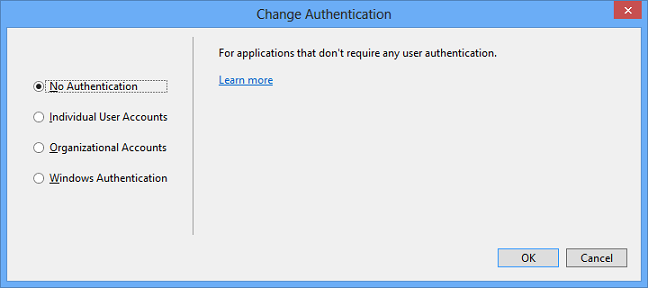

Back in the New ASP.NET Project dialog box, click **OK** to create the project.

## Set Up the Site Style

A few simple changes will set up the site menu, layout, and home page.

Open *Views\Shared\\_Layout.cshtml*, and make the following changes:

- Change each occurrence of "My ASP.NET Application" and "Application name" to "Contoso University".
- Add menu entries for Students, Courses, Instructors, and Departments, and delete the Contact entry.

The changes are highlighted.

[!code[Main](creating-an-entity-framework-data-model-for-an-asp-net-mvc-application/samples/sample1.xml?highlight=6,19,24-27,38)]

In *Views\Home\Index.cshtml*, replace the contents of the file with the following code to replace the text about ASP.NET and MVC with text about this application:

[!code[Main](creating-an-entity-framework-data-model-for-an-asp-net-mvc-application/samples/sample2.xml)]

Press CTRL+F5 to run the site. You see the home page with the main menu.

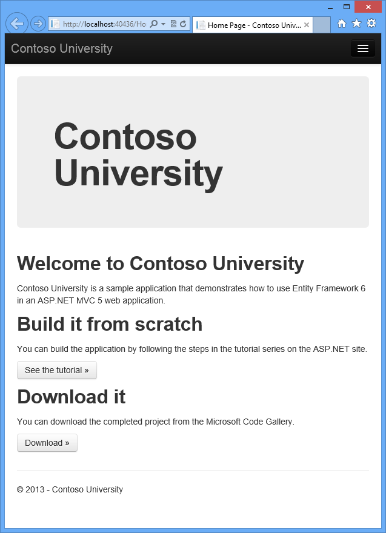

## Install Entity Framework 6

From the **Tools** menu click **NuGet Package Manager** and then click **Package Manager Console**.

In the **Package Manager Console** window enter the following command:

`Install-Package EntityFramework`

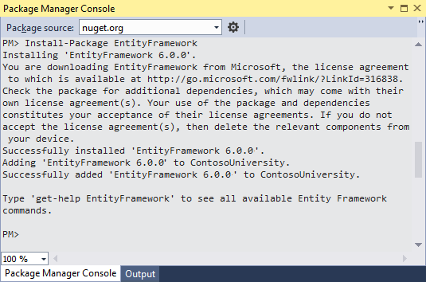

The image shows 6.0.0 being installed, but NuGet will install the latest version of Entity Framework (excluding pre-release versions), which as of the most recent update to the tutorial is 6.1.1.

This step is one of a few steps that this tutorial has you do manually, but which could have been done automatically by the ASP.NET MVC scaffolding feature. You're doing them manually so that you can see the steps required to use the Entity Framework. You'll use scaffolding later to create the MVC controller and views. An alternative is to let scaffolding automatically install the EF NuGet package, create the database context class, and create the connection string. When you're ready to do it that way, all you have to do is skip those steps and scaffold your MVC controller after you create your entity classes.

## Create the Data Model

Next you'll create entity classes for the Contoso University application. You'll start with the following three entities:

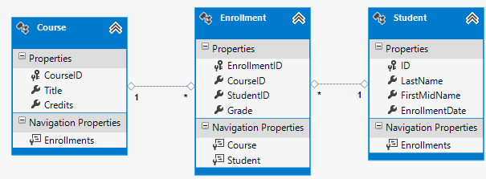

There's a one-to-many relationship between `Student` and `Enrollment` entities, and there's a one-to-many relationship between `Course` and `Enrollment` entities. In other words, a student can be enrolled in any number of courses, and a course can have any number of students enrolled in it.

In the following sections you'll create a class for each one of these entities.

> [!NOTE] If you try to compile the project before you finish creating all of these entity classes, you'll get compiler errors.

### The Student Entity

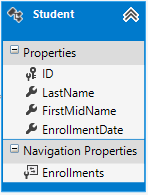

In the *Models* folder, create a class file named *Student.cs* and replace the template code with the following code:

[!code[Main](creating-an-entity-framework-data-model-for-an-asp-net-mvc-application/samples/sample3.xml)]

The `ID` property will become the primary key column of the database table that corresponds to this class. By default, the Entity Framework interprets a property that's named `ID` or *classname*`ID` as the primary key.

The `Enrollments` property is a *navigation property*. Navigation properties hold other entities that are related to this entity. In this case, the `Enrollments` property of a `Student` entity will hold all of the `Enrollment` entities that are related to that `Student` entity. In other words, if a given `Student` row in the database has two related `Enrollment` rows (rows that contain that student's primary key value in their `StudentID` foreign key column), that `Student` entity's `Enrollments` navigation property will contain those two `Enrollment` entities.

Navigation properties are typically defined as `virtual` so that they can take advantage of certain Entity Framework functionality such as *lazy loading*. (Lazy loading will be explained later, in the [Reading Related Data](reading-related-data-with-the-entity-framework-in-an-asp-net-mvc-application.md) tutorial later in this series.)

If a navigation property can hold multiple entities (as in many-to-many or one-to-many relationships), its type must be a list in which entries can be added, deleted, and updated, such as `ICollection`.

### The Enrollment Entity

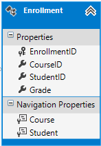

In the *Models* folder, create *Enrollment.cs* and replace the existing code with the following code:

[!code[Main](creating-an-entity-framework-data-model-for-an-asp-net-mvc-application/samples/sample4.xml)]

The `EnrollmentID` property will be the primary key; this entity uses the *classname*`ID` pattern instead of `ID` by itself as you saw in the `Student` entity. Ordinarily you would choose one pattern and use it throughout your data model. Here, the variation illustrates that you can use either pattern. In a later tutorial, you'll see how using `ID` without `classname` makes it easier to implement inheritance in the data model.

The `Grade` property is an [enum](https://msdn.microsoft.com/en-us/data/hh859576.aspx). The question mark after the `Grade` type declaration indicates that the `Grade` property is [nullable](https://msdn.microsoft.com/en-us/library/2cf62fcy.aspx). A grade that's null is different from a zero grade — null means a grade isn't known or hasn't been assigned yet.

The `StudentID` property is a foreign key, and the corresponding navigation property is `Student`. An `Enrollment` entity is associated with one `Student` entity, so the property can only hold a single `Student` entity (unlike the `Student.Enrollments` navigation property you saw earlier, which can hold multiple `Enrollment` entities).

The `CourseID` property is a foreign key, and the corresponding navigation property is `Course`. An `Enrollment` entity is associated with one `Course` entity.

Entity Framework interprets a property as a foreign key property if it's named *&lt;navigation property name&gt;&lt;primary key property name&gt;* (for example, `StudentID` for the `Student` navigation property since the `Student` entity's primary key is `ID`). Foreign key properties can also be named the same simply *&lt;primary key property name&gt;* (for example, `CourseID` since the `Course` entity's primary key is `CourseID`).

### The Course Entity

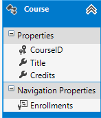

In the *Models* folder, create*Course.cs*, replacing the template code with the following code:

[!code[Main](creating-an-entity-framework-data-model-for-an-asp-net-mvc-application/samples/sample5.xml)]

The `Enrollments` property is a navigation property. A `Course` entity can be related to any number of `Enrollment` entities.

We'll say more about the [DatabaseGenerated](https://msdn.microsoft.com/en-us/library/system.componentmodel.dataannotations.schema.databasegeneratedattribute(v=vs.110).aspx) attribute in a later tutorial in this series. Basically, this attribute lets you enter the primary key for the course rather than having the database generate it.

## Create the Database Context

The main class that coordinates Entity Framework functionality for a given data model is the *database context* class. You create this class by deriving from the [System.Data.Entity.DbContext](https://msdn.microsoft.com/en-us/library/system.data.entity.dbcontext(v=VS.103).aspx) class. In your code you specify which entities are included in the data model. You can also customize certain Entity Framework behavior. In this project, the class is named `SchoolContext`.

To create a folder in the ContosoUniversity project, right-click the project in **Solution Explorer** and click **Add**, and then click **New Folder**. Name the new folder *DAL* (for Data Access Layer). In that folder create a new class file named *SchoolContext.cs*, and replace the template code with the following code:

[!code[Main](creating-an-entity-framework-data-model-for-an-asp-net-mvc-application/samples/sample6.xml)]

### Specifying entity sets

This code creates a [DbSet](https://msdn.microsoft.com/en-us/library/system.data.entity.dbset(v=VS.103).aspx) property for each entity set. In Entity Framework terminology, an *entity set* typically corresponds to a database table, and an *entity* corresponds to a row in the table.

> [!NOTE] 
> 
> You could have omitted the `DbSet<Enrollment>` and `DbSet<Course>` statements and it would work the same. The Entity Framework would include them implicitly because the `Student` entity references the `Enrollment` entity and the `Enrollment` entity references the `Course` entity.

### Specifying the connection string

The name of the connection string (which you'll add to the Web.config file later) is passed in to the constructor.

[!code[Main](creating-an-entity-framework-data-model-for-an-asp-net-mvc-application/samples/sample7.xml?highlight=1)]

You could also pass in the connection string itself instead of the name of one that is stored in the Web.config file. For more information about options for specifying the database to use, see [Entity Framework - Connections and Models](https://msdn.microsoft.com/en-us/data/jj592674).

If you don't specify a connection string or the name of one explicitly, Entity Framework assumes that the connection string name is the same as the class name. The default connection string name in this example would then be `SchoolContext`, the same as what you're specifying explicitly.

### Specifying singular table names

The `modelBuilder.Conventions.Remove` statement in the [OnModelCreating](https://msdn.microsoft.com/en-us/library/system.data.entity.dbcontext.onmodelcreating(v=vs.103).aspx) method prevents table names from being pluralized. If you didn't do this, the generated tables in the database would be named `Students`, `Courses`, and `Enrollments`. Instead, the table names will be `Student`, `Course`, and `Enrollment`. Developers disagree about whether table names should be pluralized or not. This tutorial uses the singular form, but the important point is that you can select whichever form you prefer by including or omitting this line of code.

## Set up EF to initialize the database with test data

The Entity Framework can automatically create (or drop and re-create) a database for you when the application runs. You can specify that this should be done every time your application runs or only when the model is out of sync with the existing database. You can also write a `Seed` method that the Entity Framework automatically calls after creating the database in order to populate it with test data.

The default behavior is to create a database only if it doesn't exist (and throw an exception if the model has changed and the database already exists). In this section you'll specify that the database should be dropped and re-created whenever the model changes. Dropping the database causes the loss of all your data. This is generally OK during development, because the `Seed` method will run when the database is re-created and will re-create your test data. But in production you generally don't want to lose all your data every time you need to change the database schema. Later you'll see how to handle model changes by using Code First Migrations to change the database schema instead of dropping and re-creating the database.

In the DAL folder, create a new class file named *SchoolInitializer.cs* and replace the template code with the  
following code, which causes a database to be created when needed and loads test data into the new database.

[!code[Main](creating-an-entity-framework-data-model-for-an-asp-net-mvc-application/samples/sample8.xml)]

The `Seed` method takes the database context object as an input parameter, and the code in the method uses  
that object to add new entities to the database. For each entity type, the code creates a collection of new  
 entities, adds them to the appropriate `DbSet` property, and then saves the changes to the database. It isn't  
necessary to call the `SaveChanges` method after each group of entities, as is done here, but doing that helps  
you locate the source of a problem if an exception occurs while the code is writing to the database.

To tell Entity Framework to use your initializer class, add an element to the `entityFramework` element in the application *Web.config* file (the one in the root project folder), as shown in the following example:

[!code[Main](creating-an-entity-framework-data-model-for-an-asp-net-mvc-application/samples/sample9.xml?highlight=2-6)]

The `context type` specifies the fully qualified context class name and the assembly it's in, and the `databaseinitializer type` specifies the fully qualified name of the initializer class and the assembly it's in. (When you don't want EF to use the initializer, you can set an attribute on the `context` element: `disableDatabaseInitialization="true"`.) For more information, see [Entity Framework - Config File Settings](https://msdn.microsoft.com/en-us/data/jj556606).

As an alternative to setting the initializer in the *Web.config* file is to do it in code by adding a `Database.SetInitializer` statement to the `Application_Start` method in the *Global.asax.cs* file. For more information, see [Understanding Database Initializers in Entity Framework Code First](http://www.codeguru.com/csharp/article.php/c19999/Understanding-Database-Initializers-in-Entity-Framework-Code-First.htm).

The application is now set up so that when you access the database for the first time in a given run of the  
application, the Entity Framework compares the database to the model (your `SchoolContext` and entity classes). If there's a difference, the application drops and re-creates the database.

> [!NOTE] When you deploy an application to a production web server, you must remove or disable code that drops and re-creates the database. You'll do that in a later tutorial in this series.

## Set up EF to use a SQL Server Express LocalDB database

[LocalDB](https://blogs.msdn.com/b/sqlexpress/archive/2011/07/12/introducing-localdb-a-better-sql-express.aspx) is a lightweight version of the SQL Server Express Database Engine. It's easy to install and configure, starts on demand, and runs in user mode. LocalDB runs in a special execution mode of SQL Server Express that enables you to work with databases as *.mdf* files. You can put LocalDB database files in the *App\_Data* folder of a web project if you want to be able to copy the database with the project. The user instance feature in SQL Server Express also enables you to work with *.mdf* files, but the user instance feature is deprecated; therefore, LocalDB is recommended for working with *.mdf* files. In Visual Studio 2012 and later versions, LocalDB is installed by default with Visual Studio.

Typically SQL Server Express is not used for production web applications. LocalDB in particular is not recommended for production use with a web application because it is not designed to work with IIS.

In this tutorial you'll work with LocalDB. Open the application *Web.config* file and add a `connectionStrings` element preceding the `appSettings` element, as shown in the following example. (Make sure you update the *Web.config* file in the root project folder. There's also a *Web.config* file is in the *Views* subfolder that you don't need to update.)

If you are using Visual Studio 2015, replace "v11.0" in the connection string with "MSSQLLocalDB", as the default SQL Server instance name has changed.

[!code[Main](creating-an-entity-framework-data-model-for-an-asp-net-mvc-application/samples/sample10.xml?highlight=1-3)]

The connection string you've added specifies that Entity Framework will use a LocalDB database named *ContosoUniversity1.mdf*. (The database doesn't exist yet; EF will create it.) If you wanted the database to be created in your *App\_Data* folder, you could add `AttachDBFilename=|DataDirectory|\ContosoUniversity1.mdf` to the connection string. For more information about connection strings, see [SQL Server Connection Strings for ASP.NET Web Applications](https://msdn.microsoft.com/en-us/library/jj653752.aspx).

You don't actually have to have a connection string in the *Web.config* file. If you don't supply a connection string, Entity Framework will use a default one based on your context class. For more information, see [Code First to a New Database](https://msdn.microsoft.com/en-us/data/jj193542).

## Creating a Student Controller and Views

Now you'll create a web page to display data, and the process of requesting the data will automatically trigger  
the creation of the database. You'll begin by creating a new controller. But before you do that, build the project to make the model and context classes available to MVC controller scaffolding.

1. Right-click the **Controllers** folder in **Solution Explorer**, select **Add**, and then click **New Scaffolded Item**.
- In the **Add Scaffold** dialog box, select **MVC 5 Controller with views, using Entity Framework**.

    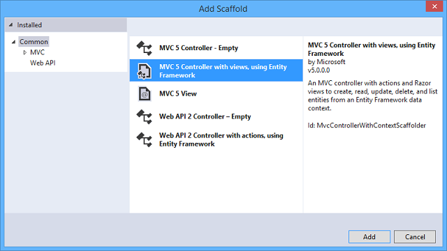
- In the Add Controller dialog box, make the following selections and then click **Add**:

    - Model class: **Student (ContosoUniversity.Models)**. (If you don't see this option in the drop-down list, build the project and try again.)
    - Data context class: **SchoolContext (ContosoUniversity.DAL)**.
    - Controller name: **StudentController** (not StudentsController).
    - Leave the default values for the other fields.

    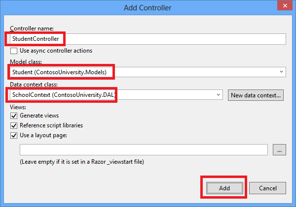

    When you click **Add**, the scaffolder creates a StudentController.cs file and a set of views (.cshtml files) that work with the controller. In the future when you create projects that use Entity Framework you can also take advantage of some additional functionality of the scaffolder: just create your first model class, don't create a connection string, and then in the **Add Controller** box specify new context class. The scaffolder will create your `DbContext` class and your connection string as well as the controller and views.
- Visual Studio opens the *Controllers\StudentController.cs* file. You see a class variable has been created that instantiates a database context object:

    [!code[Main](creating-an-entity-framework-data-model-for-an-asp-net-mvc-application/samples/sample11.xml)]

    The `Index` action method gets a list of students from the *Students* entity set by reading the `Students` property of the database context instance:

    [!code[Main](creating-an-entity-framework-data-model-for-an-asp-net-mvc-application/samples/sample12.xml)]

    The *Student\Index.cshtml* view displays this list in a table:

    [!code[Main](creating-an-entity-framework-data-model-for-an-asp-net-mvc-application/samples/sample13.xml)]
- Press CTRL+F5 to run the project. (If you get a "Cannot create Shadow Copy" error, close the browser and try again.)

    Click the **Students** tab to see the test data that the `Seed` method inserted. Depending on how narrow your browser window is, you'll see the Student tab link in the top address bar or you'll have to click the upper right corner to see the link.

    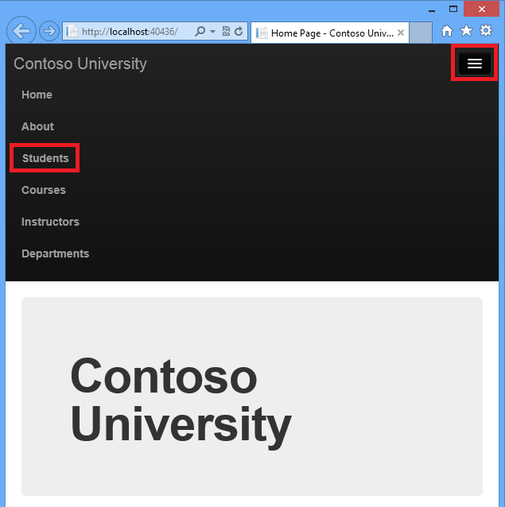

    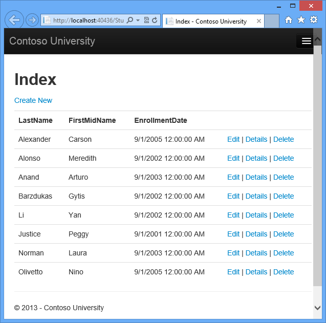

## View the Database

When you ran the Students page and the application tried to access the database, EF saw that there was no database and so it created one, then it ran the seed method to populate the database with data.

You can use either **Server Explorer** or **SQL Server Object Explorer** (SSOX) to view the database in Visual Studio. For this tutorial you'll use **Server Explorer**. (In Visual Studio Express editions earlier than 2013, **Server Explorer** is called **Database Explorer**.)

1. Close the browser.
2. In **Server Explorer**, expand **Data Connections**, expand **School Context (ContosoUniversity)**, and then expand **Tables** to see the tables in your new database.

    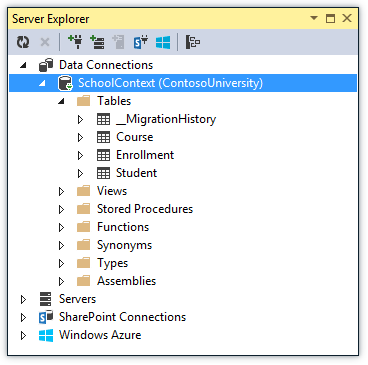
3. Right-click the **Student** table and click **Show Table Data** to see the columns that were created and the rows that were inserted into the table.

    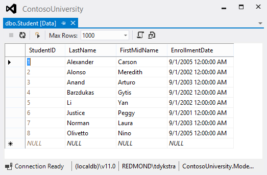
4. Close the **Server Explorer** connection.

The *ContosoUniversity1.mdf*and *.ldf*database files are in the `C:\Users\<yourusername>` folder.

Because you're using the `DropCreateDatabaseIfModelChanges` initializer, you could now make a change to the `Student` class, run the application again, and the database would automatically be re-created to match your change. For example, if you add an `EmailAddress` property to the `Student` class, run the Students page again, and then look at the table again, you will see a new `EmailAddress` column.

## Conventions

The amount of code you had to write in order for the Entity Framework to be able to create a complete database for you is minimal because of the use of *conventions*, or assumptions that the Entity Framework makes. Some of them have already been noted or were used without your being aware of them:

- The pluralized forms of entity class names are used as table names.
- Entity property names are used for column names.
- Entity properties that are named `ID` or *classname*`ID` are recognized as primary key properties.
- A property is interpreted as a foreign key property if it's named *&lt;navigation property name&gt;&lt;primary key property name&gt;* (for example, `StudentID` for the `Student` navigation property since the `Student` entity's primary key is `ID`). Foreign key properties can also be named the same simply &lt;primary key property name&gt; (for example, `EnrollmentID` since the `Enrollment` entity's primary key is `EnrollmentID`).

You've seen that conventions can be overridden. For example, you specified that table names shouldn't be pluralized, and you'll see later how to explicitly mark a property as a foreign key property. You'll learn more about conventions and how to override them in the [Creating a More Complex Data Model](creating-a-more-complex-data-model-for-an-asp-net-mvc-application.md) tutorial later in this series. For more information about conventions, see [Code First Conventions](https://msdn.microsoft.com/en-us/data/jj679962).

## Summary

You've now created a simple application that uses the Entity Framework and SQL Server Express LocalDB to store and display data. In the following tutorial you'll learn how to perform basic CRUD (create, read, update, delete) operations.

Please leave feedback on how you liked this tutorial and what we could improve. You can also request new topics at [Show Me How With Code](http://aspnet.uservoice.com/forums/228522-show-me-how-with-code).

Links to other Entity Framework resources can be found in [ASP.NET Data Access - Recommended Resources](../../../../whitepapers/aspnet-data-access-content-map.md).

>[!div class="step-by-step"]
[Next](implementing-basic-crud-functionality-with-the-entity-framework-in-asp-net-mvc-application.md)