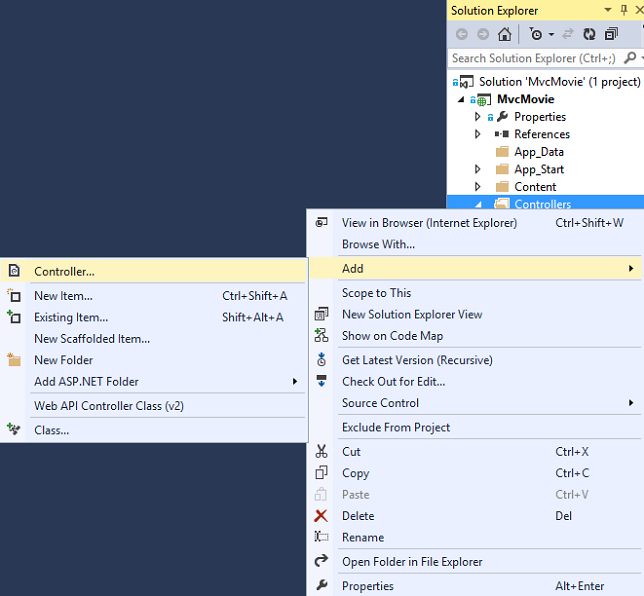
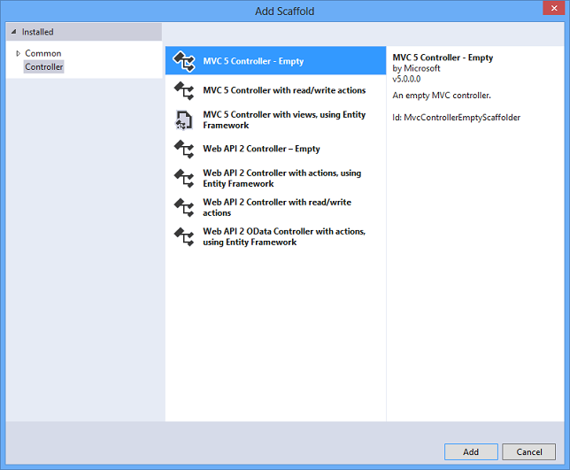
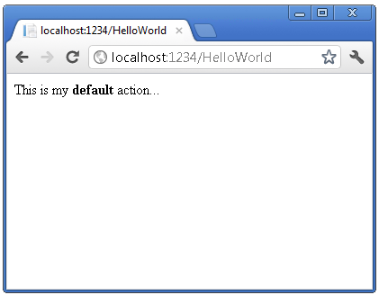
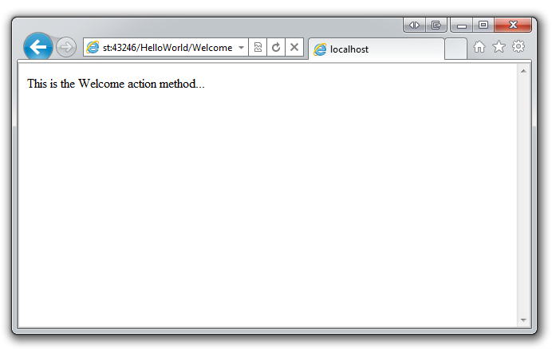
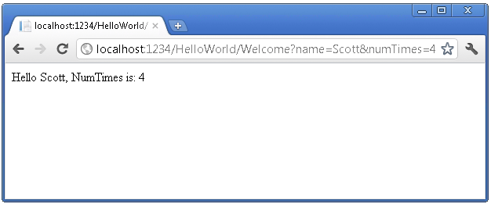
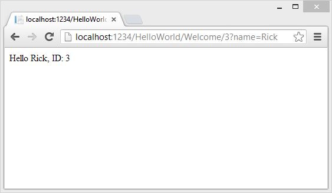
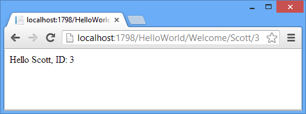

Adding a Controller
====================
by [Rick Anderson](https://github.com/Rick-Anderson)

MVC stands for *model-view-controller*. MVC is a pattern for developing applications that are well architected, testable and easy to maintain. MVC-based applications contain:

- **M** odels: Classes that represent the data of the application and that use validation logic to enforce business rules for that data.
- **V** iews: Template files that your application uses to dynamically generate HTML responses.
- **C** ontrollers: Classes that handle incoming browser requests, retrieve model data, and then specify view templates that return a response to the browser.

We'll be covering all these concepts in this tutorial series and show you how to use them to build an application.

Let's begin by creating a controller class. In **Solution Explorer**, right-click the *Controllers* folder and then click **Add**, then **Controller**.

In the **Add Scaffold** dialog box, click **MVC 5 Controller - Empty**, and then click **Add**.

  
 

Name your new controller "HelloWorldController" and click **Add**.

Notice in **Solution Explorer** that a new file has been created named *HelloWorldController.cs* and a new folder *Views\HelloWorld*. The controller is open in the IDE.

Replace the contents of the file with the following code.

[!code[Main](adding-a-controller/samples/sample1.xml)]

The controller methods will return a string of HTML as an example. The controller is named `HelloWorldController` and the first method is named `Index`. Let's invoke it from a browser. Run the application (press F5 or Ctrl+F5). In the browser, append &quot;HelloWorld&quot; to the path in the address bar. (For example, in the illustration below, it's `http://localhost:1234/HelloWorld.`) The page in the browser will look like the following screenshot. In the method above, the code returned a string directly. You told the system to just return some HTML, and it did!

ASP.NET MVC invokes different controller classes (and different action methods within them) depending on the incoming URL. The default URL routing logic used by ASP.NET MVC uses a format like this to determine what code to invoke:

`/[Controller]/[ActionName]/[Parameters]`

You set the format for routing in the *App\_Start/RouteConfig.cs* file.

[!code[Main](adding-a-controller/samples/sample2.xml?highlight=7-8)]

When you run the application and don't supply any URL segments, it defaults to the "Home" controller and the "Index" action method specified in the defaults section of the code above.

The first part of the URL determines the controller class to execute. So */HelloWorld* maps to the `HelloWorldController` class. The second part of the URL determines the action method on the class to execute. So */HelloWorld/Index* would cause the `Index` method of the `HelloWorldController` class to execute. Notice that we only had to browse to */HelloWorld* and the `Index` method was used by default. This is because a method named `Index` is the default method that will be called on a controller if one is not explicitly specified. The third part of the URL segment ( `Parameters`) is for route data. We'll see route data later on in this tutorial.

Browse to `http://localhost:xxxx/HelloWorld/Welcome`. The `Welcome` method runs and returns the string &quot;This is the Welcome action method...&quot;. The default MVC mapping is `/[Controller]/[ActionName]/[Parameters]`. For this URL, the controller is `HelloWorld` and `Welcome` is the action method. You haven't used the `[Parameters]` part of the URL yet.

Let's modify the example slightly so that you can pass some parameter information from the URL to the controller (for example, */HelloWorld/Welcome?name=Scott&amp;numtimes=4*). Change your `Welcome` method to include two parameters as shown below. Note that the code uses the C# optional-parameter feature to indicate that the `numTimes` parameter should default to 1 if no value is passed for that parameter.

[!code[Main](adding-a-controller/samples/sample3.xml)]

> [!NOTE] Security Note: The code above uses [HttpServerUtility.HtmlEncode](https://msdn.microsoft.com/en-us/library/w3te6wfz.aspx) to protect the application from malicious input (namely JavaScript). For more information see [How to: Protect Against Script Exploits in a Web Application by Applying HTML Encoding to Strings](https://msdn.microsoft.com/en-us/library/a2a4yykt(v=vs.100).aspx).

 Run your application and browse to the example URL (`http://localhost:xxxx/HelloWorld/Welcome?name=Scott&numtimes=4)`. You can try different values for `name` and `numtimes` in the URL. The [ASP.NET MVC model binding system](http://odetocode.com/Blogs/scott/archive/2009/04/27/6-tips-for-asp-net-mvc-model-binding.aspx) automatically maps the named parameters from the query string in the address bar to parameters in your method.

In the sample above, the URL segment ( `Parameters`) is not used, the `name` and `numTimes` parameters are passed as [query strings](http://en.wikipedia.org/wiki/Query_string). The ? (question mark) in the above URL is a separator, and the query strings follow. The &amp; character separates query strings.

Replace the Welcome method with the following code:

[!code[Main](adding-a-controller/samples/sample4.xml)]

Run the application and enter the following URL: `http://localhost:xxx/HelloWorld/Welcome/3?name=Rick`

This time the third URL segment matched the route parameter `ID.` The `Welcome` action method contains a parameter (`ID`) that matched the URL specification in the `RegisterRoutes` method.

[!code[Main](adding-a-controller/samples/sample5.xml?highlight=7)]

In ASP.NET MVC applications, it's more typical to pass in parameters as route data (like we did with ID above) than passing them as query strings. You could also add a route to pass both the `name` and `numtimes` in parameters as route data in the URL. In the *App\_Start\RouteConfig.cs* file, add the "Hello" route:

[!code[Main](adding-a-controller/samples/sample6.xml?highlight=13-16)]

Run the application and browse to `/localhost:XXX/HelloWorld/Welcome/Scott/3`.

For many MVC applications, the default route works fine. You'll learn later in this tutorial to pass data using the model binder, and you won't have to modify the default route for that.

In these examples the controller has been doing the &quot;VC&quot; portion of MVC — that is, the view and controller work. The controller is returning HTML directly. Ordinarily you don't want controllers returning HTML directly, since that becomes very cumbersome to code. Instead we'll typically use a separate view template file to help generate the HTML response. Let's look next at how we can do this.

>[!div class="step-by-step"] [Previous](getting-started.md) [Next](adding-a-view.md)