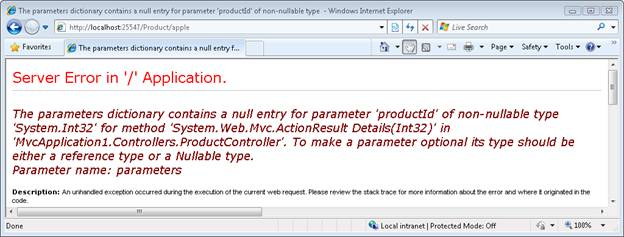

Creating a Route Constraint (VB)
====================
by [Stephen Walther](https://github.com/StephenWalther)

> In this tutorial, Stephen Walther demonstrates how you can control how browser requests match routes by creating route constraints with regular expressions.

You use route constraints to restrict the browser requests that match a particular route. You can use a regular expression to specify a route constraint.

For example, imagine that you have defined the route in Listing 1 in your Global.asax file.

**Listing 1 - Global.asax.vb**

[!code[Main](creating-a-route-constraint-vb/samples/sample1.xml)]

Listing 1 contains a route named Product. You can use the Product route to map browser requests to the ProductController contained in Listing 2.

**Listing 2 - Controllers\ProductController.vb**

[!code[Main](creating-a-route-constraint-vb/samples/sample2.xml)]

Notice that the Details() action exposed by the Product controller accepts a single parameter named productId. This parameter is an integer parameter.

The route defined in Listing 1 will match any of the following URLs:

- /Product/23
- /Product/7

Unfortunately, the route will also match the following URLs:

- /Product/blah
- /Product/apple

Because the Details() action expects an integer parameter, making a request that contains something other than an integer value will cause an error. For example, if you type the URL /Product/apple into your browser then you will get the error page in Figure 1.

**Figure 01**: Seeing a page explode ([Click to view full-size image](creating-a-route-constraint-vb/_static/image2.png))

What you really want to do is only match URLs that contain a proper integer productId. You can use a constraint when defining a route to restrict the URLs that match the route. The modified Product route in Listing 3 contains a regular expression constraint that only matches integers.

**Listing 3 - Global.asax.vb**

[!code[Main](creating-a-route-constraint-vb/samples/sample3.xml)]

The regular expression \d+ matches one or more integers. This constraint causes the Product route to match the following URLs:

- /Product/3
- /Product/8999

But not the following URLs:

- /Product/apple
- /Product

These browser requests will be handled by another route or, if there are no matching routes, a *The resource could not be found* error will be returned.

>[!div class="step-by-step"]
[Previous](creating-custom-routes-vb.md)
[Next](creating-a-custom-route-constraint-vb.md)