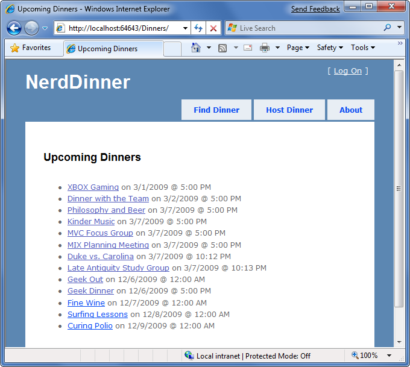
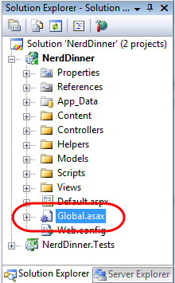
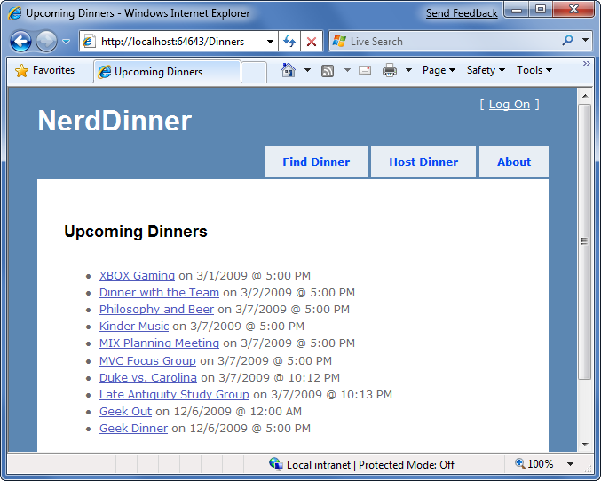
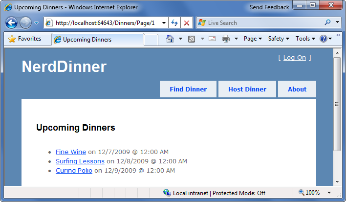
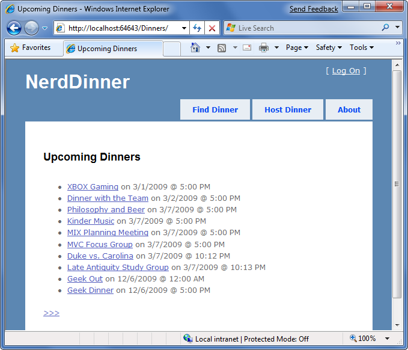
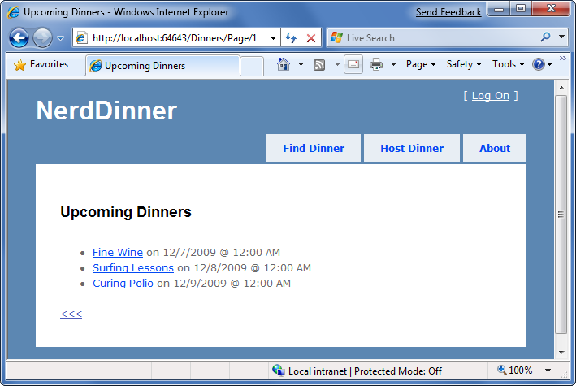

Implement Efficient Data Paging
====================
by [Microsoft](https://github.com/microsoft)

[Download PDF](http://aspnetmvcbook.s3.amazonaws.com/aspnetmvc-nerdinner_v1.pdf)

> This is step 8 of a free ["NerdDinner" application tutorial](introducing-the-nerddinner-tutorial.md) that walks-through how to build a small, but complete, web application using ASP.NET MVC 1.
> 
> Step 8 shows how to add paging support to our /Dinners URL so that instead of displaying 1000s of dinners at once, we'll only display 10 upcoming dinners at a time - and allow end-users to page back and forward through the entire list in an SEO friendly way.
> 
> If you are using ASP.NET MVC 3, we recommend you follow the [Getting Started With MVC 3](../../older-versions/getting-started-with-aspnet-mvc3/cs/intro-to-aspnet-mvc-3.md) or [MVC Music Store](../../older-versions/mvc-music-store/mvc-music-store-part-1.md) tutorials.

## NerdDinner Step 8: Paging Support

If our site is successful, it will have thousands of upcoming dinners. We need to make sure that our UI scales to handle all of these dinners, and allows users to browse them. To enable this, we'll add paging support to our */Dinners* URL so that instead of displaying 1000s of dinners at once, we'll only display 10 upcoming dinners at a time - and allow end-users to page back and forward through the entire list in an SEO friendly way.

### Index() Action Method Recap

The Index() action method within our DinnersController class currently looks like below:

[!code[Main](implement-efficient-data-paging/samples/sample1.xml)]

When a request is made to the */Dinners* URL, it retrieves a list of all upcoming dinners and then renders a listing of all of them out:

### Understanding IQuerable&lt;T&gt;

*IQueryable&lt;T&gt;* is an interface that was introduced with LINQ as part of .NET 3.5. It enables powerful "deferred execution" scenarios that we can take advantage of to implement paging support.

In our DinnerRepository we are returning an IQueryable&lt;Dinner&gt; sequence from our FindUpcomingDinners() method:

[!code[Main](implement-efficient-data-paging/samples/sample2.xml)]

The IQueryable&lt;Dinner&gt; object returned by our FindUpcomingDinners() method encapsulates a query to retrieve Dinner objects from our database using LINQ to SQL. Importantly, it won't execute the query against the database until we attempt to access/iterate over the data in the query, or until we call the ToList() method on it. The code calling our FindUpcomingDinners() method can optionally choose to add additional "chained" operations/filters to the IQueryable&lt;Dinner&gt; object before executing the query. LINQ to SQL is then smart enough to execute the combined query against the database when the data is requested.

To implement paging logic we can update our DinnersController's Index() action method so that it applies additional "Skip" and "Take" operators to the returned IQueryable&lt;Dinner&gt; sequence before calling ToList() on it:

[!code[Main](implement-efficient-data-paging/samples/sample3.xml)]

The above code skips over the first 10 upcoming dinners in the database, and then returns back 20 dinners. LINQ to SQL is smart enough to construct an optimized SQL query that performs this skipping logic in the SQL database – and not in the web-server. This means that even if we have millions of upcoming Dinners in the database, only the 10 we want will be retrieved as part of this request (making it efficient and scalable).

### Adding a "page" value to the URL

Instead of hard-coding a specific page range, we'll want our URLs to include a "page" parameter that indicates which Dinner range a user is requesting.

#### Using a Querystring value

The code below demonstrates how we can update our Index() action method to support a querystring parameter and enable URLs like */Dinners?page=2*:

[!code[Main](implement-efficient-data-paging/samples/sample4.xml)]

The Index() action method above has a parameter named "page". The parameter is declared as a nullable integer (that is what int? indicates). This means that the */Dinners?page=2* URL will cause a value of "2" to be passed as the parameter value. The */Dinners* URL (without a querystring value) will cause a null value to be passed.

We are multiplying the page value by the page size (in this case 10 rows) to determine how many dinners to skip over. We are using the [C# null "coalescing" operator (??)](https://weblogs.asp.net/scottgu/archive/2007/09/20/the-new-c-null-coalescing-operator-and-using-it-with-linq.aspx) which is useful when dealing with nullable types. The code above assigns page the value of 0 if the page parameter is null.

#### Using Embedded URL values

An alternative to using a querystring value would be to embed the page parameter within the actual URL itself. For example: */Dinners/Page/2* or */Dinners/2*. ASP.NET MVC includes a powerful URL routing engine that makes it easy to support scenarios like this.

We can register custom routing rules that map any incoming URL or URL format to any controller class or action method we want. All we need to-do is to open the Global.asax file within our project:

And then register a new mapping rule using the MapRoute() helper method like the first call to routes.MapRoute() below:

[!code[Main](implement-efficient-data-paging/samples/sample5.xml)]

Above we are registering a new routing rule named "UpcomingDinners". We are indicating it has the URL format "Dinners/Page/{page}" – where {page} is a parameter value embedded within the URL. The third parameter to the MapRoute() method indicates that we should map URLs that match this format to the Index() action method on the DinnersController class.

We can use the exact same Index() code we had before with our Querystring scenario – except now our "page" parameter will come from the URL and not the querystring:

[!code[Main](implement-efficient-data-paging/samples/sample6.xml)]

And now when we run the application and type in */Dinners* we'll see the first 10 upcoming dinners:

And when we type in */Dinners/Page/1* we'll see the next page of dinners:

### Adding page navigation UI

The last step to complete our paging scenario will be to implement "next" and "previous" navigation UI within our view template to enable users to easily skip over the Dinner data.

To implement this correctly, we'll need to know the total number of Dinners in the database, as well as how many pages of data this translates to. We'll then need to calculate whether the currently requested "page" value is at the beginning or end of the data, and show or hide the "previous" and "next" UI accordingly. We could implement this logic within our Index() action method. Alternatively we can add a helper class to our project that encapsulates this logic in a more re-usable way.

Below is a simple "PaginatedList" helper class that derives from the List&lt;T&gt; collection class built-into the .NET Framework. It implements a re-usable collection class that can be used to paginate any sequence of IQueryable data. In our NerdDinner application we'll have it work over IQueryable&lt;Dinner&gt; results, but it could just as easily be used against IQueryable&lt;Product&gt; or IQueryable&lt;Customer&gt; results in other application scenarios:

[!code[Main](implement-efficient-data-paging/samples/sample7.xml)]

Notice above how it calculates and then exposes properties like "PageIndex", "PageSize", "TotalCount", and "TotalPages". It also then exposes two helper properties "HasPreviousPage" and "HasNextPage" that indicate whether the page of data in the collection is at the beginning or end of the original sequence. The above code will cause two SQL queries to be run - the first to retrieve the count of the total number of Dinner objects (this doesn't return the objects – rather it performs a "SELECT COUNT" statement that returns an integer), and the second to retrieve just the rows of data we need from our database for the current page of data.

We can then update our DinnersController.Index() helper method to create a PaginatedList&lt;Dinner&gt; from our DinnerRepository.FindUpcomingDinners() result, and pass it to our view template:

[!code[Main](implement-efficient-data-paging/samples/sample8.xml)]

We can then update the \Views\Dinners\Index.aspx view template to inherit from ViewPage&lt;NerdDinner.Helpers.PaginatedList&lt;Dinner&gt;&gt; instead of ViewPage&lt;IEnumerable&lt;Dinner&gt;&gt;, and then add the following code to the bottom of our view-template to show or hide next and previous navigation UI:

[!code[Main](implement-efficient-data-paging/samples/sample9.xml)]

Notice above how we are using the Html.RouteLink() helper method to generate our hyperlinks. This method is similar to the Html.ActionLink() helper method we've used previously. The difference is that we are generating the URL using the "UpcomingDinners" routing rule we setup within our Global.asax file. This ensures that we'll generate URLs to our Index() action method that have the format: */Dinners/Page/{page}* – where the {page} value is a variable we are providing above based on the current PageIndex.

And now when we run our application again we'll see 10 dinners at a time in our browser:

We also have &lt;&lt;&lt; and &gt;&gt;&gt; navigation UI at the bottom of the page that allows us to skip forwards and backwards over our data using search engine accessible URLs:

| **Side Topic: Understanding the implications of IQueryable&lt;T&gt;** |
| --- |
| IQueryable&lt;T&gt; is a very powerful feature that enables a variety of interesting deferred execution scenarios (like paging and composition based queries). As with all powerful features, you want to be careful with how you use it and make sure it is not abused. It is important to recognize that returning an IQueryable&lt;T&gt; result from your repository enables calling code to append on chained operator methods to it, and so participate in the ultimate query execution. If you do not want to provide calling code this ability, then you should return back IList&lt;T&gt; or IEnumerable&lt;T&gt; results - which contain the results of a query that has already executed. For pagination scenarios this would require you to push the actual data pagination logic into the repository method being called. In this scenario we might update our FindUpcomingDinners() finder method to have a signature that either returned a PaginatedList: PaginatedList&lt; Dinner&gt; FindUpcomingDinners(int pageIndex, int pageSize) { } Or return back an IList&lt;Dinner&gt;, and use a "totalCount" out param to return the total count of Dinners: IList&lt;Dinner&gt; FindUpcomingDinners(int pageIndex, int pageSize, out int totalCount) { } |

### Next Step

Let's now look at how we can add authentication and authorization support to our application.

>[!div class="step-by-step"] [Previous](re-use-ui-using-master-pages-and-partials.md) [Next](secure-applications-using-authentication-and-authorization.md)