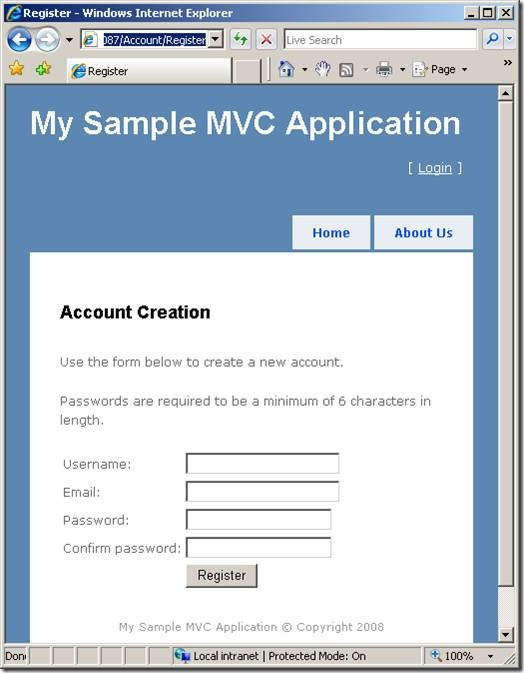
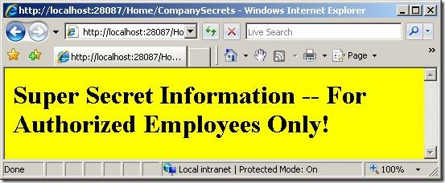
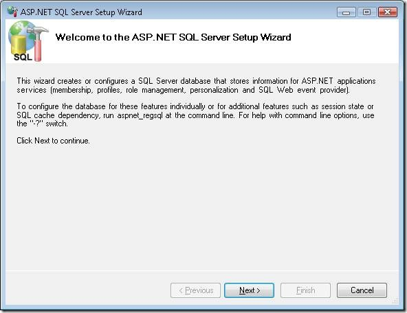
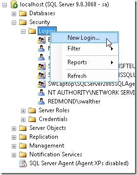
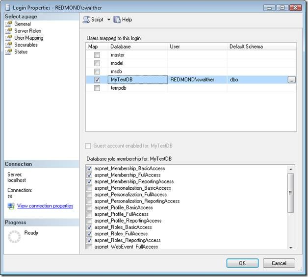

[Edit .md file](C:\Projects\msc\dev\Msc.Www\Web.ASP\App_Data\github\mvc\overview\older-versions-1\security\authenticating-users-with-forms-authentication-vb.md) | [Edit dev content](http://www.aspdev.net/umbraco#/content/content/edit/25213) | [View dev content](http://docs.aspdev.net/tutorials/mvc/overview/older-versions-1/security/authenticating-users-with-forms-authentication-vb.html) | [View prod content](http://www.asp.net/mvc/overview/older-versions-1/security/authenticating-users-with-forms-authentication-vb) | Picker: 27599

Authenticating Users with Forms Authentication (VB)
====================
by [Microsoft](https://github.com/microsoft)

> Learn how to use the [Authorize] attribute to password protect particular pages in your MVC application. You learn how to use the Web Site Administration Tool to create and manage users and roles. You also learn how to configure where user account and role information is stored.

The goal of this tutorial is to explain how you can use Forms authentication to password protect the views in your ASP.NET MVC applications. You learn how to use the Web Site Administration Tool to create users and roles. You also learn how to prevent unauthorized users from invoking controller actions. Finally, you learn how to configure where user names and passwords are stored.

#### Using the Web Site Administration Tool

Before we do anything else, we should start by creating some users and roles. The easiest way to create new users and roles is to take advantage of the Visual Studio 2008 Web Site Administration Tool. You can launch this tool by selecting the menu option **Project, ASP.NET Configuration**. Alternatively, you can launch the Web Site Administration Tool by clicking the (somewhat scary) icon of the hammer hitting the world that appears at the top of the Solution Explorer window (see Figure 1).

**Figure 1 – Launching the Web Site Administration Tool**

![clip_image002[4]](authenticating-users-with-forms-authentication-vb/_static/image1.jpg)

Within the Web Site Administration Tool, you create new users and roles by selecting the Security tab. Click the **Create user** link to create a new user named Stephen (see Figure 2). Provide the Stephen user with any password that you want (for example, *secret*).

**Figure 2 – Creating a new user**

![clip_image004[4]](authenticating-users-with-forms-authentication-vb/_static/image2.jpg)

You create new roles by first enabling roles and defining one or more roles. Enable roles by clicking the **Enable roles** link. Next, create a role named *Administrators* by clicking the **Create or Manage roles** link (see Figure 3).

**Figure 3 – Creating a new role**

![clip_image006[4]](authenticating-users-with-forms-authentication-vb/_static/image3.jpg)

Finally, create a new user named Sally and associate Sally with the Administrators role by clicking the Create User link and selecting Administrators when creating Sally (see Figure 4).

**Figure 4 – Adding a user to a role**

![clip_image008[4]](authenticating-users-with-forms-authentication-vb/_static/image4.jpg)

When all is said and done, you should have two new users named Stephen and Sally. You should also have a new role named Administrators. Sally is a member of the Administrators role and Stephen is not.

#### Requiring Authorization

You can require a user to be authenticated before the user invokes a controller action by adding the [Authorize] attribute to the action. You can apply the [Authorize] attribute to an individual controller action or you can apply this attribute to an entire controller class.

For example, the controller in Listing 1 exposes an action named CompanySecrets(). Because this action is decorated with the [Authorize] attribute, this action cannot be invoked unless a user is authenticated.

**Listing 1 – Controllers\HomeController.vb**

    <HandleError()> _
    Public Class HomeController
        Inherits System.Web.Mvc.Controller
    
        Function Index()
            Return View()
        End Function
    
        <Authorize()> _
        Function CompanySecrets()
            Return View()
        End Function
    
    End Class

If you invoke the CompanySecrets() action by entering the URL /Home/CompanySecrets in the address bar of your browser, and you are not an authenticated user, then you will be redirected to the Login view automatically (see Figure 5).

**Figure 5 – The Login view**

![clip_image010[4]](authenticating-users-with-forms-authentication-vb/_static/image5.jpg)

You can use the Login view to enter your user name and password. If you are not a registered user then you can click the **register** link to navigate to the Register view (see Figure 6). You can use the Register view to create a new user account.

**Figure 6 – The Register view**

After you successfully log in, you can see the CompanySecrets view (see Figure 7). By default, you will continue to be logged in until you close your browser window.

**Figure 7 – The CompanySecrets view**

#### Authorizing by User Name or User Role

You can use the [Authorize] attribute to restrict access to a controller action to a particular set of users or a particular set of user roles. For example, the modified Home controller in Listing 2 contains two new actions named StephenSecrets() and AdministratorSecrets().

**Listing 2 – Controllers\HomeController.vb**

    <HandleError()> _
    Public Class HomeController
        Inherits System.Web.Mvc.Controller
    
        Function Index()
            Return View()
        End Function
    
        <Authorize()> _
        Function CompanySecrets()
            Return View()
        End Function
    
        <Authorize(Users:="Stephen")> _
        Function StephenSecrets()
            Return View()
        End Function
    
        <Authorize(Roles:="Administrators")> _
        Function AdministratorSecrets()
            Return View()
        End Function
    
    End Class

Only a user with the user name Stephen can invoke the StephenSecrets() action. All other users get redirected to the Login view. The Users property accepts a comma separated list of user account names.

Only users in the Administrators role can invoke the AdministratorSecrets() action. For example, because Sally is a member of the Administrators group, she can invoke the AdministratorSecrets() action. All other users get redirected to the Login view. The Roles property accepts a comma separated list of role names.

#### Configuring Authentication

At this point, you might be wondering where the user account and role information is being stored. By default, the information is stored in a (RANU) SQL Express database named ASPNETDB.mdf located in your MVC application's App\_Data folder. This database is generated by the ASP.NET framework automatically when you start using membership.

In order to see the ASPNETDB.mdf database in the Solution Explorer window, you first need to select the menu option Project, Show All Files.

Using the default SQL Express database is fine when developing an application. Most likely, however, you won't want to use the default ASPNETDB.mdf database for a production application. In that case, you can change where user account information is stored by completing the following two steps:

1. Add the Application Services database objects to your production database - Change your application connection string to point to your production database

The first step is to add all of the necessary database objects (tables and stored procedures) to your production database. The easiest way to add these objects to a new database is to take advantage of the ASP.NET SQL Server Setup Wizard (see Figure 8). You can launch this tool by opening the Visual Studio 2008 Command Prompt from the Microsoft Visual Studio 2008 program group and executing the following command from the command prompt:

aspnet\_regsql

**Figure 8 – The ASP.NET SQL Server Setup Wizard**

The ASP.NET SQL Server Setup Wizard enables you to select a SQL Server database on your network and install all of the database objects required by the ASP.NET application services. The database server is not required to be located on your local machine.

> [!NOTE] If you don't want to use the ASP.NET SQL Server Setup Wizard, then you can find SQL scripts for adding the application services database objects in the following folder:

> C:\Windows\Microsoft.NET\Framework\v2.0.50727

After you create the necessary database objects, you need to modify the database connection used by your MVC application. Modify the ApplicationServices connection string in your web configuration (web.config) file so that it points to the production database. For example, the modified connection in Listing 3 points to a database named MyProductionDB (the original ApplicationServices connection string has been commented out).

**Listing 3 – Web.config**

    <connectionStrings>
    
    <!--<add name="ApplicationServices" connectionString="data source=.\SQLEXPRESS;Integrated Security=SSPI;AttachDBFilename=|DataDirectory|aspnetdb.mdf;User Instance=true" providerName="System.Data.SqlClient"/>-->
    
    <add name="ApplicationServices" connectionString="data source=localhost;Integrated Security=SSPI;Initial Catalog=MyProductionDB" />
    
    </connectionStrings>

#### Configuring Database Permissions

If you use Integrated Security to connect to your database then you will need to add the correct Windows user account as a login to your database. The correct account depends on whether you are using the ASP.NET Development Server or Internet Information Services as your web server. The correct user account also depends on your operating system.

If you are using the ASP.NET Development Server (the default web server used by Visual Studio) then your application executes within the context of your Windows user account. In that case, you need to add your Windows user account as a database server login.

Alternatively, if you are using Internet Information Services then you need to add either the ASPNET account or the NT AUTHORITY/NETWORK SERVICE account as a database server login. If you are using Windows XP then add the ASPNET account as a login to your database. If you are using a more recent operating system, such as Windows Vista or Windows Server 2008, then add the NT AUTHORITY/NETWORK SERVICE account as the database login.

You can add a new user account to your database by using Microsoft SQL Server Management Studio (see Figure 9).

**Figure 9 – Creating a new Microsoft SQL Server login**

After you create the required login, you need to map the login to a database user with the right database roles. Double-click the login and select the User Mapping tab. Select one or more application services database roles. For example, in order to authenticate users, you need to enable the aspnet\_Membership\_BasicAccess database role. In order to create new users, you need to enable the aspnet\_Membership\_FullAccess database role (see Figure 10).

**Figure 10 – Adding Application Services database roles**

#### Summary

In this tutorial, you learned how to use Forms authentication when building an ASP.NET MVC application. First, you learned how to create new users and roles by taking advantage of the Web Site Administration Tool. Next, you learned how to use the [Authorize] attribute to prevent unauthorized users from invoking controller actions. Finally, you learned how to configure your MVC application to store user and role information in a production database.

>[!div class="step-by-step"] [Previous](preventing-javascript-injection-attacks-cs.md) [Next](authenticating-users-with-windows-authentication-vb.md)