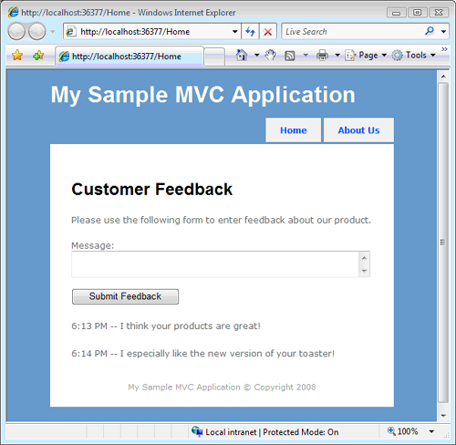
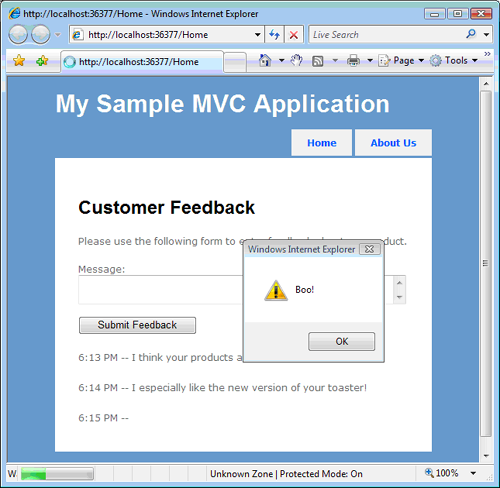
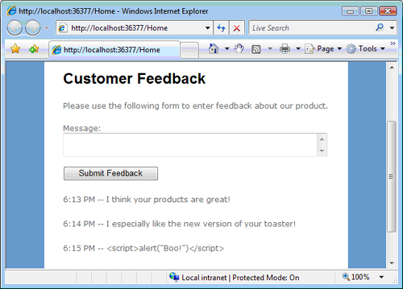

[Edit .md file](C:\Projects\msc\dev\Msc.Www\Web.ASP\App_Data\github\mvc\overview\older-versions-1\security\preventing-javascript-injection-attacks-vb.md) | [Edit dev content](http://www.aspdev.net/umbraco#/content/content/edit/25217) | [View dev content](http://docs.aspdev.net/tutorials/mvc/overview/older-versions-1/security/preventing-javascript-injection-attacks-vb.html) | [View prod content](http://www.asp.net/mvc/overview/older-versions-1/security/preventing-javascript-injection-attacks-vb) | Picker: 27603

Preventing JavaScript Injection Attacks (VB)
====================
by [Stephen Walther](https://github.com/StephenWalther)

[Download PDF](http://download.microsoft.com/download/8/4/8/84843d8d-1575-426c-bcb5-9d0c42e51416/ASPNET_MVC_Tutorial_06_VB.pdf)

> Prevent JavaScript Injection Attacks and Cross-Site Scripting Attacks from happening to you. In this tutorial, Stephen Walther explains how you can easily defeat these types of attacks by HTML encoding your content.

The goal of this tutorial is to explain how you can prevent JavaScript injection attacks in your ASP.NET MVC applications. This tutorial discusses two approaches to defending your website against a JavaScript injection attack. You learn how to prevent JavaScript injection attacks by encoding the data that you display. You also learn how to prevent JavaScript injection attacks by encoding the data that you accept.

## What is a JavaScript Injection Attack?

Whenever you accept user input and redisplay the user input, you open your website to JavaScript injection attacks. Let's examine a concrete application that is open to JavaScript injection attacks.

Imagine that you have created a customer feedback website (see Figure 1). Customers can visit the website and enter feedback on their experience using your products. When a customer submits their feedback, the feedback is redisplayed on the feedback page.

**Figure 01**: Customer Feedback Website ([Click to view full-size image](preventing-javascript-injection-attacks-vb/_static/image3.png))

The customer feedback website uses the `controller` in Listing 1. This `controller` contains two actions named `Index()` and `Create()`.

**Listing 1 – `HomeController.vb`**

    Public Class HomeController
         Inherits System.Web.Mvc.Controller
    
         Private db As New FeedbackDataContext()
    
         Function Index()
              Return View(db.Feedbacks)
         End Function
    
         Function Create(ByVal message As String)
              ' Add feedback
              Dim newFeedback As New Feedback()
              newFeedback.Message = Server.HtmlEncode(message)
    
              newFeedback.EntryDate = DateTime.Now
              db.Feedbacks.InsertOnSubmit(newFeedback)
              db.SubmitChanges()
    
              ' Redirect
              Return RedirectToAction("Index")
         End Function
    
    End Class

The `Index()` method displays the `Index` view. This method passes all of the previous customer feedback to the `Index` view by retrieving the feedback from the database (using a LINQ to SQL query).

The `Create()` method creates a new Feedback item and adds it to the database. The message that the customer enters in the form is passed to the `Create()` method in the message parameter. A Feedback item is created and the message is assigned to the Feedback item's `Message` property. The Feedback item is submitted to the database with the `DataContext.SubmitChanges()` method call. Finally, the visitor is redirected back to the `Index` view where all of the feedback is displayed.

The `Index` view is contained in Listing 2.

**Listing 2 – `Index.aspx`**

    <%@ Page Language="VB" MasterPageFile="~/Views/Shared/Site.Master" AutoEventWireup="false" CodeBehind="Index.aspx.vb" Inherits="CustomerFeedback.Index"%>
    
    <asp:Content ID="indexContent" ContentPlaceHolderID="MainContent" runat="server">
         <h1>Customer Feedback</h1>
         

              Please use the following form to enter feedback about our product.
         

         <form method="post" action="/Home/Create">
              <label for="message">Message:</label>
    
               
              <textarea name="message" cols="50" rows="2"></textarea>
                
              <input type="submit" value="Submit Feedback" />
         </form>
    
         <% For Each feedback As CustomerFeedback.Feedback In ViewData.Model%>
              

    
              <%=feedback.EntryDate.ToShortTimeString()%>
              --
              <%=feedback.Message%>
              

         <% Next %>
    
    </asp:Content>

The `Index` view has two sections. The top section contains the actual customer feedback form. The bottom section contains a For..Each loop that loops through all of the previous customer feedback items and displays the EntryDate and Message properties for each feedback item.

The customer feedback website is a simple website. Unfortunately, the website is open to JavaScript injection attacks.

Imagine that you enter the following text into the customer feedback form:

    

This text represents a JavaScript script that displays an alert message box. After someone submits this script into the feedback form, the message *Boo!*will appear whenever anyone visits the customer feedback website in the future (see Figure 2).

**Figure 02**: JavaScript Injection ([Click to view full-size image](preventing-javascript-injection-attacks-vb/_static/image6.png))

Now, your initial response to JavaScript injection attacks might be apathy. You might think that JavaScript injection attacks are simply a type of *defacement* attack. You might believe that no one can do anything truly evil by committing a JavaScript injection attack.

Unfortunately, a hacker can do some really, really evil things by injecting JavaScript into a website. You can use a JavaScript injection attack to perform a Cross-Site Scripting (XSS) attack. In a Cross-Site Scripting attack, you steal confidential user information and send the information to another website.

For example, a hacker can use a JavaScript injection attack to steal the values of browser cookies from other users. If sensitive information -- such as passwords, credit card numbers, or social security numbers – is stored in the browser cookies, then a hacker can use a JavaScript injection attack to steal this information. Or, if a user enters sensitive information in a form field contained in a page that has been compromised with a JavaScript attack, then the hacker can use the injected JavaScript to grab the form data and send it to another website.

*Please be scared*. Take JavaScript injection attacks seriously and protect your user's confidential information. In the next two sections, we discuss two techniques that you can use to defend your ASP.NET MVC applications from JavaScript injection attacks.

## Approach #1: HTML Encode in the View

One easy method of preventing JavaScript injection attacks is to HTML encode any data entered by website users when you redisplay the data in a view. The updated `Index` view in Listing 3 follows this approach.

**Listing 3 – `Index.aspx` (HTML Encoded)**

    <%@ Page Language="VB" MasterPageFile="~/Views/Shared/Site.Master" AutoEventWireup="false" CodeBehind="Index.aspx.vb" Inherits="CustomerFeedback.Index"%>
    
    <asp:Content ID="indexContent" ContentPlaceHolderID="MainContent" runat="server">
         <h1>Customer Feedback</h1>
    
         

              Please use the following form to enter feedback about our product.
         

    
         <form method="post" action="/Home/Create">
              <label for="message">Message:</label>
               
              <textarea name="message" cols="50" rows="2"></textarea>
    
                
              <input type="submit" value="Submit Feedback" />
         </form>
    
         <% For Each feedback As CustomerFeedback.Feedback In ViewData.Model%>
              

              <%=feedback.EntryDate.ToShortTimeString()%>
              --
              <%=Html.Encode(feedback.Message)%>
    
              

         <% Next %>
    
    </asp:Content>

Notice that the value of `feedback.Message` is HTML encoded before the value is displayed with the following code:

    <%=Html.Encode(feedback.Message)%>

What does it mean to HTML encode a string? When you HTML encode a string, dangerous characters such as `<` and `>` are replaced by HTML entity references such as `&lt;` and `&gt;`. So when the string `` is HTML encoded, it gets converted to `&lt;script&gt;alert(&quot;Boo!&quot;)&lt;/script&gt;`. The encoded string no longer executes as a JavaScript script when interpreted by a browser. Instead, you get the harmless page in Figure 3.

**Figure 03**: Defeated JavaScript Attack ([Click to view full-size image](preventing-javascript-injection-attacks-vb/_static/image9.png))

Notice that in the `Index` view in Listing 3 only the value of `feedback.Message` is encoded. The value of `feedback.EntryDate` is not encoded. You only need to encode data entered by a user. Because the value of EntryDate was generated in the controller, you don't need to HTML encode this value.

## Approach #2: HTML Encode in the Controller

Instead of HTML encoding data when you display the data in a view, you can HTML encode the data just before you submit the data to the database. This second approach is taken in the case of the `controller` in Listing 4.

**Listing 4 – `HomeController.cs` (HTML Encoded)**

    Public Class HomeController
         Inherits System.Web.Mvc.Controller
    
         Private db As New FeedbackDataContext()
    
         Function Index()
              Return View(db.Feedbacks)
         End Function
    
         Function Create(ByVal message As String)
              ' Add feedback
              Dim newFeedback As New Feedback()
              newFeedback.Message = Server.HtmlEncode(message)
              newFeedback.EntryDate = DateTime.Now
              db.Feedbacks.InsertOnSubmit(newFeedback)
              db.SubmitChanges()
    
              ' Redirect
              Return RedirectToAction("Index")
         End Function
    
    End Class

Notice that the value of Message is HTML encoded before the value is submitted to the database within the `Create()` action. When the Message is redisplayed in the view, the Message is HTML encoded and any JavaScript injected in the Message is not executed.

Typically, you should favor the first approach discussed in this tutorial over this second approach. The problem with this second approach is that you end up with HTML encoded data in your database. In other words, your database data is dirtied with funny looking characters.

Why is this bad? If you ever need to display the database data in something other than a web page, then you will have problems. For example, you can no longer easily display the data in a Windows Forms application.

## Summary

The purpose of this tutorial was to scare you about the prospect of a JavaScript injection attack. This tutorial discussed two approaches for defending your ASP.NET MVC applications against JavaScript injection attacks: you can either HTML encode user submitted data in the view or you can HTML encode user submitted data in the controller.

>[!div class="step-by-step"] [Previous](authenticating-users-with-windows-authentication-vb.md)