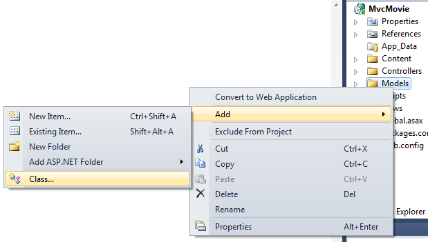
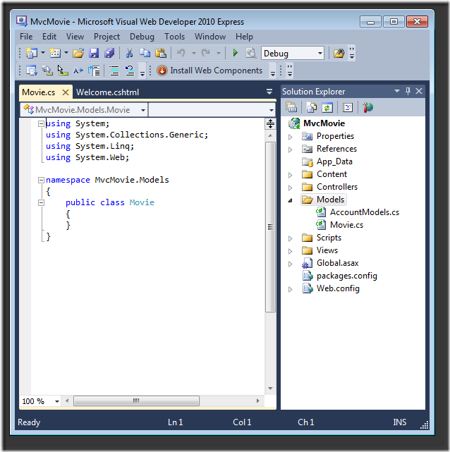
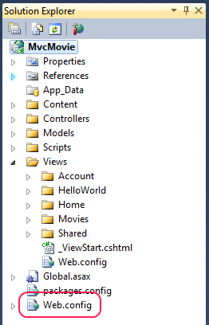

[Edit .md file](C:\Projects\msc\dev\Msc.Www\Web.ASP\App_Data\github\mvc\overview\older-versions\getting-started-with-aspnet-mvc3\cs\adding-a-model.md) | [Edit dev content](http://www.aspdev.net/umbraco#/content/content/edit/25083) | [View dev content](http://docs.aspdev.net/tutorials/mvc/overview/older-versions/getting-started-with-aspnet-mvc3/cs/adding-a-model.html) | [View prod content](http://www.asp.net/mvc/overview/older-versions/getting-started-with-aspnet-mvc3/cs/adding-a-model) | Picker: 27652

Adding a Model (C#)
====================
by [Rick Anderson](https://github.com/Rick-Anderson)

> This tutorial will teach you the basics of building an ASP.NET MVC Web application using Microsoft Visual Web Developer 2010 Express Service Pack 1, which is a free version of Microsoft Visual Studio. Before you start, make sure you've installed the prerequisites listed below. You can install all of them by clicking the following link: [Web Platform Installer](https://www.microsoft.com/web/gallery/install.aspx?appid=VWD2010SP1Pack). Alternatively, you can individually install the prerequisites using the following links:
> 
> - [Visual Studio Web Developer Express SP1 prerequisites](https://www.microsoft.com/web/gallery/install.aspx?appid=VWD2010SP1Pack)
> - [ASP.NET MVC 3 Tools Update](https://www.microsoft.com/web/gallery/install.aspx?appsxml=&amp;appid=MVC3)
> - [SQL Server Compact 4.0](https://www.microsoft.com/web/gallery/install.aspx?appid=SQLCE;SQLCEVSTools_4_0)(runtime + tools support)
> 
> If you're using Visual Studio 2010 instead of Visual Web Developer 2010, install the prerequisites by clicking the following link: [Visual Studio 2010 prerequisites](https://www.microsoft.com/web/gallery/install.aspx?appsxml=&amp;appid=VS2010SP1Pack).
> 
> A Visual Web Developer project with C# source code is available to accompany this topic. [Download the C# version](https://code.msdn.microsoft.com/Introduction-to-MVC-3-10d1b098). If you prefer Visual Basic, switch to the [Visual Basic version](../vb/adding-a-model.md) of this tutorial.

## Adding a Model

In this section you'll add some classes for managing movies in a database. These classes will be the "model" part of the ASP.NET MVC application.

You'll use a .NET Framework data-access technology known as the Entity Framework to define and work with these model classes. The Entity Framework (often referred to as EF) supports a development paradigm called *Code First*. Code First allows you to create model objects by writing simple classes. (These are also known as POCO classes, from "plain-old CLR objects.") You can then have the database created on the fly from your classes, which enables a very clean and rapid development workflow.

## Adding Model Classes

In **Solution Explorer**, right click the *Models* folder, select **Add**, and then select **Class**.

Name the *class* "Movie".

Add the following five properties to the `Movie` class:

    public class Movie 
    {
        public int ID { get; set; }
        public string Title { get; set; }
        public DateTime ReleaseDate { get; set; }
        public string Genre { get; set; }
        public decimal Price { get; set; }
    }

We'll use the `Movie` class to represent movies in a database. Each instance of a `Movie` object will correspond to a row within a database table, and each property of the `Movie` class will map to a column in the table.

In the same file, add the following `MovieDBContext` class:

    public class MovieDBContext : DbContext 
    {
        public DbSet<Movie> Movies { get; set; } 
    }

The `MovieDBContext` class represents the Entity Framework movie database context, which handles fetching, storing, and updating `Movie` class instances in a database. The `MovieDBContext` derives from the `DbContext` base class provided by the Entity Framework. For more information about `DbContext` and `DbSet`, see [Productivity Improvements for the Entity Framework](https://blogs.msdn.com/b/efdesign/archive/2010/06/21/productivity-improvements-for-the-entity-framework.aspx?wa=wsignin1.0).

In order to be able to reference `DbContext` and `DbSet`, you need to add the following `using` statement at the top of the file:

    using System.Data.Entity;

The complete *Movie.cs* file is shown below.

    using System;
    using System.Data.Entity;
    
    namespace MvcMovie.Models  
    {
        public class Movie
        {        public int ID { get; set; }
            public string Title { get; set; }        public DateTime ReleaseDate { get; set; }        public string Genre { get; set; }
            public decimal Price { get; set; }    }
    
        public class MovieDBContext : DbContext 
        {
            public DbSet<Movie> Movies { get; set; } 
        }
    }

## Creating a Connection String and Working with SQL Server Compact

The `MovieDBContext` class you created handles the task of connecting to the database and mapping `Movie` objects to database records. One question you might ask, though, is how to specify which database it will connect to. You'll do that by adding connection information in the *Web.config* file of the application.

Open the application root *Web.config* file. (Not the *Web.config* file in the *Views* folder.) The image below show both *Web.config* files; open the *Web.config* file circled in red.

### 

Add the following connection string to the `<connectionStrings>` element in the *Web.config* file.

    <add name="MovieDBContext" 
             connectionString="Data Source=|DataDirectory|Movies.sdf" 
             providerName="System.Data.SqlServerCe.4.0"/>

The following example shows a portion of the *Web.config* file with the new connection string added:

    <configuration>
      <connectionStrings>
        <add name="MovieDBContext" 
             connectionString="Data Source=|DataDirectory|Movies.sdf" 
             providerName="System.Data.SqlServerCe.4.0"/>
        <add name="ApplicationServices"
             connectionString="data source=.\SQLEXPRESS;Integrated Security=SSPI;AttachDBFilename=|DataDirectory|aspnetdb.mdf;User Instance=true"
             providerName="System.Data.SqlClient" />
      </connectionStrings>

This small amount of code and XML is everything you need to write in order to represent and store the movie data in a database.

Next, you'll build a new `MoviesController` class that you can use to display the movie data and allow users to create new movie listings.

>[!div class="step-by-step"] [Previous](adding-a-view.md) [Next](accessing-your-models-data-from-a-controller.md)