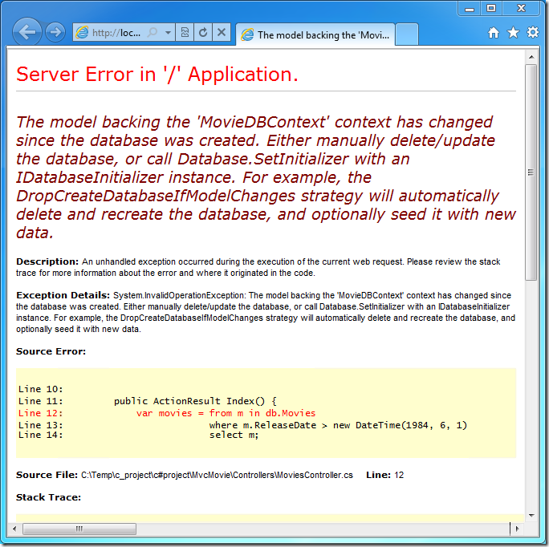
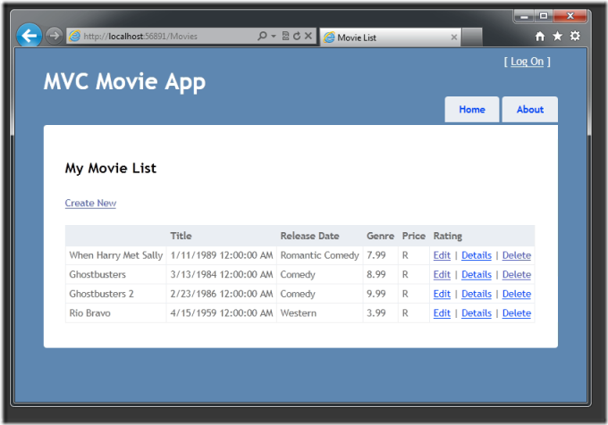
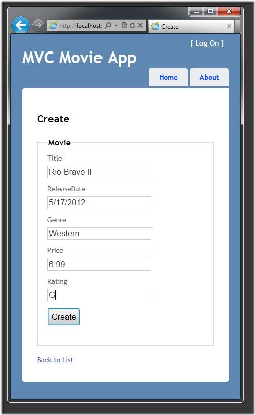
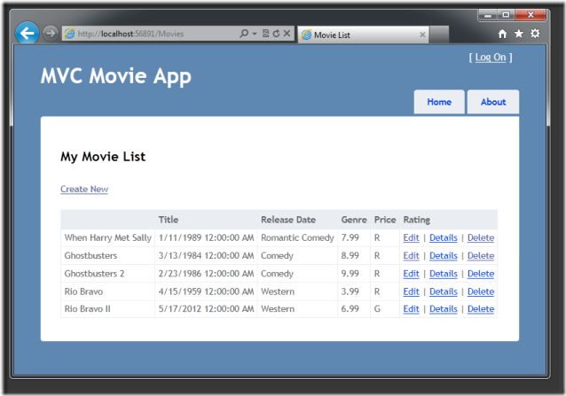

[Edit .md file](C:\Projects\msc\dev\Msc.Www\Web.ASP\App_Data\github\mvc\overview\older-versions\getting-started-with-aspnet-mvc3\vb\adding-a-new-field.md) | [Edit dev content](http://www.aspdev.net/umbraco#/content/content/edit/25095) | [View dev content](http://docs.aspdev.net/tutorials/mvc/overview/older-versions/getting-started-with-aspnet-mvc3/vb/adding-a-new-field.html) | [View prod content](http://www.asp.net/mvc/overview/older-versions/getting-started-with-aspnet-mvc3/vb/adding-a-new-field) | Picker: 27664

Adding a New Field to the Movie Model and Database Table (VB)
====================
by [Rick Anderson](https://github.com/Rick-Anderson)

> This tutorial will teach you the basics of building an ASP.NET MVC Web application using Microsoft Visual Web Developer 2010 Express Service Pack 1, which is a free version of Microsoft Visual Studio. Before you start, make sure you've installed the prerequisites listed below. You can install all of them by clicking the following link: [Web Platform Installer](https://www.microsoft.com/web/gallery/install.aspx?appid=VWD2010SP1Pack). Alternatively, you can individually install the prerequisites using the following links:
> 
> - [Visual Studio Web Developer Express SP1 prerequisites](https://www.microsoft.com/web/gallery/install.aspx?appid=VWD2010SP1Pack)
> - [ASP.NET MVC 3 Tools Update](https://www.microsoft.com/web/gallery/install.aspx?appsxml=&amp;appid=MVC3)
> - [SQL Server Compact 4.0](https://www.microsoft.com/web/gallery/install.aspx?appid=SQLCE;SQLCEVSTools_4_0)(runtime + tools support)
> 
> If you're using Visual Studio 2010 instead of Visual Web Developer 2010, install the prerequisites by clicking the following link: [Visual Studio 2010 prerequisites](https://www.microsoft.com/web/gallery/install.aspx?appsxml=&amp;appid=VS2010SP1Pack).
> 
> A Visual Web Developer project with VB.NET source code is available to accompany this topic. [Download the VB.NET version](https://code.msdn.microsoft.com/Introduction-to-MVC-3-10d1b098). If you prefer C#, switch to the [C# version](../cs/adding-a-new-field.md) of this tutorial.

In this section you'll make some changes to the model classes and learn how you can update the database schema to match the model changes.

## Adding a Rating Property to the Movie Model

Start by adding a new `Rating` property to the existing `Movie` class. Open the *Movie.cs* file and add the `Rating` property like this one:

    Public Property Rating() As String

The complete `Movie` class now looks like the following code:

    Public Class Movie
        Public Property ID() As Integer
        Public Property Title() As String
        Public Property ReleaseDate() As Date
        Public Property Genre() As String
        Public Property Price() As Decimal
        Public Property Rating() As String
    End Class

Recompile the application using the **Debug** &gt;**Build Movie** menu command.

Now that you've updated the `Model` class, you also need to update the *\Views\Movies\Index.vbhtml* and *\Views\Movies\Create.vbhtml* view templates in order to support the new `Rating` property.

Open the*\Views\Movies\Index.vbhtml* file and add a `<th>Rating</th>` column heading just after the **Price** column. Then add a `<td>` column near the end of the template to render the `@item.Rating` value. Below is what the updated *Index.vbhtml* view template looks like:

    <table>
        <tr>
            <th>            Title        </th>
            <th>            ReleaseDate        </th>
            <th>            Genre        </th>
            <th>            Price        </th>
            <th>Rating</th>
            <th></th>
        </tr>
    
    @For Each item In Model
        Dim currentItem = item
        @<tr>
            <td>
                @Html.DisplayFor(Function(modelItem) currentItem.Title)
            </td>
            <td>
                @Html.DisplayFor(Function(modelItem) currentItem.ReleaseDate)
            </td>
            <td>
                @Html.DisplayFor(Function(modelItem) currentItem.Genre)
            </td>
            <td>
                @Html.DisplayFor(Function(modelItem) currentItem.Price)
            </td>
             <td>
                @Html.DisplayFor(Function(modelItem) currentItem.Rating)
            </td>
            <td>
                @Html.ActionLink("Edit", "Edit", New With {.id = currentItem.ID}) |
                @Html.ActionLink("Details", "Details", New With {.id = currentItem.ID}) |
                @Html.ActionLink("Delete", "Delete", New With {.id = currentItem.ID})
            </td>
        </tr>
    Next
    
    </table>

Next, open the *\Views\Movies\Create.vbhtml* file and add the following markup near the end of the form. This renders a text box so that you can specify a rating when a new movie is created.

    

         @Html.LabelFor(Function(model) model.Rating)
     

     

         @Html.EditorFor(Function(model) model.Rating)
         @Html.ValidationMessageFor(Function(model) model.Rating)
     

## Managing Model and Database Schema Differences

You've now updated the application code to support the new `Rating` property.

Now run the application and navigate to the */Movies* URL. When you do this, though, you'll see the following error:

You're seeing this error because the updated `Movie` model class in the application is now different than the schema of the `Movie` table of the existing database. (There's no `Rating` column in the database table.)

By default, when you use Entity Framework Code First to automatically create a database, as you did earlier in this tutorial, Code First adds a table to the database to help track whether the schema of the database is in sync with the model classes it was generated from. If they aren't in sync, the Entity Framework throws an error. This makes it easier to track down issues at development time that you might otherwise only find (by obscure errors) at run time. The sync-checking feature is what causes the error message to be displayed that you just saw.

There are two approaches to resolving the error:

1. Have the Entity Framework automatically drop and re-create the database based on the new model class schema. This approach is very convenient when doing active development on a test database, because it allows you to quickly evolve the model and database schema together. The downside, though, is that you lose existing data in the database — so you *don't* want to use this approach on a production database!
2. Explicitly modify the schema of the existing database so that it matches the model classes. The advantage of this approach is that you keep your data. You can make this change either manually or by creating a database change script.

For this tutorial, we'll use the first approach — you'll have the Entity Framework Code First automatically re-create the database anytime the model changes.

## Automatically Re-Creating the Database on Model Changes

Let's update the application so that Code First automatically drops and re-creates the database anytime you change the model for the application.

> [!NOTE] 
> 
> **Warning**&#160;&#160; You should enable this approach of automatically dropping and re-creating the database only when you're using a development or test database, and *never* on a production database that contains real data. Using it on a production server can lead to data loss.

In **Solution Explorer**, right click the *Models* folder, select **Add**, and then select **Class**.

Name the class &quot;MovieInitializer&quot;. Update the `MovieInitializer` class to contain the following code:

    using System;
    Imports System
    Imports System.Collections.Generic
    Imports System.Data.Entity
    
    Namespace MvcMovie.Models
        Public Class MovieInitializer
            Inherits DropCreateDatabaseIfModelChanges(Of MovieDBContext)
            Protected Overrides Sub Seed(ByVal context As MovieDBContext)
                Dim movies = New List(Of Movie) From {
                 New Movie With {.Title = "When Harry Met Sally", .ReleaseDate = Date.Parse("1989-1-11"), .Genre = "Romantic Comedy", .Rating = "R", .Price = 7.99D},
                 New Movie With {.Title = "Ghostbusters ", .ReleaseDate = Date.Parse("1984-3-13"), .Genre = "Comedy", .Rating = "R", .Price = 8.99D},
                 New Movie With {.Title = "Ghostbusters 2", .ReleaseDate = Date.Parse("1986-2-23"), .Genre = "Comedy", .Rating = "R", .Price = 9.99D},
                 New Movie With {.Title = "Rio Bravo", .ReleaseDate = Date.Parse("1959-4-15"), .Genre = "Western", .Rating = "R", .Price = 3.99D}}
    
                movies.ForEach(Function(d) context.Movies.Add(d))
            End Sub
        End Class
    End Namespace

The `MovieInitializer` class specifies that the database used by the model should be dropped and automatically re-created if the model classes ever change. The code includes a `Seed` method to specify some default data to automatically add to the database any time it's created (or re-created). This provides a useful way to populate the database with some sample data, without requiring you to manually populate it each time you make a model change.

Now that you've defined the `MovieInitializer` class, you'll want to wire it up so that each time the application runs, it checks whether the model classes are different from the schema in the database. If they are, you can run the initializer to re-create the database to match the model and then populate the database with the sample data.

Open the *Global.asax* file that's at the root of the `MvcMovies` project:

The *Global.asax* file contains the class that defines the entire application for the project, and contains an `Application_Start` event handler that runs when the application first starts.

Find the `Application_Start` method and add a call to `Database.SetInitializer` at the beginning of the method, as shown below:

    Sub Application_Start()
            System.Data.Entity.Database.SetInitializer(Of MovieDBContext)(New MvcMovie.Models.MovieInitializer())
           
            AreaRegistration.RegisterAllAreas()
    
            RegisterGlobalFilters(GlobalFilters.Filters)
            RegisterRoutes(RouteTable.Routes)
        End Sub

The `Database.SetInitializer` statement you just added indicates that the database used by the `MovieDBContext` instance should be automatically deleted and re-created if the schema and the database don't match. And as you saw, it will also populate the database with the sample data that's specified in the `MovieInitializer` class.

Close the *Global.asax* file.

Re-run the application and navigate to the */Movies* URL. When the application starts, it detects that the model structure no longer matches the database schema. It automatically re-creates the database to match the new model structure and populates the database with the sample movies:

Click the **Create New** link to add a new movie. Note that you can add a rating.

Click **Create**. The new movie, including the rating, now shows up in the movies listing:

In this section you saw how you can modify model objects and keep the database in sync with the changes. You also learned a way to populate a newly created database with sample data so you can try out scenarios. Next, let's look at how you can add richer validation logic to the model classes and enable some business rules to be enforced.

>[!div class="step-by-step"] [Previous](examining-the-edit-methods-and-edit-view.md) [Next](adding-validation-to-the-model.md)