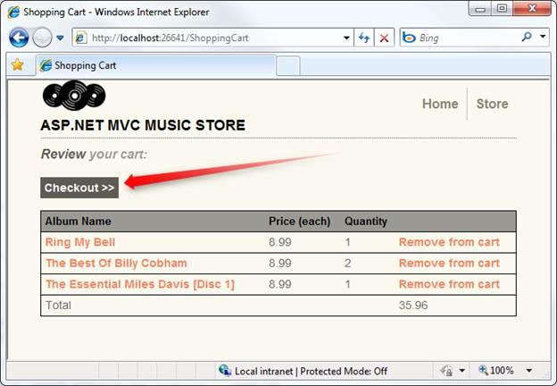
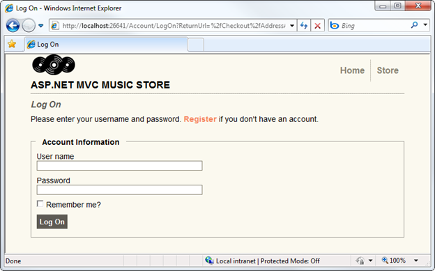
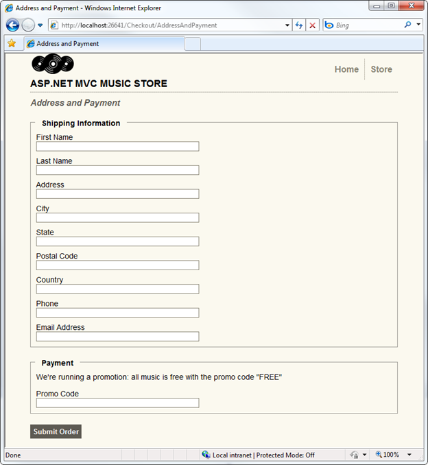
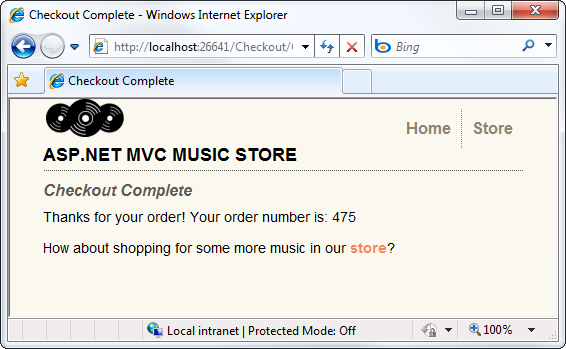
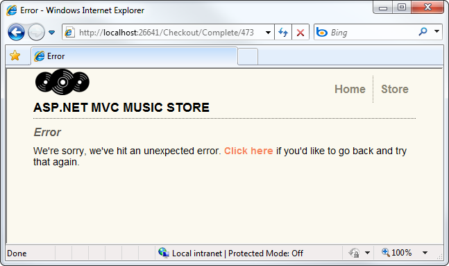
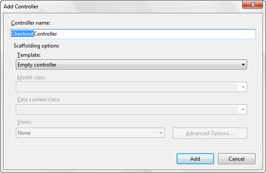
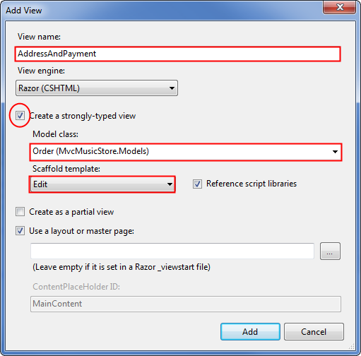
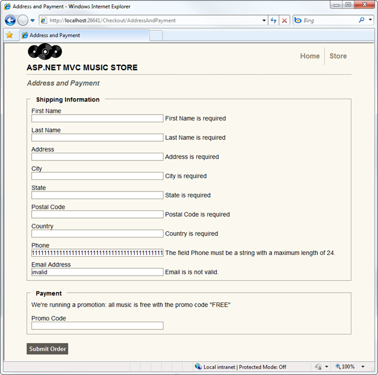
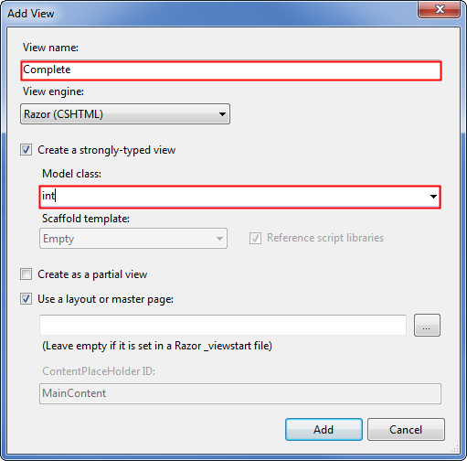

[Edit .md file](C:\Projects\msc\dev\Msc.Www\Web.ASP\App_Data\github\mvc\overview\older-versions\mvc-music-store\mvc-music-store-part-9.md) | [Edit dev content](http://www.aspdev.net/umbraco#/content/content/edit/24900) | [View dev content](http://docs.aspdev.net/tutorials/mvc/overview/older-versions/mvc-music-store/mvc-music-store-part-9.html) | [View prod content](http://www.asp.net/mvc/overview/older-versions/mvc-music-store/mvc-music-store-part-9) | Picker: 27633

Part 9: Registration and Checkout
====================
by [Jon Galloway](https://github.com/jongalloway)

> The MVC Music Store is a tutorial application that introduces and explains step-by-step how to use ASP.NET MVC and Visual Studio for web development.  
>   
> The MVC Music Store is a lightweight sample store implementation which sells music albums online, and implements basic site administration, user sign-in, and shopping cart functionality.  
>   
> This tutorial series details all of the steps taken to build the ASP.NET MVC Music Store sample application. Part 9 covers Registration and Checkout.

In this section, we will be creating a CheckoutController which will collect the shopper's address and payment information. We will require users to register with our site prior to checking out, so this controller will require authorization.

Users will navigate to the checkout process from their shopping cart by clicking the "Checkout" button.

If the user is not logged in, they will be prompted to.

Upon successful login, the user is then shown the Address and Payment view.

Once they have filled the form and submitted the order, they will be shown the order confirmation screen.

Attempting to view either a non-existent order or an order that doesn't belong to you will show the Error view.

## Migrating the Shopping Cart

While the shopping process is anonymous, when the user clicks on the Checkout button, they will be required to register and login. Users will expect that we will maintain their shopping cart information between visits, so we will need to associate the shopping cart information with a user when they complete registration or login.

This is actually very simple to do, as our ShoppingCart class already has a method which will associate all the items in the current cart with a username. We will just need to call this method when a user completes registration or login.

Open the **AccountController** class that we added when we were setting up Membership and Authorization. Add a using statement referencing MvcMusicStore.Models, then add the following MigrateShoppingCart method:

    private void MigrateShoppingCart(string UserName)
     {
        // Associate shopping cart items with logged-in user
        var cart = ShoppingCart.GetCart(this.HttpContext);
     
        cart.MigrateCart(UserName);
        Session[ShoppingCart.CartSessionKey] = UserName;
     }

Next, modify the LogOn post action to call MigrateShoppingCart after the user has been validated, as shown below:

    //
    // POST: /Account/LogOn
    [HttpPost]
     public ActionResult LogOn(LogOnModel model, string returnUrl)
     {
        if (ModelState.IsValid)
        {
            if (Membership.ValidateUser(model.UserName, model.Password))
            {
                MigrateShoppingCart(model.UserName);
                        
                FormsAuthentication.SetAuthCookie(model.UserName,
                    model.RememberMe);
                if (Url.IsLocalUrl(returnUrl) && returnUrl.Length > 1
                    && returnUrl.StartsWith("/")
                    && !returnUrl.StartsWith("//") &&
                    !returnUrl.StartsWith("/\\"))
                {
                    return Redirect(returnUrl);
                }
                else
                {
                    return RedirectToAction("Index", "Home");
                }
            }
            else
            {
                ModelState.AddModelError("", "The user name or password provided is incorrect.");
            }
        }
        // If we got this far, something failed, redisplay form
        return View(model);
     }

Make the same change to the Register post action, immediately after the user account is successfully created:

    //
    // POST: /Account/Register
    [HttpPost]
     public ActionResult Register(RegisterModel model)
     {
        if (ModelState.IsValid)
        {
            // Attempt to register the user
            MembershipCreateStatus createStatus;
            Membership.CreateUser(model.UserName, model.Password, model.Email, 
                   "question", "answer", true, null, out
                   createStatus);
     
            if (createStatus == MembershipCreateStatus.Success)
            {
                MigrateShoppingCart(model.UserName);
                        
                FormsAuthentication.SetAuthCookie(model.UserName, false /*
                      createPersistentCookie */);
                return RedirectToAction("Index", "Home");
            }
            else
            {
                ModelState.AddModelError("", ErrorCodeToString(createStatus));
            }
        }
        // If we got this far, something failed, redisplay form
        return View(model);
     }

That's it - now an anonymous shopping cart will be automatically transferred to a user account upon successful registration or login.

## Creating the CheckoutController

Right-click on the Controllers folder and add a new Controller to the project named CheckoutController using the Empty controller template.

First, add the Authorize attribute above the Controller class declaration to require users to register before checkout:

    namespace MvcMusicStore.Controllers
    {
        [Authorize]
        public class CheckoutController : Controller

*Note: This is similar to the change we previously made to the StoreManagerController, but in that case the Authorize attribute required that the user be in an Administrator role. In the Checkout Controller, we're requiring the user be logged in but aren't requiring that they be administrators.*

For the sake of simplicity, we won't be dealing with payment information in this tutorial. Instead, we are allowing users to check out using a promotional code. We will store this promotional code using a constant named PromoCode.

As in the StoreController, we'll declare a field to hold an instance of the MusicStoreEntities class, named storeDB. In order to make use of the MusicStoreEntities class, we will need to add a using statement for the MvcMusicStore.Models namespace. The top of our Checkout controller appears below.

    using System;
     using System.Linq;
     using System.Web.Mvc;
     using MvcMusicStore.Models;
     
    namespace MvcMusicStore.Controllers
    {
        [Authorize]
        public class CheckoutController : Controller
        {
            MusicStoreEntities storeDB = new MusicStoreEntities();
            const string PromoCode = "FREE";

The CheckoutController will have the following controller actions:

**AddressAndPayment (GET method)** will display a form to allow the user to enter their information.

**AddressAndPayment (POST method)** will validate the input and process the order.

**Complete** will be shown after a user has successfully finished the checkout process. This view will include the user's order number, as confirmation.

First, let's rename the Index controller action (which was generated when we created the controller) to AddressAndPayment. This controller action just displays the checkout form, so it doesn't require any model information.

    //
    // GET: /Checkout/AddressAndPayment
    public ActionResult AddressAndPayment()
    {
        return View();
    }

Our AddressAndPayment POST method will follow the same pattern we used in the StoreManagerController: it will try to accept the form submission and complete the order, and will re-display the form if it fails.

After validating the form input meets our validation requirements for an Order, we will check the PromoCode form value directly. Assuming everything is correct, we will save the updated information with the order, tell the ShoppingCart object to complete the order process, and redirect to the Complete action.

    //
    // POST: /Checkout/AddressAndPayment
    [HttpPost]
     public ActionResult AddressAndPayment(FormCollection values)
     {
        var order = new Order();
        TryUpdateModel(order);
     
        try
        {
            if (string.Equals(values["PromoCode"], PromoCode,
                StringComparison.OrdinalIgnoreCase) == false)
            {
                return View(order);
            }
            else
            {
                order.Username = User.Identity.Name;
                order.OrderDate = DateTime.Now;
     
                //Save Order
                storeDB.Orders.Add(order);
                storeDB.SaveChanges();
                //Process the order
                var cart = ShoppingCart.GetCart(this.HttpContext);
                cart.CreateOrder(order);
     
                return RedirectToAction("Complete",
                    new { id = order.OrderId });
            }
        }
        catch
        {
            //Invalid - redisplay with errors
            return View(order);
        }
    }

Upon successful completion of the checkout process, users will be redirected to the Complete controller action. This action will perform a simple check to validate that the order does indeed belong to the logged-in user before showing the order number as a confirmation.

    //
    // GET: /Checkout/Complete
    public ActionResult Complete(int id)
     {
        // Validate customer owns this order
        bool isValid = storeDB.Orders.Any(
            o => o.OrderId == id &&
            o.Username == User.Identity.Name);
     
        if (isValid)
        {
            return View(id);
        }
        else
        {
            return View("Error");
        }
    }

*Note: The Error view was automatically created for us in the /Views/Shared folder when we began the project.*

The complete CheckoutController code is as follows:

    using System;
     using System.Linq;
     using System.Web.Mvc;
     using MvcMusicStore.Models;
     
    namespace MvcMusicStore.Controllers
    {
        [Authorize]
        public class CheckoutController : Controller
        {
            MusicStoreEntities storeDB = new MusicStoreEntities();
            const string PromoCode = "FREE";
            //
            // GET: /Checkout/AddressAndPayment
            public ActionResult AddressAndPayment()
            {
                return View();
            }
            //
            // POST: /Checkout/AddressAndPayment
            [HttpPost]
            public ActionResult AddressAndPayment(FormCollection values)
            {
                var order = new Order();
                TryUpdateModel(order);
     
                try
                {
                    if (string.Equals(values["PromoCode"], PromoCode,
                        StringComparison.OrdinalIgnoreCase) == false)
                    {
                        return View(order);
                    }
                    else
                    {
                        order.Username = User.Identity.Name;
                        order.OrderDate = DateTime.Now;
     
                        //Save Order
                        storeDB.Orders.Add(order);
                        storeDB.SaveChanges();
                        //Process the order
                        var cart = ShoppingCart.GetCart(this.HttpContext);
                        cart.CreateOrder(order);
     
                        return RedirectToAction("Complete",
                            new { id = order.OrderId });
                    }
                }
                catch
                {
                    //Invalid - redisplay with errors
                    return View(order);
                }
            }
            //
            // GET: /Checkout/Complete
            public ActionResult Complete(int id)
            {
                // Validate customer owns this order
                bool isValid = storeDB.Orders.Any(
                    o => o.OrderId == id &&
                    o.Username == User.Identity.Name);
     
                if (isValid)
                {
                    return View(id);
                }
                else
                {
                    return View("Error");
                }
            }
        }
    }

## Adding the AddressAndPayment view

Now, let's create the AddressAndPayment view. Right-click on one of the the AddressAndPayment controller actions and add a view named AddressAndPayment which is strongly typed as an Order and uses the Edit template, as shown below.

This view will make use of two of the techniques we looked at while building the StoreManagerEdit view:

- We will use Html.EditorForModel() to display form fields for the Order model
- We will leverage validation rules using an Order class with validation attributes

We'll start by updating the form code to use Html.EditorForModel(), followed by an additional textbox for the Promo Code. The complete code for the AddressAndPayment view is shown below.

    @model MvcMusicStore.Models.Order
    @{
        ViewBag.Title = "Address And Payment";
    }
    
    
    @using (Html.BeginForm()) {
        
        <h2>Address And Payment</h2>
        <fieldset>
            <legend>Shipping Information</legend>
            @Html.EditorForModel()
        </fieldset>
        <fieldset>
            <legend>Payment</legend>
            
We're running a promotion: all music is free 
                with the promo code: "FREE"

            

                @Html.Label("Promo Code")
            

            

                @Html.TextBox("PromoCode")
            

        </fieldset>
        
        <input type="submit" value="Submit Order" />
    }

## Defining validation rules for the Order

Now that our view is set up, we will set up the validation rules for our Order model as we did previously for the Album model. Right-click on the Models folder and add a class named Order. In addition to the validation attributes we used previously for the Album, we will also be using a Regular Expression to validate the user's e-mail address.

    using System.Collections.Generic;
     using System.ComponentModel;
     using System.ComponentModel.DataAnnotations;
     using System.Web.Mvc;
     
    namespace MvcMusicStore.Models
    {
        [Bind(Exclude = "OrderId")]
        public partial class Order
        {
            [ScaffoldColumn(false)]
            public int OrderId { get; set; }
            [ScaffoldColumn(false)]
            public System.DateTime OrderDate { get; set; }
            [ScaffoldColumn(false)]
            public string Username { get; set; }
            [Required(ErrorMessage = "First Name is required")]
            [DisplayName("First Name")]
            [StringLength(160)]
            public string FirstName { get; set; }
            [Required(ErrorMessage = "Last Name is required")]
            [DisplayName("Last Name")]
            [StringLength(160)]
            public string LastName { get; set; }
            [Required(ErrorMessage = "Address is required")]
            [StringLength(70)]
            public string Address { get; set; }
            [Required(ErrorMessage = "City is required")]
            [StringLength(40)]
            public string City { get; set; }
            [Required(ErrorMessage = "State is required")]
            [StringLength(40)]
            public string State { get; set; }
            [Required(ErrorMessage = "Postal Code is required")]
            [DisplayName("Postal Code")]
            [StringLength(10)]
            public string PostalCode { get; set; }
            [Required(ErrorMessage = "Country is required")]
            [StringLength(40)]
            public string Country { get; set; }
            [Required(ErrorMessage = "Phone is required")]
            [StringLength(24)]
            public string Phone { get; set; }
            [Required(ErrorMessage = "Email Address is required")]
            [DisplayName("Email Address")]
           
            [RegularExpression(@"[A-Za-z0-9._%+-]+@[A-Za-z0-9.-]+\.[A-Za-z]{2,4}",
                ErrorMessage = "Email is is not valid.")]
            [DataType(DataType.EmailAddress)]
            public string Email { get; set; }
            [ScaffoldColumn(false)]
            public decimal Total { get; set; }
            public List<OrderDetail> OrderDetails { get; set; }
        }
    }

Attempting to submit the form with missing or invalid information will now show error message using client-side validation.

Okay, we've done most of the hard work for the checkout process; we just have a few odds and ends to finish. We need to add two simple views, and we need to take care of the handoff of the cart information during the login process.

## Adding the Checkout Complete view

The Checkout Complete view is pretty simple, as it just needs to display the Order ID. Right-click on the Complete controller action and add a view named Complete which is strongly typed as an int.

Now we will update the view code to display the Order ID, as shown below.

    @model int
    @{
        ViewBag.Title = "Checkout Complete";
    }
    <h2>Checkout Complete</h2>
    
Thanks for your order! Your order number is: @Model

    
How about shopping for some more music in our 
        @Html.ActionLink("store",
    "Index", "Home")
    

## Updating The Error view

The default template includes an Error view in the Shared views folder so that it can be re-used elsewhere in the site. This Error view contains a very simple error and doesn't use our site Layout, so we'll update it.

Since this is a generic error page, the content is very simple. We'll include a message and a link to navigate to the previous page in history if the user wants to re-try their action.

    @{
        ViewBag.Title = "Error";
    }
     
    <h2>Error</h2>
     
    
We're sorry, we've hit an unexpected error.
        <a href="javascript:history.go(-1)">Click here</a> 
        if you'd like to go back and try that again.

*Please use the Discussions at [http://mvcmusicstore.codeplex.com](http://mvcmusicstore.codeplex.com) for any questions or comments.*

>[!div class="step-by-step"] [Previous](mvc-music-store-part-8.md) [Next](mvc-music-store-part-10.md)