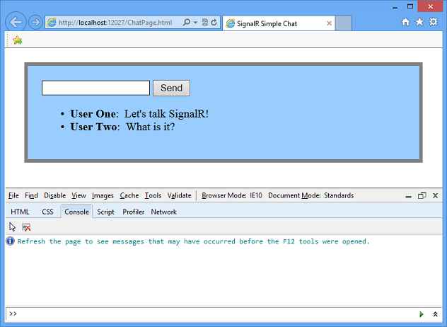
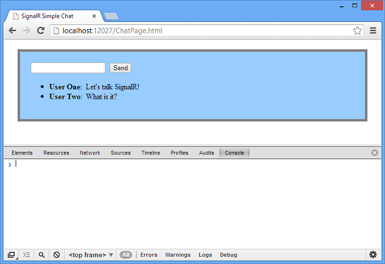
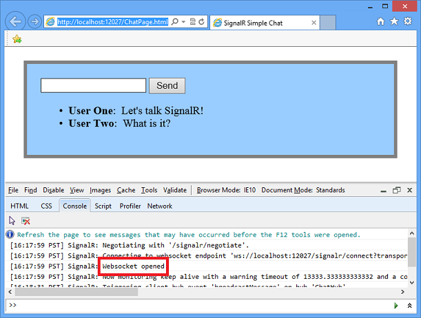
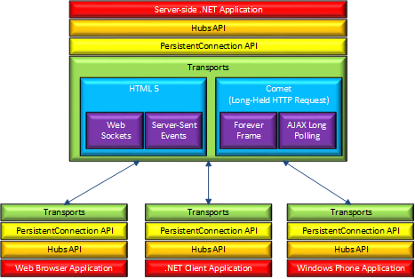

Introduction to SignalR
====================
by [Patrick Fletcher](https://github.com/pfletcher)

> This article describes what SignalR is, and some of the solutions it was designed to create. 
> 
> ## Questions and comments
> 
> Please leave feedback on how you liked this tutorial and what we could improve in the comments at the bottom of the page. If you have questions that are not directly related to the tutorial, you can post them to the [ASP.NET SignalR forum](https://forums.asp.net/1254.aspx/1?ASP+NET+SignalR) or [StackOverflow.com](http://stackoverflow.com/).

## What is SignalR?

ASP.NET SignalR is a library for ASP.NET developers that simplifies the process of adding real-time web functionality to applications. Real-time web functionality is the ability to have server code push content to connected clients instantly as it becomes available, rather than having the server wait for a client to request new data.

SignalR can be used to add any sort of "real-time" web functionality to your ASP.NET application. While chat is often used as an example, you can do a whole lot more. Any time a user refreshes a web page to see new data, or the page implements [long polling](http://en.wikipedia.org/wiki/Push_technology#Long_polling) to retrieve new data, it is a candidate for using SignalR. Examples include dashboards and monitoring applications, collaborative applications (such as simultaneous editing of documents), job progress updates, and real-time forms.

SignalR also enables completely new types of web applications that require high frequency updates from the server, for example, real-time gaming. For a great example of this, see the [ShootR game.](http://shootr.signalr.net/)

SignalR provides a simple API for creating server-to-client remote procedure calls (RPC) that call JavaScript functions in client browsers (and other client platforms) from server-side .NET code. SignalR also includes API for connection management (for instance, connect and disconnect events), and grouping connections.

SignalR handles connection management automatically, and lets you broadcast messages to all connected clients simultaneously, like a chat room. You can also send messages to specific clients. The connection between the client and server is persistent, unlike a classic HTTP connection, which is re-established for each communication.

SignalR supports "server push" functionality, in which server code can call out to client code in the browser using Remote Procedure Calls (RPC), rather than the request-response model common on the web today.

SignalR applications can scale out to thousands of clients using Service Bus, SQL Server or [Redis](http://redis.io).

SignalR is open-source, accessible through [GitHub](https://github.com/signalr).

## SignalR and WebSocket

SignalR uses the new WebSocket transport where available, and falls back to older transports where necessary. While you could certainly write your application using WebSocket directly, using SignalR means that a lot of the extra functionality you would need to implement will already have been done for you. Most importantly, this means that you can code your application to take advantage of WebSocket without having to worry about creating a separate code path for older clients. SignalR also shields you from having to worry about updates to WebSocket, since SignalR will continue to be updated to support changes in the underlying transport, providing your application a consistent interface across versions of WebSocket.

While you could certainly create a solution using WebSocket alone, SignalR provides all of the functionality you would need to write yourself, such as fallback to other transports and revising your application for updates to WebSocket implementations.

## Transports and fallbacks

SignalR is an abstraction over some of the transports that are required to do real-time work between client and server. A SignalR connection starts as HTTP, and is then promoted to a WebSocket connection if it is available. WebSocket is the ideal transport for SignalR, since it makes the most efficient use of server memory, has the lowest latency, and has the most underlying features (such as full duplex communication between client and server), but it also has the most stringent requirements: WebSocket requires the server to be using Windows Server 2012 or Windows 8, and .NET Framework 4.5. If these requirements are not met, SignalR will attempt to use other transports to make its connections.

### HTML 5 transports

These transports depend on support for [HTML 5](http://en.wikipedia.org/wiki/HTML5). If the client browser does not support the HTML 5 standard, older transports will be used.

- **WebSocket** (if the both the server and browser indicate they can support Websocket). WebSocket is the only transport that establishes a true persistent, two-way connection between client and server. However, WebSocket also has the most stringent requirements; it is fully supported only in the latest versions of Microsoft Internet Explorer, Google Chrome, and Mozilla Firefox, and only has a partial implementation in other browsers such as Opera and Safari.
- **Server Sent Events**, also known as EventSource (if the browser supports Server Sent Events, which is basically all browsers except Internet Explorer.)

### Comet transports

The following transports are based on the [Comet](http://en.wikipedia.org/wiki/Comet_(programming)) web application model, in which a browser or other client maintains a long-held HTTP request, which the server can use to push data to the client without the client specifically requesting it.

- **Forever Frame** (for Internet Explorer only). Forever Frame creates a hidden IFrame which makes a request to an endpoint on the server that does not complete. The server then continually sends script to the client which is immediately executed, providing a one-way realtime connection from server to client. The connection from client to server uses a separate connection from the server to client connection, and like a standard HTML request, a new connection is created for each piece of data that needs to be sent.
- **Ajax long polling**. Long polling does not create a persistent connection, but instead polls the server with a request that stays open until the server responds, at which point the connection closes, and a new connection is requested immediately. This may introduce some latency while the connection resets.

For more information on what transports are supported under which configurations, see [Supported Platforms](supported-platforms.md).

### Transport selection process

The following list shows the steps that SignalR uses to decide which transport to use.

1. If the browser is Internet Explorer 8 or earlier, Long Polling is used.
2. If JSONP is configured (that is, the `jsonp` parameter is set to `true` when the connection is started), Long Polling is used.
3. If a cross-domain connection is being made (that is, if the SignalR endpoint is not in the same domain as the hosting page), then WebSocket will be used if the following criteria are met:

    - The client supports CORS (Cross-Origin Resource Sharing). For details on which clients support CORS, see [CORS at caniuse.com](http://www.caniuse.com/CORS).
    - The client supports WebSocket
    - The server supports WebSocket

    If any of these criteria are not met, Long Polling will be used. For more information on cross-domain connections, see [How to establish a cross-domain connection](../guide-to-the-api/hubs-api-guide-javascript-client.md).
4. If JSONP is not configured and the connection is not cross-domain, WebSocket will be used if both the client and server support it.
5. If either the client or server do not support WebSocket, Server Sent Events is used if it is available.
6. If Server Sent Events is not available, Forever Frame is attempted.
7. If Forever Frame fails, Long Polling is used.

### Monitoring transports

You can determine what transport your application is using by enabling logging on your hub, and opening the console window in your browser.

To enable logging for your hub's events in a browser, add the following command to your client application:

`$.connection.hub.logging = true;`

- In Internet Explorer, open the developer tools by pressing F12, and click the Console tab.

    
- In Chrome, open the console by pressing Ctrl+Shift+J.

    

With the console open and logging enabled, you'll be able to see which transport is being used by SignalR.

### Specifying a transport

Negotiating a transport takes a certain amount of time and client/server resources. If the client capabilities are known, then a transport can be specified when the client connection is started. The following code snippet demonstrates starting a connection using the Ajax Long Polling transport, as would be used if it was known that the client did not support any other protocol:

`connection.start({ transport: 'longPolling' });`

You can specify a fallback order if you want a client to try specific transports in order. The following code snippet demonstrates trying WebSocket, and failing that, going directly to Long Polling.

`connection.start({ transport: ['webSockets','longPolling'] });`

The string constants for specifying transports are defined as follows:

- `webSockets`
- `foreverFrame`
- `serverSentEvents`
- `longPolling`

## Connections and Hubs

The SignalR API contains two models for communicating between clients and servers: Persistent Connections and Hubs.

A Connection represents a simple endpoint for sending single-recipient, grouped, or broadcast messages. The Persistent Connection API (represented in .NET code by the PersistentConnection class) gives the developer direct access to the low-level communication protocol that SignalR exposes. Using the Connections communication model will be familiar to developers who have used connection-based APIs such as Windows Communcation Foundation.

A Hub is a more high-level pipeline built upon the Connection API that allows your client and server to call methods on each other directly. SignalR handles the dispatching across machine boundaries as if by magic, allowing clients to call methods on the server as easily as local methods, and vice versa. Using the Hubs communication model will be familiar to developers who have used remote invocation APIs such as .NET Remoting. Using a Hub also allows you to pass strongly typed parameters to methods, enabling model binding.

### Architecture diagram

The following diagram shows the relationship between Hubs, Persistent Connections, and the underlying technologies used for transports.

### How Hubs work

When server-side code calls a method on the client, a packet is sent across the active transport that contains the name and parameters of the method to be called (when an object is sent as a method parameter, it is serialized using JSON). The client then matches the method name to methods defined in client-side code. If there is a match, the client method will be executed using the deserialized parameter data.

The method call can be monitored using tools like [Fiddler.](http://fiddler2.com/) The following image shows a method call sent from a SignalR server to a web browser client in the Logs pane of Fiddler. The method call is being sent from a hub called `MoveShapeHub`, and the method being invoked is called `updateShape`.

In this example, the hub name is identified with the `H` parameter; the method name is identified with the `M` parameter, and the data being sent to the method is identified with the `A` parameter. The application that generated this message is created in the [High-Frequency Realtime](tutorial-high-frequency-realtime-with-signalr.md) tutorial.

### Choosing a communication model

Most applications should use the Hubs API. The Connections API could be used in the following circumstances:

- The format of the actual message sent needs to be specified.
- The developer prefers to work with a messaging and dispatching model rather than a remote invocation model.
- An existing application that uses a messaging model is being ported to use SignalR.