Using SignalR Performance Counters in an Azure Web Role
====================
by [Tom FitzMacken](https://github.com/tfitzmac)

> This article describes how to install and use SignalR performance counters in an Azure Web Role.

SignalR performance counters can be used to monitor performance in an Azure Web Role. The resulting counters will be captured by Windows Azure Diagnostics. Installing SignalR performance counters on Azure is done with SignalR.exe, the same tool that is used for standalone or on-premises applications. However, since Azure roles are transient, the application must be configured to install and register SignalR performance counters upon startup.

This tutorial demonstrates how to create an Azure Web Role application that uses SignalR 2 performance counters.

**Prerequisites**

- [Visual Studio 2013](https://www.visualstudio.com/products/visual-studio-express-vs)
- [Windows Azure SDK for Visual Studio 2013](https://www.windowsazure.com/en-us/downloads/)
- A Microsoft Azure subscription. To sign up for a free Azure trial account, see [Azure Free Trial](https://azure.microsoft.com/en-us/pricing/free-trial/).

## Creating an Azure Web Role application that exposes SignalR performance counters

1. Open Visual Studio 2013 with Administrator privileges.
2. In Visual Studio 2013, select **File**, **New**, **Project**.
3. In the **Templates** pane of the **New Project** window, under the **Visual C#** node, select the **Cloud** node, and select the **Windows Azure Cloud Service** template. Name the application **SignalRPerfCounters** and click **OK**.

    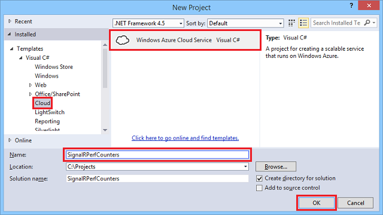
4. In the **New Windows Azure Cloud Service** dialog, select **ASP.NET Web Role** and click the **&gt;** button to add the role to the project. Click **OK**.

    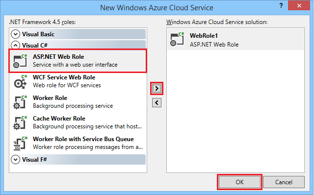
5. In the **New ASP.NET Project - WebRole1** dialog, select the **MVC** template, and select **OK**.

    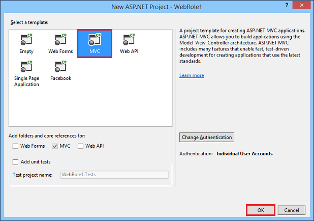
6. In **Solution Explorer**, open the `diagnostics.wadcfg` file under **WebRole1**.

    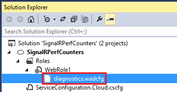
7. Replace the contents of the file with the following code.

        <?xml version="1.0"?>
        
        <!-- Specifies the interval at which the diagnostics agent polls the storage service for diagnostics configuration changes-->
        <DiagnosticMonitorConfiguration xmlns="http://schemas.microsoft.com/ServiceHosting/2010/10/DiagnosticsConfiguration" configurationChangePollInterval="PT1M" overallQuotaInMB="4096">
          <!--Configure the diagnostics infrastructure logs into which the diagnostics agent log data about itself -->
          <DiagnosticInfrastructureLogs bufferQuotaInMB="256"  scheduledTransferLogLevelFilter="Warning"   scheduledTransferPeriod="PT5M" />
          <!-- Configure the capture and persistence of basic log from the WAD trace listener-->
          <Logs bufferQuotaInMB="100" scheduledTransferLogLevelFilter="Warning" scheduledTransferPeriod="PT5M" />
          <!-- Configure the capture and persistence of data located in directories on local file system  which are for crash dupmp, failed IIS request logs and IIS logs-->
          <Directories bufferQuotaInMB="1024" scheduledTransferPeriod="PT5M">
            <CrashDumps container="wad-crash-dumps" directoryQuotaInMB="128" />
            <FailedRequestLogs container="wad-frq" directoryQuotaInMB="128"/>
            <IISLogs container="wad-iis" directoryQuotaInMB="128" />
            <DataSources>
              <DirectoryConfiguration container="wad-startup" directoryQuotaInMB="10">
                <!-- Absolute specifies an absolute path with optional environment expansion -->
                <Absolute expandEnvironment="true" path="%ROLEROOT%\approot\bin\Startup\Log" />
              </DirectoryConfiguration>
            </DataSources>
          </Directories>
          <!-- Configure the capture and persistence of performance counters data-->
          <PerformanceCounters bufferQuotaInMB="256" scheduledTransferPeriod="PT5M">
            <PerformanceCounterConfiguration  counterSpecifier="\Processor(_Total)\% Processor Time" sampleRate="PT10S" />
            <PerformanceCounterConfiguration  counterSpecifier="\LogicalDisk(*)\% Free Space" sampleRate="PT10S" />
            <PerformanceCounterConfiguration  counterSpecifier="\LogicalDisk(*)\Avg. Disk sec/Transfer" sampleRate="PT10S" />
            <PerformanceCounterConfiguration  counterSpecifier="\Memory\Available Bytes" sampleRate="PT10S" />
            <PerformanceCounterConfiguration  counterSpecifier="\Memory\Available MBytes" sampleRate="PT10S" />
            <PerformanceCounterConfiguration  counterSpecifier="\ASP.NET\Requests Queued" sampleRate="PT10S" />
            <PerformanceCounterConfiguration  counterSpecifier="\ASP.NET\Requests Rejected" sampleRate="PT10S" />
            <PerformanceCounterConfiguration  counterSpecifier="\ASP.NET Applications(__Total__)\Requests/Sec" sampleRate="PT10S" />
            <PerformanceCounterConfiguration  counterSpecifier="\ASP.NET\Request Wait Time" sampleRate="PT10S" />
            <PerformanceCounterConfiguration  counterSpecifier="\.NET CLR Memory(w3wp)\% Time in GC" sampleRate="PT10S" />
            <PerformanceCounterConfiguration  counterSpecifier="\.NET CLR Exceptions(w3wp)\# of Exceps Thrown / sec" sampleRate="PT10S" />
            <PerformanceCounterConfiguration  counterSpecifier="\.NET CLR LocksAndThreads(w3wp)\# of current logical Threads" sampleRate="PT10S" />
            <PerformanceCounterConfiguration  counterSpecifier="\.NET CLR LocksAndThreads(w3wp)\# of current physical Threads" sampleRate="PT10S" />
            <PerformanceCounterConfiguration  counterSpecifier="\.NET CLR LocksAndThreads(w3wp)\Current Queue Length" sampleRate="PT10S" />
            <PerformanceCounterConfiguration  counterSpecifier="\.NET CLR LocksAndThreads(w3wp)\Contention Rate / sec" sampleRate="PT10S" />
            <PerformanceCounterConfiguration  counterSpecifier="\.NET CLR Memory(w3wp)\# Bytes in all Heaps" sampleRate="PT10S" />
            <PerformanceCounterConfiguration  counterSpecifier="\.NET CLR Memory(w3wp)\# GC Handles" sampleRate="PT10S" />
            <PerformanceCounterConfiguration  counterSpecifier="\.NET CLR Memory(w3wp)\# of Pinned Objects" sampleRate="PT10S" />
            <PerformanceCounterConfiguration  counterSpecifier="\TCPV4\Segments Retransmitted/sec" sampleRate="PT10S" />
            <PerformanceCounterConfiguration  counterSpecifier="\TCPV4\Connection Failures" sampleRate="PT10S" />
            <PerformanceCounterConfiguration  counterSpecifier="\TCPV6\Segments Retransmitted/sec" sampleRate="PT10S" />
            <!-- comment out to check that addition occurred <PerformanceCounterConfiguration  counterSpecifier="\TCPV6\Connection Failures" sampleRate="PT10S" />-->
          </PerformanceCounters>
          <!-- configure the capture and persistence of the Windows event logs -->
          <WindowsEventLog bufferQuotaInMB="100" scheduledTransferLogLevelFilter="Warning" scheduledTransferPeriod="PT5M">
            <DataSource name="System!*" />
            <DataSource name="Application!*"/>
          </WindowsEventLog>
        </DiagnosticMonitorConfiguration>
8. Open the Library Package Manager Console from **Tools/Library Package Manager**. Enter the following commands to install the latest version of SignalR and the SignalR utilities package:

        install-package microsoft.aspnet.signalr
        install-package microsoft.aspnet.signalr.utils
9. Next, we'll configure the application to install the SignalR performance counters to the role instance when it starts up or recycles. In **Solution Explorer**, right-click on the **WebRole1** project and select **Add...**, **New Folder**. Name the new folder **Startup**.

    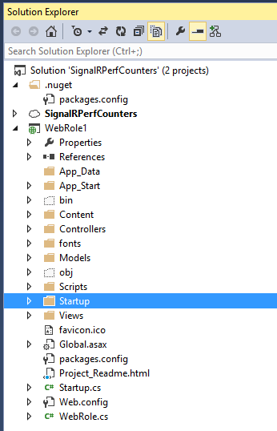
10. Copy the **SignalR.exe** file (added with the **Microsoft.AspNet.SignalR.Utils** package) from **&lt;project folder&gt;\SignalRPerfCounters\packages\Microsoft.AspNet.SignalR.Utils.2.0.2\tools** to the new Startup folder.
- In **Solution Explorer**, right-click the **Startup** folder and select **Add...**, **Existing Item**. In the dialog that appears, select **SignalR.exe** and click **Add**.

    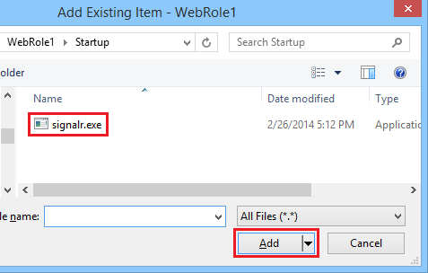
- Right-click on the **Startup** folder you created. Select **Add**, **New Item**. Select the **General** node, select **Text File**, name the new item `SignalRPerfCounterInstall.cmd`. This command file will install the SignalR performance counters to the web role.

    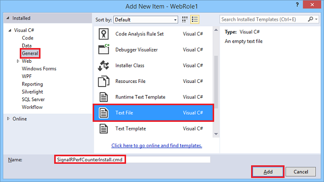
- Right-click the **SignalR.exe** file, and select **Properties**. Set **Copy to Output Directory** to **Copy Always**.

    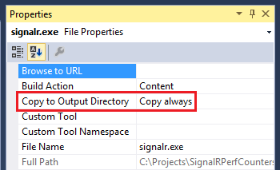
- Repeat the previous step for the **SignalRPerfCounterInstall.cmd** file.
- Open **SignalRPerfCounterInstall.cmd** and enter the following script, then save and close the file. This script executes SignalR.exe, which adds the SignalR performance counters to the role instance.

        SET SignalR_LogDir=%~dp0Log\
        MKDIR "%SignalR_LogDir%"
        cd %~dp0
        signalr.exe ipc   >> "%SignalR_LogDir%SignalR_Log.txt" 2>&1
        net localgroup "Performance Monitor Users" "Network Service" /ADD >> "%SignalR_LogDir%NetworkAdd.txt" 2>&1
- Right-click on the **SignalRPerfCounterInstall.cmd** file and select **Open With...** In the dialog that appears, select **Binary Editor** and click **OK**.

    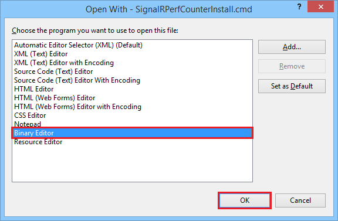
- In the binary editor, select any leading bytes in the file and delete them. Save and close the file.

    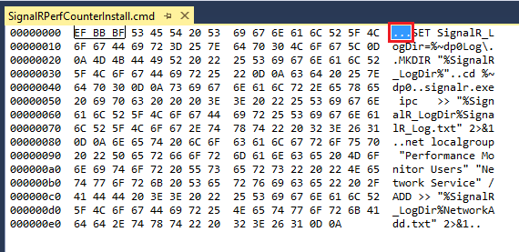
- Open `ServiceDefinition.csdef` and add a startup task that executes the `SignalrPerfCounterInstall.cmd` file when the service starts up:

    [!code[Main](using-signalr-performance-counters-in-an-azure-web-role/samples/sample1.xml?highlight=4-7)]
- Open `Views/Shared/_Layout.cshtml` and remove the jquery bundle script from the end of the file.

        

                @RenderBody()
                

                <footer>
                    
&copy; @DateTime.Now.Year - My ASP.NET Application

                </footer>
            

        
            @Scripts.Render("~/bundles/jquery")
            @Scripts.Render("~/bundles/bootstrap")
            @RenderSection("scripts", required: false)
        </body>
        </html>
- Open `Views/Home/Index.cshtml`, and replace the contents with the following code. This adds a JavaScript client that continuously calls the `increment` method on the server.

        @{
            ViewBag.Title = "Home Page";
        }
        
        
        
        
        
        

            <section class="featured">
                

                    

                        Hello World!
                    

                    

                        My Counter: 
                    

                

            </section>
            <section class="content-wrapper main-content clear-fix"></section>
        

        
        
- Create a new folder in the **WebRole1** project called Hubs. Right-click this folder, and select **Add...**, **SignalR Hub Class (v2)**. Name the new hub **MyHub** and click **Add**.
- Open **MyHub.cs** and replace the contents with the following code.

        using Microsoft.AspNet.SignalR;
        using System.Threading.Tasks;
        
        namespace WebRole1.Hubs
        {
            public class MyHub : Hub
            {
                public async Task Increment(int x)
                {
                    await this.Clients.Caller.sendResult(x + 1);
                }
            }
        }
- **[Crank.exe](signalr-connection-density-testing-with-crank.md)** is a connection density testing tool provided with the SignalR codebase. Since Crank requires a **PersistentConnection**, we'll add one to the site to test. Add a new folder to the **WebRole1** project called **PersistentConnections**. Right-click this folder and select **Add...**, **Class**. Name the new class **MyPersistentConnection** and click **Add**.
- Open **MyPersistentConnection.cs** and replace the contents with the following code.

        using System.Threading.Tasks;
        using Microsoft.AspNet.SignalR;
        using Microsoft.AspNet.SignalR.Infrastructure;
        
        namespace WebRole1.PersistentConnections
        {
            public class MyPersistentConnection : PersistentConnection
            {
                protected override Task OnReceived(IRequest request, string connectionId, string data)
                {
                    //Return data to calling user
                    return Connection.Send(connectionId, data);        
                }
            }
        }
- Next, we'll start the SignalR objects when OWIN starts up, using the `Startup.cs` class. Your project already contains a **Startup.cs** class, unless you changed the authentication method when creating the project, in which case you'll need to create it. Open or create **Startup.cs** and replace the contents with the following code.

        using Microsoft.Owin;
        using Owin;
        using WebRole1.PersistentConnections;
        
        [assembly: OwinStartupAttribute(typeof(WebRole1.Startup))]
        namespace WebRole1
        {
            public partial class Startup
            {
                public void Configuration(IAppBuilder app)
                {
                    ConfigureAuth(app);     //Only needed if "No Authentication" was not selected for the project
                    app.MapSignalR();
                    app.MapSignalR<MyPersistentConnection>("/echo");
                }
            }
        }
- Since in Windows Azure, diagnostics is started before the role starts, the performance counters need to be dynamically added. To do this, create a new folder in the **WebRole1** project called **SignalRHelper**; in this folder, create a new class called **SignalRDiagnosticHelper**. Open this new class and replace the contents with the following code.

        using System;
        using System.Linq;
        using Microsoft.WindowsAzure.Diagnostics;
        using Microsoft.WindowsAzure.Diagnostics.Management;
        using Microsoft.WindowsAzure.ServiceRuntime;
        
        namespace WebRole1.SignalRHelper
        {
            public class SignalRDiagnosticHelper
            {
                private const string EmulatorCategoryTemplate = "signalr({0}_web)";
                private const string CloudCategoryTemplate = "signalr({0}_in_{1}_web)";
        
                public static string createSignalRCategoryName()
                {
                    if (RoleEnvironment.IsEmulated)
                    {
                        string id = RoleEnvironment.CurrentRoleInstance.Id.ToLower();
                        return string.Format(EmulatorCategoryTemplate, id);
                    }
                    else
                    {
                        var name = RoleEnvironment.CurrentRoleInstance.Role.Name.ToLower();
                        var number = RoleEnvironment.CurrentRoleInstance.Id.Split(new char[] { '_' }).Last();
                        return string.Format(CloudCategoryTemplate, name, number);
        
                    }
        
                }
        
                public static void RegisterSignalRPerfCounters()
                {
                    TimeSpan ts = new TimeSpan(0, 0, 10);
        
                    RoleInstanceDiagnosticManager roleInstanceDiagnosticManager =
                    new RoleInstanceDiagnosticManager(
                    RoleEnvironment.GetConfigurationSettingValue("Microsoft.WindowsAzure.Plugins.Diagnostics.ConnectionString"),
                    RoleEnvironment.DeploymentId,
                    RoleEnvironment.CurrentRoleInstance.Role.Name,
                    RoleEnvironment.CurrentRoleInstance.Id);
        
                    // Get the current diagnostic monitor for the role.
                    var config = roleInstanceDiagnosticManager.GetCurrentConfiguration() ?? DiagnosticMonitor.GetDefaultInitialConfiguration();
        
                    string connectionString = RoleEnvironment.GetConfigurationSettingValue("Microsoft.WindowsAzure.Plugins.Diagnostics.ConnectionString");
                    string deploymentID = RoleEnvironment.DeploymentId;
                    string roleName = RoleEnvironment.CurrentRoleInstance.Role.Name;
        
                    // Get the DeploymentDiagnosticManager object for your deployment.
                    DeploymentDiagnosticManager diagManager = new DeploymentDiagnosticManager(connectionString, deploymentID);
        
                    var signalRCategoryName = createSignalRCategoryName();
        
                    RegisterCounter("Connections Connected", ts, signalRCategoryName, config);
                    RegisterCounter("Connections Reconnected", ts, signalRCategoryName, config);
                    RegisterCounter("Connections Disconnected", ts, signalRCategoryName, config);
                    RegisterCounter("Connections Current", ts, signalRCategoryName, config);
                    RegisterCounter("Connection Messages Received Total", ts, signalRCategoryName, config);
                    RegisterCounter("Connection Messages Sent Total", ts, signalRCategoryName, config);
                    RegisterCounter("Connection Messages Received/Sec", ts, signalRCategoryName, config);
                    RegisterCounter("Connection Messages Sent/Sec", ts, signalRCategoryName, config);
                    RegisterCounter("Message Bus Messages Received Total", ts, signalRCategoryName, config);
                    RegisterCounter("Message Bus Messages Received/Sec", ts, signalRCategoryName, config);
                    RegisterCounter("Scaleout Message Bus Messages Received/Sec", ts, signalRCategoryName, config);
                    RegisterCounter("Message Bus Messages Published Total", ts, signalRCategoryName, config);
                    RegisterCounter("Message Bus Messages Published/Sec", ts, signalRCategoryName, config);
                    RegisterCounter("Message Bus Subscribers Current", ts, signalRCategoryName, config);
                    RegisterCounter("Message Bus Subscribers Total", ts, signalRCategoryName, config);
                    RegisterCounter("Message Bus Subscribers/Sec", ts, signalRCategoryName, config);
                    RegisterCounter("Message Bus Allocated Workers", ts, signalRCategoryName, config);
                    RegisterCounter("Message Bus Busy Workers", ts, signalRCategoryName, config);
                    RegisterCounter("Message Bus Topics Current", ts, signalRCategoryName, config);
                    RegisterCounter("Errors: All Total", ts, signalRCategoryName, config);
                    RegisterCounter("Errors: All/Sec", ts, signalRCategoryName, config);
                    RegisterCounter("Errors: Hub Resolution Total", ts, signalRCategoryName, config);
                    RegisterCounter("Errors: Hub Resolution/Sec", ts, signalRCategoryName, config);
                    RegisterCounter("Errors: Hub Invocation Total", ts, signalRCategoryName, config);
                    RegisterCounter("Errors: Hub Invocation/Sec", ts, signalRCategoryName, config);
                    RegisterCounter("Errors: Tranport Total", ts, signalRCategoryName, config);
                    RegisterCounter("Errors: Transport/Sec", ts, signalRCategoryName, config);
                    RegisterCounter("Scaleout Streams Total", ts, signalRCategoryName, config);
                    RegisterCounter("Scaleout Streams Open", ts, signalRCategoryName, config);
                    RegisterCounter("Scaleout Streams Buffering", ts, signalRCategoryName, config);
                    RegisterCounter("Scaleout Errors Total", ts, signalRCategoryName, config);
                    RegisterCounter("Scaleout Errors/Sec", ts, signalRCategoryName, config);
                    RegisterCounter("Scaleout Send Queue Length", ts, signalRCategoryName, config);
        
                    // useful for checking that it is not the category name that is issue
                    RegisterCounter("Connection Failures", ts, "TCPV6", config);
        
                    // Apply the updated configuration to the diagnostic monitor. 
                    DiagnosticMonitor.Start("Microsoft.WindowsAzure.Plugins.Diagnostics.ConnectionString", config);
                    return;
                }
        
                public static void RegisterCounter(string counterType, TimeSpan sampleRate, string category, DiagnosticMonitorConfiguration config)
                {
                    var counterSpecifier = "\\" + category + "\\" + counterType;
                    config.PerformanceCounters.DataSources.Add(new PerformanceCounterConfiguration()
                    {
                        CounterSpecifier = counterSpecifier,
                        SampleRate = sampleRate
                    });
                }
            }
        
        }
- To register the performance counters when the application starts, add the following line to **Global.asax.cs**:

    [!code[Main](using-signalr-performance-counters-in-an-azure-web-role/samples/sample2.xml?highlight=11)]
- Test your application in the Windows Azure Emulator by pressing **F5**.

    > [!NOTE] If you encounter a **FileLoadException** at **MapSignalR()**, change the binding redirects in Web.Config to the following:

    [!code[Main](using-signalr-performance-counters-in-an-azure-web-role/samples/sample3.xml?highlight=3,7)]
- To test your application in the cloud, deploy the application to your Azure subscription. For details on how to deploy an application to Azure, see [How to Create and Deploy a Cloud Service](https://www.windowsazure.com/en-us/documentation/articles/cloud-services-how-to-create-deploy/). To monitor performance counters in Azure, you can connect to the role instance using Server Manager and Remote Desktop Connection, and run Peformance Monitor in the role instance. For details on how to enable Remote Desktop Connection on an Azure role during deployment, see [Using Remote Desktop with Windows Azure Roles](https://msdn.microsoft.com/en-us/library/windowsazure/gg443832.aspx).
- When connected to the role instance with Remote Desktop Connection, open Server Manager from the taskbar, and select **Tools**, **Performance Monitor**.

    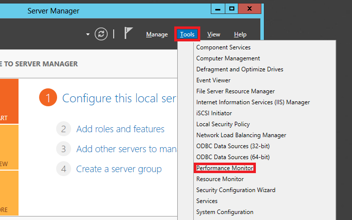
- The following image shows Performance Monitor running in a cloud instance during a connection density test using Crank.

    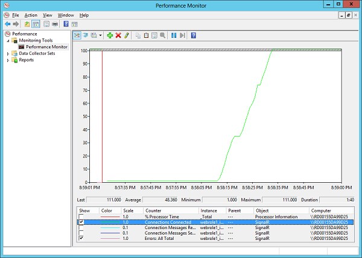

 Special thanks to Martin Richard for the [original content](https://blogs.msdn.com/b/mgrichard/archive/2014/01/21/capturing-signalr-2-0-performance-counters-in-azure-using-windows-azure-diagnostics-wad.aspx) for this tutorial.