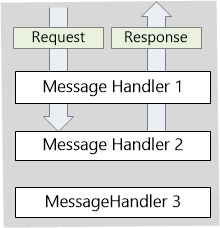
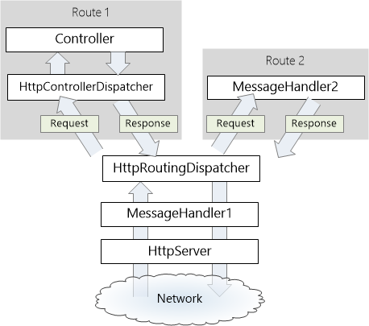
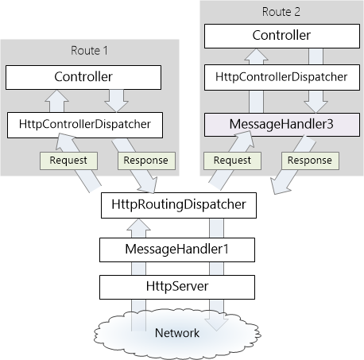

[Edit .md file](C:\Projects\msc\dev\Msc.Www\Web.ASP\App_Data\github\web-api\overview\advanced\http-message-handlers.md) | [Edit dev content](http://www.aspdev.net/umbraco#/content/content/edit/37110) | [View dev content](http://docs.aspdev.net/tutorials/web-api/overview/advanced/http-message-handlers.html) | [View prod content](http://www.asp.net/web-api/overview/advanced/http-message-handlers) | Picker: 37111

HTTP Message Handlers in ASP.NET Web API
====================
by [Mike Wasson](https://github.com/MikeWasson)

A *message handler* is a class that receives an HTTP request and returns an HTTP response. Message handlers derive from the abstract **HttpMessageHandler** class.

Typically, a series of message handlers are chained together. The first handler receives an HTTP request, does some processing, and gives the request to the next handler. At some point, the response is created and goes back up the chain. This pattern is called a *delegating* handler.

## Server-Side Message Handlers

On the server side, the Web API pipeline uses some built-in message handlers:

- **HttpServer** gets the request from the host.
- **HttpRoutingDispatcher** dispatches the request based on the route.
- **HttpControllerDispatcher** sends the request to a Web API controller.

You can add custom handlers to the pipeline. Message handlers are good for cross-cutting concerns that operate at the level of HTTP messages (rather than controller actions). For example, a message handler might:

- Read or modify request headers.
- Add a response header to responses.
- Validate requests before they reach the controller.

This diagram shows two custom handlers inserted into the pipeline:

> [!NOTE] On the client side, HttpClient also uses message handlers. For more information, see [HttpClient Message Handlers](httpclient-message-handlers.md).

## Custom Message Handlers

To write a custom message handler, derive from **System.Net.Http.DelegatingHandler** and override the **SendAsync** method. This method has the following signature:

    Task<HttpResponseMessage> SendAsync(
        HttpRequestMessage request, CancellationToken cancellationToken);

The method takes an **HttpRequestMessage** as input and asynchronously returns an **HttpResponseMessage**. A typical implementation does the following:

1. Process the request message.
2. Call `base.SendAsync` to send the request to the inner handler.
3. The inner handler returns a response message. (This step is asynchronous.)
4. Process the response and return it to the caller.

Here is a trivial example:

    public class MessageHandler1 : DelegatingHandler
    {
        protected async override Task<HttpResponseMessage> SendAsync(
            HttpRequestMessage request, CancellationToken cancellationToken)
        {
            Debug.WriteLine("Process request");
            // Call the inner handler.
            var response = await base.SendAsync(request, cancellationToken);
            Debug.WriteLine("Process response");
            return response;
        }
    }

> [!NOTE] The call to `base.SendAsync` is asynchronous. If the handler does any work after this call, use the **await** keyword, as shown.

A delegating handler can also skip the inner handler and directly create the response:

    public class MessageHandler2 : DelegatingHandler
    {
        protected override Task<HttpResponseMessage> SendAsync(
            HttpRequestMessage request, CancellationToken cancellationToken)
        {
            // Create the response.
            var response = new HttpResponseMessage(HttpStatusCode.OK)
            {
                Content = new StringContent("Hello!")
            };
    
            // Note: TaskCompletionSource creates a task that does not contain a delegate.
            var tsc = new TaskCompletionSource<HttpResponseMessage>();
            tsc.SetResult(response);   // Also sets the task state to "RanToCompletion"
            return tsc.Task;
        }
    }

If a delegating handler creates the response without calling `base.SendAsync`, the request skips the rest of the pipeline. This can be useful for a handler that validates the request (creating an error response).

## Adding a Handler to the Pipeline

To add a message handler on the server side, add the handler to the **HttpConfiguration.MessageHandlers** collection. If you used the "ASP.NET MVC 4 Web Application" template to create the project, you can do this inside the **WebApiConfig** class:

    public static class WebApiConfig
    {
        public static void Register(HttpConfiguration config)
        {
            config.MessageHandlers.Add(new MessageHandler1());
            config.MessageHandlers.Add(new MessageHandler2());
    
            // Other code not shown...
        }
    }

Message handlers are called in the same order that they appear in **MessageHandlers** collection. Because they are nested, the response message travels in the other direction. That is, the last handler is the first to get the response message.

Notice that you don't need to set the inner handlers; the Web API framework automatically connects the message handlers.

If you are [self-hosting](../older-versions/self-host-a-web-api.md), create an instance of the **HttpSelfHostConfiguration** class and add the handlers to the **MessageHandlers** collection.

    var config = new HttpSelfHostConfiguration("http://localhost");
    config.MessageHandlers.Add(new MessageHandler1());
    config.MessageHandlers.Add(new MessageHandler2());

Now let's look at some examples of custom message handlers.

## Example: X-HTTP-Method-Override

X-HTTP-Method-Override is a non-standard HTTP header. It is designed for clients that cannot send certain HTTP request types, such as PUT or DELETE. Instead, the client sends a POST request and sets the X-HTTP-Method-Override header to the desired method. For example:

    X-HTTP-Method-Override: PUT

Here is a message handler that adds support for X-HTTP-Method-Override:

    public class MethodOverrideHandler : DelegatingHandler      
    {
        readonly string[] _methods = { "DELETE", "HEAD", "PUT" };
        const string _header = "X-HTTP-Method-Override";
    
        protected override Task<HttpResponseMessage> SendAsync(
            HttpRequestMessage request, CancellationToken cancellationToken)
        {
            // Check for HTTP POST with the X-HTTP-Method-Override header.
            if (request.Method == HttpMethod.Post && request.Headers.Contains(_header))
            {
                // Check if the header value is in our methods list.
                var method = request.Headers.GetValues(_header).FirstOrDefault();
                if (_methods.Contains(method, StringComparer.InvariantCultureIgnoreCase))
                {
                    // Change the request method.
                    request.Method = new HttpMethod(method);
                }
            }
            return base.SendAsync(request, cancellationToken);
        }
    }

In the **SendAsync** method, the handler checks whether the request message is a POST request, and whether it contains the X-HTTP-Method-Override header. If so, it validates the header value, and then modifies the request method. Finally, the handler calls `base.SendAsync` to pass the message to the next handler.

When the request reaches the **HttpControllerDispatcher** class, **HttpControllerDispatcher** will route the request based on the updated request method.

## Example: Adding a Custom Response Header

Here is a message handler that adds a custom header to every response message:

    // .Net 4.5
    public class CustomHeaderHandler : DelegatingHandler
    {
        async protected override Task<HttpResponseMessage> SendAsync(
                HttpRequestMessage request, CancellationToken cancellationToken)
        {
            HttpResponseMessage response = await base.SendAsync(request, cancellationToken);
            response.Headers.Add("X-Custom-Header", "This is my custom header.");
            return response;
        }
    }

First, the handler calls `base.SendAsync` to pass the request to the inner message handler. The inner handler returns a response message, but it does so asynchronously using a **Task&lt;T&gt;** object. The response message is not available until `base.SendAsync` completes asynchronously.

This example uses the **await** keyword to perform work asynchronously after `SendAsync` completes. If you are targeting .NET Framework 4.0, use the **Task**&lt;T&gt;**.ContinueWith** method:

    public class CustomHeaderHandler : DelegatingHandler
    {
        protected override Task<HttpResponseMessage> SendAsync(
            HttpRequestMessage request, CancellationToken cancellationToken)
        {
            return base.SendAsync(request, cancellationToken).ContinueWith(
                (task) =>
                {
                    HttpResponseMessage response = task.Result;
                    response.Headers.Add("X-Custom-Header", "This is my custom header.");
                    return response;
                }
            );
        }
    }

## Example: Checking for an API Key

Some web services require clients to include an API key in their request. The following example shows how a message handler can check requests for a valid API key:

    public class ApiKeyHandler : DelegatingHandler
    {
        public string Key { get; set; }
    
        public ApiKeyHandler(string key)
        {
            this.Key = key;
        }
    
        protected override Task<HttpResponseMessage> SendAsync(
            HttpRequestMessage request, CancellationToken cancellationToken)
        {
            if (!ValidateKey(request))
            {
                var response = new HttpResponseMessage(HttpStatusCode.Forbidden);
                var tsc = new TaskCompletionSource<HttpResponseMessage>();
                tsc.SetResult(response);    
                return tsc.Task;
            }
            return base.SendAsync(request, cancellationToken);
        }
    
        private bool ValidateKey(HttpRequestMessage message)
        {
            var query = message.RequestUri.ParseQueryString();
            string key = query["key"];
            return (key == Key);
        }
    }

This handler looks for the API key in the URI query string. (For this example, we assume that the key is a static string. A real implementation would probably use more complex validation.) If the query string contains the key, the handler passes the request to the inner handler.

If the request does not have a valid key, the handler creates a response message with status 403, Forbidden. In this case, the handler does not call `base.SendAsync`, so the inner handler never receives the request, nor does the controller. Therefore, the controller can assume that all incoming requests have a valid API key.

> [!NOTE] If the API key applies only to certain controller actions, consider using an action filter instead of a message handler. Action filters run after URI routing is performed.

## Per-Route Message Handlers

Handlers in the **HttpConfiguration.MessageHandlers** collection apply globally.

Alternatively, you can add a message handler to a specific route when you define the route:

[!code[Main](http-message-handlers/samples/sample1.xml?highlight=16)]

In this example, if the request URI matches "Route2", the request is dispatched to `MessageHandler2`. The following diagram shows the pipeline for these two routes:

Notice that `MessageHandler2` replaces the default **HttpControllerDispatcher**. In this example, `MessageHandler2` creates the response, and requests that match "Route2" never go to a controller. This lets you replace the entire Web API controller mechanism with your own custom endpoint.

Alternatively, a per-route message handler can delegate to **HttpControllerDispatcher**, which then dispatches to a controller.

The following code shows how to configure this route:

    // List of delegating handlers.
    DelegatingHandler[] handlers = new DelegatingHandler[] {
        new MessageHandler3()
    };
    
    // Create a message handler chain with an end-point.
    var routeHandlers = HttpClientFactory.CreatePipeline(
        new HttpControllerDispatcher(config), handlers);
    
    config.Routes.MapHttpRoute(
        name: "Route2",
        routeTemplate: "api2/{controller}/{id}",
        defaults: new { id = RouteParameter.Optional },
        constraints: null,
        handler: routeHandlers
    );