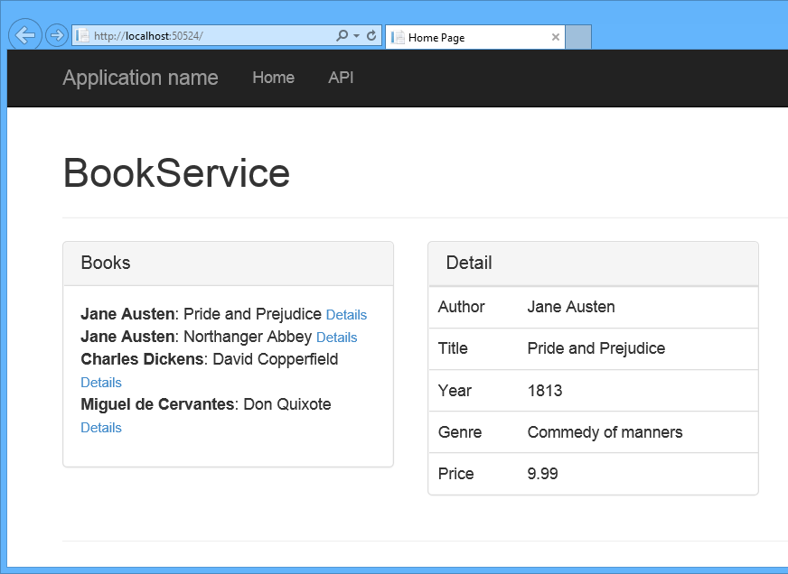

Display Item Details
====================
by [Mike Wasson](https://github.com/MikeWasson)

[Download Completed Project](https://github.com/MikeWasson/BookService)

In this section, you will add the ability to view details for each book. In app.js, add to the following code to the view model:

    self.detail = ko.observable();
    
    self.getBookDetail = function (item) {
        ajaxHelper(booksUri + item.Id, 'GET').done(function (data) {
            self.detail(data);
        });
    }

In Views/Home/Index.cshtml, add a data-bind element to the Details link:

[!code[Main](part-8/samples/sample1.xml?highlight=5)]

This binds the click handler for the &lt;a&gt; element to the `getBookDetail` function on the view model.

In the same file, replace the following mark-up:

    

        <!-- TODO: Book details -->
    

with this:

    <!-- ko if:detail() -->
    
    

    

      

        <h2 class="panel-title">Detail</h2>
      

      <table class="table">
        <tr><td>Author</td><td data-bind="text: detail().AuthorName"></td></tr>
        <tr><td>Title</td><td data-bind="text: detail().Title"></td></tr>
        <tr><td>Year</td><td data-bind="text: detail().Year"></td></tr>
        <tr><td>Genre</td><td data-bind="text: detail().Genre"></td></tr>
        <tr><td>Price</td><td data-bind="text: detail().Price"></td></tr>
      </table>
    

    

    
    <!-- /ko -->

This markup creates a table that is data-bound to the properties of the `detail` observable in the view model.

The "&lt;!-- ko --&gt;&quot; syntax lets you include a Knockout binding outside of a DOM element. In this case, the `if` binding causes this section of markup to be displayed only when `details` is non-null.

    <!-- ko if:detail() -->

Now if you run the app and click one of the &quot;Detail&quot; links, the app will display the book details.

>[!div class="step-by-step"] [Previous](part-7.md) [Next](part-9.md)