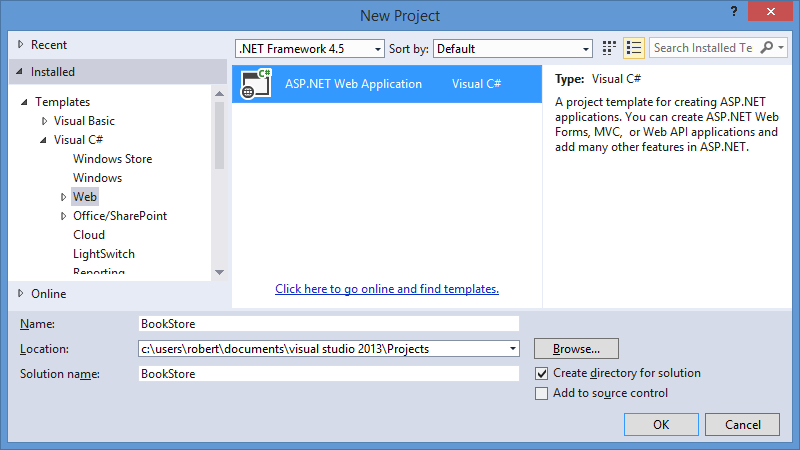
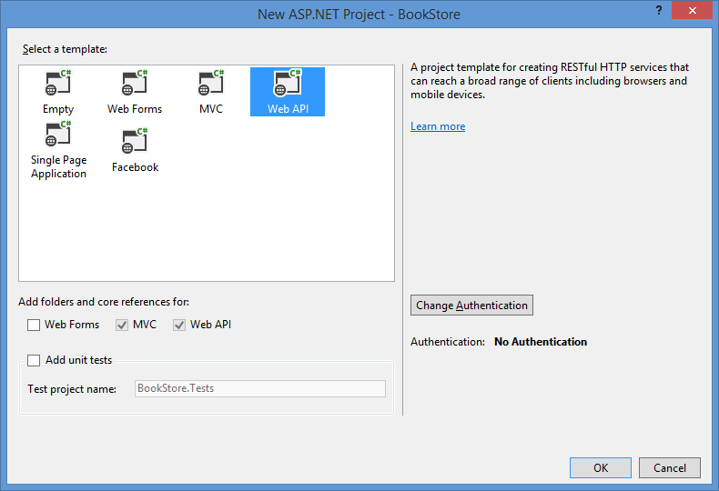
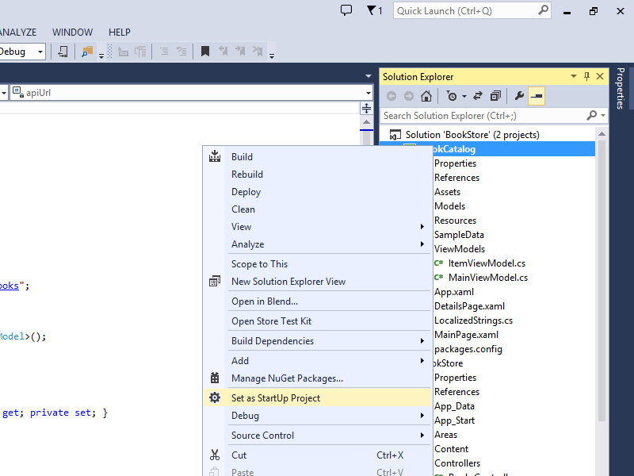
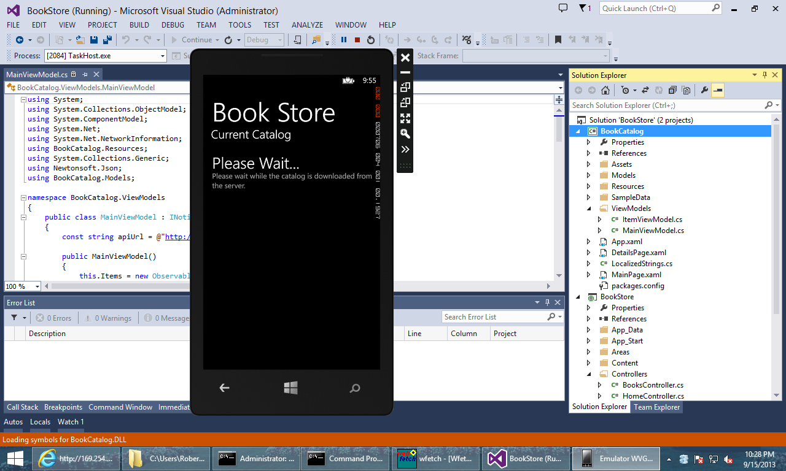
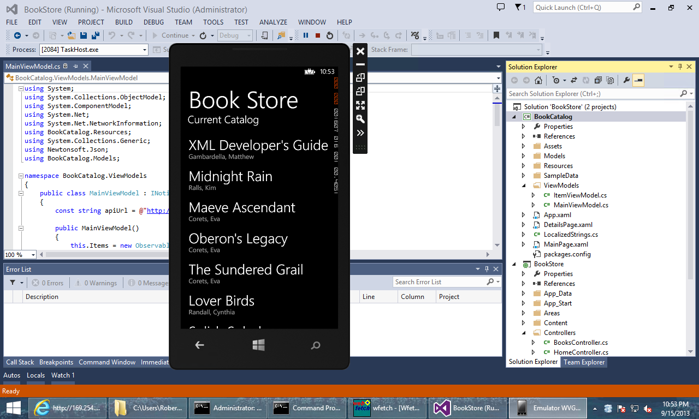
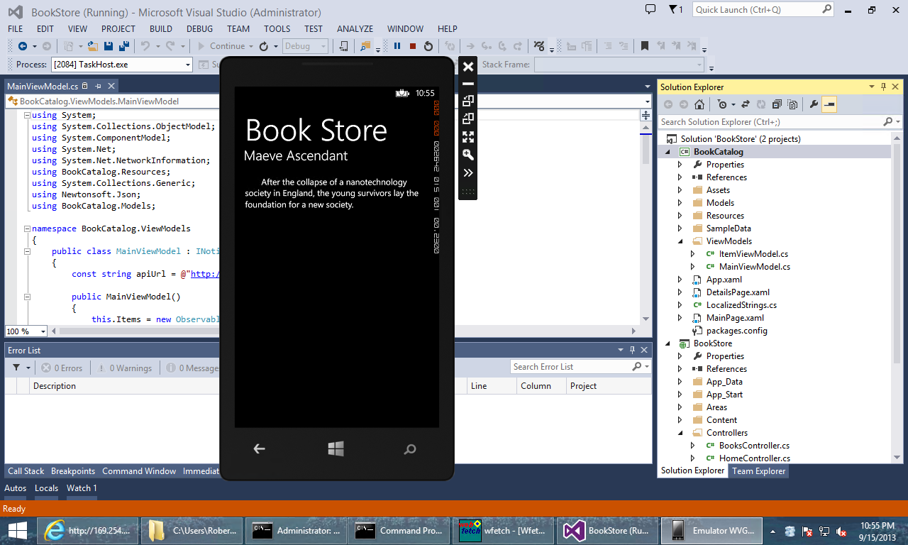
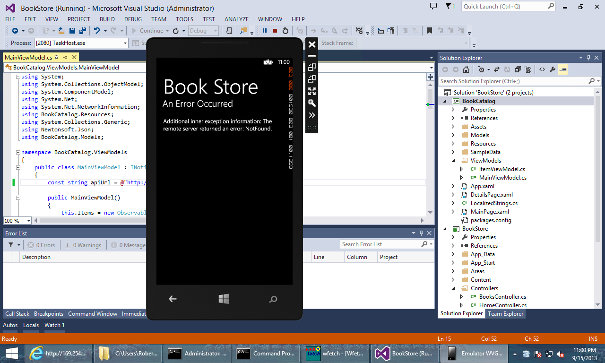

Calling Web API from a Windows Phone 8 Application (C#)
====================
by [Robert McMurray](https://github.com/rmcmurray)

In this tutorial, you will learn how to create a complete end-to-end scenario consisting of an ASP.NET Web API application that provides a catalog of books to a Windows Phone 8 application.

### Overview

RESTful services like ASP.NET Web API simplify the creation of HTTP-based applications for developers by abstracting the architecture for server-side and client-side applications. Instead of creating a proprietary socket-based protocol for communication, Web API developers simply need to publish the requisite HTTP methods for their application, (for example: GET, POST, PUT, DELETE), and client application developers only need to consume the HTTP methods that are necessary for their application.

In this end-to-end tutorial, you will learn how to use Web API to create the following projects:

- In the [first part of this tutorial](#STEP1), you will create an ASP.NET Web API application that supports all of the Create, Read, Update, and Delete (CRUD) operations to manage a book catalog. This application will use the [Sample XML File (books.xml)](https://msdn.microsoft.com/library/windows/desktop/ms762271.aspx) from MSDN.
- In the [second part of this tutorial](#STEP2), you will create an interactive Windows Phone 8 application that retrieves the data from your Web API application.

#### Prerequisites

- Visual Studio 2013 with the Windows Phone 8 SDK installed
- Windows 8 or later on a 64-bit system with Hyper-V installed
- For a list of additional requirements, see the *System Requirements* section on the [Windows Phone SDK 8.0](https://www.microsoft.com/en-us/download/details.aspx?id=35471) download page.

> [!NOTE] If you are going to test the connectivity between Web API and Windows Phone 8 projects on your local system, you will need to follow the instructions in the *[Connecting the Windows Phone 8 Emulator to Web API Applications on a Local Computer](https://go.microsoft.com/fwlink/?LinkId=324014)* article to set up your testing environment.

### Step 1: Creating the Web API Bookstore Project

The first step of this end-to-end tutorial is to create a Web API project that supports all of the CRUD operations; note that you will add the Windows Phone application project to this solution in [Step 2](#STEP2) of this tutorial.

1. Open **Visual Studio 2013**.
2. Click **File**, then **New**, and then **Project**.
3. When the **New Project** dialog box is displayed, expand **Installed**, then **Templates**, then **Visual C#**, and then **Web**.

    |  |
    | --- |
    | Click image to expand |
4. Highlight **ASP.NET Web Application**, enter **BookStore** for the project name, and then click **OK**.
5. When the **New ASP.NET Project** dialog box is displayed, select the **Web API** template, and then click **OK**.

    |  |
    | --- |
    | Click image to expand |
6. When the Web API project opens, remove the sample controller from the project:

    1. Expand the **Controllers** folder in the solution explorer.
    2. Right-click the **ValuesController.cs** file, and then click **Delete**.
    3. Click **OK** when prompted to confirm the deletion.
7. Add an XML data file to the Web API project; this file contains the contents of the bookstore catalog:

    1. Right-click the **App\_Data** folder in the solution explorer, then click **Add**, and then click **New Item**.
    2. When the **Add New Item** dialog box is displayed, highlight the **XML File** template.
    3. Name the file **Books.xml**, and then click **Add**.
    4. When the **Books.xml** file is opened, replace the code in the file with the XML from the sample **books.xml** file on MSDN: 

            <?xml version="1.0" encoding="utf-8"?>
            <catalog>
              <book id="bk101">
                <author>Gambardella, Matthew</author>
                <title>XML Developer's Guide</title>
                <genre>Computer</genre>
                <price>44.95</price>
                <publish_date>2000-10-01</publish_date>
                <description>
                  An in-depth look at creating applications
                  with XML.
                </description>
              </book>
              <book id="bk102">
                <author>Ralls, Kim</author>
                <title>Midnight Rain</title>
                <genre>Fantasy</genre>
                <price>5.95</price>
                <publish_date>2000-12-16</publish_date>
                <description>
                  A former architect battles corporate zombies,
                  an evil sorceress, and her own childhood to become queen
                  of the world.
                </description>
              </book>
              <book id="bk103">
                <author>Corets, Eva</author>
                <title>Maeve Ascendant</title>
                <genre>Fantasy</genre>
                <price>5.95</price>
                <publish_date>2000-11-17</publish_date>
                <description>
                  After the collapse of a nanotechnology
                  society in England, the young survivors lay the
                  foundation for a new society.
                </description>
              </book>
              <book id="bk104">
                <author>Corets, Eva</author>
                <title>Oberon's Legacy</title>
                <genre>Fantasy</genre>
                <price>5.95</price>
                <publish_date>2001-03-10</publish_date>
                <description>
                  In post-apocalypse England, the mysterious
                  agent known only as Oberon helps to create a new life
                  for the inhabitants of London. Sequel to Maeve
                  Ascendant.
                </description>
              </book>
              <book id="bk105">
                <author>Corets, Eva</author>
                <title>The Sundered Grail</title>
                <genre>Fantasy</genre>
                <price>5.95</price>
                <publish_date>2001-09-10</publish_date>
                <description>
                  The two daughters of Maeve, half-sisters,
                  battle one another for control of England. Sequel to
                  Oberon's Legacy.
                </description>
              </book>
              <book id="bk106">
                <author>Randall, Cynthia</author>
                <title>Lover Birds</title>
                <genre>Romance</genre>
                <price>4.95</price>
                <publish_date>2000-09-02</publish_date>
                <description>
                  When Carla meets Paul at an ornithology
                  conference, tempers fly as feathers get ruffled.
                </description>
              </book>
              <book id="bk107">
                <author>Thurman, Paula</author>
                <title>Splish Splash</title>
                <genre>Romance</genre>
                <price>4.95</price>
                <publish_date>2000-11-02</publish_date>
                <description>
                  A deep sea diver finds true love twenty
                  thousand leagues beneath the sea.
                </description>
              </book>
              <book id="bk108">
                <author>Knorr, Stefan</author>
                <title>Creepy Crawlies</title>
                <genre>Horror</genre>
                <price>4.95</price>
                <publish_date>2000-12-06</publish_date>
                <description>
                  An anthology of horror stories about roaches,
                  centipedes, scorpions  and other insects.
                </description>
              </book>
              <book id="bk109">
                <author>Kress, Peter</author>
                <title>Paradox Lost</title>
                <genre>Science Fiction</genre>
                <price>6.95</price>
                <publish_date>2000-11-02</publish_date>
                <description>
                  After an inadvertant trip through a Heisenberg
                  Uncertainty Device, James Salway discovers the problems
                  of being quantum.
                </description>
              </book>
              <book id="bk110">
                <author>O'Brien, Tim</author>
                <title>Microsoft .NET: The Programming Bible</title>
                <genre>Computer</genre>
                <price>36.95</price>
                <publish_date>2000-12-09</publish_date>
                <description>
                  Microsoft's .NET initiative is explored in
                  detail in this deep programmer's reference.
                </description>
              </book>
              <book id="bk111">
                <author>O'Brien, Tim</author>
                <title>MSXML3: A Comprehensive Guide</title>
                <genre>Computer</genre>
                <price>36.95</price>
                <publish_date>2000-12-01</publish_date>
                <description>
                  The Microsoft MSXML3 parser is covered in
                  detail, with attention to XML DOM interfaces, XSLT processing,
                  SAX and more.
                </description>
              </book>
              <book id="bk112">
                <author>Galos, Mike</author>
                <title>Visual Studio 7: A Comprehensive Guide</title>
                <genre>Computer</genre>
                <price>49.95</price>
                <publish_date>2001-04-16</publish_date>
                <description>
                  Microsoft Visual Studio 7 is explored in depth,
                  looking at how Visual Basic, Visual C++, C#, and ASP+ are
                  integrated into a comprehensive development
                  environment.
                </description>
              </book>
            </catalog>
    5. Save and close the XML file.
8. Add the bookstore model to the Web API project; this model contains the Create, Read, Update, and Delete (CRUD) logic for the bookstore application:

    1. Right-click the **Models** folder in the solution explorer, then click **Add**, and then click **Class**.
    2. When the **Add New Item** dialog box is displayed, name the class file **BookDetails.cs**, and then click **Add**.
    3. When the **BookDetails.cs** file is opened, replace the code in the file with the following: 

            using System;
            using System.Collections.Generic;
            using System.ComponentModel.DataAnnotations;
            using System.Linq;
            using System.Xml;
            using System.Xml.Linq;
            using System.Xml.XPath;
            using System.Web;
            
            namespace BookStore.Models
            {
                /// 

                /// Define a class that will hold the detailed information for a book.
                /// 

                public class BookDetails
                {
                    [Required]
                    public String Id { get; set; }
                    [Required]
                    public String Title { get; set; }
                    public String Author { get; set; }
                    public String Genre { get; set; }
                    public Decimal Price { get; set; }
                    public DateTime PublishDate { get; set; }
                    public String Description { get; set; }
                }
            
                /// 

                /// Define an interface which contains the methods for the book repository.
                /// 

                public interface IBookRepository
                {
                    BookDetails CreateBook(BookDetails book);
                    IEnumerable<BookDetails> ReadAllBooks();
                    BookDetails ReadBook(String id);
                    BookDetails UpdateBook(String id, BookDetails book);
                    Boolean DeleteBook(String id);
                }
            
                /// 

                /// Define a class based on the book repository interface which contains the method implementations.
                /// 

                public class BookRepository : IBookRepository
                {
                    private string xmlFilename = null;
                    private XDocument xmlDocument = null;
            
                    /// 

                    /// Define the class constructor.
                    /// 

                    public BookRepository()
                    {
                        try
                        {
                            // Determine the path to the books.xml file.
                            xmlFilename = HttpContext.Current.Server.MapPath("~/app_data/books.xml");
                            // Load the contents of the books.xml file into an XDocument object.
                            xmlDocument = XDocument.Load(xmlFilename);
                        }
                        catch (Exception ex)
                        {
                            // Rethrow the exception.
                            throw ex;
                        }
                    }
            
                    /// 

                    /// Method to add a new book to the catalog.
                    /// Defines the implementation of the POST method.
                    /// 

                    public BookDetails CreateBook(BookDetails book)
                    {
                        try
                        {
                            // Retrieve the book with the highest ID from the catalog.
                            var highestBook = (
                                from bookNode in xmlDocument.Elements("catalog").Elements("book")
                                orderby bookNode.Attribute("id").Value descending
                                select bookNode).Take(1);
                            // Extract the ID from the book data.
                            string highestId = highestBook.Attributes("id").First().Value;
                            // Create an ID for the new book.
                            string newId = "bk" + (Convert.ToInt32(highestId.Substring(2)) + 1).ToString();
                            // Verify that this book ID does not currently exist.
                            if (this.ReadBook(newId) == null)
                            {
                                // Retrieve the parent element for the book catalog.
                                XElement bookCatalogRoot = xmlDocument.Elements("catalog").Single();
                                // Create a new book element.
                                XElement newBook = new XElement("book", new XAttribute("id", newId));
                                // Create elements for each of the book's data items.
                                XElement[] bookInfo = FormatBookData(book);
                                // Add the element to the book element.
                                newBook.ReplaceNodes(bookInfo);
                                // Append the new book to the XML document.
                                bookCatalogRoot.Add(newBook);
                                // Save the XML document.
                                xmlDocument.Save(xmlFilename);
                                // Return an object for the newly-added book.
                                return this.ReadBook(newId);
                            }
                        }
                        catch (Exception ex)
                        {
                            // Rethrow the exception.
                            throw ex;
                        }
                        // Return null to signify failure.
                        return null;
                    }
            
                    /// 

                    /// Method to retrieve all of the books in the catalog.
                    /// Defines the implementation of the non-specific GET method.
                    /// 

                    public IEnumerable<BookDetails> ReadAllBooks()
                    {
                        try
                        {
                            // Return a list that contains the catalog of book ids/titles.
                            return (
                                // Query the catalog of books.
                                from book in xmlDocument.Elements("catalog").Elements("book")
                                // Sort the catalog based on book IDs.
                                orderby book.Attribute("id").Value ascending
                                // Create a new instance of the detailed book information class.
                                select new BookDetails
                                {
                                    // Populate the class with data from each of the book's elements.
                                    Id = book.Attribute("id").Value,
                                    Author = book.Element("author").Value,
                                    Title = book.Element("title").Value,
                                    Genre = book.Element("genre").Value,
                                    Price = Convert.ToDecimal(book.Element("price").Value),
                                    PublishDate = Convert.ToDateTime(book.Element("publish_date").Value),
                                    Description = book.Element("description").Value
                                }).ToList();
                        }
                        catch (Exception ex)
                        {
                            // Rethrow the exception.
                            throw ex;
                        }
                    }
            
                    /// 

                    /// Method to retrieve a specific book from the catalog.
                    /// Defines the implementation of the ID-specific GET method.
                    /// 

                    public BookDetails ReadBook(String id)
                    {
                        try
                        {
                            // Retrieve a specific book from the catalog.
                            return (
                                // Query the catalog of books.
                                from book in xmlDocument.Elements("catalog").Elements("book")
                                // Specify the specific book ID to query.
                                where book.Attribute("id").Value.Equals(id)
                                // Create a new instance of the detailed book information class.
                                select new BookDetails
                                {
                                    // Populate the class with data from each of the book's elements.
                                    Id = book.Attribute("id").Value,
                                    Author = book.Element("author").Value,
                                    Title = book.Element("title").Value,
                                    Genre = book.Element("genre").Value,
                                    Price = Convert.ToDecimal(book.Element("price").Value),
                                    PublishDate = Convert.ToDateTime(book.Element("publish_date").Value),
                                    Description = book.Element("description").Value
                                }).Single();
                        }
                        catch
                        {
                            // Return null to signify failure.
                            return null;
                        }
                    }
            
                    /// 

                    /// Populates a book BookDetails class with the data for a book.
                    /// 

                    private XElement[] FormatBookData(BookDetails book)
                    {
                        XElement[] bookInfo =
                        {
                            new XElement("author", book.Author),
                            new XElement("title", book.Title),
                            new XElement("genre", book.Genre),
                            new XElement("price", book.Price.ToString()),
                            new XElement("publish_date", book.PublishDate.ToString()),
                            new XElement("description", book.Description)
                        };
                        return bookInfo;
                    }
            
                    /// 

                    /// Method to update an existing book in the catalog.
                    /// Defines the implementation of the PUT method.
                    /// 

                    public BookDetails UpdateBook(String id, BookDetails book)
                    {
                        try
                        {
                            // Retrieve a specific book from the catalog.
                            XElement updateBook = xmlDocument.XPathSelectElement(String.Format("catalog/book[@id='{0}']", id));
                            // Verify that the book exists.
                            if (updateBook != null)
                            {
                                // Create elements for each of the book's data items.
                                XElement[] bookInfo = FormatBookData(book);
                                // Add the element to the book element.
                                updateBook.ReplaceNodes(bookInfo);
                                // Save the XML document.
                                xmlDocument.Save(xmlFilename);
                                // Return an object for the updated book.
                                return this.ReadBook(id);
                            }
                        }
                        catch (Exception ex)
                        {
                            // Rethrow the exception.
                            throw ex;
                        }
                        // Return null to signify failure.
                        return null;
                    }
            
                    /// 

                    /// Method to remove an existing book from the catalog.
                    /// Defines the implementation of the DELETE method.
                    /// 

                    public Boolean DeleteBook(String id)
                    {
                        try
                        {
                            if (this.ReadBook(id) != null)
                            {
                                // Remove the specific child node from the catalog.
                                xmlDocument
                                    .Elements("catalog")
                                    .Elements("book")
                                    .Where(x => x.Attribute("id").Value.Equals(id))
                                    .Remove();
                                // Save the XML document.
                                xmlDocument.Save(xmlFilename);
                                // Return a success status.
                                return true;
                            }
                            else
                            {
                                // Return a failure status.
                                return false;
                            }
                        }
                        catch (Exception ex)
                        {
                            // Rethrow the exception.
                            throw ex;
                        }
                    }
                }
            }
    4. Save and close the **BookDetails.cs** file.
9. Add the bookstore controller to the Web API project:

    1. Right-click the **Controllers** folder in the solution explorer, then click **Add**, and then click **Controller**.
    2. When the **Add Scaffold** dialog box is displayed, highlight **Web API 2 Controller - Empty**, and then click **Add**.
    3. When the **Add Controller** dialog box is displayed, name the controller **BooksController**, and then click **Add**.
    4. When the **BooksController.cs** file is opened, replace the code in the file with the following: 

            using System;
            using System.Collections.Generic;
            using System.Linq;
            using System.Net;
            using System.Net.Http;
            using System.Web.Http;
            using BookStore.Models;
            
            namespace BookStore.Controllers
            {
                public class BooksController : ApiController
                {
                    private BookRepository repository = null;
            
                    // Define the class constructor.
                    public BooksController()
                    {
                        this.repository = new BookRepository();
                    }
            
                    /// 

                    /// Method to retrieve all of the books in the catalog.
                    /// Example: GET api/books
                    /// 

                    [HttpGet]
                    public HttpResponseMessage Get()
                    {
                        IEnumerable<BookDetails> books = this.repository.ReadAllBooks();
                        if (books != null)
                        {
                            return Request.CreateResponse<IEnumerable<BookDetails>>(HttpStatusCode.OK, books);
                        }
                        else
                        {
                            return Request.CreateResponse(HttpStatusCode.NotFound);
                        }
                    }
            
                    /// 

                    /// Method to retrieve a specific book from the catalog.
                    /// Example: GET api/books/5
                    /// 

                    [HttpGet]
                    public HttpResponseMessage Get(String id)
                    {
                        BookDetails book = this.repository.ReadBook(id);
                        if (book != null)
                        {
                            return Request.CreateResponse<BookDetails>(HttpStatusCode.OK, book);
                        }
                        else
                        {
                            return Request.CreateResponse(HttpStatusCode.NotFound);
                        }
                    }
            
                    /// 

                    /// Method to add a new book to the catalog.
                    /// Example: POST api/books
                    /// 

                    [HttpPost]
                    public HttpResponseMessage Post(BookDetails book)
                    {
                        if ((this.ModelState.IsValid) && (book != null))
                        {
                            BookDetails newBook = this.repository.CreateBook(book);
                            if (newBook != null)
                            {
                                var httpResponse = Request.CreateResponse<BookDetails>(HttpStatusCode.Created, newBook);
                                string uri = Url.Link("DefaultApi", new { id = newBook.Id });
                                httpResponse.Headers.Location = new Uri(uri);
                                return httpResponse;
                            }
                        }
                        return Request.CreateResponse(HttpStatusCode.BadRequest);
                    }
            
                    /// 

                    /// Method to update an existing book in the catalog.
                    /// Example: PUT api/books/5
                    /// 

                    [HttpPut]
                    public HttpResponseMessage Put(String id, BookDetails book)
                    {
                        if ((this.ModelState.IsValid) && (book != null) && (book.Id.Equals(id)))
                        {
                            BookDetails modifiedBook = this.repository.UpdateBook(id, book);
                            if (modifiedBook != null)
                            {
                                return Request.CreateResponse<BookDetails>(HttpStatusCode.OK, modifiedBook);
                            }
                            else
                            {
                                return Request.CreateResponse(HttpStatusCode.NotFound);
                            }
                        }
                        return Request.CreateResponse(HttpStatusCode.BadRequest);
                    }
            
                    /// 

                    /// Method to remove an existing book from the catalog.
                    /// Example: DELETE api/books/5
                    /// 

                    [HttpDelete]
                    public HttpResponseMessage Delete(String id)
                    {
                        BookDetails book = this.repository.ReadBook(id);
                        if (book != null)
                        {
                            if (this.repository.DeleteBook(id))
                            {
                                return Request.CreateResponse(HttpStatusCode.OK);
                            }
                        }
                        else
                        {
                            return Request.CreateResponse(HttpStatusCode.NotFound);
                        }
                        return Request.CreateResponse(HttpStatusCode.BadRequest);
                    }
                }
            }
    5. Save and close the **BooksController.cs** file.
10. Build the Web API application to check for errors.

### Step 2: Adding the Windows Phone 8 Bookstore Catalog Project

The next step of this end-to-end scenario is to create the catalog application for Windows Phone 8. This application will use the *Windows Phone Databound App* template for the default user interface, and it will use the Web API application that you created in [Step 1](#STEP1) of this tutorial as the data source.

1. Right-click the **BookStore** solution in the in the solution explorer, then click **Add**, and then **New Project**.
2. When the **New Project** dialog box is displayed, expand **Installed**, then **Visual C#**, and then **Windows Phone**.
3. Highlight **Windows Phone Databound App**, enter **BookCatalog** for the name, and then click **OK**.
4. Add the Json.NET NuGet package to the **BookCatalog** project:

    1. Right-click **References** for the **BookCatalog** project in the solution explorer, and then click **Manage NuGet Packages**.
    2. When the **Manage NuGet Packages** dialog box is displayed, expand the **Online** section, and highlight **nuget.org**.
    3. Enter **Json.NET** in the search field and click the search icon.
    4. Highlight **Json.NET** in the search results, and then click **Install**.
    5. When the installation has completed, click **Close**.
5. Add the **BookDetails** model to the **BookCatalog** project; this contains a generic model of the bookstore class:

    1. Right-click the **BookCatalog** project in the solution explorer, then click **Add**, and then click **New Folder**.
    2. Name the new folder **Models**.
    3. Right-click the **Models** folder in the solution explorer, then click **Add**, and then click **Class**.
    4. When the **Add New Item** dialog box is displayed, name the class file **BookDetails.cs**, and then click **Add**.
    5. When the **BookDetails.cs** file is opened, replace the code in the file with the following: 

            using System;
            using System.Text;
            
            namespace BookCatalog.Models
            {
                /// 

                /// Define a class that will hold the detailed information for a book.
                /// 

                public class BookDetails
                {
                    public String Id { get; set; }
                    public String Title { get; set; }
                    public String Author { get; set; }
                    public String Genre { get; set; }
                    public Decimal Price { get; set; }
                    public DateTime PublishDate { get; set; }
                    public String Description { get; set; }
                }
            }
    6. Save and close the **BookDetails.cs** file.
6. Update the **MainViewModel.cs** class to include the functionality to communicate with the BookStore Web API application:

    1. Expand the **ViewModels** folder in the solution explorer, and then double-click the **MainViewModel.cs** file.
    2. When the the **MainViewModel.cs** file is opened, replace the code in the file with the following; note that you will need to update the value of the `apiUrl` constant with the actual URL of your Web API: 

            using System;
            using System.Collections.ObjectModel;
            using System.ComponentModel;
            using System.Net;
            using System.Net.NetworkInformation;
            using BookCatalog.Resources;
            using System.Collections.Generic;
            using Newtonsoft.Json;
            using BookCatalog.Models;
            
            namespace BookCatalog.ViewModels
            {
                public class MainViewModel : INotifyPropertyChanged
                {
                    const string apiUrl = @"http://www.contoso.com/api/Books";
            
                    public MainViewModel()
                    {
                        this.Items = new ObservableCollection<ItemViewModel>();
                    }
            
                    /// 

                    /// A collection for ItemViewModel objects.
                    /// 

                    public ObservableCollection<ItemViewModel> Items { get; private set; }
            
                    public bool IsDataLoaded
                    {
                        get;
                        private set;
                    }
            
                    /// 

                    /// Creates and adds a few ItemViewModel objects into the Items collection.
                    /// 

                    public void LoadData()
                    {
                        if (this.IsDataLoaded == false)
                        {
                            this.Items.Clear();
                            this.Items.Add(new ItemViewModel() { ID = "0", LineOne = "Please Wait...", LineTwo = "Please wait while the catalog is downloaded from the server.", LineThree = null });
                            WebClient webClient = new WebClient();
                            webClient.Headers["Accept"] = "application/json";
                            webClient.DownloadStringCompleted += new DownloadStringCompletedEventHandler(webClient_DownloadCatalogCompleted);
                            webClient.DownloadStringAsync(new Uri(apiUrl));
                        }
                    }
            
                    private void webClient_DownloadCatalogCompleted(object sender, DownloadStringCompletedEventArgs e)
                    {
                        try
                        {
                            this.Items.Clear();
                            if (e.Result != null)
                            {
                                var books = JsonConvert.DeserializeObject<BookDetails[]>(e.Result);
                                int id = 0;
                                foreach (BookDetails book in books)
                                {
                                    this.Items.Add(new ItemViewModel()
                                    {
                                        ID = (id++).ToString(),
                                        LineOne = book.Title,
                                        LineTwo = book.Author,
                                        LineThree = book.Description.Replace("\n", " ")
                                    });
                                }
                                this.IsDataLoaded = true;
                            }
                        }
                        catch (Exception ex)
                        {
                            this.Items.Add(new ItemViewModel()
                            {
                                ID = "0",
                                LineOne = "An Error Occurred",
                                LineTwo = String.Format("The following exception occured: {0}", ex.Message),
                                LineThree = String.Format("Additional inner exception information: {0}", ex.InnerException.Message)
                            });
                        }
                    }
            
                    public event PropertyChangedEventHandler PropertyChanged;
                    private void NotifyPropertyChanged(String propertyName)
                    {
                        PropertyChangedEventHandler handler = PropertyChanged;
                        if (null != handler)
                        {
                            handler(this, new PropertyChangedEventArgs(propertyName));
                        }
                    }
                }
            }
    3. Save and close the **MainViewModel.cs** file.
7. Update the **MainPage.xaml** file to customize the application name:

    1. Double-click the **MainPage.xaml** file in the solution explorer.
    2. When the the **MainPage.xaml** file is opened, locate the following lines of code: 

            <StackPanel Grid.Row="0" Margin="12,17,0,28">
                <TextBlock Text="MY APPLICATION" Style="{StaticResource PhoneTextNormalStyle}"/> 
                <TextBlock Text="page name" Margin="9,-7,0,0" Style="{StaticResource PhoneTextTitle1Style}"/>
            </StackPanel>
    3. Replace those lines with the following: 

            <StackPanel Grid.Row="0" Margin="12,17,0,28">
                <TextBlock Text="Book Store" Style="{StaticResource PhoneTextTitle1Style}"/> 
                <TextBlock Text="Current Catalog" Margin="9,-7,0,0" Style="{StaticResource PhoneTextTitle2Style}"/>
            </StackPanel>
    4. Save and close the **MainPage.xaml** file.
8. Update the **DetailsPage.xaml** file to customize the displayed items:

    1. Double-click the **DetailsPage.xaml** file in the solution explorer.
    2. When the the **DetailsPage.xaml** file is opened, locate the following lines of code: 

            <StackPanel x:Name="TitlePanel" Grid.Row="0" Margin="12,17,0,28">
                <TextBlock Text="MY APPLICATION" Style="{StaticResource PhoneTextNormalStyle}"/>
                <TextBlock Text="{Binding LineOne}" Margin="9,-7,0,0" Style="{StaticResource PhoneTextTitle1Style}"/>
            </StackPanel>
    3. Replace those lines with the following: 

            <StackPanel x:Name="TitlePanel" Grid.Row="0" Margin="12,17,0,28">
                <TextBlock Text="Book Store" Style="{StaticResource PhoneTextTitle1Style}"/>
                <TextBlock Text="{Binding LineOne}" Margin="9,-7,0,0" Style="{StaticResource PhoneTextTitle2Style}"/>
            </StackPanel>
    4. Save and close the **DetailsPage.xaml** file.
9. Build the Windows Phone application to check for errors.

### Step 3: Testing the End-to-End Solution

As mentioned in the *Prerequisites* section of this tutorial, when you are testing the connectivity between Web API and Windows Phone 8 projects on your local system, you will need to follow the instructions in the *[Connecting the Windows Phone 8 Emulator to Web API Applications on a Local Computer](https://go.microsoft.com/fwlink/?LinkId=324014)* article to set up your testing environment.

Once you have the testing environment configured, you will need to set the Windows Phone application as the startup project. To do so, highlight the **BookCatalog** application in the solution explorer, and then click **Set as StartUp Project**:

|  |
| --- |
| Click image to expand |

When you press F5, Visual Studio will start both the Windows Phone Emulator, which will display a &quot;Please Wait&quot; message while the application data is retrieved from your Web API:

|  |
| --- |
| Click image to expand |

If everything is successful, you should see the catalog displayed:

|  |
| --- |
| Click image to expand |

If you tap on any book title, the application will display the book description:

|  |
| --- |
| Click image to expand |

If the application cannot communicate with your Web API, an error message will be displayed:

|  |
| --- |
| Click image to expand |

If you tap on the error message, any additional details about the error will be displayed:

|  |
| --- |
| Click image to expand |