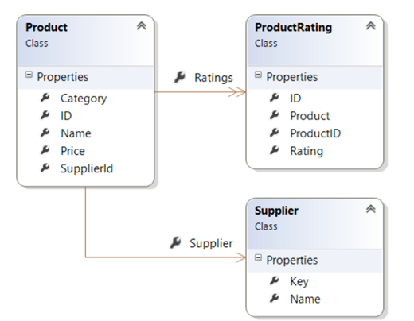
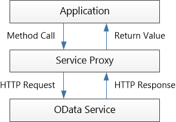
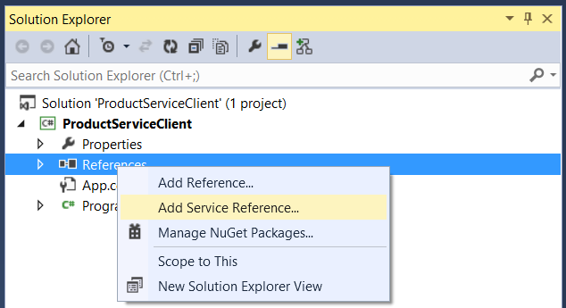
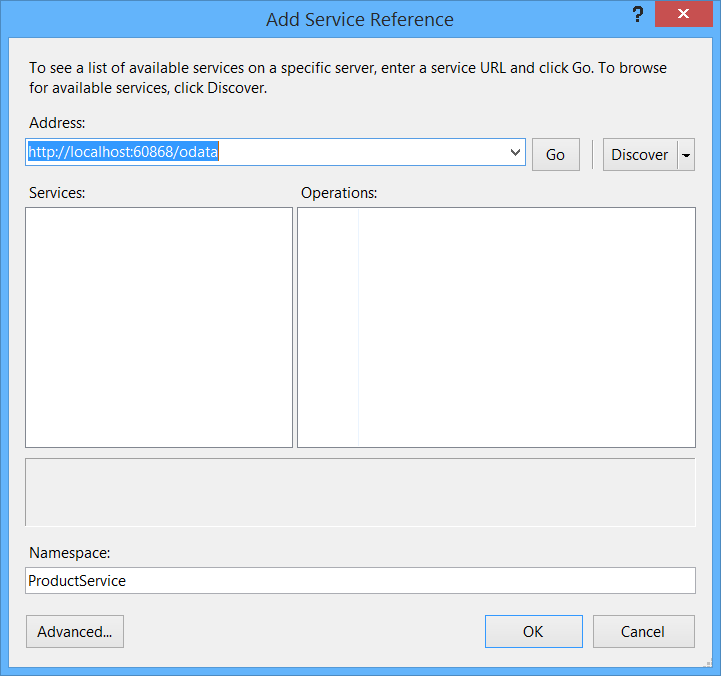
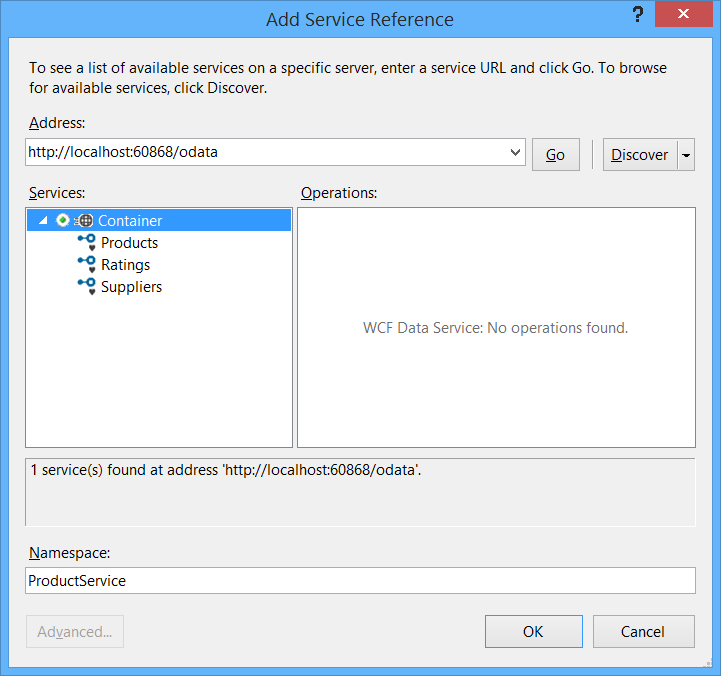
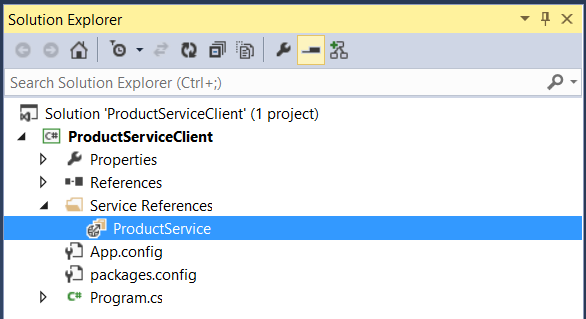

Calling an OData Service From a .NET Client (C#)
====================
by [Mike Wasson](https://github.com/MikeWasson)

[Download Completed Project](http://code.msdn.microsoft.com/ASPNET-Web-API-OData-cecdb524)

> This tutorial shows how to call an OData service from a C# client application.
> 
> ## Software versions used in the tutorial
> 
> 
> - [Visual Studio 2013](https://www.microsoft.com/visualstudio/eng/2013-downloads) (works with Visual Studio 2012)
> - [WCF Data Services Client Library](https://msdn.microsoft.com/en-us/library/cc668772.aspx)
> - Web API 2. (The example OData service is built using Web API 2, but the client application does not depend on Web API.)

In this tutorial, I'll walk through creating a client application that calls an OData service. The OData service exposes the following entities:

- `Product`
- `Supplier`
- `ProductRating`

The following articles describe how to implement the OData service in Web API. (You don't need to read them to understand this tutorial, however.)

- [Creating an OData Endpoint in Web API 2](creating-an-odata-endpoint.md)
- [OData Entity Relations in Web API 2](working-with-entity-relations.md)
- [OData Actions in Web API 2](odata-actions.md)

## Generate the Service Proxy

The first step is to generate a service proxy. The service proxy is a .NET class that defines methods for accessing the OData service. The proxy translates method calls into HTTP requests.

Start by opening the OData service project in Visual Studio. Press CTRL+F5 to run the service locally in IIS Express. Note the local address, including the port number that Visual Studio assigns. You will need this address when you create the proxy.

Next, open another instance of Visual Studio and create a console application project. The console application will be our OData client application. (You can also add the project to the same solution as the service.)

> [!NOTE] The remaining steps refer the console project.

In Solution Explorer, right-click **References** and select **Add Service Reference**.

In the **Add Service Reference** dialog, type the address of the OData service:

    http://localhost:port/odata

where *port* is the port number.

For **Namespace**, type "ProductService". This option defines the namespace of the proxy class.

Click **Go**. Visual Studio reads the OData metadata document to discover the entities in the service.

Click **OK** to add the proxy class to your project.

## Create an Instance of the Service Proxy Class

Inside your `Main` method, create a new instance of the proxy class, as follows:

    using System;
    using System.Data.Services.Client;
    using System.Linq;
    
    namespace Client
    {
        class Program
        {
            Uri uri = new Uri("http://localhost:1234/odata/");
            var container = new ProductService.Container(uri);
    
            // ...
        }
    }

Again, use the actual port number where your service is running. When you deploy your service, you will use the URI of the live service. You don't need to update the proxy.

The following code adds an event handler that prints the request URIs to the console window. This step isn't required, but it's interesting to see the URIs for each query.

    container.SendingRequest2 += (s, e) =>
    {
        Console.WriteLine("{0} {1}", e.RequestMessage.Method, e.RequestMessage.Url);
    };

## Query the Service

The following code gets the list of products from the OData service.

    class Program
    {
        static void DisplayProduct(ProductService.Product product)
        {
            Console.WriteLine("{0} {1} {2}", product.Name, product.Price, product.Category);
        }
    
        // Get an entire entity set.
        static void ListAllProducts(ProductService.Container container)
        {
            foreach (var p in container.Products)
            {
                DisplayProduct(p);
            } 
        }
      
        static void Main(string[] args)
        {
            Uri uri = new Uri("http://localhost:18285/odata/");
            var container = new ProductService.Container(uri);
            container.SendingRequest2 += (s, e) =>
            {
                Console.WriteLine("{0} {1}", e.RequestMessage.Method, e.RequestMessage.Url);
            };
    
            // Get the list of products
            ListAllProducts(container);
        }
    }

Notice that you don't need to write any code to send the HTTP request or parse the response. The proxy class does this automatically when you enumerate the `Container.Products` collection in the **foreach** loop.

When you run the application, the output should look like the following:

    GET http://localhost:60868/odata/Products
    Hat 15.00   Apparel
    Scarf   12.00   Apparel
    Socks   5.00    Apparel
    Yo-yo   4.95    Toys
    Puzzle  8.00    Toys

To get an entity by ID, use a `where` clause.

    // Get a single entity.
    static void ListProductById(ProductService.Container container, int id)
    {
        var product = container.Products.Where(p => p.ID == id).SingleOrDefault();
        if (product != null)
        {
            DisplayProduct(product);
        }
    }

For the rest of this topic, I won't show the entire `Main` function, just the code needed to call the service.

## Apply Query Options

OData defines [query options](../supporting-odata-query-options.md) that can be used to filter, sort, page data, and so forth. In the service proxy, you can apply these options by using various LINQ expressions.

In this section, I'll show brief examples. For more details, see the topic [LINQ Considerations (WCF Data Services)](https://msdn.microsoft.com/en-us/library/ee622463.aspx) on MSDN.

### Filtering ($filter)

To filter, use a `where` clause. The following example filters by product category.

    // Use the $filter option.
    static void ListProductsInCategory(ProductService.Container container, string category)
    {
        var products =
            from p in container.Products
            where p.Category == category
            select p;
        foreach (var p in products)
        {
            DisplayProduct(p);
        }
    }

This code corresponds to the following OData query.

    GET http://localhost/odata/Products()?$filter=Category eq 'apparel'

Notice that the proxy converts the `where` clause into an OData `$filter` expression.

### Sorting ($orderby)

To sort, use an `orderby` clause. The following example sorts by price, from highest to lowest.

    // Use the $orderby option
    static void ListProductsSorted(ProductService.Container container)
    {
        // Sort by price, highest to lowest.
        var products =
            from p in container.Products
            orderby p.Price descending
            select p;
    
        foreach (var p in products)
        {
            DisplayProduct(p);
        }
    }

Here is the corresponding OData request.

    GET http://localhost/odata/Products()?$orderby=Price desc

### Client-Side Paging ($skip and $top)

For large entity sets, the client might want to limit the number of results. For example, a client might show 10 entries at a time. This is called *client-side paging*. (There is also [server-side paging](../supporting-odata-query-options.md#server-paging), where the server limits the number of results.) To perform client-side paging, use the LINQ **Skip** and **Take** methods. The following example skips the first 40 results and takes the next 10.

    // Use $skip and $top options.
    static void ListProductsPaged(ProductService.Container container)
    {
        var products =
            (from p in container.Products
              orderby p.Price descending
              select p).Skip(40).Take(10);
    
        foreach (var p in products)
        {
            DisplayProduct(p);
        }
    }

Here is the corresponding OData request:

    GET http://localhost/odata/Products()?$orderby=Price desc&$skip=40&$top=10

### Select ($select) and Expand ($expand)

To include related entities, use the **DataServiceQuery<t>.Expand</t>** method. For example, to include the `Supplier` for each `Product`:

    // Use the $expand option.
    static void ListProductsAndSupplier(ProductService.Container container)
    {
        var products = container.Products.Expand(p => p.Supplier);
        foreach (var p in products)
        {
            Console.WriteLine("{0}\t{1}\t{2}", p.Name, p.Price, p.Supplier.Name);
        }
    }

Here is the corresponding OData request:

    GET http://localhost/odata/Products()?$expand=Supplier

To change the shape of the response, use the LINQ **select** clause. The following example gets just the name of each product, with no other properties.

    // Use the $select option.
    static void ListProductNames(ProductService.Container container)
    {
    
        var products = from p in container.Products select new { Name = p.Name };
        foreach (var p in products)
        {
            Console.WriteLine(p.Name);
        }
    }

Here is the corresponding OData request:

    GET http://localhost/odata/Products()?$select=Name

A select clause can include related entities. In that case, do not call **Expand**; the proxy automatically includes the expansion in this case. The following example gets the name and supplier of each product.

    // Use $expand and $select options
    static void ListProductNameSupplier(ProductService.Container container)
    {
        var products =
            from p in container.Products
            select new
            {
                Name = p.Name,
                Supplier = p.Supplier.Name
            };
        foreach (var p in products)
        {
            Console.WriteLine("{0}\t{1}", p.Name, p.Supplier);
        }
    }

Here is the corresponding OData request. Notice that it includes the **$expand** option.

    GET http://localhost/odata/Products()?$expand=Supplier&$select=Name,Supplier/Name

For more information about $select and $expand, see [Using $select, $expand, and $value in Web API 2](../using-select-expand-and-value.md).

## Add a New Entity

To add a new entity to an entity set, call `AddToEntitySet`, where *EntitySet* is the name of the entity set. For example, `AddToProducts` adds a new `Product` to the `Products` entity set. When you generate the proxy, WCF Data Services automatically creates these strongly-typed **AddTo** methods.

    // Add an entity.
    static void AddProduct(ProductService.Container container, ProductService.Product product)
    {
        container.AddToProducts(product);
        var serviceResponse = container.SaveChanges();
        foreach (var operationResponse in serviceResponse)
        {
            Console.WriteLine(operationResponse.StatusCode);
        }
    }

To add a link between two entities, use the **AddLink** and **SetLink** methods. The following code adds a new supplier and a new product, and then creates links between them.

    // Add entities with links.
    static void AddProductWithSupplier(ProductService.Container container, 
        ProductService.Product product, ProductService.Supplier supplier)
    {
        container.AddToSuppliers(supplier);
        container.AddToProducts(product);
        container.AddLink(supplier, "Products", product);
        container.SetLink(product, "Supplier", supplier);
        var serviceResponse = container.SaveChanges();
        foreach (var operationResponse in serviceResponse)
        {
            Console.WriteLine(operationResponse.StatusCode);
        }
    }

Use **AddLink** when the navigation property is a collection. In this example, we are adding a product to the `Products` collection on the supplier.

Use **SetLink** when the navigation property is a single entity. In this example, we are setting the `Supplier` property on the product.

## Update / Patch

To update an entity, call the **UpdateObject** method.

    static void UpdatePrice(ProductService.Container container, int id, decimal price)
    {
        var product = container.Products.Where(p => p.ID == id).SingleOrDefault();
        if (product != null)
        { 
            product.Price = price;
            container.UpdateObject(product);
            container.SaveChanges(SaveChangesOptions.PatchOnUpdate);
        }
    }

The update is performed when you call **SaveChanges**. By default, WCF sends an HTTP MERGE request. The **PatchOnUpdate** option tells WCF to send an HTTP PATCH instead.

> [!NOTE] Why PATCH versus MERGE? The original HTTP 1.1 specification ([RCF 2616](http://tools.ietf.org/html/rfc2616)) did not define any HTTP method with "partial update" semantics. To support partial updates, the OData specification defined the MERGE method. In 2010, [RFC 5789](http://tools.ietf.org/html/rfc5789) defined the PATCH method for partial updates. You can read some of the history in this [blog post](https://blogs.msdn.com/b/astoriateam/archive/2008/05/20/merge-vs-replace-semantics-for-update-operations.aspx) on the WCF Data Services Blog. Today, PATCH is preferred over MERGE. The OData controller created by the Web API scaffolding supports both methods.

If you want to replace the entire entity (PUT semantics), specify the **ReplaceOnUpdate** option. This causes WCF to send an HTTP PUT request.

    container.SaveChanges(SaveChangesOptions.ReplaceOnUpdate);

## Delete an Entity

To delete an entity, call **DeleteObject**.

    static void DeleteProduct(ProductService.Container container, int id)
    {
        var product = container.Products.Where(p => p.ID == id).SingleOrDefault();
        if (product != null)
        {
            container.DeleteObject(product);
            container.SaveChanges();
        }
    }

## Invoke an OData Action

In OData, [actions](odata-actions.md) are a way to add server-side behaviors that are not easily defined as CRUD operations on entities.

Although the OData metadata document describes the actions, the proxy class does not create any strongly-typed methods for them. You can still invoke an OData action by using the generic **Execute** method. However, you will need to know the data types of the parameters and the return value.

For example, the `RateProduct` action takes parameter named "Rating" of type `Int32` and returns a `double`. The following code shows how to invoke this action.

    int rating = 2;
    Uri actionUri = new Uri(uri, "Products(5)/RateProduct");
    var averageRating = container.Execute<double>(
        actionUri, "POST", true, new BodyOperationParameter("Rating", rating)).First();

For more information, see[Calling Service Operations and Actions](https://msdn.microsoft.com/en-us/library/hh230677.aspx).

One option is to extend the **Container** class to provide a strongly typed method that invokes the action:

    namespace ProductServiceClient.ProductService
    {
        public partial class Container
        {
            public double RateProduct(int productID, int rating)
            {
                Uri actionUri = new Uri(this.BaseUri,
                    String.Format("Products({0})/RateProduct", productID)
                    );
    
                return this.Execute<double>(actionUri, 
                    "POST", true, new BodyOperationParameter("Rating", rating)).First();
            }
        }
    }