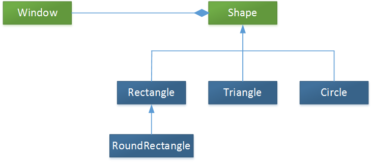

[Edit .md file](C:\Projects\msc\dev\Msc.Www\Web.ASP\App_Data\github\web-api\overview\odata-support-in-aspnet-web-api\odata-v4\complex-type-inheritance-in-odata-v4.md) | [Edit dev content](http://www.aspdev.net/umbraco#/content/content/edit/59688) | [View dev content](http://docs.aspdev.net/tutorials/web-api/overview/odata-support-in-aspnet-web-api/odata-v4/complex-type-inheritance-in-odata-v4.html) | [View prod content](http://www.asp.net/web-api/overview/odata-support-in-aspnet-web-api/odata-v4/complex-type-inheritance-in-odata-v4) | Picker: 59691

Complex Type Inheritance in OData v4 with ASP.NET Web API
====================
by [Microsoft](https://github.com/microsoft)

> According to the OData v4 [specification](http://www.odata.org/documentation/odata-version-4-0/), a complex type can inherit from another complex type. (A *complex* type is a structured type without a key.) Web API OData 5.3 supports complex type inheritance.
> 
> This topic shows how to build an entity data model (EDM) with complex inheritance types. For the complete source code, see [OData Complex Type Inheritance Sample](http://aspnet.codeplex.com/sourcecontrol/latest#Samples/WebApi/OData/v4/ODataComplexTypeInheritanceSample/ReadMe.txt).
> 
> ## Software versions used in the tutorial
> 
> 
> - Web API OData 5.3
> - OData v4

## Model Hierarchy

To illustrate complex type inheritance, we'll use the following class hierarchy.

`Shape` is an abstract complex type. `Rectangle`, `Triangle`, and `Circle` are complex types derived from `Shape`, and `RoundRectangle` derives from `Rectangle`. `Window` is an entity type and contains a `Shape` instance.

Here are the CLR classes that define these types.

    public class Window
    {
        public int Id { get; set; }
        public string Title { get; set; }
        public Shape Shape { get; set; }
    }
    
    public abstract class Shape
    {
        public bool HasBorder { get; set; }
        public Color Color { get; set; }
    }
    
    public class Rectangle : Shape
    {
        public Point P1 { get; set; }
        public Point P2 { get; set; }
        public Point P3 { get; set; }
    }
    
    public class RoundRectangle : Rectangle
    {
        public double Round { get; set; }
    }
    
    public class Triangle : Shape
    {
        public Point LeftTop { get; set; }
        public int Height { get; set; }
        public int Weight { get; set; }
    }
    
    public class Circle : Shape
    {
        public Point Center { get; set; }
        public int Radius { get; set; }
    }
    
    public class Point
    {
        public int X { get; set; }
        public int Y { get; set; }
    }
    
    public enum Color
    {
        Red,
        Blue,
        Green,
        Yellow
    }

## Build the EDM Model

To create the EDM, you can use **ODataConventionModelBuilder**, which infers the inheritance relationships from the CLR types.

    private IEdmModel GetEdmModel()
    {
        ODataConventionModelBuilder builder = new ODataConventionModelBuilder();
        builder.EntitySet<Window>("Windows");
        return builder.GetEdmModel();
    }

You can also build the EDM explicitly, using **ODataModelBuilder**. This takes more code, but gives you more control over the EDM.

    private IEdmModel GetExplicitEdmModel()
    {
      ODataModelBuilder builder = new ODataModelBuilder();
    
      EnumTypeConfiguration<Color> color = builder.EnumType<Color>();
      color.Member(Color.Red);
      color.Member(Color.Blue);
      color.Member(Color.Green);
      color.Member(Color.Yellow);
    
      ComplexTypeConfiguration<Point> point = builder.ComplexType<Point>();
      point.Property(c => c.X);
      point.Property(c => c.Y);
    
      ComplexTypeConfiguration<Shape> shape = builder.ComplexType<Shape>();
      shape.EnumProperty(c => c.Color);
      shape.Property(c => c.HasBorder);
      shape.Abstract();
    
      ComplexTypeConfiguration<Triangle> triangle = builder.ComplexType<Triangle>();
        triangle.ComplexProperty(c => c.P1);
        triangle.ComplexProperty(c => c.P2);
        triangle.ComplexProperty(c => c.P2);
        triangle.DerivesFrom<Shape>();
    
        ComplexTypeConfiguration<Rectangle> rectangle = builder.ComplexType<Rectangle>();
        rectangle.ComplexProperty(c => c.LeftTop);
        rectangle.Property(c => c.Height);
        rectangle.Property(c => c.Weight);
        rectangle.DerivesFrom<Shape>();
    
      ComplexTypeConfiguration<RoundRectangle> roundRectangle = builder.ComplexType<RoundRectangle>();
        roundRectangle.Property(c => c.Round);
        roundRectangle.DerivesFrom<Rectangle>();
    
        ComplexTypeConfiguration<Circle> circle = builder.ComplexType<Circle>();
        circle.ComplexProperty(c => c.Center);
        circle.Property(c => c.Radius);
        circle.DerivesFrom<Shape>();
    
        EntityTypeConfiguration<Window> window = builder.EntityType<Window>();
        window.HasKey(c => c.Id);
        window.Property(c => c.Title);
        window.ComplexProperty(c => c.Shape);
    
        builder.EntitySet<Window>("Windows");
        return builder.GetEdmModel();
    }

These two examples create the same EDM schema.

## Metadata Document

Here is the OData metadata document, showing complex type inheritance.

[!code[Main](complex-type-inheritance-in-odata-v4/samples/sample1.xml?highlight=13,17,25,30)]

From the metadata document, you can see that:

- The `Shape` complex type is abstract.
- The `Rectangle`, `Triangle`, and `Circle` complex type have the base type `Shape`.
- The `RoundRectangle` type has the base type `Rectangle`.

## Casting Complex Types

Casting on complex types is now supported. For example, the following query casts a `Shape` to a `Rectangle`.

    GET ~/odata/Windows(1)/Shape/NS.Rectangle/LeftTop

Here's the response payload:

    { 
       "@odata.context":"http://localhost/odata/$metadata#Windows(1)/Shape/NS.Rectangle/LeftTop",
        "X":100,"Y":100
    }