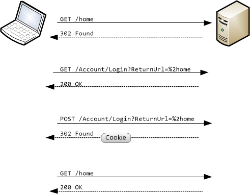

[Edit .md file](C:\Projects\msc\dev\Msc.Www\Web.ASP\App_Data\github\web-api\overview\security\forms-authentication.md) | [Edit dev content](http://www.aspdev.net/umbraco#/content/content/edit/43544) | [View dev content](http://docs.aspdev.net/tutorials/web-api/overview/security/forms-authentication.html) | [View prod content](http://www.asp.net/web-api/overview/security/forms-authentication) | Picker: 43552

Forms Authentication in ASP.NET Web API
====================
by [Mike Wasson](https://github.com/MikeWasson)

Forms authentication uses an HTML form to send the user's credentials to the server. It is not an Internet standard. Forms authentication is only appropriate for web APIs that are called from a web application, so that the user can interact with the HTML form.

| Advantages | Disadvantages |
| --- | --- |
| - Easy to implement: Built into ASP.NET. - Uses ASP.NET membership provider, which makes it easy to manage user accounts. | - Not a standard HTTP authentication mechanism; uses HTTP cookies instead of the standard Authorization header. - Requires a browser client. - Credentials are sent as plaintext. - Vulnerable to cross-site request forgery (CSRF); requires anti-CSRF measures. - Difficult to use from nonbrowser clients. Login requires a browser. - User credentials are sent in the request. - Some users disable cookies. |

Briefly, forms authentication in ASP.NET works like this:

1. The client requests a resource that requires authentication.
2. If the user is not authenticated, the server returns HTTP 302 (Found) and redirects to a login page.
3. The user enters credentials and submits the form.
4. The server returns another HTTP 302 that redirects back to the original URI. This response includes an authentication cookie.
5. The client requests the resource again. The request includes the authentication cookie, so the server grants the request.

For more information, see [An Overview of Forms Authentication.](../../../web-forms/overview/older-versions-security/introduction/an-overview-of-forms-authentication-cs.md)

## Using Forms Authentication with Web API

To create an application that uses forms authentication, select the "Internet Application" template in the MVC 4 project wizard. This template creates MVC controllers for account management. You can also use the "Single Page Application" template, available in the ASP.NET Fall 2012 Update.

In your web API controllers, you can restrict access by using the `[Authorize]` attribute, as described in [Using the [Authorize] Attribute](authentication-and-authorization-in-aspnet-web-api.md#auth3).

Forms-authentication uses a session cookie to authenticate requests. Browsers automatically send all relevant cookies to the destination web site. This feature makes forms authentication potentially vulnerable to cross-site request forgery (CSRF) attacks See [Preventing Cross-Site Request Forgery (CSRF) Attacks](preventing-cross-site-request-forgery-csrf-attacks.md).

Forms authentication does not encrypt the user's credentials. Therefore, forms authentication is not secure unless used with SSL. See [Working with SSL in Web API](working-with-ssl-in-web-api.md).