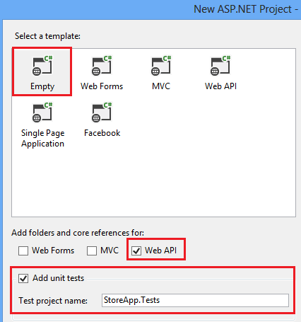
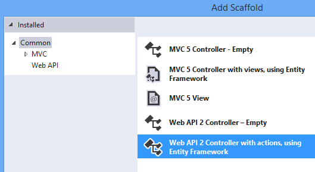
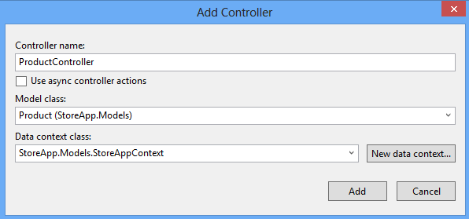
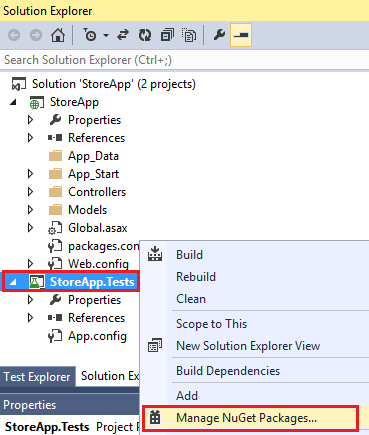
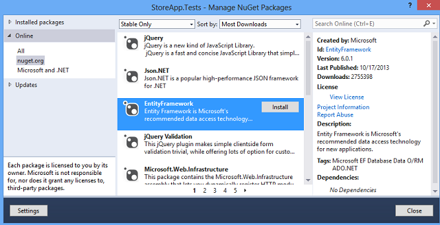
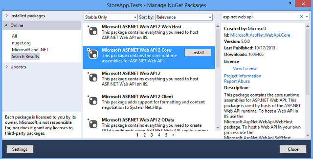
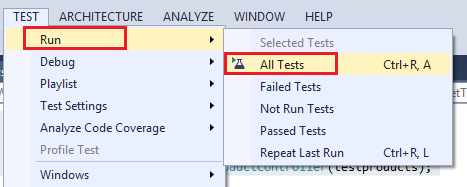
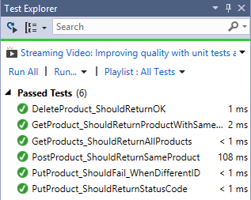

[Edit .md file](C:\Projects\msc\dev\Msc.Www\Web.ASP\App_Data\github\web-api\overview\testing-and-debugging\mocking-entity-framework-when-unit-testing-aspnet-web-api-2.md) | [Edit dev content](http://www.aspdev.net/umbraco#/content/content/edit/52974) | [View dev content](http://docs.aspdev.net/tutorials/web-api/overview/testing-and-debugging/mocking-entity-framework-when-unit-testing-aspnet-web-api-2.html) | [View prod content](http://www.asp.net/web-api/overview/testing-and-debugging/mocking-entity-framework-when-unit-testing-aspnet-web-api-2) | Picker: 52975

Mocking Entity Framework when Unit Testing ASP.NET Web API 2
====================
by [Tom FitzMacken](https://github.com/tfitzmac)

[Download Completed Project](http://code.msdn.microsoft.com/Unit-Testing-with-ASPNET-e2867d4d)

> This guidance and application demonstrate how to create unit tests for your Web API 2 application that uses the Entity Framework. It shows how to modify the scaffolded controller to enable passing a context object for testing, and how to create test objects that work with Entity Framework.
> 
> For an introduction to unit testing with ASP.NET Web API, see [Unit Testing with ASP.NET Web API 2](unit-testing-with-aspnet-web-api.md).
> 
> This tutorial assumes you are familiar with the basic concepts of ASP.NET Web API. For an introductory tutorial, see [Getting Started with ASP.NET Web API 2](../getting-started-with-aspnet-web-api/tutorial-your-first-web-api.md).
> 
> ## Software versions used in the tutorial
> 
> 
> - [Visual Studio 2013](https://www.microsoft.com/visualstudio/eng/2013-downloads)
> - Web API 2

## In this topic

This topic contains the following sections:

- [Prerequisites](#prereqs)
- [Download code](#download)
- [Create application with unit test project](#appwithunittest)
- [Create the model class](#modelclass)
- [Add the controller](#controller)
- [Add dependency injection](#dependency)
- [Install NuGet packages in test project](#testpackages)
- [Create test context](#testcontext)
- [Create tests](#tests)
- [Run tests](#runtests)

If you have already completed the steps in [Unit Testing with ASP.NET Web API 2](unit-testing-with-aspnet-web-api.md), you can skip to the section [Add the controller](#controller).

## Prerequisites

Visual Studio 2013 or Visual Studio Express 2013 for Web

## Download code

Download the [completed project](https://code.msdn.microsoft.com/Unit-Testing-with-ASPNET-e2867d4d). The downloadable project includes unit test code for this topic and for the [Unit Testing ASP.NET Web API 2](unit-testing-with-aspnet-web-api.md) topic.

## Create application with unit test project

You can either create a unit test project when creating your application or add a unit test project to an existing application. This tutorial shows creating a unit test project when creating the application.

Create a new ASP.NET Web Application named **StoreApp**.

In the New ASP.NET Project windows, select the **Empty** template and add folders and core references for Web API. Select the **Add unit tests** option. The unit test project is automatically named **StoreApp.Tests**. You can keep this name.

After creating the application, you will see it contains two projects - **StoreApp** and **StoreApp.Tests**.

## Create the model class

In your StoreApp project, add a class file to the **Models** folder named **Product.cs**. Replace the contents of the file with the following code.

    using System;
    
    namespace StoreApp.Models
    {
        public class Product
        {
            public int Id { get; set; }
            public string Name { get; set; }
            public decimal Price { get; set; }
        }
    }

Build the solution.

## Add the controller

Right-click the Controllers folder and select **Add** and **New Scaffolded Item**. Select Web API 2 Controller with actions, using Entity Framework.

Set the following values:

- Controller name: **ProductController**
- Model class: **Product**
- Data context class: [Select **New data context** button which fills in the values seen below]

Click **Add** to create the controller with automatically-generated code. The code includes methods for creating, retrieving, updating and deleting instances of the Product class. The following code shows the method for add a Product. Notice that the method returns an instance of **IHttpActionResult**.

    // POST api/Product
    [ResponseType(typeof(Product))]
    public IHttpActionResult PostProduct(Product product)
    {
        if (!ModelState.IsValid)
        {
            return BadRequest(ModelState);
        }
    
        db.Products.Add(product);
        db.SaveChanges();
    
        return CreatedAtRoute("DefaultApi", new { id = product.Id }, product);
    }

IHttpActionResult is one of the new features in Web API 2, and it simplifies unit test development.

In the next section, you will customize the generated code to facilitate passing test objects to the controller.

## Add dependency injection

Currently, the ProductController class is hard-coded to use an instance of the StoreAppContext class. You will use a pattern called dependency injection to modify your application and remove that hard-coded dependency. By breaking this dependency, you can pass in a mock object when testing.

Right-click the **Models** folder, and add a new interface named **IStoreAppContext**.

Replace the code with the following code.

    using System;
    using System.Data.Entity;
    
    namespace StoreApp.Models
    {
        public interface IStoreAppContext : IDisposable
        {
            DbSet<Product> Products { get; }
            int SaveChanges();
            void MarkAsModified(Product item);    
        }
    }

Open the StoreAppContext.cs file and make the following highlighted changes. The important changes to note are:

- StoreAppContext class implements IStoreAppContext interface
- MarkAsModified method is implemented

[!code[Main](mocking-entity-framework-when-unit-testing-aspnet-web-api-2/samples/sample1.xml?highlight=6,14-17)]

Open the ProductController.cs file. Change the existing code to match the highlighted code. These changes break the dependency on StoreAppContext and enable other classes to pass in a different object for the context class. This change will enable you to pass in a test context during unit tests.

[!code[Main](mocking-entity-framework-when-unit-testing-aspnet-web-api-2/samples/sample2.xml?highlight=4,7-12)]

There is one more change you must make in ProductController. In the **PutProduct** method, replace the line that sets the entity state to modified with a call to the MarkAsModified method.

[!code[Main](mocking-entity-framework-when-unit-testing-aspnet-web-api-2/samples/sample3.xml?highlight=14-15)]

Build the solution.

You are now ready to set up the test project.

## Install NuGet packages in test project

When you use the Empty template to create an application, the unit test project (StoreApp.Tests) does not include any installed NuGet packages. Other templates, such as the Web API template, include some NuGet packages in the unit test project. For this tutorial, you must include the Entity Framework packge and the Microsoft ASP.NET Web API 2 Core package to the test project.

Right-click the StoreApp.Tests project and select **Manage NuGet Packages**. You must select the StoreApp.Tests project to add the packages to that project.

From the Online packages, find and install the EntityFramework package (version 6.0 or later). If it appears that the EntityFramework package is already installed, you may have selected the StoreApp project instead of the the StoreApp.Tests project.

Find and install Microsoft ASP.NET Web API 2 Core package.

Close the Manage NuGet Packages window.

## Create test context

Add a class named **TestDbSet** to the test project. This class serves as the base class for your test data set. Replace the code with the following code.

    using System;
    using System.Collections.Generic;
    using System.Collections.ObjectModel;
    using System.Data.Entity;
    using System.Linq;
    
    namespace StoreApp.Tests
    {
        public class TestDbSet<T> : DbSet<T>, IQueryable, IEnumerable<T>
            where T : class
        {
            ObservableCollection<T> _data;
            IQueryable _query;
    
            public TestDbSet()
            {
                _data = new ObservableCollection<T>();
                _query = _data.AsQueryable();
            }
    
            public override T Add(T item)
            {
                _data.Add(item);
                return item;
            }
    
            public override T Remove(T item)
            {
                _data.Remove(item);
                return item;
            }
    
            public override T Attach(T item)
            {
                _data.Add(item);
                return item;
            }
    
            public override T Create()
            {
                return Activator.CreateInstance<T>();
            }
    
            public override TDerivedEntity Create<TDerivedEntity>()
            {
                return Activator.CreateInstance<TDerivedEntity>();
            }
    
            public override ObservableCollection<T> Local
            {
                get { return new ObservableCollection<T>(_data); }
            }
    
            Type IQueryable.ElementType
            {
                get { return _query.ElementType; }
            }
    
            System.Linq.Expressions.Expression IQueryable.Expression
            {
                get { return _query.Expression; }
            }
    
            IQueryProvider IQueryable.Provider
            {
                get { return _query.Provider; }
            }
    
            System.Collections.IEnumerator System.Collections.IEnumerable.GetEnumerator()
            {
                return _data.GetEnumerator();
            }
    
            IEnumerator<T> IEnumerable<T>.GetEnumerator()
            {
                return _data.GetEnumerator();
            }
        }
    }

Add a class named **TestProductDbSet** to the test project which contains the following code.

    using System;
    using System.Linq;
    using StoreApp.Models;
    
    namespace StoreApp.Tests
    {
        class TestProductDbSet : TestDbSet<Product>
        {
            public override Product Find(params object[] keyValues)
            {
                return this.SingleOrDefault(product => product.Id == (int)keyValues.Single());
            }
        }
    }

Add a class named **TestStoreAppContext** and replace the existing code with the following code.

    using System;
    using System.Data.Entity;
    using StoreApp.Models;
    
    namespace StoreApp.Tests
    {
        public class TestStoreAppContext : IStoreAppContext 
        {
            public TestStoreAppContext()
            {
                this.Products = new TestProductDbSet();
            }
    
            public DbSet<Product> Products { get; set; }
    
            public int SaveChanges()
            {
                return 0;
            }
    
            public void MarkAsModified(Product item) { }
            public void Dispose() { }
        }
    }

## Create tests

By default, your test project includes an empty test file named **UnitTest1.cs**. This file shows the attributes you use to create test methods. For this tutorial, you can delete this file because you will add a new test class.

Add a class named **TestProductController** to the test project. Replace the code with the following code.

    using System;
    using Microsoft.VisualStudio.TestTools.UnitTesting;
    using System.Web.Http.Results;
    using System.Net;
    using StoreApp.Models;
    using StoreApp.Controllers;
    
    namespace StoreApp.Tests
    {
        [TestClass]
        public class TestProductController
        {
            [TestMethod]
            public void PostProduct_ShouldReturnSameProduct()
            {
                var controller = new ProductController(new TestStoreAppContext());
    
                var item = GetDemoProduct();
    
                var result =
                    controller.PostProduct(item) as CreatedAtRouteNegotiatedContentResult<Product>;
    
                Assert.IsNotNull(result);
                Assert.AreEqual(result.RouteName, "DefaultApi");
                Assert.AreEqual(result.RouteValues["id"], result.Content.Id);
                Assert.AreEqual(result.Content.Name, item.Name);
            }
    
            [TestMethod]
            public void PutProduct_ShouldReturnStatusCode()
            {
                var controller = new ProductController(new TestStoreAppContext());
    
                var item = GetDemoProduct();
    
                var result = controller.PutProduct(item.Id, item) as StatusCodeResult;
                Assert.IsNotNull(result);
                Assert.IsInstanceOfType(result, typeof(StatusCodeResult));
                Assert.AreEqual(HttpStatusCode.NoContent, result.StatusCode);
            }
    
            [TestMethod]
            public void PutProduct_ShouldFail_WhenDifferentID()
            {
                var controller = new ProductController(new TestStoreAppContext());
    
                var badresult = controller.PutProduct(999, GetDemoProduct());
                Assert.IsInstanceOfType(badresult, typeof(BadRequestResult));
            }
    
            [TestMethod]
            public void GetProduct_ShouldReturnProductWithSameID()
            {
                var context = new TestStoreAppContext();
                context.Products.Add(GetDemoProduct());
    
                var controller = new ProductController(context);
                var result = controller.GetProduct(3) as OkNegotiatedContentResult<Product>;
    
                Assert.IsNotNull(result);
                Assert.AreEqual(3, result.Content.Id);
            }
    
            [TestMethod]
            public void GetProducts_ShouldReturnAllProducts()
            {
                var context = new TestStoreAppContext();
                context.Products.Add(new Product { Id = 1, Name = "Demo1", Price = 20 });
                context.Products.Add(new Product { Id = 2, Name = "Demo2", Price = 30 });
                context.Products.Add(new Product { Id = 3, Name = "Demo3", Price = 40 });
    
                var controller = new ProductController(context);
                var result = controller.GetProducts() as TestProductDbSet;
    
                Assert.IsNotNull(result);
                Assert.AreEqual(3, result.Local.Count);
            }
    
            [TestMethod]
            public void DeleteProduct_ShouldReturnOK()
            {
                var context = new TestStoreAppContext();
                var item = GetDemoProduct();
                context.Products.Add(item);
    
                var controller = new ProductController(context);
                var result = controller.DeleteProduct(3) as OkNegotiatedContentResult<Product>;
    
                Assert.IsNotNull(result);
                Assert.AreEqual(item.Id, result.Content.Id);
            }
    
            Product GetDemoProduct()
            {
                return new Product() { Id = 3, Name = "Demo name", Price = 5 };
            }
        }
    }

## Run tests

You are now ready to run the tests. All of the method that are marked with the **TestMethod** attribute will be tested. From the **Test** menu item, run the tests.

Open the **Test Explorer** window, and notice the results of the tests.

