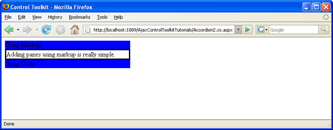

[Edit .md file](C:\Projects\msc\dev\Msc.Www\Web.ASP\App_Data\github\web-forms\overview\ajax-control-toolkit\accordion\dynamically-adding-an-accordion-pane-cs.md) | [Edit dev content](http://www.aspdev.net/umbraco#/content/content/edit/24774) | [View dev content](http://docs.aspdev.net/tutorials/web-forms/overview/ajax-control-toolkit/accordion/dynamically-adding-an-accordion-pane-cs.html) | [View prod content](http://www.asp.net/web-forms/overview/ajax-control-toolkit/accordion/dynamically-adding-an-accordion-pane-cs) | Picker: 33074

Dynamically Adding An Accordion Pane (C#)
====================
by [Christian Wenz](https://github.com/wenz)

[Download Code](http://download.microsoft.com/download/5/6/d/56d50cef-2011-4c8f-9891-7edc6dc57df9/Accordion2.cs.zip) or [Download PDF](http://download.microsoft.com/download/6/7/1/6718d452-ff89-4d3f-a90e-c74ec2d636a3/accordion2CS.pdf)

> The Accordion control in the AJAX Control Toolkit provides multiple panes and allows the user to display one of them at a time. Panels are usually declared within the page itself, but server-side code can be used to achieve the same result.

## Overview

The Accordion control in the AJAX Control Toolkit provides multiple panes and allows the user to display one of them at a time. Panels are usually declared within the page itself, but server-side code can be used to achieve the same result.

## Steps

The Accordion control exposes all important properties to server-side code. Among other things, the `Panes` property grants access to the collection of panes that make up the Accordion. Every pane there is of type `AccordionPane`. It is therefore trivial to create such a pane:

    AccordionPane ap1 = new AccordionPane();

The `HeaderContainer` property of `AccordionPane` provides access to the ASP.NET controls within the header section of the pane; the `ContentContainer` property of `AccordionPane` does the same for the content section of the pane. This allows ASP.NET code to add content to the panes:

    ap1.HeaderContainer.Controls.Add(new LiteralControl("Using Code"));
    ap1.ContentContainer.Controls.Add(new 
     LiteralControl("Adding panes using code is really flexible."));

Finally, the pane(s) must be added to the `Panes` collection of the Accordion:

    acc1.Panes.Add(ap1);

Here is a complete server-side code that adds two panes to an Accordion control:

    

The only missing element is the Accordion itself, which depends on the presence of the ASP.NET `ScriptManager` control:

    <form id="form1" runat="server">
     <asp:ScriptManager ID="asm" runat="server" />
     

     <ajaxToolkit:Accordion ID="acc1" runat="server" 
     HeaderCssClass="header" ContentCssClass="content" 
     Width="300px" FadeTransitions="true">
     </ajaxToolkit:Accordion>
     

    </form>

To finish the example, the two CSS classes referenced in the Accordion control provide style information for the browser:

    

The data in the accordion was dynamically added by server-side code ([Click to view full-size image](dynamically-adding-an-accordion-pane-cs/_static/image3.png))

>[!div class="step-by-step"] [Previous](databinding-to-an-accordion-cs.md) [Next](databinding-to-an-accordion-vb.md)