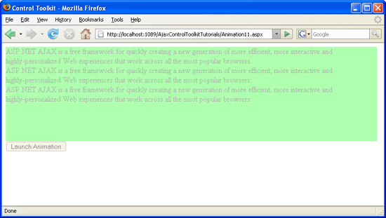

[Edit .md file](C:\Projects\msc\dev\Msc.Www\Web.ASP\App_Data\github\web-forms\overview\ajax-control-toolkit\animation\changing-an-animation-using-client-side-code-vb.md) | [Edit dev content](http://www.aspdev.net/umbraco#/content/content/edit/24797) | [View dev content](http://docs.aspdev.net/tutorials/web-forms/overview/ajax-control-toolkit/animation/changing-an-animation-using-client-side-code-vb.html) | [View prod content](http://www.asp.net/web-forms/overview/ajax-control-toolkit/animation/changing-an-animation-using-client-side-code-vb) | Picker: 33097

Changing an Animation Using Client-Side Code (VB)
====================
by [Christian Wenz](https://github.com/wenz)

[Download Code](http://download.microsoft.com/download/f/9/a/f9a26acd-8df4-4484-8a18-199e4598f411/Animation11.vb.zip) or [Download PDF](http://download.microsoft.com/download/6/7/1/6718d452-ff89-4d3f-a90e-c74ec2d636a3/animation11VB.pdf)

> The Animation control in the ASP.NET AJAX Control Toolkit is not just a control but a whole framework to add animations to a control. The animation can also be changed using custom client-side JavaScript code.

## Overview

The Animation control in the ASP.NET AJAX Control Toolkit is not just a control but a whole framework to add animations to a control. The animation can also be changed using custom client-side JavaScript code.

## Steps

First of all, include the `ScriptManager` in the page; then, the ASP.NET AJAX library is loaded, making it possible to use the Control Toolkit:

    <asp:ScriptManager ID="asm" runat="server"/>

The animation will be applied to a panel of text which looks like this:

    <asp:Panel ID="panelShadow" runat="server" CssClass="panelClass">
     ASP.NET AJAX is a free framework for quickly creating a new generation of  
     more efficient, more interactive and highly-personalized Web experiences 
     that work across all the most popular browsers. 
     ASP.NET AJAX is a free framework for quickly creating a new generation of  
     more efficient, more interactive and highly-personalized Web experiences 
     that work across all the most popular browsers. 
     ASP.NET AJAX is a free framework for quickly creating a new generation of 
     more efficient, more interactive and highly-personalized Web experiences 
     that work across all the most popular browsers. 
    </asp:Panel>

In the associated CSS class for the panel, define a nice background color and also set a fixed width for the panel:

    

The actual animation is launched by an HTML button:

    <input type="button" id="Button1" runat="server" value="Launch Animation" />

Then, add the `AnimationExtender` to the page, providing an `ID`, the `TargetControlID` attribute and the obligatory `runat="server"`:

    <ajaxToolkit:AnimationExtender ID="ae" runat="server" TargetControlID="Button1" />

Note that there is no `<Animations>` node within the `AnimationExtender` control. Custom JavaScript code is used to provide the animations to be used with the control.

As with the server API of `AnimationExtender`, there is no easy way to assign an animation to the extender yet. However the extender does expose several methods to read and write animations registered with the various events (`OnClick`, `OnLoad`, and so on). Here are some examples:

- `get_OnClick()`
- `set_OnClick()`
- `get_OnLoad()`
- `set_OnLoad()`
- `...`

The format of the return value of the `get_*()` functions and the format of the argument for the `set_*()` functions is a JSON string, providing an object representation of what the XML markup would be. Currently, there is no way to pass an object in, but it is possible to read an object from a given animation (`get_OnXXXBehavior()` methods).

Here is a JSON string (without the delimiting quotes and formatted nicely) representing an animation triggered by the button, but animating the panel by resizing it and fading it out at the same time:

    {
     "AnimationName":"Sequence",
     "AnimationChildren":[
     {
     "AnimationName":"EnableAction",
     "Enabled":"false",
     "AnimationChildren":[]
     },
     {
     "AnimationName":"Parallel",
     "AnimationChildren":[
     {
     "AnimationName":"FadeOut",
     "Duration":"1.5",
     "Fps":"24",
     "AnimationTarget":"Panel1",
     "AnimationChildren":[]
     },
     {
     "AnimationName":"Resize",
     "Width":"1000",
     "Height":"150",
     "Unit":"px",
     "AnimationTarget":"Panel1",
     "AnimationChildren":[]
     }]
     }]
    }

The following JavaScript code assigns this JSON descripting to the `OnClick` animation of the current extender and runs it:

    

The animation runs immediately, without a mouse click (and with very little markup) ([Click to view full-size image](changing-an-animation-using-client-side-code-vb/_static/image3.png))

>[!div class="step-by-step"] [Previous](executing-animations-using-client-side-code-vb.md) [Next](animating-an-updatepanel-control-vb.md)