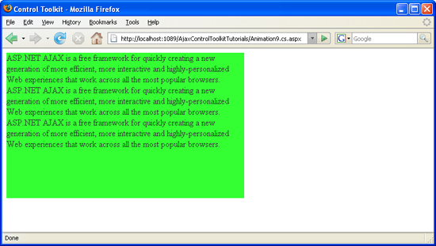

Modifying Animations From The Server Side (C#)
====================
by [Christian Wenz](https://github.com/wenz)

[Download Code](http://download.microsoft.com/download/f/9/a/f9a26acd-8df4-4484-8a18-199e4598f411/Animation9.cs.zip) or [Download PDF](http://download.microsoft.com/download/6/7/1/6718d452-ff89-4d3f-a90e-c74ec2d636a3/animation9CS.pdf)

> The Animation control in the ASP.NET AJAX Control Toolkit is not just a control but a whole framework to add animations to a control. The animations may also be changed on the server-side

## Overview

The Animation control in the ASP.NET AJAX Control Toolkit is not just a control but a whole framework to add animations to a control. The animations may also be changed on the server-side

## Steps

First of all, include the `ScriptManager` in the page; then, the ASP.NET AJAX library is loaded, making it possible to use the Control Toolkit:

[!code[Main](modifying-animations-from-the-server-side-cs/samples/sample1.xml)]

The animation will be applied to a panel of text which looks like this:

[!code[Main](modifying-animations-from-the-server-side-cs/samples/sample2.xml)]

In the associated CSS class for the panel, define a nice background color and also set a fixed width for the panel:

[!code[Main](modifying-animations-from-the-server-side-cs/samples/sample3.xml)]

The rest of the code runs on the server-side and does not use markup; instead, it uses code to create the `AnimationExtender` control:

[!code[Main](modifying-animations-from-the-server-side-cs/samples/sample4.xml)]

However, the Control Toolkit currently does not provide an API access to create the individual animations. It is however possible to set the `AnimationExtender`'s Animations property to a string containing the XML markup used when assigning the animations declaratively. In order to create the XML which must not contain the `<Animations>` element you could use the .NET Framework's XML support or, as in the following code, just provide the string:

[!code[Main](modifying-animations-from-the-server-side-cs/samples/sample5.xml)]

Finally, add the `AnimationExtender` control to the current page, within the `<form runat="server">` element, making sure that the animation is included and runs:

[!code[Main](modifying-animations-from-the-server-side-cs/samples/sample6.xml)]

The animation is created using server-side C#/VB code ([Click to view full-size image](modifying-animations-from-the-server-side-cs/_static/image3.png))

>[!div class="step-by-step"]
[Previous](triggering-an-animation-in-another-control-cs.md)
[Next](executing-animations-using-client-side-code-cs.md)