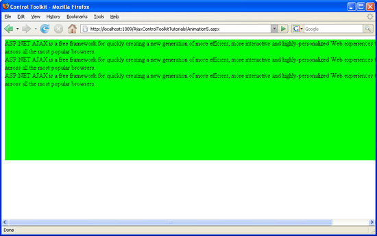

[Edit .md file](C:\Projects\msc\dev\Msc.Www\Web.ASP\App_Data\github\web-forms\overview\ajax-control-toolkit\animation\picking-one-animation-out-of-a-list-vb.md) | [Edit dev content](http://www.aspdev.net/umbraco#/content/content/edit/24785) | [View dev content](http://docs.aspdev.net/tutorials/web-forms/overview/ajax-control-toolkit/animation/picking-one-animation-out-of-a-list-vb.html) | [View prod content](http://www.asp.net/web-forms/overview/ajax-control-toolkit/animation/picking-one-animation-out-of-a-list-vb) | Picker: 33085

Picking One Animation Out Of a List (VB)
====================
by [Christian Wenz](https://github.com/wenz)

[Download Code](http://download.microsoft.com/download/f/9/a/f9a26acd-8df4-4484-8a18-199e4598f411/Animation5.vb.zip) or [Download PDF](http://download.microsoft.com/download/6/7/1/6718d452-ff89-4d3f-a90e-c74ec2d636a3/animation5VB.pdf)

> The Animation control in the ASP.NET AJAX Control Toolkit is not just a control but a whole framework to add animations to a control. The framework also allows the programmer to pick one animation out of a list of animations, depending on the evaluation of some JavaScript code.

## Overview

The Animation control in the ASP.NET AJAX Control Toolkit is not just a control but a whole framework to add animations to a control. The framework also allows the programmer to pick one animation out of a list of animations, depending on the evaluation of some JavaScript code.

## Steps

First of all, include the `ScriptManager` in the page; then, the ASP.NET AJAX library is loaded, making it possible to use the Control Toolkit:

    <asp:ScriptManager ID="asm" runat="server" />

The animation will be applied to a panel of text which looks like this:

    <asp:Panel ID="panelShadow" runat="server" CssClass="panelClass">
     ASP.NET AJAX is a free framework for quickly creating a new generation of more 
     efficient, more interactive and highly-personalized Web experiences that work 
     across all the most popular browsers. 
     ASP.NET AJAX is a free framework for quickly creating a new generation of more 
     efficient, more interactive and highly-personalized Web experiences that work 
     across all the most popular browsers. 
     ASP.NET AJAX is a free framework for quickly creating a new generation of more 
     efficient, more interactive and highly-personalized Web experiences that work 
     across all the most popular browsers. 
    </asp:Panel>

In the associated CSS class for the panel, define a nice background color and also set a fixed width for the panel:

    

Then, add the `AnimationExtender` to the page, providing an `ID`, the `TargetControlID` attribute and the obligatory `runat="server":`

    <ajaxToolkit:AnimationExtender ID="ae" runat="server" TargetControlID="Panel1">

Within the `<Animations>` node, use `<OnLoad>` to run the animations once the page has been fully loaded. Instead of one of the regular animations, the `<Case>` element comes into play. The value of its SelectScript attribute is evaluated; the return value must be numerical. Depending on this number, one of the subanimations within &lt;Case&gt; is executed. For instance, if SelectScript evaluates to 2, the Control Toolkit runs the third animation within &lt;Case&gt; (counting starts at 0).

The following markup defines three subanimations: Resizing the width, resizing the height, and fading out. The JavaScript code (`Math.floor(3 * Math.random())`) then picks a number between 0 and 2, so that one of the three animations is run:

    <ajaxToolkit:AnimationExtender ID="ae" runat="server"
     TargetControlID="Panel1">
     <Animations>
     <OnLoad>
     <Case SelectScript="Math.floor(3 * Math.random())">
     <Resize Width="1000" Unit="px" />
     <Resize Height="150" Unit="px" />
     <FadeOut Duration="1.5" Fps="24" />
     </Case>
     </OnLoad>
     </Animations>
    </ajaxToolkit:AnimationExtender>

One of the possible three animations: The panel gets wider ([Click to view full-size image](picking-one-animation-out-of-a-list-vb/_static/image3.png))

>[!div class="step-by-step"] [Previous](animation-depending-on-a-condition-vb.md) [Next](animating-in-response-to-user-interaction-vb.md)