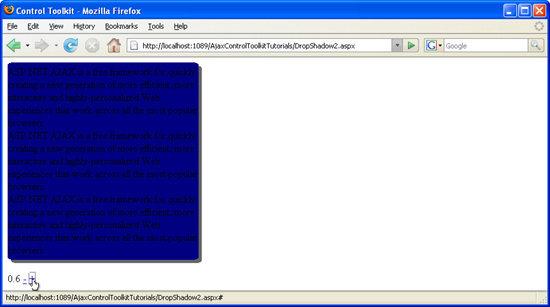

[Edit .md file](C:\Projects\msc\dev\Msc.Www\Web.ASP\App_Data\github\web-forms\overview\ajax-control-toolkit\dropshadow\manipulating-dropshadow-properties-from-client-code-vb.md) | [Edit dev content](http://www.aspdev.net/umbraco#/content/content/edit/24813) | [View dev content](http://docs.aspdev.net/tutorials/web-forms/overview/ajax-control-toolkit/dropshadow/manipulating-dropshadow-properties-from-client-code-vb.html) | [View prod content](http://www.asp.net/web-forms/overview/ajax-control-toolkit/dropshadow/manipulating-dropshadow-properties-from-client-code-vb) | Picker: 33113

Manipulating DropShadow Properties from Client Code (VB)
====================
by [Christian Wenz](https://github.com/wenz)

[Download Code](http://download.microsoft.com/download/5/1/6/51652a81-500b-4f6b-88d3-617103e7941e/DropShadow2.vb.zip) or [Download PDF](http://download.microsoft.com/download/b/6/a/b6ae89ee-df69-4c87-9bfb-ad1eb2b23373/dropshadow2VB.pdf)

> The DropShadow control in the AJAX Control Toolkit extends a panel with a drop shadow. Properties of this extender can also be changed using client JavaScript code.

## Overview

The DropShadow control in the AJAX Control Toolkit extends a panel with a drop shadow. Properties of this extender can also be changed using client JavaScript code.

## Steps

The code starts with a panel containing some lines of text:

    <asp:Panel ID="panelShadow" runat="server" CssClass="panel" Width="300px">
     ASP.NET AJAX is a free framework for quickly creating a new generation of more 
     efficient, more interactive and highly-personalized Web experiences that work 
     across all the most popular browsers. 
     ASP.NET AJAX is a free framework for quickly creating a new generation of more 
     efficient, more interactive and highly-personalized Web experiences that work 
     across all the most popular browsers. 
     ASP.NET AJAX is a free framework for quickly creating a new generation of more 
     efficient, more interactive and highly-personalized Web experiences that work 
     across all the most popular browsers. 
    </asp:Panel>

The associated CSS class gives the panel a nice background color:

    

The `DropShadowExtender` is added to extend the panel with a drop shadow effect, opacity set to 50%:

    <ajaxToolkit:DropShadowExtender ID="dse1" runat="server"
     TargetControlID="panelShadow"
     Opacity="0.5" Rounded="true" />

Then, the ASP.NET AJAX `ScriptManager` control enables the Control Toolkit to work:

    <asp:ScriptManager ID="asm" runat="server" />

Another panel contains two JavaScript links for setting the opacity of the drop shadow: the minus link decreases the shadow's opacity, the plus link increases it.

    <asp:Panel ID="panelControl" runat="server">
      
     <label id="txtOpacity" runat="server">0.5</label>
     <a href="#" onclick="changeOpacity(-0.1); return false;">-</a>
     <a href="#" onclick="changeOpacity(+0.1); return false;">+</a>
    </asp:Panel>

The JavaScript function `changeOpacity()` must then first find the `DropShadowExtender` control on the page. ASP.NET AJAX defines the `$find()` method for exactly that task. Then, the `get_Opacity()` method retrieves the current opacity, the `set_Opacity()` method sets it. The JavaScript code then puts the current opacity value in the `<label>` element:

    

The opacity is changed on the client side ([Click to view full-size image](manipulating-dropshadow-properties-from-client-code-vb/_static/image3.png))

>[!div class="step-by-step"] [Previous](adjusting-the-z-index-of-a-dropshadow-vb.md)