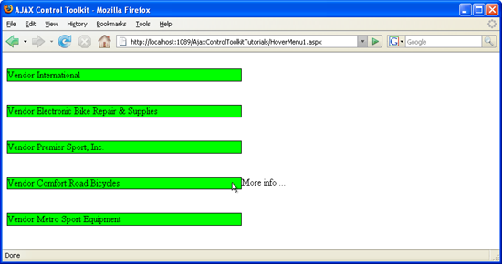

[Edit .md file](C:\Projects\msc\dev\Msc.Www\Web.ASP\App_Data\github\web-forms\overview\ajax-control-toolkit\hovermenu\using-hovermenu-with-a-repeater-control-cs.md) | [Edit dev content](http://www.aspdev.net/umbraco#/content/content/edit/24822) | [View dev content](http://docs.aspdev.net/tutorials/web-forms/overview/ajax-control-toolkit/hovermenu/using-hovermenu-with-a-repeater-control-cs.html) | [View prod content](http://www.asp.net/web-forms/overview/ajax-control-toolkit/hovermenu/using-hovermenu-with-a-repeater-control-cs) | Picker: 33122

Using HoverMenu with a Repeater Control (C#)
====================
by [Christian Wenz](https://github.com/wenz)

[Download Code](http://download.microsoft.com/download/b/0/6/b06fe835-5b8f-4c00-aef8-062c19d75b95/HoverMenu1.cs.zip) or [Download PDF](http://download.microsoft.com/download/b/6/a/b6ae89ee-df69-4c87-9bfb-ad1eb2b23373/hovermenu1CS.pdf)

> The HoverMenu control in the AJAX Control Toolkit provides a simple popup effect: When the mouse pointer hovers over an element, a popup appears at a specified position. It is also possible to use this control within a repeater.

## Overview

The `HoverMenu` control in the AJAX Control Toolkit provides a simple popup effect: When the mouse pointer hovers over an element, a popup appears at a specified position. It is also possible to use this control within a repeater.

## Steps

First of all, a data source is required. This sample uses the AdventureWorks database and the Microsoft SQL Server 2005 Express Edition. The database is an optional part of a Visual Studio installation (including express edition) and is also available as a separate download under [https://go.microsoft.com/fwlink/?LinkId=64064](https://go.microsoft.com/fwlink/?LinkId=64064). The AdventureWorks database is part of the SQL Server 2005 Samples and Sample Databases (download at [https://www.microsoft.com/downloads/details.aspx?FamilyID=e719ecf7-9f46-4312-af89-6ad8702e4e6e&amp;DisplayLang=en](https://www.microsoft.com/downloads/details.aspx?FamilyID=e719ecf7-9f46-4312-af89-6ad8702e4e6e&amp;DisplayLang=en)). The easiest way to set the database up is to use the Microsoft SQL Server Management Studio Express ([https://www.microsoft.com/downloads/details.aspx?FamilyID=c243a5ae-4bd1-4e3d-94b8-5a0f62bf7796&amp;DisplayLang=en](https://www.microsoft.com/downloads/details.aspx?FamilyID=c243a5ae-4bd1-4e3d-94b8-5a0f62bf7796&amp;DisplayLang=en)) and attach the `AdventureWorks.mdf` database file.

For this sample, we assume that the instance of the SQL Server 2005 Express Edition is called `SQLEXPRESS` and resides on the same machine as the web server; this is also the default setup. If your setup differs, you have to adapt the connection information for the database.

In order to activate the functionality of ASP.NET AJAX and the Control Toolkit, the `ScriptManager` control must be put anywhere on the page (but within the `<form>` element):

    <asp:ScriptManager ID="asm" runat="server" />

Then, add a data source to the page. In order to use a limited amount of data, we only select the first five entries in the Vendor table of the AdventureWorks database. If you are using the Visual Studio assistant to create the data source, mind that a bug in the current version does not prefix the table name (`Vendor`) with `Purchasing`. The following markup shows the correct syntax:

    <asp:SqlDataSource ID="sds1" runat="server" ConnectionString="
     Data Source=(local)\SQLEXPRESS;Initial Catalog=AdventureWorks;Integrated Security=True"
     ProviderName="System.Data.SqlClient" SelectCommand="SELECT TOP 5
     [VendorID], [Name] FROM [Purchasing].[Vendor]" />

Next, add a panel which serves as the modal popup:

    <asp:Panel ID="HoverPanel" runat="server">
     More info ...
    </asp:Panel>

Now, the `HoverMenuExtender` comes into play. So that every element in the data source gets its own popup, the extender must be put within the repeater's `<ItemTemplate>` section. Here is the markup:

    <asp:Repeater ID="rep1" DataSourceID="sds1" runat="server">
     <ItemTemplate>
      
     <asp:Panel ID="myPanel" runat="server" Width="400px" BackColor="Lime" BorderWidth="1px">
     

     Vendor
     <%#DataBinder.Eval(Container.DataItem, "Name")%>
     

     </asp:Panel>
      
     <ajaxToolkit:HoverMenuExtender ID="hme" runat="server" TargetControlID="myPanel"
     PopupControlID="HoverPanel" PopupPosition="Right" PopDelay="50" />
     </ItemTemplate>
    </asp:Repeater>

Now every item in the data source displays a popup to the right (`PopupPosition` attribute) after a delay of 50 milliseconds (`PopDelay` attribute).

The hover menu appears next to each item in the repeater ([Click to view full-size image](using-hovermenu-with-a-repeater-control-cs/_static/image3.png))

>[!div class="step-by-step"] [Next](using-hovermenu-with-a-repeater-control-vb.md)