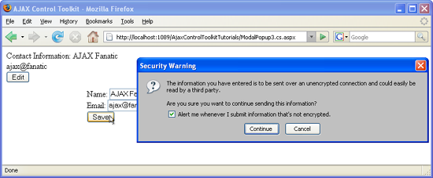

Handling Postbacks from a ModalPopup (VB)
====================
by [Christian Wenz](https://github.com/wenz)

[Download Code](http://download.microsoft.com/download/2/4/0/24052038-f942-4336-905b-b60ae56f0dd5/ModalPopup3.vb.zip) or [Download PDF](http://download.microsoft.com/download/b/6/a/b6ae89ee-df69-4c87-9bfb-ad1eb2b23373/modalpopup3VB.pdf)

> The ModalPopup control in the AJAX Control Toolkit offers a simple way to create a modal popup using client-side means. Special care must be taken when a postback is created from within the popup.

## Overview

The ModalPopup control in the AJAX Control Toolkit offers a simple way to create a modal popup using client-side means. Special care must be taken when a postback is created from within the popup.

## Steps

In order to activate the functionality of ASP.NET AJAX and the Control Toolkit, the `ScriptManager` control must be put anywhere on the page (but within the `<form>` element):

    <asp:ScriptManager ID="asm" runat="server" />

Next, add a panel which serves as the modal popup. There, the user can enter a name and an email address. A button is used to close the popup and save the information. Note that the `OnClick` attribute is set so that a postback occurs when this button is clicked:

    <asp:Panel ID="ModalPanel" runat="server" Width="500px">
     Name: <asp:TextBox ID="tbName" runat="server" /> 
     Email: <asp:TextBox ID="tbEmail" runat="server" /> 
     <asp:Button ID="OKButton" runat="server" Text="Save"OnClick="SaveData" />
    </asp:Panel>

The page itself consists of two labels for exactly the same information: name and email address. A button is used to trigger the modal popup:

    

     Contact Information:
     <asp:Label ID="lblName" runat="server" Text="AJAX Fanatic"/> 
     <asp:Label ID="lblEmail" runat="server" Text="ajax@fanatic"/> 
     <asp:Button ID="btn1" runat="server" Text="Edit"/>
    

In order to make the popup appear, add the `ModalPopupExtender` control. Set the `PopupControlID` attribute to the panel's ID and `TargetControlID` to the button's ID:

    <ajaxToolkit:ModalPopupExtender ID="mpe" runat="server" TargetControlID="btn1" PopupControlID="ModalPanel" />

Now whenever the `Save` button within the modal popup is clicked, the server-side `SaveData()` method is executed. There, you could save the entered data in a data store. For the sake of simplicity, the new data is just output in the label:

    Protected Sub SaveData(ByVal sender As Object, ByVal e As EventArgs)
     lblName.Text = HttpUtility.HtmlEncode(tbName.Text)
     lblEmail.Text = HttpUtility.HtmlEncode(tbEmail.Text)
    End Sub

Also, the textbox controls within the modal popup should be filled with the current name and email. However this is only necessary when no postback occurs. If there is a postback, the ASP.NET viewstate feature will automatically fill the textboxes with the appropriate values.

    Sub Page_Load()
     If Not Page.IsPostBack Then
     tbName.Text = lblName.Text
     tbEmail.Text = lblEmail.Text
     End If
    End Sub

The modal popup causes a postback ([Click to view full-size image](handling-postbacks-from-a-modalpopup-vb/_static/image3.png))

>[!div class="step-by-step"] [Previous](using-modalpopup-with-a-repeater-control-vb.md) [Next](positioning-a-modalpopup-vb.md)