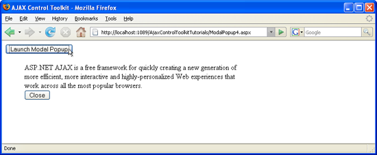

Positioning a ModalPopup (C#)
====================
by [Christian Wenz](https://github.com/wenz)

[Download Code](http://download.microsoft.com/download/2/4/0/24052038-f942-4336-905b-b60ae56f0dd5/ModalPopup4.cs.zip) or [Download PDF](http://download.microsoft.com/download/b/6/a/b6ae89ee-df69-4c87-9bfb-ad1eb2b23373/modalpopup4CS.pdf)

> The ModalPopup control in the AJAX Control Toolkit offers a simple way to create a modal popup using client-side means. However the control does not offer a built-in functionality to position the popup.

## Overview

The ModalPopup control in the AJAX Control Toolkit offers a simple way to create a modal popup using client-side means. However the control does not offer a built-in functionality to position the popup.

## Steps

In order to activate the functionality of ASP.NET AJAX and the Control Toolkit, the `ScriptManager`. control must be put anywhere on the page (but within the `<form>` element):

    <asp:ScriptManager ID="asm" runat="server" />

Next, add a panel which serves as the modal popup. A button is used to close the popup:

    <asp:Panel ID="ModalPanel" runat="server" Width="500px">
     ASP.NET AJAX is a free framework for quickly creating a new generation of more 
     efficient, more interactive and highly-personalized Web experiences that work 
     across all the most popular browsers. 
     <asp:Button ID="OKButton" runat="server" Text="Close" />
    </asp:Panel>

Whenever the popup is shown, it shall be positioned at a certain place in the page. For this task, a client-side JavaScript function is created. It first tries to access the panel. If it succeeds, the panel's position is set using CSS and JavaScript (change the position of the popup at will). However the `ModalPopupExtender` control also tries to position the popup. Therefore, the JavaScript code repeatedly positions the popup, every tenth of a second.

    

Now all that is left to do is to make the browser call these functions whenever appropriate. The `movePanel()` JavaScript function must be called when the button is clicked that triggers the panel:

    

     <asp:Button ID="btn1" runat="server" Text="Launch Modal Popup" 
     OnClientClick="movePanel();" />
    

And the `stopMoving()` function comes into play when the popup is closed this can be triggered in the `ModalPopupExtender` control:

    <ajaxToolkit:ModalPopupExtender ID="mpe" runat="server"
     TargetControlId="btn1" PopupControlID="ModalPanel" OkControlID="OKButton"
     OnOkScript="stopMoving();" />

The modal popup appears at the designated position ([Click to view full-size image](positioning-a-modalpopup-cs/_static/image3.png))

>[!div class="step-by-step"] [Previous](handling-postbacks-from-a-modalpopup-cs.md) [Next](launching-a-modal-popup-window-from-server-code-vb.md)