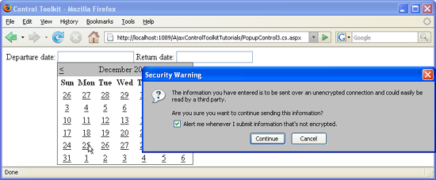
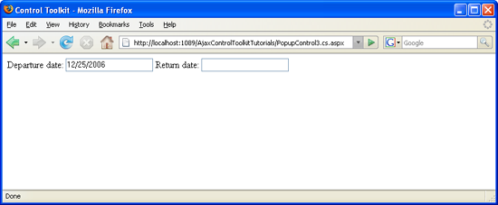

Handling Postbacks from A Popup Control Without an UpdatePanel (C#)
====================
by [Christian Wenz](https://github.com/wenz)

[Download Code](http://download.microsoft.com/download/9/3/f/93f8daea-bebd-4821-833b-95205389c7d0/PopupControl3.cs.zip) or [Download PDF](http://download.microsoft.com/download/2/d/c/2dc10e34-6983-41d4-9c08-f78f5387d32b/popupcontrol3CS.pdf)

> The PopupControl extender in the AJAX Control Toolkit offers an easy way to trigger a popup when any other control is activated. When a postback occurs in such a panel and there are several panels on the page it is hard to determine which panel has been clicked.

## Overview

The PopupControl extender in the AJAX Control Toolkit offers an easy way to trigger a popup when any other control is activated. When a postback occurs in such a panel and there are several panels on the page it is hard to determine which panel has been clicked.

## Steps

When using a `PopupControl` with a postback, but without having an `UpdatePanel` on the page, the Control Toolkit does not offer a way to determine which client element has triggered the popup which in turn caused the postback. However a small trick provides a workaround for this scenario.

First of all, here is the basic setup: two text boxes which both trigger the same popup, a calendar. Two `PopupControlExtenders` bring text boxes and popup together.

    <form id="form1" runat="server">
     <asp:ScriptManager ID="asm" runat="server" />
     

     Departure date: <asp:TextBox ID="tbDeparture" runat="server" />
     Return date: <asp:TextBox ID="tbReturn" runat="server" />
     

     <asp:Panel ID="pnlCalendar" runat="server">
     <asp:Calendar ID="c1" runat="server" OnSelectionChanged="c1_SelectionChanged" />
     </asp:Panel>
     <ajaxToolkit:PopupControlExtender ID="pce1" runat="server"
     TargetControlID="tbDeparture" PopupControlID="pnlCalendar" Position="Bottom" />
     <ajaxToolkit:PopupControlExtender ID="pce2" runat="server"
     TargetControlID="tbReturn" PopupControlID="pnlCalendar" Position="Bottom" />
    </form>

The basic idea is to add a hidden form field in the &lt;`form`&gt; element that holds the text box which launched the popup:

    <input type="hidden" id="tbHidden" runat="server" />

When the page is loaded, JavaScript code adds an event handler to both text boxes: Whenever the user clicks on a text box, its name is written into the hidden form field:

    

In the server-side code, the value of the hidden field must be read. Since hidden form fields are trivial to manipulate, a whitelist approach to validate the hidden value is required. Once the correct text box has been identified, the date from the calendar is written into it.

    

The Calendar appears when the user clicks into the textbox ([Click to view full-size image](handling-postbacks-from-a-popup-control-without-an-updatepanel-cs/_static/image3.png))

Clicking on a date puts it in the textbox ([Click to view full-size image](handling-postbacks-from-a-popup-control-without-an-updatepanel-cs/_static/image6.png))

>[!div class="step-by-step"] [Previous](handling-postbacks-from-a-popup-control-with-an-updatepanel-cs.md) [Next](using-multiple-popup-controls-vb.md)