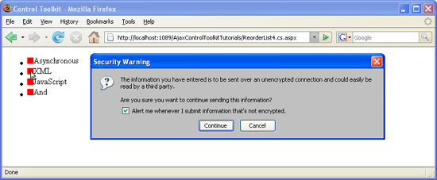

[Edit .md file](C:\Projects\msc\dev\Msc.Www\Web.ASP\App_Data\github\web-forms\overview\ajax-control-toolkit\reorderlist\using-postbacks-with-reorderlist-vb.md) | [Edit dev content](http://www.aspdev.net/umbraco#/content/content/edit/24849) | [View dev content](http://docs.aspdev.net/tutorials/web-forms/overview/ajax-control-toolkit/reorderlist/using-postbacks-with-reorderlist-vb.html) | [View prod content](http://www.asp.net/web-forms/overview/ajax-control-toolkit/reorderlist/using-postbacks-with-reorderlist-vb) | Picker: 33149

Using Postbacks with ReorderList (VB)
====================
by [Christian Wenz](https://github.com/wenz)

[Download Code](http://download.microsoft.com/download/9/3/f/93f8daea-bebd-4821-833b-95205389c7d0/ReorderList4.vb.zip) or [Download PDF](http://download.microsoft.com/download/2/d/c/2dc10e34-6983-41d4-9c08-f78f5387d32b/reorderlist4VB.pdf)

> The ReorderList control in the AJAX Control Toolkit provides a list that can be reordered by the user via drag and drop. Whenever the list is reordered, a postback shall inform the server of the change.

## Overview

The `ReorderList` control in the AJAX Control Toolkit provides a list that can be reordered by the user via drag and drop. Whenever the list is reordered, a postback shall inform the server of the change.

## Steps

There are several possible data sources for the `ReorderList` control. One is to use an `XmlDataSource` control:

    <asp:XmlDataSource ID="XmlDataSource1" runat="server" XPath="acronym/letter">
     <Data>
     <acronym>
     <letter char="A" description="Asynchronous" />
     <letter char="J" description="JavaScript" />
     <letter char="A" description="And" />
     <letter char="X" description="XML" />
     </acronym>
     </Data>
    </asp:XmlDataSource>

In order to bind this XML to a `ReorderList` control and enable postbacks, the following attributes must be set:

- `DataSourceID`: The ID of the data source
- `SortOrderField`: The property to sort by
- `AllowReorder`: Whether to allow the user to reorder the list elements
- `PostBackOnReorder`: Whether to create a postback whenever the list is rearranged

Here is the appropriate markup for the control:

    <ajaxToolkit:ReorderList ID="rl1" runat="server" SortOrderField="char"
     AllowReorder="true"
     DataSourceID="XmlDataSource1" PostBackOnReorder="true">

Within the `ReorderList` control, specific data from the data source may be bound using the `Eval()` method:

    <DragHandleTemplate>
     

     

     </DragHandleTemplate>
     <ItemTemplate>
     

     <asp:Label ID="ItemLabel" Text='<%# Eval("description") %>' runat="server" />
     

     </ItemTemplate>
    </ajaxToolkit:ReorderList>

At an arbitrary position on the page, a label will hold the information when the last reordering occurred:

    

     <asp:Label ID="lastUpdate" runat="server" />
    

This label is filled with text in the server-side code, handling the postback:

    

Finally, in order to activate the functionality of ASP.NET AJAX and the Control Toolkit, the `ScriptManager` control must be put on the page:

    <asp:ScriptManager ID="asm" runat="server" />

Each reordering triggers a postback ([Click to view full-size image](using-postbacks-with-reorderlist-vb/_static/image3.png))

>[!div class="step-by-step"] [Previous](drag-and-drop-via-reorderlist-cs.md) [Next](drag-and-drop-via-reorderlist-vb.md)