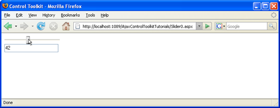

[Edit .md file](C:\Projects\msc\dev\Msc.Www\Web.ASP\App_Data\github\web-forms\overview\ajax-control-toolkit\slider\databinding-the-slider-control-cs.md) | [Edit dev content](http://www.aspdev.net/umbraco#/content/content/edit/24852) | [View dev content](http://docs.aspdev.net/tutorials/web-forms/overview/ajax-control-toolkit/slider/databinding-the-slider-control-cs.html) | [View prod content](http://www.asp.net/web-forms/overview/ajax-control-toolkit/slider/databinding-the-slider-control-cs) | Picker: 33152

Databinding the Slider Control (C#)
====================
by [Christian Wenz](https://github.com/wenz)

[Download Code](http://download.microsoft.com/download/9/3/f/93f8daea-bebd-4821-833b-95205389c7d0/Slider0.cs.zip) or [Download PDF](http://download.microsoft.com/download/2/d/c/2dc10e34-6983-41d4-9c08-f78f5387d32b/slider0CS.pdf)

> The Slider control in the AJAX Control Toolkit provides a graphical slider that can be controlled using the mouse. It is possible to bind the current position of the slider to another ASP.NET control.

## Overview

The Slider control in the AJAX Control Toolkit provides a graphical slider that can be controlled using the mouse. It is possible to bind the current position of the slider to another ASP.NET control.

## Steps

In order to activate the functionality of ASP.NET AJAX and the Control Toolkit, the `ScriptManager` control must be put anywhere on the page (but within the `<form>` element):

    <asp:ScriptManager ID="asm" runat="server" />

Next, add two `TextBox` controls to the page. One will be transformed into a graphical slider, and the other one will hold the position of the slider.

    <asp:TextBox ID="Slider1" runat="server" />
    <asp:TextBox ID="SliderValue" runat="server" />

The next step is already the final step. The `SliderExtender` control from the ASP.NET AJAX Control Toolkit makes a slider out of the first text box and automatically updates the second text box when the slider position changes. In order for that to work, The `SliderExtender`'s `TargetControlID` attribute must be set to the ID of the first text box; the `BoundControlID` attribute must be set to the ID of the second text box.

    <ajaxToolkit:SliderExtender ID="se1" runat="server" TargetControlID="Slider1"
     BoundControlID="SliderValue" />

As you can see in the browser, the data binding works in both directions: entering a new value in the text box updates the slider's position. If you make the second text box read only, you may add a weak protection to the text field so that it is harder for the user to manually update the value in there.

Slider and text box are in sync ([Click to view full-size image](databinding-the-slider-control-cs/_static/image3.png))

>[!div class="step-by-step"] [Previous](using-the-slider-control-with-auto-postback-cs.md) [Next](using-the-slider-control-with-auto-postback-vb.md)