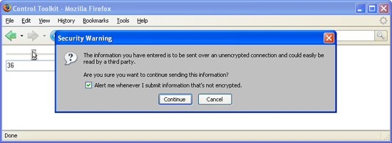
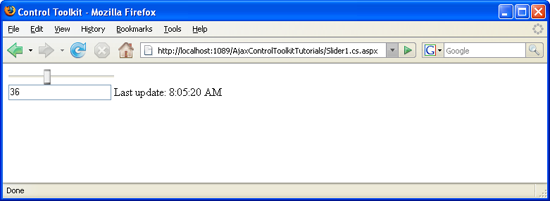

[Edit .md file](C:\Projects\msc\dev\Msc.Www\Web.ASP\App_Data\github\web-forms\overview\ajax-control-toolkit\slider\using-the-slider-control-with-auto-postback-cs.md) | [Edit dev content](http://www.aspdev.net/umbraco#/content/content/edit/24854) | [View dev content](http://docs.aspdev.net/tutorials/web-forms/overview/ajax-control-toolkit/slider/using-the-slider-control-with-auto-postback-cs.html) | [View prod content](http://www.asp.net/web-forms/overview/ajax-control-toolkit/slider/using-the-slider-control-with-auto-postback-cs) | Picker: 33154

Using the Slider Control With Auto-Postback (C#)
====================
by [Christian Wenz](https://github.com/wenz)

[Download Code](http://download.microsoft.com/download/9/3/f/93f8daea-bebd-4821-833b-95205389c7d0/Slider1.cs.zip) or [Download PDF](http://download.microsoft.com/download/b/6/a/b6ae89ee-df69-4c87-9bfb-ad1eb2b23373/slider1CS.pdf)

> The Slider control in the AJAX Control Toolkit provides a graphical slider that can be controlled using the mouse. It is possible to make the slider autopostback once its value changes.

## Overview

The Slider control in the AJAX Control Toolkit provides a graphical slider that can be controlled using the mouse. It is possible to make the slider autopostback once its value changes.

## Steps

In order to make the slider automatically postback upon a change, both text boxes need the attribute `AutoPostBack="true"`: The text box that will become the slider itself, and the text box that holds the slider's position. Here is the required markup for that:

    <asp:TextBox ID="Slider1" runat="server" AutoPostBack="true" />
    <asp:TextBox ID="SliderValue" runat="server" AutoPostBack="true" />

The `SliderExtender` control from the ASP.NET AJAX Control Toolkit assigns the slider functionality to the two text boxes:

    <ajaxToolkit:SliderExtender ID="se1" runat="server"
     TargetControlId="Slider1" BoundControlID="SliderValue" />

An additional label element will later be used to inform the user of a postback:

    <asp:Label ID="LastUpdate" runat="server" />

Finally, the `ScriptManager` control of ASP.NET AJAX loads the required JavaScript for the Control Toolkit to work:

    <asp:ScriptManager ID="asm" runat="server" />

Now the slider is posting back; on the server-side, this event may be caught and acted upon:

    

Moving the slider triggers a postback ([Click to view full-size image](using-the-slider-control-with-auto-postback-cs/_static/image3.png))

Afterwards, the date of this change is written in the label ([Click to view full-size image](using-the-slider-control-with-auto-postback-cs/_static/image6.png))

>[!div class="step-by-step"] [Next](databinding-the-slider-control-cs.md)