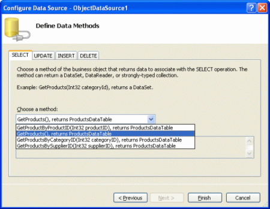
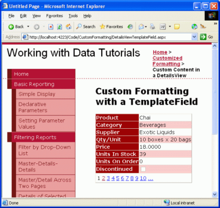
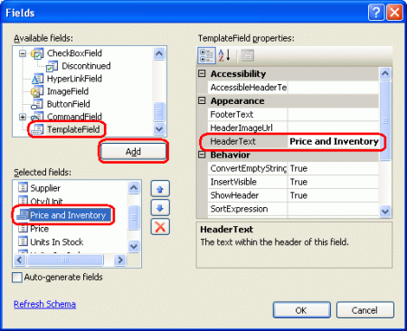
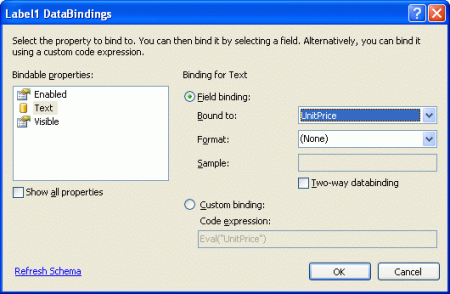
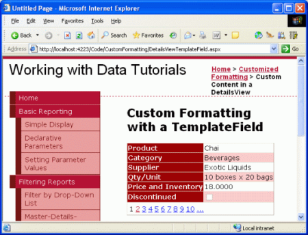
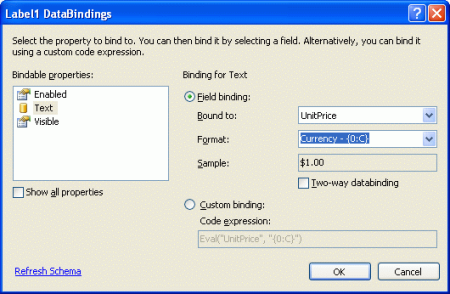
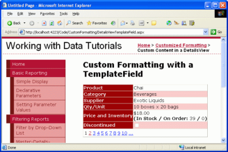
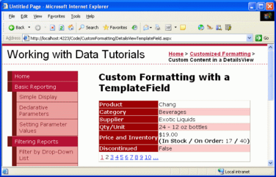
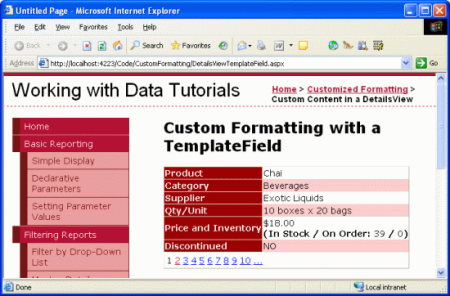

[Edit .md file](C:\Projects\msc\dev\Msc.Www\Web.ASP\App_Data\github\web-forms\overview\data-access\custom-formatting\using-templatefields-in-the-detailsview-control-cs.md) | [Edit dev content](http://www.aspdev.net/umbraco#/content/content/edit/24998) | [View dev content](http://docs.aspdev.net/tutorials/web-forms/overview/data-access/custom-formatting/using-templatefields-in-the-detailsview-control-cs.html) | [View prod content](http://www.asp.net/web-forms/overview/data-access/custom-formatting/using-templatefields-in-the-detailsview-control-cs) | Picker: 33238

Using TemplateFields in the DetailsView Control (C#)
====================
by [Scott Mitchell](https://twitter.com/ScottOnWriting)

[Download Sample App](http://download.microsoft.com/download/9/6/9/969e5c94-dfb6-4e47-9570-d6d9e704c3c1/ASPNET_Data_Tutorial_13_CS.exe) or [Download PDF](using-templatefields-in-the-detailsview-control-cs/_static/datatutorial13cs1.pdf)

> The same TemplateFields capabilities available with the GridView are also available with the DetailsView control. In this tutorial we'll display one product at a time using a DetailsView containing TemplateFields.

## Introduction

The TemplateField offers a higher degree of flexibility in rendering data than the BoundField, CheckBoxField, HyperLinkField, and other data field controls. In the [previous tutorial](using-templatefields-in-the-gridview-control-cs.md) we looked at using the TemplateField in a GridView to:

- Display multiple data field values in one column. Specifically, both the `FirstName` and `LastName` fields were combined into one GridView column.
- Use an alternate Web control to express a data field value. We saw how to show the `HiredDate` value using a Calendar control.
- Show status information based on the underlying data. While the `Employees` table does not contain a column that returns the number of days an employee has been on the job, we were able to display such information in the GridView example in the previous tutorial with the use of a TemplateField and formatting method.

The same TemplateFields capabilities available with the GridView are also available with the DetailsView control. In this tutorial we'll display one product at a time using a DetailsView that contains two TemplateFields. The first TemplateField will combine the `UnitPrice`, `UnitsInStock`, and `UnitsOnOrder` data fields into one DetailsView row. The second TemplateField will display the value of the `Discontinued` field, but will use a formatting method to display "YES" if `Discontinued` is `true`, and "NO" otherwise.

**Figure 1**: Two TemplateFields are Used to Customize the Display ([Click to view full-size image](using-templatefields-in-the-detailsview-control-cs/_static/image3.png))

Let's get started!

## Step 1: Binding the Data to the DetailsView

As discussed in the previous tutorial, when working with TemplateFields it's often easiest to start by creating the DetailsView control that contains just BoundFields and then add new TemplateFields or convert the existing BoundFields to TemplateFields as needed. Therefore, start this tutorial by adding a DetailsView to the page through the Designer and binding it to an ObjectDataSource that returns the list of products. These steps will create a DetailsView with BoundFields for each of the product's non-Boolean value fields and a CheckBoxField for the one Boolean value field (Discontinued).

Open the `DetailsViewTemplateField.aspx` page and drag a DetailsView from the Toolbox onto the Designer. From the DetailsView's smart tag choose to add a new ObjectDataSource control that invokes the `ProductsBLL` class's `GetProducts()` method.

**Figure 2**: Add a New ObjectDataSource Control that Invokes the `GetProducts()` Method ([Click to view full-size image](using-templatefields-in-the-detailsview-control-cs/_static/image6.png))

For this report remove the `ProductID`, `SupplierID`, `CategoryID`, and `ReorderLevel` BoundFields. Next, reorder the BoundFields so that the `CategoryName` and `SupplierName` BoundFields appear immediately after the `ProductName` BoundField. Feel free to adjust the `HeaderText` properties and formatting properties for the BoundFields as you see fit. Like with the GridView, these BoundField-level edits can be performed through the Fields dialog box (accessible by clicking on the Edit Fields link in the DetailsView's smart tag) or through the declarative syntax. Lastly, clear out the DetailsView's `Height` and `Width` property values in order to allow the DetailsView control to expand based on the data displayed and check the Enable Paging checkbox in the smart tag.

After making these changes, your DetailsView control's declarative markup should look similar to the following:

    <asp:DetailsView ID="DetailsView1" runat="server" AutoGenerateRows="False"
        DataKeyNames="ProductID" DataSourceID="ObjectDataSource1" AllowPaging="True"
        EnableViewState="False">
        <Fields>
            <asp:BoundField DataField="ProductName" HeaderText="Product"
              SortExpression="ProductName" />
            <asp:BoundField DataField="CategoryName" HeaderText="Category"
              ReadOnly="True" SortExpression="CategoryName" />
            <asp:BoundField DataField="SupplierName" HeaderText="Supplier"
              ReadOnly="True" SortExpression="SupplierName" />
            <asp:BoundField DataField="QuantityPerUnit"
              HeaderText="Qty/Unit" SortExpression="QuantityPerUnit" />
            <asp:BoundField DataField="UnitPrice" HeaderText="Price"
              SortExpression="UnitPrice" />
            <asp:BoundField DataField="UnitsInStock"
              HeaderText="Units In Stock" SortExpression="UnitsInStock" />
            <asp:BoundField DataField="UnitsOnOrder"
              HeaderText="Units On Order" SortExpression="UnitsOnOrder" />
            <asp:CheckBoxField DataField="Discontinued"
              HeaderText="Discontinued" SortExpression="Discontinued" />
        </Fields>
    </asp:DetailsView>

Take a moment to view the page through a browser. At this point you should see a single product listed (Chai) with rows showing the product's name, category, supplier, price, units in stock, units on order, and its discontinued status.

**Figure 3**: The Product's Details Are Shown Using a Series of BoundFields ([Click to view full-size image](using-templatefields-in-the-detailsview-control-cs/_static/image9.png))

## Step 2: Combining the Price, Units In Stock, and Units On Order Into One Row

The DetailsView has a row for the `UnitPrice`, `UnitsInStock`, and `UnitsOnOrder` fields. We can combine these data fields into a single row with a TemplateField either by adding a new TemplateField or by converting one of the existing `UnitPrice`, `UnitsInStock`, and `UnitsOnOrder` BoundFields into a TemplateField. While I personally prefer converting existing BoundFields, let's practice by adding a new TemplateField.

Start by clicking on the Edit Fields link in the DetailsView's smart tag to bring up the Fields dialog box. Next, add a new TemplateField and set its `HeaderText` property to "Price and Inventory" and move the new TemplateField so that it is positioned above the `UnitPrice` BoundField.

**Figure 4**: Add a New TemplateField to the DetailsView Control ([Click to view full-size image](using-templatefields-in-the-detailsview-control-cs/_static/image12.png))

Since this new TemplateField will contain the values currently displayed in the `UnitPrice`, `UnitsInStock`, and `UnitsOnOrder` BoundFields, let's remove them.

The last task for this step is to define the `ItemTemplate` markup for the Price and Inventory TemplateField, which can be accomplished either through the DetailsView's template editing interface in the Designer or by hand through the control's declarative syntax. As with the GridView, the DetailsView's template editing interface can be accessed by clicking on the Edit Templates link in the smart tag. From here you can select the template to edit from the drop-down list and then add any Web controls from the Toolbox.

For this tutorial, start by adding a Label control to the Price and Inventory TemplateField's `ItemTemplate`. Next, click on the Edit DataBindings link from the Label Web control's smart tag and bind the `Text` property to the `UnitPrice` field.

**Figure 5**: Bind the Label's `Text` Property to the `UnitPrice` Data Field ([Click to view full-size image](using-templatefields-in-the-detailsview-control-cs/_static/image15.png))

## Formatting the Price as a Currency

With this addition, the Label Web control Price and Inventory TemplateField will now display just the price for the selected product. Figure 6 shows a screen shot of our progress thus far when viewed through a browser.

**Figure 6**: The Price and Inventory TemplateField Shows the Price ([Click to view full-size image](using-templatefields-in-the-detailsview-control-cs/_static/image18.png))

Note that the product's price is not formatted as a currency. With a BoundField, formatting is possible by setting the `HtmlEncode` property to `false` and the `DataFormatString` property to `{0:formatSpecifier}`. For a TemplateField, however, any formatting instructions must be specified in the databinding syntax or through the use of a formatting method defined somewhere within the application's code (such as in the ASP.NET page's code-behind class).

To specify the formatting for the databinding syntax used in the Label Web control, return to the DataBindings dialog box by clicking on the Edit DataBindings link from the Label's smart tag. You can type the formatting instructions directly in the Format drop-down list or select one of the defined format strings. Like with the BoundField's `DataFormatString` property, the formatting is specified using `{0:formatSpecifier}`.

For the `UnitPrice` field use the currency formatting specified either by selecting the appropriate drop-down list value or by typing in `{0:C}` by hand.

**Figure 7**: Format the Price as a Currency ([Click to view full-size image](using-templatefields-in-the-detailsview-control-cs/_static/image21.png))

Declaratively, the formatting specification is indicated as a second parameter into the `Bind` or `Eval` methods. The settings just made through the Designer result in the following databinding expression in the declarative markup:

    <asp:Label ID="Label1" runat="server" Text='<%# Eval("UnitPrice", "{0:C}") %>'/>

## Adding the Remaining Data Fields to the TemplateField

At this point we've displayed and formatted the `UnitPrice` data field in the Price and Inventory TemplateField, but still need to display the `UnitsInStock` and `UnitsOnOrder` fields. Let's display these on a line below the price and in parentheses. From the template editing interface in the Designer, such markup can be added by positioning your cursor within the template and simply typing in the text to be displayed. Alternatively, this markup can be entered directly in the declarative syntax.

Add the static markup, Label Web controls, and databinding syntax so that the Price and Inventory TemplateField displays the price and inventory information like so:

*UnitPrice*  
(**In Stock / On Order:** *UnitsInStock* / *UnitsOnOrder*)

After performing this task your DetailsView's declarative markup should look similar to the following:

    <asp:DetailsView ID="DetailsView1" runat="server" AutoGenerateRows="False"
        DataKeyNames="ProductID" DataSourceID="ObjectDataSource1" AllowPaging="True"
        EnableViewState="False">
        <Fields>
            <asp:BoundField DataField="ProductName"
              HeaderText="Product" SortExpression="ProductName" />
            <asp:BoundField DataField="CategoryName" HeaderText="Category"
              ReadOnly="True" SortExpression="CategoryName" />
            <asp:BoundField DataField="SupplierName"
              HeaderText="Supplier" ReadOnly="True"
              SortExpression="SupplierName" />
            <asp:BoundField DataField="QuantityPerUnit"
              HeaderText="Qty/Unit" SortExpression="QuantityPerUnit" />
            <asp:TemplateField HeaderText="Price and Inventory">
                <ItemTemplate>
                    <asp:Label ID="Label1" runat="server"
                      Text='<%# Eval("UnitPrice", "{0:C}") %>'></asp:Label>
                     
                    <strong>
                    (In Stock / On Order: </strong>
                    <asp:Label ID="Label2" runat="server"
                      Text='<%# Eval("UnitsInStock") %>'></asp:Label>
                    <strong>/</strong>
                    <asp:Label ID="Label3" runat="server"
                      Text='<%# Eval("UnitsOnOrder") %>'>
                    </asp:Label><strong>)</strong>
                </ItemTemplate>
            </asp:TemplateField>
            <asp:CheckBoxField DataField="Discontinued"
               HeaderText="Discontinued" SortExpression="Discontinued" />
        </Fields>
    </asp:DetailsView>

With these changes we've consolidated the price and inventory information into a single DetailsView row.

**Figure 8**: The Price and Inventory Information is Displayed in a Single Row ([Click to view full-size image](using-templatefields-in-the-detailsview-control-cs/_static/image24.png))

## Step 3: Customizing the Discontinued Field Information

The `Products` table's `Discontinued` column is a bit value that indicates whether the product has been discontinued. When binding a DetailsView (or GridView) to a data source control, the Boolean value fields, like `Discontinued`, are implemented as CheckBoxFields whereas non-Boolean value fields, like `ProductID`, `ProductName`, and so on, are implemented as BoundFields. The CheckBoxField renders as a disabled checkbox that is checked if the data field's value is True and unchecked otherwise.

Rather than display the CheckBoxField we may want to instead display text indicating whether or not the product is discontinued. To accomplish this we could remove the CheckBoxField from the DetailsView and then add a BoundField whose `DataField` property was set to `Discontinued`. Take a moment to do this. After this change the DetailsView shows the text "True" for discontinued products and "False" for products that are still active.

**Figure 9**: The Strings True and False Are Used to Display the Discontinued State ([Click to view full-size image](using-templatefields-in-the-detailsview-control-cs/_static/image27.png))

Imagine that we didn't want the strings "True" or "False" to be used, but "YES" and "NO", instead. Such customization can be performed with the aid of a TemplateField and a formatting method. A formatting method can take in any number of input parameters, but must return the HTML (as a string) to inject into the template.

Add a formatting method to the `DetailsViewTemplateField.aspx` page's code-behind class named `DisplayDiscontinuedAsYESorNO` that accepts a Boolean as an input parameter and returns a string. As discussed in the previous tutorial, this method *must* be marked as `protected` or `public` in order to be accessible from the template.

    protected string DisplayDiscontinuedAsYESorNO(bool discontinued)
    {
        if (discontinued)
            return "YES";
        else
            return "NO";
    }

This method checks the input parameter (`discontinued`) and returns "YES" if it is `true`, "NO" otherwise.

> [!NOTE] In the formatting method examined in the previous tutorial recall that we were passing in a data field that might contain `NULL` s and therefore needed to check if the employee's `HiredDate` property value had a database `NULL` value before accessing the `EmployeesRow`'s `HiredDate` property. Such a check is not needed here since the `Discontinued` column can never have database `NULL` values assigned. Moreover, this is why the method can accept a Boolean input parameter rather than having to accept a `ProductsRow` instance or a parameter of type `object`.

With this formatting method complete, all that remains is to call it from the TemplateField's `ItemTemplate`. To create the TemplateField either remove the `Discontinued` BoundField and add a new TemplateField or convert the `Discontinued` BoundField into a TemplateField. Then, from the declarative markup view, edit the TemplateField so that it contains just an ItemTemplate that invokes the `DisplayDiscontinuedAsYESorNO` method, passing in the value of the current `ProductRow` instance's `Discontinued` property. This can be accessed via the `Eval` method. Specifically, the TemplateField's markup should look like:

    <asp:TemplateField HeaderText="Discontinued" SortExpression="Discontinued">
        <ItemTemplate>
            <%# DisplayDiscontinuedAsYESorNO((bool)
              Eval("Discontinued")) %>
        </ItemTemplate>
    </asp:TemplateField>

This will cause the `DisplayDiscontinuedAsYESorNO` method to be invoked when rendering the DetailsView, passing in the `ProductRow` instance's `Discontinued` value. Since the `Eval` method returns a value of type `object`, but the `DisplayDiscontinuedAsYESorNO` method expects an input parameter of type `bool`, we cast the `Eval` methods return value to `bool`. The `DisplayDiscontinuedAsYESorNO` method will then return "YES" or "NO" depending on the value it receives. The returned value is what is displayed in this DetailsView row (see Figure 10).

**Figure 10**: YES or NO Values are Now Shown in the Discontinued Row ([Click to view full-size image](using-templatefields-in-the-detailsview-control-cs/_static/image30.png))

## Summary

The TemplateField in the DetailsView control allows for a higher degree of flexibility in displaying data than is available with the other field controls and are ideal for situations where:

- Multiple data fields need to be displayed in one GridView column
- The data is best expressed using a Web control rather than plain text
- The output depends on the underlying data, such as displaying metadata or in reformatting the data

While TemplateFields allow for a greater degree of flexibility in the rendering of the DetailsView's underlying data, the DetailsView output still feels a bit boxy as each field is rendered as a row in an HTML `<table>`.

The FormView control offers a greater degree of flexibility in configuring the rendered output. The FormView does not contain fields but rather just a series of templates (`ItemTemplate`, `EditItemTemplate`, `HeaderTemplate`, and so on). We'll see how to use the FormView to achieve even more control of the rendered layout in our next tutorial.

Happy Programming!

## About the Author

[Scott Mitchell](http://www.4guysfromrolla.com/ScottMitchell.shtml), author of seven ASP/ASP.NET books and founder of [4GuysFromRolla.com](http://www.4guysfromrolla.com), has been working with Microsoft Web technologies since 1998. Scott works as an independent consultant, trainer, and writer. His latest book is [*Sams Teach Yourself ASP.NET 2.0 in 24 Hours*](https://www.amazon.com/exec/obidos/ASIN/0672327384/4guysfromrollaco). He can be reached at [mitchell@4GuysFromRolla.com.](mailto:mitchell@4GuysFromRolla.com) or via his blog, which can be found at [http://ScottOnWriting.NET](http://ScottOnWriting.NET).

## Special Thanks To

This tutorial series was reviewed by many helpful reviewers. Lead reviewer for this tutorial was Dan Jagers. Interested in reviewing my upcoming MSDN articles? If so, drop me a line at [mitchell@4GuysFromRolla.com.](mailto:mitchell@4GuysFromRolla.com)

>[!div class="step-by-step"] [Previous](using-templatefields-in-the-gridview-control-cs.md) [Next](using-the-formview-s-templates-cs.md)