[Edit .md file](C:\Projects\msc\dev\Msc.Www\Web.ASP\App_Data\github\web-forms\overview\data-access\database-driven-site-maps\building-a-custom-database-driven-site-map-provider-vb.md) | [Edit dev content](http://www.aspdev.net/umbraco#/content/content/edit/25005) | [View dev content](http://docs.aspdev.net/tutorials/web-forms/overview/data-access/database-driven-site-maps/building-a-custom-database-driven-site-map-provider-vb.html) | [View prod content](http://www.asp.net/web-forms/overview/data-access/database-driven-site-maps/building-a-custom-database-driven-site-map-provider-vb) | Picker: 33245

Building a Custom Database-Driven Site Map Provider (VB)
====================
by [Scott Mitchell](https://twitter.com/ScottOnWriting)

[Download Code](http://download.microsoft.com/download/3/9/f/39f92b37-e92e-4ab3-909e-b4ef23d01aa3/ASPNET_Data_Tutorial_62_VB.zip) or [Download PDF](building-a-custom-database-driven-site-map-provider-vb/_static/datatutorial62vb1.pdf)

> The default site map provider in ASP.NET 2.0 retrieves its data from a static XML file. While the XML-based provider is suitable to many small and medium-sized Web sites, larger Web applications require a more dynamic site map. In this tutorial we'll build a custom site map provider that retrieves its data from the Business Logic Layer, which in turn retrieves data from the database.

## Introduction

ASP.NET 2.0 s site map feature enables a page developer to define a web application s site map in some persistent medium, such as in an XML file. Once defined, the site map data can be accessed programmatically through the [`SiteMap` class](https://msdn.microsoft.com/en-us/library/system.web.sitemap.aspx) in the [`System.Web` namespace](https://msdn.microsoft.com/en-us/library/system.web.aspx) or through a variety of navigation Web controls, such as the SiteMapPath, Menu, and TreeView controls. The site map system uses the [provider model](http://aspnet.4guysfromrolla.com/articles/101905-1.aspx) so that different site map serialization implementations can be created and plugged into a web application. The default site map provider that ships with ASP.NET 2.0 persists site map structure in an XML file. Back in the [Master Pages and Site Navigation](../introduction/master-pages-and-site-navigation-vb.md) tutorial we created a file named `Web.sitemap` that contained this structure and have been updating its XML with each new tutorial section.

The default XML-based site map provider works well if the site map s structure is fairly static, such as for these tutorials. In many scenarios, however, a more dynamic site map is needed. Consider the site map shown in Figure 1, where each category and product appear as sections in the website s structure. With this site map, visiting the web page corresponding to the root node might list all of the categories, whereas visiting a particular category s web page would list that category s products and viewing a particular product s web page would show that product s details.

[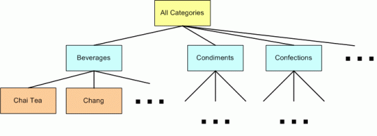](building-a-custom-database-driven-site-map-provider-vb/_static/image1.png)

**Figure 1**: The Categories and Products Makeup the Site Map s Structure ([Click to view full-size image](building-a-custom-database-driven-site-map-provider-vb/_static/image2.png))

While this category- and product-based structure could be hard-coded into the `Web.sitemap` file, the file would need to be updated each time a category or product was added, removed, or renamed. Consequently, the site map maintenance would be greatly simplified if its structure was retrieved from the database or, ideally, from the Business Logic Layer of the application s architecture. That way, as products and categories were added, renamed, or deleted, the site map would automatically update to reflect these changes.

Since ASP.NET 2.0 s site map serialization is built atop the provider model, we can create our own custom site map provider that grabs its data from an alternate data store, such as the database or architecture. In this tutorial we'll build a custom provider that retrieves its data from the BLL. Let s get started!

> [!NOTE] The custom site map provider created in this tutorial is tightly coupled to the application s architecture and data model. Jeff Prosise s [Storing Site Maps in SQL Server](https://msdn.microsoft.com/msdnmag/issues/05/06/WickedCode/) and [The SQL Site Map Provider You ve Been Waiting For](https://msdn.microsoft.com/msdnmag/issues/06/02/wickedcode/default.aspx) articles examine a generalized approach to storing site map data in SQL Server.

## Step 1: Creating the Custom Site Map Provider Web Pages

Before we start creating a custom site map provider, let s first add the ASP.NET pages we'll need for this tutorial. Start by adding a new folder named `SiteMapProvider`. Next, add the following ASP.NET pages to that folder, making sure to associate each page with the `Site.master` master page:

- `Default.aspx`
- `ProductsByCategory.aspx`
- `ProductDetails.aspx`

Also add a `CustomProviders` subfolder to the `App_Code` folder.

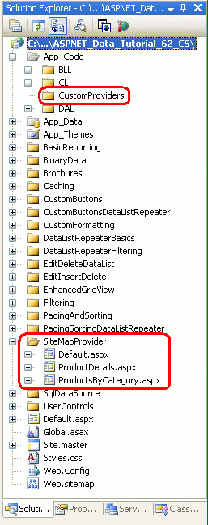

**Figure 2**: Add the ASP.NET Pages for the Site Map Provider-Related Tutorials

Since there is only one tutorial for this section, we don t need `Default.aspx` to list the section s tutorials. Instead, `Default.aspx` will display the categories in a GridView control. We'll tackle this in Step 2.

Next, update `Web.sitemap` to include a reference to the `Default.aspx` page. Specifically, add the following markup after the Caching `<siteMapNode>`:

    <siteMapNode 
        title="Customizing the Site Map" url="~/SiteMapProvider/Default.aspx" 
        description="Learn how to create a custom provider that retrieves the site map 
                     from the Northwind database." />

After updating `Web.sitemap`, take a moment to view the tutorials website through a browser. The menu on the left now includes an item for the sole site map provider tutorial.

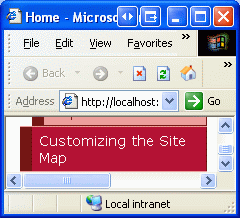

**Figure 3**: The Site Map Now Includes an Entry for the Site Map Provider Tutorial

This tutorial s main focus is to illustrate creating a custom site map provider and configuring a web application to use that provider. In particular, we'll build a provider that returns a site map that includes a root node along with a node for each category and product, as depicted in Figure 1. In general, each node in the site map may specify a URL. For our site map, the root node s URL will be `~/SiteMapProvider/Default.aspx`, which will list all of the categories in the database. Each category node in the site map will have a URL that points to `~/SiteMapProvider/ProductsByCategory.aspx?CategoryID=categoryID`, which will list all of the products in the specified *categoryID*. Finally, each product site map node will point to `~/SiteMapProvider/ProductDetails.aspx?ProductID=productID`, which will display the specific product s details.

To start we need to create the `Default.aspx`, `ProductsByCategory.aspx`, and `ProductDetails.aspx` pages. These pages are completed in Steps 2, 3, and 4, respectively. Since the thrust of this tutorial is on site map providers, and since past tutorials have covered creating these sorts of multi-page master/detail reports, we will hurry through Steps 2 through 4. If you need a refresher on creating master/detail reports that span multiple pages, refer back to the [Master/Detail Filtering Across Two Pages](../masterdetail/master-detail-filtering-across-two-pages-vb.md) tutorial.

## Step 2: Displaying a List of Categories

Open the `Default.aspx` page in the `SiteMapProvider` folder and drag a GridView from the Toolbox onto the Designer, setting its `ID` to `Categories`. From the GridView s smart tag, bind it to a new ObjectDataSource named `CategoriesDataSource` and configure it so that it retrieves its data using the `CategoriesBLL` class s `GetCategories` method. Since this GridView just displays the categories and does not provide data modification capabilities, set the drop-down lists in the UPDATE, INSERT, and DELETE tabs to (None) .

[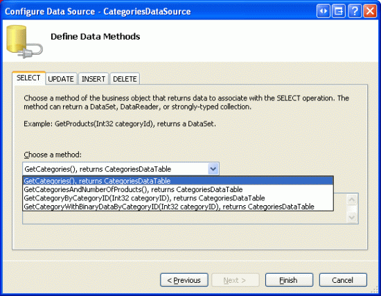](building-a-custom-database-driven-site-map-provider-vb/_static/image3.png)

**Figure 4**: Configure the ObjectDataSource to Return Categories Using the `GetCategories` Method ([Click to view full-size image](building-a-custom-database-driven-site-map-provider-vb/_static/image4.png))

[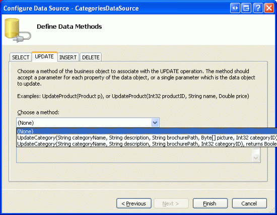](building-a-custom-database-driven-site-map-provider-vb/_static/image5.png)

**Figure 5**: Set the Drop-Down Lists in the UPDATE, INSERT, and DELETE Tabs to (None) ([Click to view full-size image](building-a-custom-database-driven-site-map-provider-vb/_static/image6.png))

After completing the Configure Data Source wizard, Visual Studio will add a BoundField for `CategoryID`, `CategoryName`, `Description`, `NumberOfProducts`, and `BrochurePath`. Edit the GridView so that it only contains the `CategoryName` and `Description` BoundFields and update the `CategoryName` BoundField s `HeaderText` property to Category .

Next, add a HyperLinkField and position it so that it s the left-most field. Set the `DataNavigateUrlFields` property to `CategoryID` and the `DataNavigateUrlFormatString` property to `~/SiteMapProvider/ProductsByCategory.aspx?CategoryID={0}`. Set the `Text` property to View Products .

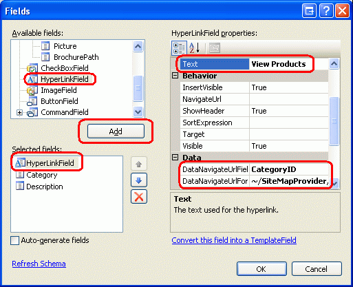

**Figure 6**: Add a HyperLinkField to the `Categories` GridView

After creating the ObjectDataSource and customizing the GridView s fields, the two controls declarative markup will look like the following:

    <asp:GridView ID="Categories" runat="server" AutoGenerateColumns="False" 
        DataKeyNames="CategoryID" DataSourceID="CategoriesDataSource" 
        EnableViewState="False">
        <Columns>
            <asp:HyperLinkField DataNavigateUrlFields="CategoryID" 
                DataNavigateUrlFormatString=
                    "~/SiteMapProvider/ProductsByCategory.aspx?CategoryID={0}"
                Text="View Products" />
            <asp:BoundField DataField="CategoryName" HeaderText="Category" 
                SortExpression="CategoryName" />
            <asp:BoundField DataField="Description" HeaderText="Description" 
                SortExpression="Description" />
        </Columns>
    </asp:GridView>
    <asp:ObjectDataSource ID="CategoriesDataSource" runat="server" 
        OldValuesParameterFormatString="original_{0}" SelectMethod="GetCategories" 
        TypeName="CategoriesBLL"></asp:ObjectDataSource>

Figure 7 shows `Default.aspx` when viewed through a browser. Clicking a category s View Products link takes you to `ProductsByCategory.aspx?CategoryID=categoryID`, which we will build in Step 3.

[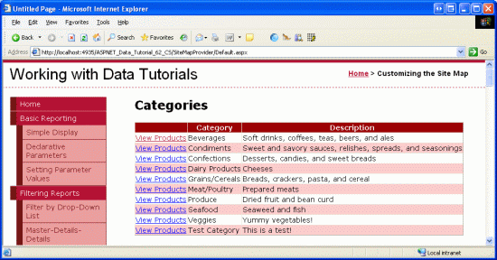](building-a-custom-database-driven-site-map-provider-vb/_static/image7.png)

**Figure 7**: Each Category is Listed Along with a View Products Link ([Click to view full-size image](building-a-custom-database-driven-site-map-provider-vb/_static/image8.png))

## Step 3: Listing the Selected Category s Products

Open the `ProductsByCategory.aspx` page and add a GridView, naming it `ProductsByCategory`. From its smart tag, bind the GridView to a new ObjectDataSource named `ProductsByCategoryDataSource`. Configure the ObjectDataSource to use the `ProductsBLL` class s `GetProductsByCategoryID(categoryID)` method and set the drop-down lists to (None) in the UPDATE, INSERT, and DELETE tabs.

[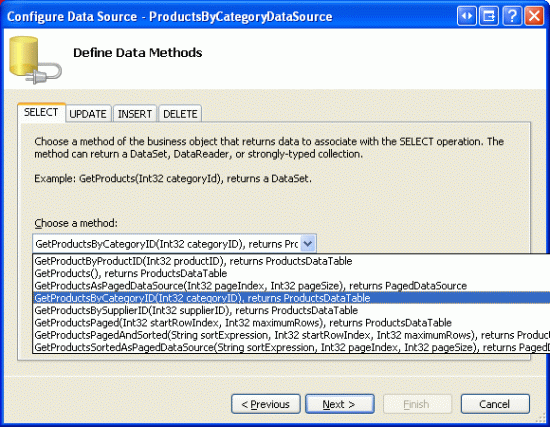](building-a-custom-database-driven-site-map-provider-vb/_static/image9.png)

**Figure 8**: Use the `ProductsBLL` Class s `GetProductsByCategoryID(categoryID)` Method ([Click to view full-size image](building-a-custom-database-driven-site-map-provider-vb/_static/image10.png))

The final step in the Configure Data Source wizard prompts for a parameter source for *categoryID*. Since this information is passed through the querystring field `CategoryID`, select QueryString from the drop-down list and enter CategoryID in the QueryStringField textbox as shown in Figure 9. Click Finish to complete the wizard.

[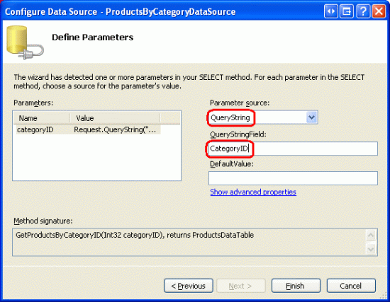](building-a-custom-database-driven-site-map-provider-vb/_static/image11.png)

**Figure 9**: Use the `CategoryID` Querystring Field for the *categoryID* Parameter ([Click to view full-size image](building-a-custom-database-driven-site-map-provider-vb/_static/image12.png))

After completing the wizard, Visual Studio will add corresponding BoundFields and a CheckBoxField to the GridView for the product data fields. Remove all but the `ProductName`, `UnitPrice`, and `SupplierName` BoundFields. Customize these three BoundFields `HeaderText` properties to read Product , Price , and Supplier , respectively. Format the `UnitPrice` BoundField as a currency.

Next, add a HyperLinkField and move it to the left-most position. Set its `Text` property to View Details , its `DataNavigateUrlFields` property to `ProductID`, and its `DataNavigateUrlFormatString` property to `~/SiteMapProvider/ProductDetails.aspx?ProductID={0}`.

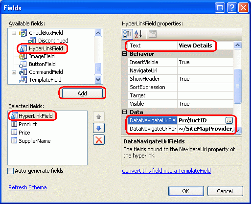

**Figure 10**: Add a View Details HyperLinkField that Points to `ProductDetails.aspx`

After making these customizations, the GridView and ObjectDataSource s declarative markup should resemble the following:

    <asp:GridView ID="ProductsByCategory" runat="server" AutoGenerateColumns="False"
        DataKeyNames="ProductID" DataSourceID="ProductsByCategoryDataSource" 
        EnableViewState="False">
        <Columns>
            <asp:HyperLinkField DataNavigateUrlFields="ProductID" 
                DataNavigateUrlFormatString=
                    "~/SiteMapProvider/ProductDetails.aspx?ProductID={0}"
                Text="View Details" />
            <asp:BoundField DataField="ProductName" HeaderText="Product"
                SortExpression="ProductName" />
            <asp:BoundField DataField="UnitPrice" DataFormatString="{0:c}" 
                HeaderText="Price" HtmlEncode="False" 
                SortExpression="UnitPrice" />
            <asp:BoundField DataField="SupplierName" HeaderText="Supplier" 
                ReadOnly="True" SortExpression="SupplierName" />
        </Columns>
    </asp:GridView>
    <asp:ObjectDataSource ID="ProductsByCategoryDataSource" runat="server" 
        OldValuesParameterFormatString="original_{0}"
        SelectMethod="GetProductsByCategoryID" TypeName="ProductsBLL">
        <SelectParameters>
            <asp:QueryStringParameter Name="categoryID" 
                QueryStringField="CategoryID" Type="Int32" />
        </SelectParameters>
    </asp:ObjectDataSource>

Return to viewing `Default.aspx` through a browser and click on the View Products link for Beverages. This will take you to `ProductsByCategory.aspx?CategoryID=1`, displaying the names, prices, and suppliers of the products in the Northwind database that belong to the Beverages category (see Figure 11). Feel free to further enhance this page to include a link to return users to the category listing page (`Default.aspx`) and a DetailsView or FormView control that displays the selected category s name and description.

[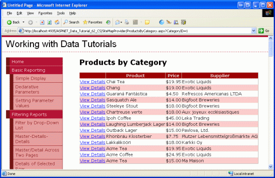](building-a-custom-database-driven-site-map-provider-vb/_static/image13.png)

**Figure 11**: The Beverages Names, Prices, and Suppliers are Displayed ([Click to view full-size image](building-a-custom-database-driven-site-map-provider-vb/_static/image14.png))

## Step 4: Showing a Product s Details

The final page, `ProductDetails.aspx`, displays the selected products details. Open `ProductDetails.aspx` and drag a DetailsView from the Toolbox onto the Designer. Set the DetailsView s `ID` property to `ProductInfo` and clear out its `Height` and `Width` property values. From its smart tag, bind the DetailsView to a new ObjectDataSource named `ProductDataSource`, configuring the ObjectDataSource to pull its data from the `ProductsBLL` class s `GetProductByProductID(productID)` method. As with the previous web pages created in Steps 2 and 3, set the drop-down lists in the UPDATE, INSERT, and DELETE tabs to (None) .

[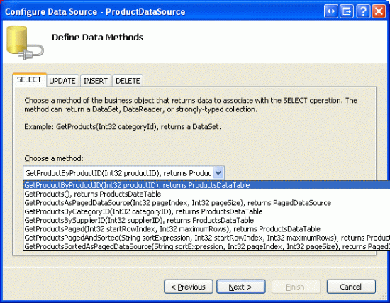](building-a-custom-database-driven-site-map-provider-vb/_static/image15.png)

**Figure 12**: Configure the ObjectDataSource to Use the `GetProductByProductID(productID)` Method ([Click to view full-size image](building-a-custom-database-driven-site-map-provider-vb/_static/image16.png))

The last step of the Configure Data Source wizard prompts for the source of the *productID* parameter. Since this data comes through the querystring field `ProductID`, set the drop-down list to QueryString and the QueryStringField textbox to ProductID . Finally, click the Finish button to complete the wizard.

**Figure 13**: Configure the *productID* Parameter to Pull its Value from the `ProductID` Querystring Field ([Click to view full-size image](building-a-custom-database-driven-site-map-provider-vb/_static/image18.png))

After completing the Configure Data Source wizard, Visual Studio will create corresponding BoundFields and a CheckBoxField in the DetailsView for the product data fields. Remove the `ProductID`, `SupplierID`, and `CategoryID` BoundFields and configure the remaining fields as you see fit. After a handful of aesthetic configurations, my DetailsView and ObjectDataSource s declarative markup looked like the following:

    <asp:DetailsView ID="ProductInfo" runat="server" AutoGenerateRows="False" 
        DataKeyNames="ProductID" DataSourceID="ProductDataSource" 
        EnableViewState="False">
        <Fields>
            <asp:BoundField DataField="ProductName" HeaderText="Product" 
                SortExpression="ProductName" />
            <asp:BoundField DataField="CategoryName" HeaderText="Category" 
                ReadOnly="True" SortExpression="CategoryName" />
            <asp:BoundField DataField="SupplierName" HeaderText="Supplier" 
                ReadOnly="True" SortExpression="SupplierName" />
            <asp:BoundField DataField="QuantityPerUnit" HeaderText="Qty/Unit" 
                SortExpression="QuantityPerUnit" />
            <asp:BoundField DataField="UnitPrice" DataFormatString="{0:c}" 
                HeaderText="Price" HtmlEncode="False" 
                SortExpression="UnitPrice" />
            <asp:BoundField DataField="UnitsInStock" HeaderText="Units In Stock" 
                SortExpression="UnitsInStock" />
            <asp:BoundField DataField="UnitsOnOrder" HeaderText="Units On Order" 
                SortExpression="UnitsOnOrder" />
            <asp:BoundField DataField="ReorderLevel" HeaderText="Reorder Level" 
                SortExpression="ReorderLevel" />
            <asp:CheckBoxField DataField="Discontinued" HeaderText="Discontinued" 
                SortExpression="Discontinued" />
        </Fields>
    </asp:DetailsView>
    <asp:ObjectDataSource ID="ProductDataSource" runat="server" 
        OldValuesParameterFormatString="original_{0}"
        SelectMethod="GetProductByProductID" TypeName="ProductsBLL">
        <SelectParameters>
            <asp:QueryStringParameter Name="productID" 
                QueryStringField="ProductID" Type="Int32" />
        </SelectParameters>
    </asp:ObjectDataSource>

To test this page, return to `Default.aspx` and click on View Products for the Beverages category. From the listing of beverage products, click on the View Details link for Chai Tea. This will take you to `ProductDetails.aspx?ProductID=1`, which shows a Chai Tea s details (see Figure 14).

[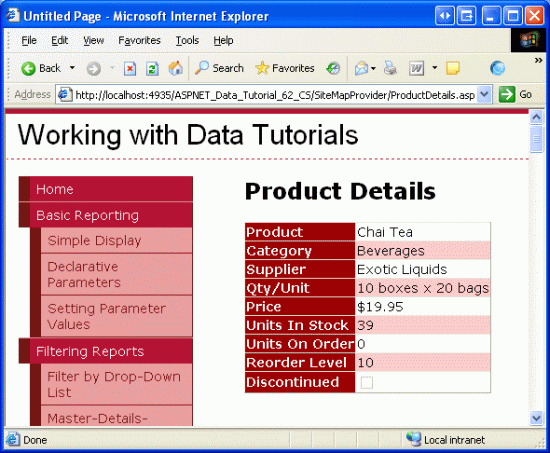](building-a-custom-database-driven-site-map-provider-vb/_static/image19.png)

**Figure 14**: Chai Tea s Supplier, Category, Price, and Other Information is Displayed ([Click to view full-size image](building-a-custom-database-driven-site-map-provider-vb/_static/image20.png))

## Step 5: Understanding the Inner Workings of a Site Map Provider

The site map is represented in the web server s memory as a collection of `SiteMapNode` instances that form a hierarchy. There must be exactly one root, all non-root nodes must have exactly one parent node, and all nodes may have an arbitrary number of children. Each `SiteMapNode` object represents a section in the website s structure; these sections commonly have a corresponding web page. Consequently, the [`SiteMapNode` class](https://msdn.microsoft.com/en-us/library/system.web.sitemapnode.aspx) has properties like `Title`, `Url`, and `Description`, which provide information for the section the `SiteMapNode` represents. There is also a `Key` property that uniquely identifies each `SiteMapNode` in the hierarchy, as well as properties used to establish this hierarchy `ChildNodes`, `ParentNode`, `NextSibling`, `PreviousSibling`, and so forth.

Figure 15 shows the general site map structure from Figure 1, but with the implementation details sketched out in finer detail.

[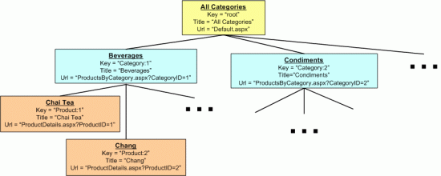](building-a-custom-database-driven-site-map-provider-vb/_static/image15.gif)

**Figure 15**: Each `SiteMapNode` has Properties Like `Title`, `Url`, `Key`, and So On ([Click to view full-size image](building-a-custom-database-driven-site-map-provider-vb/_static/image17.gif))

The site map is accessible through the [`SiteMap` class](https://msdn.microsoft.com/en-us/library/system.web.sitemap.aspx) in the [`System.Web` namespace](https://msdn.microsoft.com/en-us/library/system.web.aspx). This class s `RootNode` property returns the site map s root `SiteMapNode` instance; `CurrentNode` returns the `SiteMapNode` whose `Url` property matches the URL of the currently requested page. This class is used internally by ASP.NET 2.0 s navigation Web controls.

When the `SiteMap` class s properties are accessed, it must serialize the site map structure from some persistent medium into memory. However, the site map serialization logic is not hard coded into the `SiteMap` class. Instead, at runtime the `SiteMap` class determines which site map *provider* to use for serialization. By default, the [`XmlSiteMapProvider` class](https://msdn.microsoft.com/en-us/library/system.web.xmlsitemapprovider.aspx) is used, which reads the site map s structure from a properly-formatted XML file. However, with a little bit of work we can create our own custom site map provider.

All site map providers must be derived from the [`SiteMapProvider` class](https://msdn.microsoft.com/en-us/library/system.web.sitemapprovider.aspx), which includes the essential methods and properties needed for site map providers, but omits many of the implementation details. A second class, [`StaticSiteMapProvider`](https://msdn.microsoft.com/en-us/library/system.web.staticsitemapprovider.aspx), extends the `SiteMapProvider` class and contains a more robust implementation of the needed functionality. Internally, the `StaticSiteMapProvider` stores the `SiteMapNode` instances of the site map in a `Hashtable` and provides methods like `AddNode(child, parent)`, `RemoveNode(siteMapNode),` and `Clear()` that add and remove `SiteMapNode` s to the internal `Hashtable`. `XmlSiteMapProvider` is derived from `StaticSiteMapProvider`.

When creating a custom site map provider that extends `StaticSiteMapProvider`, there are two abstract methods that must be overridden: [`BuildSiteMap`](https://msdn.microsoft.com/en-us/library/system.web.staticsitemapprovider.buildsitemap.aspx) and [`GetRootNodeCore`](https://msdn.microsoft.com/en-us/library/system.web.sitemapprovider.getrootnodecore.aspx). `BuildSiteMap`, as its name implies, is responsible for loading the site map structure from persistent storage and constructing it in memory. `GetRootNodeCore` returns the root node in the site map.

Before a web application can use a site map provider it must be registered in the application s configuration. By default, the `XmlSiteMapProvider` class is registered using the name `AspNetXmlSiteMapProvider`. To register additional site map providers, add the following markup to `Web.config`:

    <configuration>
        <system.web>
            ...
            <siteMap defaultProvider="defaultProviderName">
              <providers>
                <add name="name" type="type" />
              </providers>
            </siteMap>
        </system.web>
    </configuration>

The *name* value assigns a human-readable name to the provider while *type* specifies the fully-qualified type name of the site map provider. We'll explore concrete values for the *name* and *type* values in Step 7, after we ve created our custom site map provider.

The site map provider class is instantiated the first time it is accessed from the `SiteMap` class and remains in memory for the lifetime of the web application. Since there is only one instance of the site map provider that may be invoked from multiple, concurrent web site visitors, it is imperative that the provider s methods be *thread-safe*.

For performance and scalability reasons, it s important that we cache the in-memory site map structure and return this cached structure rather than recreating it every time the `BuildSiteMap` method is invoked. `BuildSiteMap` may be called several times per page request per user, depending on the navigation controls in use on the page and the depth of the site map structure. In any case, if we do not cache the site map structure in `BuildSiteMap` then each time it is invoked we would need to re-retrieve the product and category information from the architecture (which would result in a query to the database). As we discussed in the previous caching tutorials, cached data can become stale. To combat this, we can use either time- or SQL cache dependency-based expiries.

> [!NOTE] A site map provider may optionally override the [`Initialize` method](https://msdn.microsoft.com/en-us/library/system.web.sitemapprovider.initialize.aspx). `Initialize` is invoked when the site map provider is first instantiated and is passed any custom attributes assigned to the provider in `Web.config` in the `<add>` element like: `<add name="name" type="type" customAttribute="value" />`. It is useful if you want to allow a page developer to specify various site map provider-related settings without having to modify the provider s code. For example, if we were reading the category and products data directly from the database as opposed to through the architecture, we d likely want to let the page developer specify the database connection string through `Web.config` rather than using a hard coded value in the provider s code. The custom site map provider we'll build in Step 6 does not override this `Initialize` method. For an example of using the `Initialize` method, refer to [Jeff Prosise](http://www.wintellect.com/Weblogs/CategoryView,category,Jeff%20Prosise.aspx) s [Storing Site Maps in SQL Server](https://msdn.microsoft.com/msdnmag/issues/05/06/WickedCode/) article.

## Step 6: Creating the Custom Site Map Provider

To create a custom site map provider that builds the site map from the categories and products in the Northwind database, we need to create a class that extends `StaticSiteMapProvider`. In Step 1 I asked you to add a `CustomProviders` folder in the `App_Code` folder - add a new class to this folder named `NorthwindSiteMapProvider`. Add the following code to the `NorthwindSiteMapProvider` class:

    Imports System.Web
    Imports System.Web.Caching
    Public Class NorthwindSiteMapProvider
        Inherits StaticSiteMapProvider
        Private ReadOnly siteMapLock As New Object()
        Private root As SiteMapNode = Nothing
        Public Const CacheDependencyKey As String = "NorthwindSiteMapProviderCacheDependency"
        Public Overrides Function BuildSiteMap() As System.Web.SiteMapNode
            ' Use a lock to make this method thread-safe
            SyncLock siteMapLock
                ' First, see if we already have constructed the
                ' rootNode. If so, return it...
                If root IsNot Nothing Then
                    Return root
                End If
                ' We need to build the site map!
                ' Clear out the current site map structure
                MyBase.Clear()
                ' Get the categories and products information from the database
                Dim productsAPI As New ProductsBLL()
                Dim products As Northwind.ProductsDataTable = productsAPI.GetProducts()
                ' Create the root SiteMapNode
                root = New SiteMapNode( _
                    Me, "root", "~/SiteMapProvider/Default.aspx", "All Categories")
                AddNode(root)
                ' Create SiteMapNodes for the categories and products
                For Each product As Northwind.ProductsRow In products
                    ' Add a new category SiteMapNode, if needed
                    Dim categoryKey, categoryName As String
                    Dim createUrlForCategoryNode As Boolean = True
                    If product.IsCategoryIDNull() Then
                        categoryKey = "Category:None"
                        categoryName = "None"
                        createUrlForCategoryNode = False
                    Else
                        categoryKey = String.Concat("Category:", product.CategoryID)
                        categoryName = product.CategoryName
                    End If
                    Dim categoryNode As SiteMapNode = FindSiteMapNodeFromKey(categoryKey)
                    ' Add the category SiteMapNode if it does not exist
                    If categoryNode Is Nothing Then
                        Dim productsByCategoryUrl As String = String.Empty
                        If createUrlForCategoryNode Then
                            productsByCategoryUrl = _
                                "~/SiteMapProvider/ProductsByCategory.aspx?CategoryID=" & _
                                product.CategoryID
                        End If
                        categoryNode = New SiteMapNode _
                            (Me, categoryKey, productsByCategoryUrl, categoryName)
                        AddNode(categoryNode, root)
                    End If
                    ' Add the product SiteMapNode
                    Dim productUrl As String = _
                        "~/SiteMapProvider/ProductDetails.aspx?ProductID=" & _
                        product.ProductID
                    Dim productNode As New SiteMapNode _
                        (Me, String.Concat("Product:", product.ProductID), _
                        productUrl, product.ProductName)
                    AddNode(productNode, categoryNode)
                Next
                ' Add a "dummy" item to the cache using a SqlCacheDependency
                ' on the Products and Categories tables
                Dim productsTableDependency As New _
                    System.Web.Caching.SqlCacheDependency("NorthwindDB", "Products")
                Dim categoriesTableDependency As New _
                    System.Web.Caching.SqlCacheDependency("NorthwindDB", "Categories")
                ' Create an AggregateCacheDependency
                Dim aggregateDependencies As New System.Web.Caching.AggregateCacheDependency()
                aggregateDependencies.Add(productsTableDependency, categoriesTableDependency)
                ' Add the item to the cache specifying a callback function
                HttpRuntime.Cache.Insert( _
                    CacheDependencyKey, DateTime.Now, aggregateDependencies, _
                    Cache.NoAbsoluteExpiration, Cache.NoSlidingExpiration, _
                    CacheItemPriority.Normal, AddressOf OnSiteMapChanged)
                ' Finally, return the root node
                Return root
            End SyncLock
        End Function
        Protected Overrides Function GetRootNodeCore() As System.Web.SiteMapNode
            Return BuildSiteMap()
        End Function
        Protected Sub OnSiteMapChanged _
        (key As String, value As Object, reason As CacheItemRemovedReason)
            SyncLock siteMapLock
                If String.Compare(key, CacheDependencyKey) = 0 Then
                    ' Refresh the site map
                    root = Nothing
                End If
            End SyncLock
        End Sub
        Public ReadOnly Property CachedDate() As Nullable(Of DateTime)
            Get
                Dim value As Object = HttpRuntime.Cache(CacheDependencyKey)
                If value Is Nothing OrElse Not TypeOf value Is Nullable(Of DateTime) Then
                    Return Nothing
                Else
                    Return CType(value, Nullable(Of DateTime))
                End If
            End Get
        End Property
    End Class

Let s start with exploring this class s `BuildSiteMap` method, which starts with a [`lock` statement](https://msdn.microsoft.com/en-us/library/c5kehkcz.aspx). The `lock` statement only allows one thread at a time to enter, thereby serializing access to its code and preventing two concurrent threads from stepping on one another s toes.

The class-level `SiteMapNode` variable `root` is used to cache the site map structure. When the site map is constructed for the first time, or for the first time after the underlying data has been modified, `root` will be `Nothing` and the site map structure will be constructed. The site map s root node is assigned to `root` during the construction process so that the next time this method is called, `root` will not be `Nothing`. Consequently, so long as `root` is not `Nothing` the site map structure will be returned to the caller without having to recreate it.

If root is `Nothing`, the site map structure is created from the product and category information. The site map is built by creating the `SiteMapNode` instances and then forming the hierarchy through calls to the `StaticSiteMapProvider` class s `AddNode` method. `AddNode` performs the internal bookkeeping, storing the assorted `SiteMapNode` instances in a `Hashtable`. Before we start constructing the hierarchy, we start by calling the `Clear` method, which clears out the elements from the internal `Hashtable`. Next, the `ProductsBLL` class s `GetProducts` method and the resulting `ProductsDataTable` are stored in local variables.

The site map s construction begins by creating the root node and assigning it to `root`. The overload of the [`SiteMapNode` s constructor](https://msdn.microsoft.com/en-us/library/system.web.sitemapnode.sitemapnode.aspx) used here and throughout this `BuildSiteMap` is passed the following information:

- A reference to the site map provider (`Me`).
- The `SiteMapNode` s `Key`. This required value must be unique for each `SiteMapNode`.
- The `SiteMapNode` s `Url`. `Url` is optional, but if provided, each `SiteMapNode` s `Url` value must be unique.
- The `SiteMapNode` s `Title`, which is required.

The `AddNode(root)` method call adds the `SiteMapNode` `root` to the site map as the root. Next, each `ProductRow` in the `ProductsDataTable` is enumerated. If there already exists a `SiteMapNode` for the current product s category, it is referenced. Otherwise, a new `SiteMapNode` for the category is created and added as a child of the `SiteMapNode``root` through the `AddNode(categoryNode, root)` method call. After the appropriate category `SiteMapNode` node has been found or created, a `SiteMapNode` is created for the current product and added as a child of the category `SiteMapNode` via `AddNode(productNode, categoryNode)`. Note that the category `SiteMapNode` s `Url` property value is `~/SiteMapProvider/ProductsByCategory.aspx?CategoryID=categoryID` while the product `SiteMapNode` s `Url` property is assigned `~/SiteMapNode/ProductDetails.aspx?ProductID=productID`.

> [!NOTE] Those products that have a database `NULL` value for their `CategoryID` are grouped under a category `SiteMapNode` whose `Title` property is set to None and whose `Url` property is set to an empty string. I decided to set `Url` to an empty string since the `ProductBLL` class s `GetProductsByCategory(categoryID)` method currently lacks the capability to return just those products with a `NULL` `CategoryID` value. Also, I wanted to demonstrate how the navigation controls render a `SiteMapNode` that lacks a value for its `Url` property. I encourage you to extend this tutorial so that the None `SiteMapNode` s `Url` property points to `ProductsByCategory.aspx`, yet only displays the products with `NULL` `CategoryID` values.

After constructing the site map, an arbitrary object is added to the data cache using a SQL cache dependency on the `Categories` and `Products` tables through an `AggregateCacheDependency` object. We explored using SQL cache dependencies in the preceding tutorial, *Using SQL Cache Dependencies*. The custom site map provider, however, uses an overload of the data cache s `Insert` method that we ve yet to explore. This overload accepts as its final input parameter a delegate that is called when the object is removed from the cache. Specifically, we pass in a new [`CacheItemRemovedCallback` delegate](https://msdn.microsoft.com/en-us/library/system.web.caching.cacheitemremovedcallback.aspx) that points to the `OnSiteMapChanged` method defined further down in the `NorthwindSiteMapProvider` class.

> [!NOTE] The in-memory representation of the site map is cached through the class-level variable `root`. Since there is only one instance of the custom site map provider class and since that instance is shared among all threads in the web application, this class variable serves as a cache. The `BuildSiteMap` method also uses the data cache, but only as a means to receive notification when the underlying database data in the `Categories` or `Products` tables changes. Note that the value put into the data cache is just the current date and time. The actual site map data is *not* put in the data cache.

The `BuildSiteMap` method completes by returning the root node of the site map.

The remaining methods are fairly straightforward. `GetRootNodeCore` is responsible for returning the root node. Since `BuildSiteMap` returns the root, `GetRootNodeCore` simply returns `BuildSiteMap` s return value. The `OnSiteMapChanged` method sets `root` back to `Nothing` when the cache item is removed. With root set back to `Nothing`, the next time `BuildSiteMap` is invoked, the site map structure will be rebuilt. Lastly, the `CachedDate` property returns the date and time value stored in the data cache, if such a value exists. This property can be used by a page developer to determine when the site map data was last cached.

## Step 7: Registering the`NorthwindSiteMapProvider`

In order for our web application to use the `NorthwindSiteMapProvider` site map provider created in Step 6, we need to register it in the `<siteMap>` section of `Web.config`. Specifically, add the following markup within the `<system.web>` element in `Web.config`:

    <siteMap defaultProvider="AspNetXmlSiteMapProvider">
      <providers>
        <add name="Northwind" type="NorthwindSiteMapProvider" />
      </providers>
    </siteMap>

This markup does two things: first, it indicates that the built-in `AspNetXmlSiteMapProvider` is the default site map provider; second, it registers the custom site map provider created in Step 6 with the human-friendly name Northwind .

> [!NOTE] For site map providers located in the application s `App_Code` folder, the value of the `type` attribute is simply the class name. Alternatively, the custom site map provider could have been created in a separate Class Library project with the compiled assembly placed in the web application s `/Bin` directory. In that case, the `type` attribute value would be *Namespace*.*ClassName*, *AssemblyName* .

After updating `Web.config`, take a moment to view any page from the tutorials in a browser. Note that the navigation interface on the left still shows the sections and tutorials defined in `Web.sitemap`. This is because we left `AspNetXmlSiteMapProvider` as the default provider. In order to create a navigation user interface element that uses the `NorthwindSiteMapProvider`, we'll need to explicitly specify that the Northwind site map provider should be used. We'll see how to accomplish this in Step 8.

## Step 8: Displaying Site Map Information Using the Custom Site Map Provider

With the custom site map provider created and registered in `Web.config`, we re ready to add navigation controls to the `Default.aspx`, `ProductsByCategory.aspx`, and `ProductDetails.aspx` pages in the `SiteMapProvider` folder. Start by opening the `Default.aspx` page and drag a `SiteMapPath` from the Toolbox onto the Designer. The SiteMapPath control is located in the Navigation section of the Toolbox.

[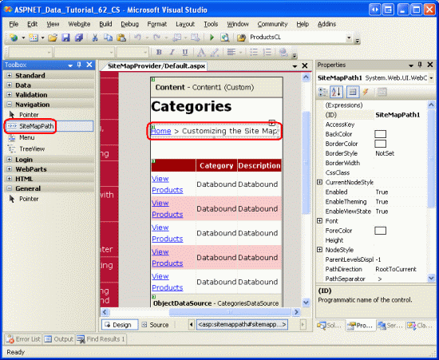](building-a-custom-database-driven-site-map-provider-vb/_static/image18.gif)

**Figure 16**: Add a SiteMapPath to `Default.aspx` ([Click to view full-size image](building-a-custom-database-driven-site-map-provider-vb/_static/image20.gif))

The SiteMapPath control displays a breadcrumb, indicating the current page s location within the site map. We added a SiteMapPath to the top of the master page back in the *Master Pages and Site Navigation* tutorial.

Take a moment to view this page through a browser. The SiteMapPath added in Figure 16 uses the default site map provider, pulling its data from `Web.sitemap`. Therefore, the breadcrumb shows Home &gt; Customizing the Site Map , just like the breadcrumb in the upper-right corner.

[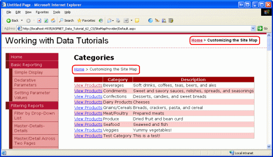](building-a-custom-database-driven-site-map-provider-vb/_static/image21.gif)

**Figure 17**: The Breadcrumb Uses the Default Site Map Provider ([Click to view full-size image](building-a-custom-database-driven-site-map-provider-vb/_static/image23.gif))

To have the SiteMapPath added in Figure 16 use the custom site map provider we created in Step 6, set its [`SiteMapProvider` property](https://msdn.microsoft.com/en-us/library/system.web.ui.webcontrols.sitemappath.sitemapprovider.aspx) to Northwind , the name we assigned to the `NorthwindSiteMapProvider` in `Web.config`. Unfortunately, the Designer continues to use the default site map provider, but if you visit the page through a browser after making this property change you'll see that the breadcrumb now uses the custom site map provider.

[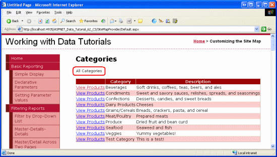](building-a-custom-database-driven-site-map-provider-vb/_static/image24.gif)

**Figure 18**: The Breadcrumb Now Uses the Custom Site Map Provider `NorthwindSiteMapProvider` ([Click to view full-size image](building-a-custom-database-driven-site-map-provider-vb/_static/image26.gif))

The SiteMapPath control displays a more functional user interface in the `ProductsByCategory.aspx` and `ProductDetails.aspx` pages. Add a SiteMapPath to these pages, setting the `SiteMapProvider` property in both to Northwind . From `Default.aspx` click on the View Products link for Beverages, and then on the View Details link for Chai Tea. As Figure 19 shows, the breadcrumb includes the current site map section ( Chai Tea ) and its ancestors: Beverages and All Categories .

[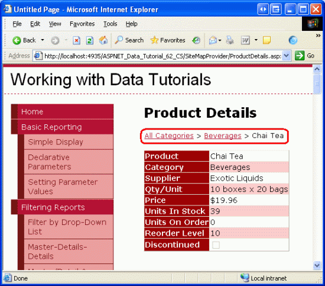](building-a-custom-database-driven-site-map-provider-vb/_static/image21.png)

**Figure 19**: The Breadcrumb Now Uses the Custom Site Map Provider `NorthwindSiteMapProvider` ([Click to view full-size image](building-a-custom-database-driven-site-map-provider-vb/_static/image22.png))

Other navigation user interface elements can be used in addition to the SiteMapPath, such as the Menu and TreeView controls. The `Default.aspx`, `ProductsByCategory.aspx`, and `ProductDetails.aspx` pages in the download for this tutorial, for example, all include Menu controls (see Figure 20). See [Examining ASP.NET 2.0 s Site Navigation Features](http://aspnet.4guysfromrolla.com/articles/111605-1.aspx) and the [Using Site Navigation Controls](https://quickstarts.asp.net/QuickStartv20/aspnet/doc/navigation/sitenavcontrols.aspx) section of the [ASP.NET 2.0 QuickStarts](https://quickstarts.asp.net/QuickStartv20/aspnet/) for a more in-depth look at the navigation controls and site map system in ASP.NET 2.0.

[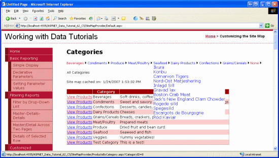](building-a-custom-database-driven-site-map-provider-vb/_static/image28.gif)

**Figure 20**: The Menu Control Lists Each of the Categories and Products ([Click to view full-size image](building-a-custom-database-driven-site-map-provider-vb/_static/image30.gif))

As mentioned earlier in this tutorial, the site map structure can be accessed programmatically through the `SiteMap` class. The following code returns the root `SiteMapNode` of the default provider:

    Dim root As SiteMapNode = SiteMap.RootNode

Since the `AspNetXmlSiteMapProvider` is the default provider for our application, the above code would return the root node defined in `Web.sitemap`. To reference a site map provider other than the default, use the `SiteMap` class s [`Providers` property](https://msdn.microsoft.com/en-us/library/system.web.sitemap.providers.aspx) like so:

    Dim root As SiteMapNode = SiteMap.Providers("name").RootNode

Where *name* is the name of the custom site map provider ( Northwind , for our web application).

To access a member specific to a site map provider, use `SiteMap.Providers["name"]` to retrieve the provider instance and then cast it to the appropriate type. For example, to display the `NorthwindSiteMapProvider` s `CachedDate` property in an ASP.NET page, use the following code:

    Dim customProvider As NorthwindSiteMapProvider = _
        TryCast(SiteMap.Providers("Northwind"), NorthwindSiteMapProvider)
    If customProvider IsNot Nothing Then
        Dim lastCachedDate As Nullable(Of DateTime) = customProvider.CachedDate
        If lastCachedDate.HasValue Then
            SiteMapLastCachedDate.Text = _
                "Site map cached on: " & lastCachedDate.Value.ToString()
        Else
            SiteMapLastCachedDate.Text = "The site map is being reconstructed!"
        End If
    End If

> [!NOTE] Be sure to test out the SQL cache dependency feature. After visiting the `Default.aspx`, `ProductsByCategory.aspx`, and `ProductDetails.aspx` pages, go to one of the tutorials in the Editing, Inserting, and Deleting section and edit the name of a category or product. Then return to one of the pages in the `SiteMapProvider` folder. Assuming enough time has passed for the polling mechanism to note the change to the underlying database, the site map should be updated to show the new product or category name.

## Summary

ASP.NET 2.0 s site map features includes a `SiteMap` class, a number of built-in navigation Web controls, and a default site map provider that expects the site map information persisted to an XML file. In order to use site map information from some other source such as from a database, the application s architecture, or a remote Web service we need to create a custom site map provider. This involves creating a class that derives, directly or indirectly, from the `SiteMapProvider` class.

In this tutorial we saw how to create a custom site map provider that based the site map on the product and category information culled from the application architecture. Our provider extended the `StaticSiteMapProvider` class and entailed creating a `BuildSiteMap` method that retrieved the data, constructed the site map hierarchy, and cached the resulting structure in a class-level variable. We used a SQL cache dependency with a callback function to invalidate the cached structure when the underlying `Categories` or `Products` data is modified.

Happy Programming!

## Further Reading

For more information on the topics discussed in this tutorial, refer to the following resources:

- [Storing Site Maps in SQL Server](https://msdn.microsoft.com/msdnmag/issues/05/06/WickedCode/) and [The SQL Site Map Provider You ve Been Waiting For](https://msdn.microsoft.com/msdnmag/issues/06/02/wickedcode/default.aspx)
- [A Look at ASP.NET 2.0 s Provider Model](http://aspnet.4guysfromrolla.com/articles/101905-1.aspx)
- [The Provider Toolkit](https://msdn.microsoft.com/en-us/asp.net/aa336558.aspx)
- [Examining ASP.NET 2.0 s Site Navigation Features](http://aspnet.4guysfromrolla.com/articles/111605-1.aspx)

## About the Author

[Scott Mitchell](http://www.4guysfromrolla.com/ScottMitchell.shtml), author of seven ASP/ASP.NET books and founder of [4GuysFromRolla.com](http://www.4guysfromrolla.com), has been working with Microsoft Web technologies since 1998. Scott works as an independent consultant, trainer, and writer. His latest book is [*Sams Teach Yourself ASP.NET 2.0 in 24 Hours*](https://www.amazon.com/exec/obidos/ASIN/0672327384/4guysfromrollaco). He can be reached at [mitchell@4GuysFromRolla.com.](mailto:mitchell@4GuysFromRolla.com) or via his blog, which can be found at [http://ScottOnWriting.NET](http://ScottOnWriting.NET).

## Special Thanks To

This tutorial series was reviewed by many helpful reviewers. Lead reviewers for this tutorial were Dave Gardner, Zack Jones, Teresa Murphy, and Bernadette Leigh. Interested in reviewing my upcoming MSDN articles? If so, drop me a line at [mitchell@4GuysFromRolla.com.](mailto:mitchell@4GuysFromRolla.com)

>[!div class="step-by-step"] [Previous](building-a-custom-database-driven-site-map-provider-cs.md)