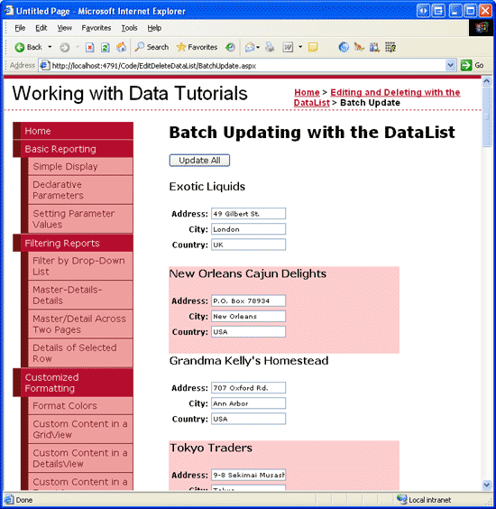
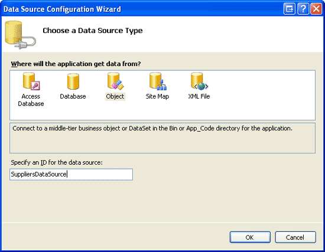
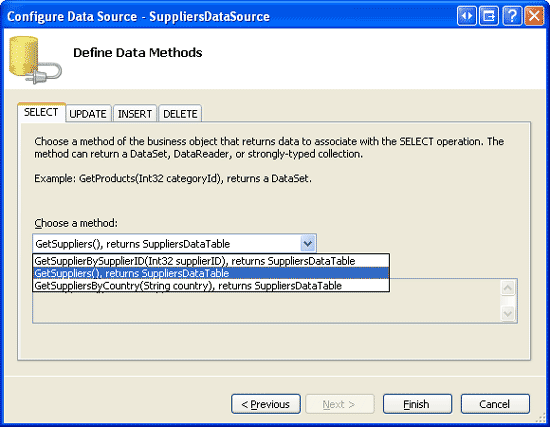
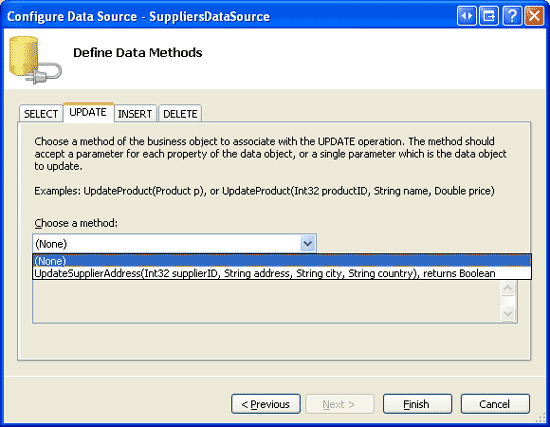
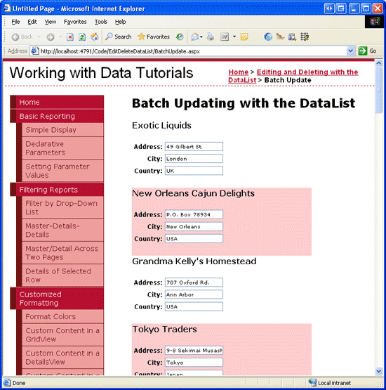
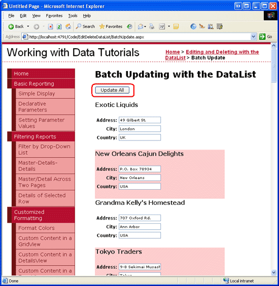

Performing Batch Updates (VB)
====================
by [Scott Mitchell](https://twitter.com/ScottOnWriting)

[Download Sample App](http://download.microsoft.com/download/9/c/1/9c1d03ee-29ba-4d58-aa1a-f201dcc822ea/ASPNET_Data_Tutorial_37_VB.exe) or [Download PDF](performing-batch-updates-vb/_static/datatutorial37vb1.pdf)

> Learn how to create a fully-editable DataList where all of its items are in edit mode and whose values can be saved by clicking an "Update All" button on the page.

## Introduction

In the [preceding tutorial](an-overview-of-editing-and-deleting-data-in-the-datalist-vb.md) we examined how to create an item-level DataList. Like the standard editable GridView, each item in the DataList included an Edit button that, when clicked, would make the item editable. While this item-level editing works well for data that is only updated occasionally, certain use case scenarios require the user to edit many records. If a user needs to edit dozens of records and is forced to click Edit, make their changes, and click Update for each one, the amount of clicking can hamper her productivity. In such situations, a better option is to provide a fully-editable DataList, one where *all* of its items are in edit mode and whose values can be edited by clicking an Update All button on the page (see Figure 1).

**Figure 1**: Each Item in a Fully Editable DataList can be Modified ([Click to view full-size image](performing-batch-updates-vb/_static/image3.png))

In this tutorial we'll examine how to enable users to update suppliers address information using a fully editable DataList.

## Step 1: Create the Editable User Interface in the DataList s ItemTemplate

In the preceding tutorial, where we creating a standard, item-level editable DataList, we used two templates:

- `ItemTemplate` contained the read-only user interface (the Label Web controls for displaying each product s name and price).
- `EditItemTemplate` contained the edit mode user interface (the two TextBox Web controls).

The DataList s `EditItemIndex` property dictates what `DataListItem` (if any) is rendered using the `EditItemTemplate`. In particular, the `DataListItem` whose `ItemIndex` value matches the DataList s `EditItemIndex` property is rendered using the `EditItemTemplate`. This model works well when only one item can be edited at a time, but falls apart when creating a fully-editable DataList.

For a fully editable DataList, we want *all* of the `DataListItem` s to render using the editable interface. The simplest way to accomplish this is to define the editable interface in the `ItemTemplate`. For modifying the suppliers address information, the editable interface contains the supplier name as text and then TextBoxes for the address, city, and country values.

Start by opening the `BatchUpdate.aspx` page, add a DataList control, and set its `ID` property to `Suppliers`. From the DataList s smart tag, opt to add a new ObjectDataSource control named `SuppliersDataSource`.

**Figure 2**: Create a New ObjectDataSource Named `SuppliersDataSource` ([Click to view full-size image](performing-batch-updates-vb/_static/image6.png))

Configure the ObjectDataSource to retrieve data using the `SuppliersBLL` class s `GetSuppliers()` method (see Figure 3). As with the preceding tutorial, rather than updating the supplier information through the ObjectDataSource, we'll work directly with the Business Logic Layer. Therefore, set the drop-down list to (None) in the UPDATE tab (see Figure 4).

**Figure 3**: Retrieve Supplier Information Using the `GetSuppliers()` Method ([Click to view full-size image](performing-batch-updates-vb/_static/image9.png))

**Figure 4**: Set the Drop-Down List to (None) in the UPDATE Tab ([Click to view full-size image](performing-batch-updates-vb/_static/image12.png))

After completing the wizard, Visual Studio automatically generates the DataList s `ItemTemplate` to display each data field returned by the data source in a Label Web control. We need to modify this template so that it provides the editing interface instead. The `ItemTemplate` can be customized through the Designer using the Edit Templates option from the DataList s smart tag or directly through the declarative syntax.

Take a moment to create an editing interface that displays the supplier s name as text, but includes TextBoxes for the supplier s address, city, and country values. After making these changes, your page s declarative syntax should look similar to the following:

    <asp:DataList ID="Suppliers" runat="server" DataKeyField="SupplierID"
        DataSourceID="SuppliersDataSource">
        <ItemTemplate>
            <h4><asp:Label ID="CompanyNameLabel" runat="server"
                Text='<%# Eval("CompanyName") %>' /></h4>
            <table border="0">
                <tr>
                    <td class="SupplierPropertyLabel">Address:</td>
                    <td class="SupplierPropertyValue">
                        <asp:TextBox ID="Address" runat="server"
                            Text='<%# Eval("Address") %>' />
                    </td>
                </tr>
                <tr>
                    <td class="SupplierPropertyLabel">City:</td>
                    <td class="SupplierPropertyValue">
                        <asp:TextBox ID="City" runat="server"
                            Text='<%# Eval("City") %>' />
                    </td>
                </tr>
                <tr>
                    <td class="SupplierPropertyLabel">Country:</td>
                    <td class="SupplierPropertyValue">
                        <asp:TextBox ID="Country" runat="server"
                            Text='<%# Eval("Country") %>' />
                    </td>
                </tr>
            </table>
             
        </ItemTemplate>
    </asp:DataList>
    <asp:ObjectDataSource ID="SuppliersDataSource" runat="server"
        OldValuesParameterFormatString="original_{0}"
        SelectMethod="GetSuppliers" TypeName="SuppliersBLL">
    </asp:ObjectDataSource>

> [!NOTE] As with the preceding tutorial, the DataList in this tutorial must have its view state enabled.

In the `ItemTemplate` I m using two new CSS classes, `SupplierPropertyLabel` and `SupplierPropertyValue`, which have been added to the `Styles.css` class and configured to use the same style settings as the `ProductPropertyLabel` and `ProductPropertyValue` CSS classes.

    .ProductPropertyLabel, .SupplierPropertyLabel
    {
        font-weight: bold;
        text-align: right;
    }
    .ProductPropertyValue, .SupplierPropertyValue
    {
        padding-right: 35px;
    }

After making these changes, visit this page through a browser. As Figure 5 shows, each DataList item displays the supplier name as text and uses TextBoxes to display the address, city, and country.

**Figure 5**: Each Supplier in the DataList is Editable ([Click to view full-size image](performing-batch-updates-vb/_static/image15.png))

## Step 2: Adding an Update All Button

While each supplier in Figure 5 has its address, city, and country fields displayed in a TextBox, there currently is no Update button available. Rather than having an Update button per item, with fully editable DataLists there is typically a single Update All button on the page that, when clicked, updates *all* of the records in the DataList. For this tutorial, let s add two Update All buttons - one at the top of the page and one at the bottom (although clicking either button will have the same effect).

Start by adding a Button Web control above the DataList and set its `ID` property to `UpdateAll1`. Next, add the second Button Web control beneath the DataList, setting its `ID` to `UpdateAll2`. Set the `Text` properties for the two Buttons to Update All . Lastly, create event handlers for both Buttons `Click` events. Rather than duplicating the update logic in each of the event handlers, let s refactor that logic to a third method, `UpdateAllSupplierAddresses`, having the event handlers simply invoking this third method.

    Protected Sub UpdateAll1_Click(sender As Object, e As EventArgs) _
        Handles UpdateAll1.Click
        UpdateAllSupplierAddresses()
    End Sub
    Protected Sub UpdateAll2_Click(sender As Object, e As EventArgs) _
        Handles UpdateAll2.Click
        UpdateAllSupplierAddresses()
    End Sub
    Private Sub UpdateAllSupplierAddresses()
        ' TODO: Write code to update _all_ of the supplier addresses in the DataList
    End Sub

Figure 6 shows the page after the Update All buttons have been added.

**Figure 6**: Two Update All Buttons have been Added to the Page ([Click to view full-size image](performing-batch-updates-vb/_static/image18.png))

## Step 3: Updating All of the Suppliers Address Information

With all of the DataList s items displaying the editing interface and with the addition of the Update All buttons, all that remains is writing the code to perform the batch update. Specifically, we need to loop through the DataList s items and call the `SuppliersBLL` class s `UpdateSupplierAddress` method for each one.

The collection of `DataListItem` instances that makeup the DataList can be accessed via the DataList s [`Items` property](https://msdn.microsoft.com/en-us/library/system.web.ui.webcontrols.datalist.items.aspx). With a reference to a `DataListItem`, we can grab the corresponding `SupplierID` from the `DataKeys` collection and programmatically reference the TextBox Web controls within the `ItemTemplate` as the following code illustrates:

    Private Sub UpdateAllSupplierAddresses()
        ' Create an instance of the SuppliersBLL class
        Dim suppliersAPI As New SuppliersBLL()
        ' Iterate through the DataList's items
        For Each item As DataListItem In Suppliers.Items
            ' Get the supplierID from the DataKeys collection
            Dim supplierID As Integer = Convert.ToInt32(Suppliers.DataKeys(item.ItemIndex))
            ' Read in the user-entered values
            Dim address As TextBox = CType(item.FindControl("Address"), TextBox)
            Dim city As TextBox = CType(item.FindControl("City"), TextBox)
            Dim country As TextBox = CType(item.FindControl("Country"), TextBox)
            Dim addressValue As String = Nothing, _
                cityValue As String = Nothing, _
                countryValue As String = Nothing
            If address.Text.Trim().Length > 0 Then
                addressValue = address.Text.Trim()
            End If
            If city.Text.Trim().Length > 0 Then
                cityValue = city.Text.Trim()
            End If
            If country.Text.Trim().Length > 0 Then
                countryValue = country.Text.Trim()
            End If
            ' Call the SuppliersBLL class's UpdateSupplierAddress method
            suppliersAPI.UpdateSupplierAddress _
                (supplierID, addressValue, cityValue, countryValue)
        Next
    End Sub

When the user clicks one of the Update All buttons, the `UpdateAllSupplierAddresses` method iterates through each `DataListItem` in the `Suppliers` DataList and calls the `SuppliersBLL` class s `UpdateSupplierAddress` method, passing in the corresponding values. A non-entered value for address, city, or country passes is a value of `Nothing` to `UpdateSupplierAddress` (rather than a blank string), which results in a database `NULL` for the underlying record s fields.

> [!NOTE] As an enhancement, you may want to add a status Label Web control to the page that provides some confirmation message after the batch update is performed.

## Updating Only Those Addresses That Have Been Modified

The batch update algorithm used for this tutorial calls the `UpdateSupplierAddress` method for *every* supplier in the DataList, regardless of whether their address information has been changed. While such blind updates aren t usually a performance issue, they can lead to superfluous records if you re auditing changes to the database table. For example, if you use triggers to record all `UPDATE` s to the `Suppliers` table to an auditing table, every time a user clicks the Update All button a new audit record will be created for each supplier in the system, regardless of whether the user made any changes.

The ADO.NET DataTable and DataAdapter classes are designed to support batch updates where only modified, deleted, and new records results in any database communication. Each row in the DataTable has a [`RowState` property](https://msdn.microsoft.com/en-us/library/system.data.datarow.rowstate.aspx) that indicates whether the row has been added to the DataTable, deleted from it, modified, or remains unchanged. When a DataTable is initially populated, all rows are marked unchanged. Changing the value of any of the row s columns marks the row as modified.

In the `SuppliersBLL` class we update the specified supplier s address information by first reading in the single supplier record into a `SuppliersDataTable` and then set the `Address`, `City`, and `Country` column values using the following code:

    Public Function UpdateSupplierAddress _
        (supplierID As Integer, address As String, city As String, country As String) _
        As Boolean
        Dim suppliers As Northwind.SuppliersDataTable = _
            Adapter.GetSupplierBySupplierID(supplierID)
        If suppliers.Count = 0 Then
            ' no matching record found, return false
            Return False
        Else
            Dim supplier As Northwind.SuppliersRow = suppliers(0)
            If address Is Nothing Then
                supplier.SetAddressNull()
            Else
                supplier.Address = address
            End If
            If city Is Nothing Then
                supplier.SetCityNull()
            Else
                supplier.City = city
            End If
            If country Is Nothing Then
                supplier.SetCountryNull()
            Else
                supplier.Country = country
            End If
            ' Update the supplier Address-related information
            Dim rowsAffected As Integer = Adapter.Update(supplier)
            ' Return true if precisely one row was updated, otherwise false
            Return rowsAffected = 1
        End If
    End Function

This code naively assigns the passed-in address, city, and country values to the `SuppliersRow` in the `SuppliersDataTable` regardless of whether or not the values have changed. These modifications cause the `SuppliersRow` s `RowState` property to be marked as modified. When the Data Access Layer s `Update` method is called, it sees that the `SupplierRow` has been modified and therefore sends an `UPDATE` command to the database.

Imagine, however, that we added code to this method to only assign the passed-in address, city, and country values if they differ from the `SuppliersRow` s existing values. In the case where the address, city, and country are the same as the existing data, no changes will be made and the `SupplierRow` s `RowState` will be left marked as unchanged. The net result is that when the DAL s `Update` method is called, no database call will be made because the `SuppliersRow` has not been modified.

To enact this change, replace the statements that blindly assign the passed-in address, city, and country values with the following code:

    ' Only assign the values to the SupplierRow's column values if they differ
    If address Is Nothing AndAlso Not supplier.IsAddressNull() Then
        supplier.SetAddressNull()
    ElseIf (address IsNot Nothing AndAlso supplier.IsAddressNull) _
        OrElse (Not supplier.IsAddressNull() AndAlso _
                    String.Compare(supplier.Address, address) <> 0) Then
        supplier.Address = address
    End If
    If city Is Nothing AndAlso Not supplier.IsCityNull() Then
        supplier.SetCityNull()
    ElseIf (city IsNot Nothing AndAlso supplier.IsCityNull) _
        OrElse (Not supplier.IsCityNull() AndAlso _
                    String.Compare(supplier.City, city) <> 0) Then
        supplier.City = city
    End If
    If country Is Nothing AndAlso Not supplier.IsCountryNull() Then
        supplier.SetCountryNull()
    ElseIf (country IsNot Nothing AndAlso supplier.IsCountryNull) _
        OrElse (Not supplier.IsCountryNull() AndAlso _
                    String.Compare(supplier.Country, country) <> 0) Then
        supplier.Country = country
    End If

With this added code, the DAL s `Update` method sends an `UPDATE` statement to the database for only those records whose address-related values have changed.

Alternatively, we could keep track of whether there are any differences between the passed-in address fields and the database data and, if there are none, simply bypass the call to the DAL s `Update` method. This approach works well if you re using the DB direct method, since the DB direct method isn t passed a `SuppliersRow` instance whose `RowState` can be checked to determine whether a database call is actually needed.

> [!NOTE] Each time the `UpdateSupplierAddress` method is invoked, a call is made to the database to retrieve information about the updated record. Then, if there are any changes in data, another call to the database is made to update the table row. This workflow could be optimized by creating an `UpdateSupplierAddress` method overload that accepts an `EmployeesDataTable` instance that has *all* of the changes from the `BatchUpdate.aspx` page. Then, it could make one call to the database to get all of the records from the `Suppliers` table. The two resultsets could then be enumerated and only those records where changes have occurred could be updated.

## Summary

In this tutorial we saw how to create a fully editable DataList, allowing a user to quickly modify the address information for multiple suppliers. We started by defining the editing interface a TextBox Web control for the supplier s address, city, and country values in the DataList s `ItemTemplate`. Next, we added Update All buttons above and below the DataList. After a user has made his changes and clicked one of the Update All buttons, the `DataListItem` s are enumerated and a call to the `SuppliersBLL` class s `UpdateSupplierAddress` method is made.

Happy Programming!

## About the Author

[Scott Mitchell](http://www.4guysfromrolla.com/ScottMitchell.shtml), author of seven ASP/ASP.NET books and founder of [4GuysFromRolla.com](http://www.4guysfromrolla.com), has been working with Microsoft Web technologies since 1998. Scott works as an independent consultant, trainer, and writer. His latest book is [*Sams Teach Yourself ASP.NET 2.0 in 24 Hours*](https://www.amazon.com/exec/obidos/ASIN/0672327384/4guysfromrollaco). He can be reached at [mitchell@4GuysFromRolla.com.](mailto:mitchell@4GuysFromRolla.com) or via his blog, which can be found at [http://ScottOnWriting.NET](http://ScottOnWriting.NET).

## Special Thanks To

This tutorial series was reviewed by many helpful reviewers. Lead reviewers for this tutorial were Zack Jones and Ken Pespisa. Interested in reviewing my upcoming MSDN articles? If so, drop me a line at [mitchell@4GuysFromRolla.com.](mailto:mitchell@4GuysFromRolla.com)

>[!div class="step-by-step"] [Previous](an-overview-of-editing-and-deleting-data-in-the-datalist-vb.md) [Next](handling-bll-and-dal-level-exceptions-vb.md)