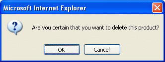
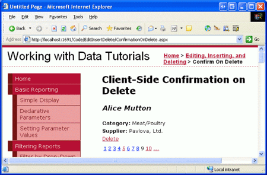
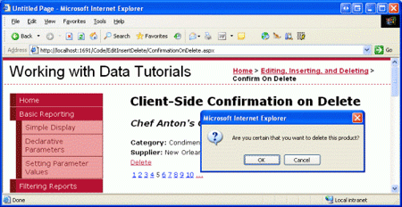
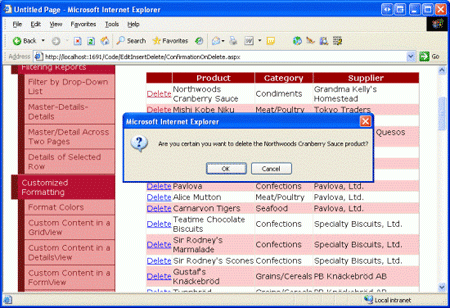

[Edit .md file](C:\Projects\msc\dev\Msc.Www\Web.ASP\App_Data\github\web-forms\overview\data-access\editing-inserting-and-deleting-data\adding-client-side-confirmation-when-deleting-cs.md) | [Edit dev content](http://www.aspdev.net/umbraco#/content/content/edit/25046) | [View dev content](http://docs.aspdev.net/tutorials/web-forms/overview/data-access/editing-inserting-and-deleting-data/adding-client-side-confirmation-when-deleting-cs.html) | [View prod content](http://www.asp.net/web-forms/overview/data-access/editing-inserting-and-deleting-data/adding-client-side-confirmation-when-deleting-cs) | Picker: 33284

Adding Client-Side Confirmation When Deleting (C#)
====================
by [Scott Mitchell](https://twitter.com/ScottOnWriting)

[Download Sample App](http://download.microsoft.com/download/9/c/1/9c1d03ee-29ba-4d58-aa1a-f201dcc822ea/ASPNET_Data_Tutorial_22_CS.exe) or [Download PDF](adding-client-side-confirmation-when-deleting-cs/_static/datatutorial22cs1.pdf)

> In the interfaces we've created so far, a user can accidentally delete data by clicking the Delete button when they meant to click the Edit button. In this tutorial we'll add a client-side confirmation dialog box that appears when the Delete button is clicked.

## Introduction

Over the past several tutorials we ve seen how to use our application architecture, ObjectDataSource, and the data Web controls in concert to provide inserting, editing, and deleting capabilities. The deleting interfaces we ve examined thus far have been composed of a Delete button that, when clicked, causes a postback and invokes the ObjectDataSource s `Delete()` method. The `Delete()` method then invokes the configured method from the Business Logic Layer, which propagates the call down to the Data Access Layer, issuing the actual `DELETE` statement to the database.

While this user interface enables visitors to delete records through the GridView, DetailsView, or FormView controls, it lacks any sort of confirmation when the user clicks the Delete button. If a user accidentally clicks the Delete button when they meant to click Edit, the record they meant to update will instead be deleted. To help prevent this, in this tutorial we'll add a client-side confirmation dialog box that appears when the Delete button is clicked.

The JavaScript `confirm(string)` function displays its string input parameter as the text inside a modal dialog box that comes equipped with two buttons - OK and Cancel (see Figure 1). The `confirm(string)` function returns a Boolean value depending on what button is clicked (`true`, if the user clicks OK, and `false` if they click Cancel).

**Figure 1**: The JavaScript `confirm(string)` Method Displays a Modal, Client-Side Messagebox

During a form submission, if a value of `false` is returned from a client-side event handler then the form submission is cancelled. Using this feature, we can have the Delete button s client-side `onclick` event handler return the value of a call to `confirm("Are you sure you want to delete this product?")`. If the user clicks Cancel, `confirm(string)` will return false, thereby causing the form submission to cancel. With no postback, the product whose Delete button was clicked won t be deleted. If, however, the user clicks OK in the confirmation dialog box, the postback will continue unabated and the product will be deleted. Consult [Using JavaScript s `confirm()` Method to Control Form Submission](http://www.webreference.com/programming/javascript/confirm/) for more information on this technique.

Adding the necessary client-side script differs slightly if using templates than when using a CommandField. Therefore, in this tutorial we will look at both a FormView and GridView example.

> [!NOTE] Using client-side confirmation techniques, like the ones discussed in this tutorial, assumes that your users are visiting with browsers that support JavaScript and that they have JavaScript enabled. If either of these assumptions are not true for a particular user, clicking the Delete button will immediately cause a postback (not displaying a confirm messagebox).

## Step 1: Creating a FormView That Supports Deletion

Start by adding a FormView to the `ConfirmationOnDelete.aspx` page in the `EditInsertDelete` folder, binding it to a new ObjectDataSource that pulls back the product information via the `ProductsBLL` class s `GetProducts()` method. Also configure the ObjectDataSource so that the `ProductsBLL` class s `DeleteProduct(productID)` method is mapped to the ObjectDataSource s `Delete()` method; ensure that the INSERT and UPDATE tabs drop-down lists are set to (None). Finally, check the Enable Paging checkbox in the FormView s smart tag.

After these steps, the new ObjectDataSource s declarative markup will look like the following:

    <asp:ObjectDataSource ID="ObjectDataSource1" runat="server"
        DeleteMethod="DeleteProduct" OldValuesParameterFormatString="original_{0}"
        SelectMethod="GetProducts" TypeName="ProductsBLL">
        <DeleteParameters>
            <asp:Parameter Name="productID" Type="Int32" />
        </DeleteParameters>
    </asp:ObjectDataSource>

As in our past examples that did not use optimistic concurrency, take a moment to clear out the ObjectDataSource s `OldValuesParameterFormatString` property.

Since it has been bound to an ObjectDataSource control that only supports deleting, the FormView s `ItemTemplate` offers only the Delete button, lacking the New and Update buttons. The FormView s declarative markup, however, includes a superfluous `EditItemTemplate` and `InsertItemTemplate`, which can be removed. Take a moment to customize the `ItemTemplate` so that is shows only a subset of the product data fields. I ve configured mine to show the product s name in an `<h3>` heading above its supplier and category names (along with the Delete button).

    <asp:FormView ID="FormView1" AllowPaging="True" DataKeyNames="ProductID"
        DataSourceID="ObjectDataSource1" runat="server">
        <ItemTemplate>
            <h3><i><%# Eval("ProductName") %></i></h3>
            <b>Category:</b>
            <asp:Label ID="CategoryNameLabel" runat="server"
                Text='<%# Eval("CategoryName") %>'>
            </asp:Label> 
            <b>Supplier:</b>
            <asp:Label ID="SupplierNameLabel" runat="server"
                Text='<%# Eval("SupplierName") %>'>
            </asp:Label> 
            <asp:LinkButton ID="DeleteButton" runat="server" CausesValidation="False"
                CommandName="Delete" Text="Delete">
            </asp:LinkButton>
        </ItemTemplate>
    </asp:FormView>

With these changes, we have a fully functional web page that allows a user to toggle through the products one at a time, with the ability to delete a product by simply clicking the Delete button. Figure 2 shows a screen shot of our progress thus far when viewed through a browser.

**Figure 2**: The FormView Shows Information About a Single Product ([Click to view full-size image](adding-client-side-confirmation-when-deleting-cs/_static/image4.png))

## Step 2: Calling the confirm(string) Function from the Delete Buttons Client-Side onclick Event

With the FormView created, the final step is to configure the Delete button such that when it s clicked by the visitor, the JavaScript `confirm(string)` function is invoked. Adding client-side script to a Button, LinkButton, or ImageButton s client-side `onclick` event can be accomplished through the use of the `OnClientClick property`, which is new to ASP.NET 2.0. Since we want to have the value of the `confirm(string)` function returned, simply set this property to: `return confirm('Are you certain that you want to delete this product?');`

After this change the Delete LinkButton s declarative syntax should look something like:

    <asp:LinkButton ID="DeleteButton" runat="server" CausesValidation="False"
        CommandName="Delete" Text="Delete"
        OnClientClick="return confirm('Are you certain you want to delete this product?');">
    </asp:LinkButton>

That s all there is to it! Figure 3 shows a screen shot of this confirmation in action. Clicking the Delete button brings up the confirm dialog box. If the user clicks Cancel, the postback is cancelled and the product is not deleted. If, however, the user clicks OK, the postback continues and the ObjectDataSource s `Delete()` method is invoked, culminating in the database record being deleted.

> [!NOTE] The string passed into the `confirm(string)` JavaScript function is delimited with apostrophes (rather than quotation marks). In JavaScript, strings can be delimited using either character. We use apostrophes here so that the delimiters for the string passed into `confirm(string)` do not introduce an ambiguity with the delimiters used for the `OnClientClick` property value.

**Figure 3**: A Confirmation is Now Displayed When Clicking the Delete Button ([Click to view full-size image](adding-client-side-confirmation-when-deleting-cs/_static/image7.png))

## Step 3: Configuring the OnClientClick Property for the Delete Button in a CommandField

When working with a Button, LinkButton, or ImageButton directly in a template, a confirmation dialog box can be associated with it by simply configuring its `OnClientClick` property to return the results of the JavaScript `confirm(string)` function. However, the CommandField - which adds a field of Delete buttons to a GridView or DetailsView - does not have an `OnClientClick` property that can be set declaratively. Instead, we must programmatically reference the Delete button in the GridView or DetailsView s appropriate `DataBound` event handler, and then set its `OnClientClick` property there.

> [!NOTE] When setting the Delete button s `OnClientClick` property in the appropriate `DataBound` event handler, we have access to the data was bound to the current record. This means we can extend the confirmation message to include details about the particular record, such as, "Are you sure you want to delete the Chai product?" Such customization is also possible in templates using databinding syntax.

To practice setting the `OnClientClick` property for the Delete button(s) in a CommandField, let s add a GridView to the page. Configure this GridView to use the same ObjectDataSource control that the FormView uses. Also limit the GridView s BoundFields to only include the product s name, category, and supplier. Lastly, check the Enable Deleting checkbox from the GridView s smart tag. This will add a CommandField to the GridView s `Columns` collection with its `ShowDeleteButton` property set to `true`.

After making these changes, your GridView s declarative markup should look like the following:

    <asp:GridView ID="GridView1" runat="server" AutoGenerateColumns="False"
        DataKeyNames="ProductID" DataSourceID="ObjectDataSource1">
        <Columns>
            <asp:CommandField ShowDeleteButton="True" />
            <asp:BoundField DataField="ProductName" HeaderText="Product"
                SortExpression="ProductName" />
            <asp:BoundField DataField="CategoryName" HeaderText="Category" ReadOnly="True"
                SortExpression="CategoryName" />
            <asp:BoundField DataField="SupplierName" HeaderText="Supplier" ReadOnly="True"
                SortExpression="SupplierName" />
        </Columns>
    </asp:GridView>

The CommandField contains a single Delete LinkButton instance that can be accessed programmatically from the GridView s `RowDataBound` event handler. Once referenced, we can set its `OnClientClick` property accordingly. Create an event handler for the `RowDataBound` event using the following code:

    protected void GridView1_RowDataBound(object sender, GridViewRowEventArgs e)
    {
        if (e.Row.RowType == DataControlRowType.DataRow)
        {
            // reference the Delete LinkButton
            LinkButton db = (LinkButton)e.Row.Cells[0].Controls[0];
    
            // Get information about the product bound to the row
            Northwind.ProductsRow product =
                (Northwind.ProductsRow) ((System.Data.DataRowView) e.Row.DataItem).Row;
    
            db.OnClientClick = string.Format(
                "return confirm('Are you certain you want to delete the {0} product?');",
                product.ProductName.Replace("'", @"\'"));
        }
    }

This event handler works with data rows (those that will have the Delete button) and begins by programmatically referencing the Delete button. In general use the following pattern:

    ButtonType obj = (ButtonType) e.Row.Cells[commandFieldIndex].Controls[controlIndex];

*ButtonType* is the type of button being used by the CommandField - Button, LinkButton, or ImageButton. By default, the CommandField uses LinkButtons, but this can be customized via the CommandField s `ButtonType property`. The *commandFieldIndex* is the ordinal index of the CommandField within the GridView s `Columns` collection, whereas the *controlIndex* is the index of the Delete button within the CommandField s `Controls` collection. The *controlIndex* value depends on the button s position relative to other buttons in the CommandField. For example, if the only button displayed in the CommandField is the Delete button, use an index of 0. If, however, there s an Edit button that precedes the Delete button, use an index of 2. The reason an index of 2 is used is because two controls are added by the CommandField before the Delete button: the Edit button and a LiteralControl that s used to add some space between the Edit and Delete buttons.

For our particular example, the CommandField uses LinkButtons and, being the left-most field, has a *commandFieldIndex* of 0. Since there are no other buttons but the Delete button in the CommandField, we use a *controlIndex* of 0.

After referencing the Delete button in the CommandField, we next grab information about the product bound to the current GridView row. Finally, we set the Delete button s `OnClientClick` property to the appropriate JavaScript, which includes the product s name. Since the JavaScript string passed into the `confirm(string)` function is delimited using apostrophes we must escape any apostrophes that appear within the product s name. In particular, any apostrophes in the product s name are escaped with "`\'`".

With these changes complete, clicking on a Delete button in the GridView displays a customized confirmation dialog box (see Figure 4). As with the confirmation messagebox from the FormView, if the user clicks Cancel the postback is cancelled, thereby preventing the deletion from occurring.

> [!NOTE] This technique can also be used to programmatically access the Delete button in the CommandField in a DetailsView. For the DetailsView, however, you d create an event handler for the `DataBound` event, since the DetailsView does not have a `RowDataBound` event.

**Figure 4**: Clicking the GridView s Delete Button Displays a Customized Confirmation Dialog Box ([Click to view full-size image](adding-client-side-confirmation-when-deleting-cs/_static/image10.png))

## Using TemplateFields

One of the disadvantages of the CommandField is that its buttons must be accessed through indexing and that the resulting object must be cast to the appropriate button type (Button, LinkButton, or ImageButton). Using "magic numbers" and hard-coded types invites problems that cannot be discovered until runtime. For example, if you, or another developer, adds new buttons to the CommandField at some point in the future (such as an Edit button) or changes the `ButtonType` property, the existing code will still compile without error, but visiting the page may cause an exception or unexpected behavior, depending on how your code was written and what changes were made.

An alternative approach is to convert the GridView and DetailsView s CommandFields into TemplateFields. This will generate a TemplateField with an `ItemTemplate` that has a LinkButton (or Button or ImageButton) for each button in the CommandField. These buttons `OnClientClick` properties can be assigned declaratively, as we saw with the FormView, or can be programmatically accessed in the appropriate `DataBound` event handler using the following pattern:

    ButtonType obj = (ButtonType) e.Row.FindControl("controlID");

Where *controlID* is the value of the button s `ID` property. While this pattern still requires a hard-coded type for the cast, it removes the need for indexing, allowing for the layout to change without resulting in a runtime error.

## Summary

The JavaScript `confirm(string)` function is a commonly used technique for controlling form submission workflow. When executed, the function displays a modal, client-side dialog box that includes two buttons, OK and Cancel. If the user clicks OK, the `confirm(string)` function returns `true`; clicking Cancel returns `false`. This functionality, coupled with a browser s behavior to cancel a form submission if an event handler during the submission process returns `false`, can be used to display a confirmation messagebox when deleting a record.

The `confirm(string)` function can be associated with a Button Web control s client-side `onclick` event handler through the control s `OnClientClick` property. When working with a Delete button in a template - either in one of the FormView s templates or in a TemplateField in the DetailsView or GridView - this property can be set either declaratively or programmatically, as we saw in this tutorial.

Happy Programming!

## About the Author

[Scott Mitchell](http://www.4guysfromrolla.com/ScottMitchell.shtml), author of seven ASP/ASP.NET books and founder of [4GuysFromRolla.com](http://www.4guysfromrolla.com), has been working with Microsoft Web technologies since 1998. Scott works as an independent consultant, trainer, and writer. His latest book is [*Sams Teach Yourself ASP.NET 2.0 in 24 Hours*](https://www.amazon.com/exec/obidos/ASIN/0672327384/4guysfromrollaco). He can be reached at [mitchell@4GuysFromRolla.com.](mailto:mitchell@4GuysFromRolla.com) or via his blog, which can be found at [http://ScottOnWriting.NET](http://ScottOnWriting.NET).

>[!div class="step-by-step"] [Previous](implementing-optimistic-concurrency-cs.md) [Next](limiting-data-modification-functionality-based-on-the-user-cs.md)