Limiting Data Modification Functionality Based on the User (C#)
====================
by [Scott Mitchell](https://twitter.com/ScottOnWriting)

[Download Sample App](http://download.microsoft.com/download/9/c/1/9c1d03ee-29ba-4d58-aa1a-f201dcc822ea/ASPNET_Data_Tutorial_23_CS.exe) or [Download PDF](limiting-data-modification-functionality-based-on-the-user-cs/_static/datatutorial23cs1.pdf)

> In a web application that allows users to edit data, different user accounts may have different data-editing privileges. In this tutorial we'll examine how to dynamically adjust the data modification capabilities based on the visiting user.

## Introduction

A number of web applications support user accounts and provide different options, reports, and functionality based on the logged in user. For example, with our tutorials we might want to allow users from the supplier companies to log on to the site and update general information about their products - their name and quantity per unit, perhaps - along with supplier information, such as their company name, address, the contact person s information, and so on. Furthermore, we might want to include some user accounts for people from our company so that they can log on and update product information like units on stock, reorder level, and so forth. Our web application might also allow anonymous users to visit (people who have not logged on), but would limit them to just viewing data. With such a user account system in place, we would want the data Web controls in our ASP.NET pages to offer the inserting, editing, and deleting capabilities appropriate for the currently logged on user.

In this tutorial we'll examine how to dynamically adjust the data modification capabilities based on the visiting user. In particular, we'll create a page that displays the suppliers information in an editable DetailsView along with a GridView that lists the products provided by the supplier. If the user visiting the page is from our company, they can: view any supplier s information; edit their address; and edit the information for any product provided by the supplier. If, however, the user is from a particular company, they can only view and edit their own address information and can only edit their products that have not been marked as discontinued.

[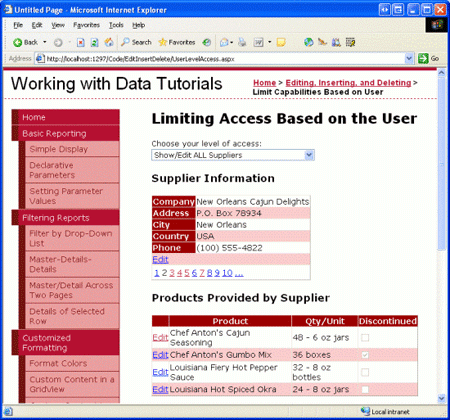](limiting-data-modification-functionality-based-on-the-user-cs/_static/image1.png)

**Figure 1**: A User from Our Company Can Edit Any Supplier s Information ([Click to view full-size image](limiting-data-modification-functionality-based-on-the-user-cs/_static/image3.png))

[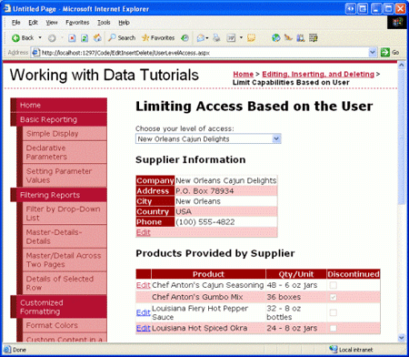](limiting-data-modification-functionality-based-on-the-user-cs/_static/image4.png)

**Figure 2**: A User from a Particular Supplier Can Only View and Edit their Information ([Click to view full-size image](limiting-data-modification-functionality-based-on-the-user-cs/_static/image6.png))

Let s get started!

> [!NOTE] ASP.NET 2.0 s membership system provides a standardized, extensible platform for creating, managing, and validating user accounts. Since an examination of the membership system is beyond the scope of these tutorials, this tutorial instead "fakes" membership by allowing anonymous visitors to choose whether they are from a particular supplier or from our company. For more on membership, refer to my [Examining ASP.NET 2.0 s Membership, Roles, and Profile](http://aspnet.4guysfromrolla.com/articles/120705-1.aspx) article series.

## Step 1: Allowing the User to Specify their Access Rights

In a real-world web application, a user s account information would include whether they worked for our company or for a particular supplier, and this information would be programmatically accessible from our ASP.NET pages once the user has logged on to the site. This information could be captured through ASP.NET 2.0 s roles system, as user-level account information through the profile system, or through some custom means.

Since the aim of this tutorial is to demonstrate adjusting the data modification capabilities based on the logged on user, and is not meant to showcase ASP.NET 2.0 s membership, roles, and profile systems, we'll use a very simply mechanism to determine the capabilities for the user visiting the page - a DropDownList from which the user can indicate if they should be able to view and edit any of the suppliers information or, alternatively, what particular supplier s information they can view and edit. If the user indicates that she can view and edit all supplier information (the default), she can page through all suppliers, edit any supplier s address information, and edit the name and quantity per unit for any product provided by the selected supplier. If the user indicates that she can only view and edit a particular supplier, however, then she can only view the details and products for that one supplier and can only update the name and quantity per unit information for those products that are *not* discontinued.

Our first step in this tutorial, then, is to create this DropDownList and populate it with the suppliers in the system. Open the `UserLevelAccess.aspx` page in the `EditInsertDelete` folder, add a DropDownList whose `ID` property is set to `Suppliers`, and bind this DropDownList to a new ObjectDataSource named `AllSuppliersDataSource`.

[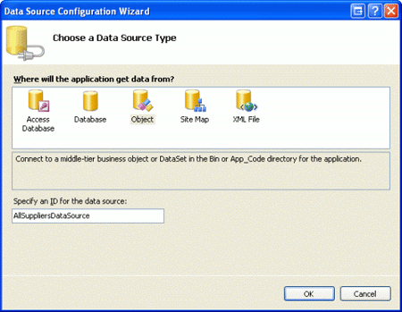](limiting-data-modification-functionality-based-on-the-user-cs/_static/image7.png)

**Figure 3**: Create a New ObjectDataSource Named `AllSuppliersDataSource` ([Click to view full-size image](limiting-data-modification-functionality-based-on-the-user-cs/_static/image9.png))

Since we want this DropDownList to include all suppliers, configure the ObjectDataSource to invoke the `SuppliersBLL` class s `GetSuppliers()` method. Also ensure that the ObjectDataSource s `Update()` method is mapped to the `SuppliersBLL` class s `UpdateSupplierAddress` method, as this ObjectDataSource will also be used by the DetailsView we'll be adding in Step 2.

After completing the ObjectDataSource wizard, complete the steps by configuring the `Suppliers` DropDownList such that it shows the `CompanyName` data field and uses the `SupplierID` data field as the value for each `ListItem`.

[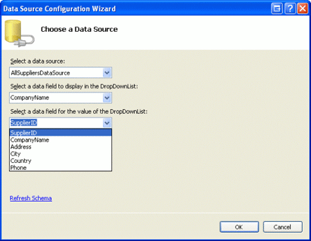](limiting-data-modification-functionality-based-on-the-user-cs/_static/image10.png)

**Figure 4**: Configure the `Suppliers` DropDownList to Use the `CompanyName` and `SupplierID` Data Fields ([Click to view full-size image](limiting-data-modification-functionality-based-on-the-user-cs/_static/image12.png))

At this point, the DropDownList lists the company names of the suppliers in the database. However, we also need to include a "Show/Edit ALL Suppliers" option to the DropDownList. To accomplish this, set the `Suppliers` DropDownList s `AppendDataBoundItems` property to `true` and then add a `ListItem` whose `Text` property is "Show/Edit ALL Suppliers" and whose value is `-1`. This can be added directly through the declarative markup or through the Designer by going to the Properties window and clicking on the ellipses in the DropDownList s `Items` property.

> [!NOTE] Refer back to the [*Master/Detail Filtering With a DropDownList*](../masterdetail/master-detail-filtering-with-a-dropdownlist-cs.md) tutorial for a more detailed discussion on adding a Select All item to a databound DropDownList.

After the `AppendDataBoundItems` property has been set and the `ListItem` added, the DropDownList s declarative markup should look like:

[!code[Main](limiting-data-modification-functionality-based-on-the-user-cs/samples/sample1.xml)]

Figure 5 shows a screen shot of our current progress, when viewed through a browser.

[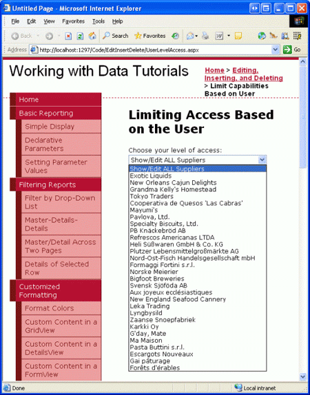](limiting-data-modification-functionality-based-on-the-user-cs/_static/image13.png)

**Figure 5**: The `Suppliers` DropDownList Contains a Show ALL `ListItem`, Plus One for Each Supplier ([Click to view full-size image](limiting-data-modification-functionality-based-on-the-user-cs/_static/image15.png))

Since we want to update the user interface immediately after the user has changed their selection, set the `Suppliers` DropDownList s `AutoPostBack` property to `true`. In Step 2 we'll create a DetailsView control that will show the information for the supplier(s) based on the DropDownList selection. Then, in Step 3, we'll create an event handler for this DropDownList s `SelectedIndexChanged` event, in which we'll add code that binds the appropriate supplier information to the DetailsView based upon the selected supplier.

## Step 2: Adding a DetailsView Control

Let s use a DetailsView to show supplier information. For the user who can view and edit all suppliers, the DetailsView will support paging, allowing the user to step through the supplier information one record at a time. If the user works for a particular supplier, however, the DetailsView will show only that particular supplier s information and will not include a paging interface. In either case, the DetailsView needs to allow the user to edit the supplier s address, city, and country fields.

Add a DetailsView to the page beneath the `Suppliers` DropDownList, set its `ID` property to `SupplierDetails`, and bind it to the `AllSuppliersDataSource` ObjectDataSource created in the previous step. Next, check the Enable Paging and Enable Editing checkboxes from the DetailsView s smart tag.

> [!NOTE] If you don t see an Enable Editing option in the DetailsView s smart tag it s because you did not map the ObjectDataSource s `Update()` method to the `SuppliersBLL` class s `UpdateSupplierAddress` method. Take a moment to go back and make this configuration change, after which the Enable Editing option should appear in the DetailsView s smart tag.

Since the `SuppliersBLL` class s `UpdateSupplierAddress` method only accepts four parameters - `supplierID`, `address`, `city`, and `country` - modify the DetailsView s BoundFields so that the `CompanyName` and `Phone` BoundFields are read-only. Additionally, remove the `SupplierID` BoundField altogether. Finally, the `AllSuppliersDataSource` ObjectDataSource currently has its `OldValuesParameterFormatString` property set to `original_{0}`. Take a moment to remove this property setting from the declarative syntax altogether, or set it to the default value, `{0}`.

After configuring the `SupplierDetails` DetailsView and `AllSuppliersDataSource` ObjectDataSource, we will have the following declarative markup:

[!code[Main](limiting-data-modification-functionality-based-on-the-user-cs/samples/sample2.xml)]

At this point the DetailsView can be paged through and the selected supplier s address information can be updated, regardless of the selection made in the `Suppliers` DropDownList (see Figure 6).

[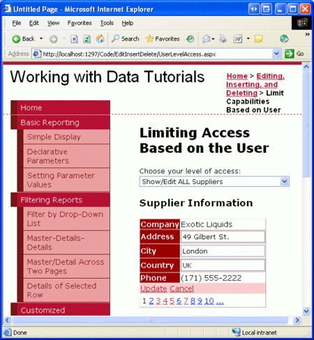](limiting-data-modification-functionality-based-on-the-user-cs/_static/image16.png)

**Figure 6**: Any Suppliers Information Can Be Viewed, and Its Address Updated ([Click to view full-size image](limiting-data-modification-functionality-based-on-the-user-cs/_static/image18.png))

## Step 3: Displaying Only the Selected Supplier s Information

Our page currently displays the information for all suppliers regardless of whether a particular supplier has been selected from the `Suppliers` DropDownList. In order to display just the supplier information for the selected supplier we need to add another ObjectDataSource to our page, one that retrieves information about a particular supplier.

Add a new ObjectDataSource to the page, naming it `SingleSupplierDataSource`. From its smart tag, click the Configure Data Source link and have it use the `SuppliersBLL` class s `GetSupplierBySupplierID(supplierID)` method. As with the `AllSuppliersDataSource` ObjectDataSource, have the `SingleSupplierDataSource` ObjectDataSource s `Update()` method mapped to the `SuppliersBLL` class s `UpdateSupplierAddress` method.

[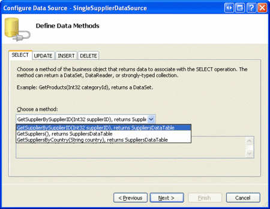](limiting-data-modification-functionality-based-on-the-user-cs/_static/image19.png)

**Figure 7**: Configure the `SingleSupplierDataSource` ObjectDataSource to Use the `GetSupplierBySupplierID(supplierID)` Method ([Click to view full-size image](limiting-data-modification-functionality-based-on-the-user-cs/_static/image21.png))

Next, we re prompted to specify the parameter source for the `GetSupplierBySupplierID(supplierID)` method s `supplierID` input parameter. Since we want to show the information for the supplier selected from the DropDownList, use the `Suppliers` DropDownList s `SelectedValue` property as the parameter source.

[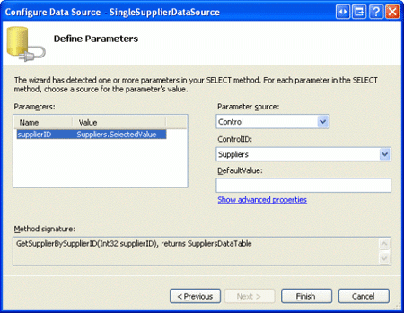](limiting-data-modification-functionality-based-on-the-user-cs/_static/image22.png)

**Figure 8**: Use the `Suppliers` DropDownList as the `supplierID` Parameter Source ([Click to view full-size image](limiting-data-modification-functionality-based-on-the-user-cs/_static/image24.png))

Even with this second ObjectDataSource added, the DetailsView control is currently configured to always use the `AllSuppliersDataSource` ObjectDataSource. We need to add logic to adjust the data source used by the DetailsView depending on the `Suppliers` DropDownList item selected. To accomplish this, create a `SelectedIndexChanged` event handler for the Suppliers DropDownList. This can most easily be created by double-clicking the DropDownList in the Designer. This event handler needs to determine what data source to use and must rebind the data to the DetailsView. This is accomplished with the following code:

[!code[Main](limiting-data-modification-functionality-based-on-the-user-cs/samples/sample3.xml)]

The event handler begins by determining whether the "Show/Edit ALL Suppliers" option was selected. If it was, it sets the `SupplierDetails` DetailsView s `DataSourceID` to `AllSuppliersDataSource` and returns the user to the first record in the set of suppliers by setting the `PageIndex` property to 0. If, however, the user has selected a particular supplier from the DropDownList, the DetailsView s `DataSourceID` is assigned to `SingleSuppliersDataSource`. Regardless of what data source is used, the `SuppliersDetails` mode is reverted back to the read-only mode and the data is rebound to the DetailsView by a call to the `SuppliersDetails` control s `DataBind()` method.

With this event handler in place, the DetailsView control now shows the selected supplier, unless the "Show/Edit ALL Suppliers" option was selected, in which case all of the suppliers can be viewed through the paging interface. Figure 9 shows the page with the "Show/Edit ALL Suppliers" option selected; note that the paging interface is present, allowing the user to visit and update any supplier. Figure 10 shows the page with the Ma Maison supplier selected. Only Ma Maison s information is viewable and editable in this case.

[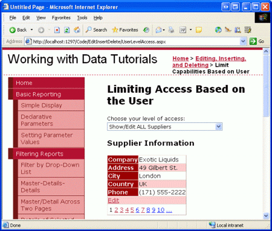](limiting-data-modification-functionality-based-on-the-user-cs/_static/image25.png)

**Figure 9**: All of the Suppliers Information Can Be Viewed and Edited ([Click to view full-size image](limiting-data-modification-functionality-based-on-the-user-cs/_static/image27.png))

[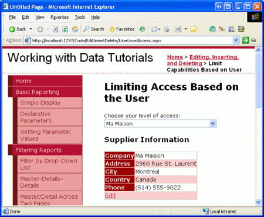](limiting-data-modification-functionality-based-on-the-user-cs/_static/image28.png)

**Figure 10**: Only the Selected Supplier s Information Can Be Viewed and Edited ([Click to view full-size image](limiting-data-modification-functionality-based-on-the-user-cs/_static/image30.png))

> [!NOTE] For this tutorial, both the DropDownList and DetailsView control s `EnableViewState` must be set to `true` (the default) because the DropDownList s `SelectedIndex` and the DetailsView s `DataSourceID` property s changes must be remembered across postbacks.

## Step 4: Listing the Suppliers Products in an Editable GridView

With the DetailsView complete, our next step is to include an editable GridView that lists those products provided by the selected supplier. This GridView should allow edits to only the `ProductName` and `QuantityPerUnit` fields. Moreover, if the user visiting the page is from a particular supplier, it should only allow updates to those products that are *not* discontinued. To accomplish this we'll need to first add an overload of the `ProductsBLL` class s `UpdateProducts` method that takes in just the `ProductID`, `ProductName`, and `QuantityPerUnit` fields as inputs. We ve stepped through this process beforehand in numerous tutorials, so let s just look at the code here, which should be added to `ProductsBLL`:

[!code[Main](limiting-data-modification-functionality-based-on-the-user-cs/samples/sample4.xml)]

With this overload created, we re ready to add the GridView control and its associated ObjectDataSource. Add a new GridView to the page, set its `ID` property to `ProductsBySupplier`, and configure it to use a new ObjectDataSource named `ProductsBySupplierDataSource`. Since we want this GridView to list those products by the selected supplier, use the `ProductsBLL` class s `GetProductsBySupplierID(supplierID)` method. Also map the `Update()` method to the new `UpdateProduct` overload we just created.

[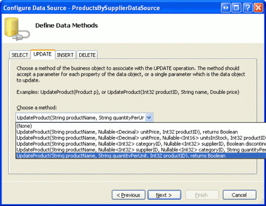](limiting-data-modification-functionality-based-on-the-user-cs/_static/image31.png)

**Figure 11**: Configure the ObjectDataSource to Use the `UpdateProduct` Overload Just Created ([Click to view full-size image](limiting-data-modification-functionality-based-on-the-user-cs/_static/image33.png))

We re prompted to select the parameter source for the `GetProductsBySupplierID(supplierID)` method s `supplierID` input parameter. Since we want to show the products for the supplier selected in the DetailsView, use the `SuppliersDetails` DetailsView control s `SelectedValue` property as the parameter source.

[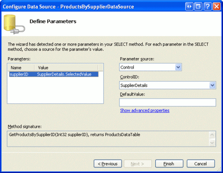](limiting-data-modification-functionality-based-on-the-user-cs/_static/image34.png)

**Figure 12**: Use the `SuppliersDetails` DetailsView s `SelectedValue` Property as the Parameter Source ([Click to view full-size image](limiting-data-modification-functionality-based-on-the-user-cs/_static/image36.png))

Returning to the GridView, remove all of the GridView fields except for `ProductName`, `QuantityPerUnit`, and `Discontinued`, marking the `Discontinued` CheckBoxField as read-only. Also, check the Enable Editing option from the GridView s smart tag. After these changes have been made, the declarative markup for the GridView and ObjectDataSource should look similar to the following:

[!code[Main](limiting-data-modification-functionality-based-on-the-user-cs/samples/sample5.xml)]

As with our previous ObjectDataSources, this one s `OldValuesParameterFormatString` property is set to `original_{0}`, which will cause problems when attempting to update a product s name or quantity per unit. Remove this property from the declarative syntax altogether or set it to its default, `{0}`.

With this configuration complete, our page now lists the products provided by the supplier selected in the GridView (see Figure 13). Currently *any* product s name or quantity per unit can be updated. However, we need to update our page logic so that such functionality is prohibited for discontinued products for users associated with a particular supplier. We'll tackle this final piece in Step 5.

[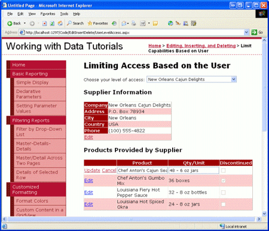](limiting-data-modification-functionality-based-on-the-user-cs/_static/image37.png)

**Figure 13**: The Products Provided by the Selected Supplier are Displayed ([Click to view full-size image](limiting-data-modification-functionality-based-on-the-user-cs/_static/image39.png))

> [!NOTE] With the addition of this editable GridView the `Suppliers` DropDownList s `SelectedIndexChanged` event handler should be updated to return the GridView to a read-only state. Otherwise, if a different supplier is selected while in the middle of editing product information, the corresponding index in the GridView for the new supplier will also be editable. To prevent this, simply set the GridView s `EditIndex` property to `-1` in the `SelectedIndexChanged` event handler.

Also, recall that it is important that the GridView s view state be enabled (the default behavior). If you set the GridView s `EnableViewState` property to `false`, you run the risk of having concurrent users unintentionally deleting or editing records. See [WARNING: Concurrency Issue with ASP.NET 2.0 GridViews/DetailsView/FormViews that Support Editing and/or Deleting and Whose View State is Disabled](http://scottonwriting.net/sowblog/posts/10054.aspx) for more information.

## Step 5: Disallow Editing for Discontinued Products When Show/Edit ALL Suppliers is Not Selected

While the `ProductsBySupplier` GridView is fully functional, it currently grants too much access to those users who are from a particular supplier. Per our business rules, such users should not be able to update discontinued products. To enforce this, we can hide (or disable) the Edit button in those GridView rows with discontinued products when the page is being visited by a user from a supplier.

Create an event handler for the GridView s `RowDataBound` event. In this event handler we need to determine whether or not the user is associated with a particular supplier, which, for this tutorial, can be determined by checking the Suppliers DropDownList s `SelectedValue` property - if it s something other than -1, then the user is associated with a particular supplier. For such users, we then need to determine whether or not the product is discontinued. We can grab a reference to the actual `ProductRow` instance bound to the GridView row via the `e.Row.DataItem` property, as discussed in the [*Displaying Summary Information in the GridView s Footer*](../custom-formatting/displaying-summary-information-in-the-gridview-s-footer-cs.md) tutorial. If the product is discontinued, we can grab a programmatic reference to the Edit button in the GridView s CommandField using the techniques discussed in the previous tutorial, [*Adding Client-Side Confirmation When Deleting*](adding-client-side-confirmation-when-deleting-cs.md). Once we have a reference we can then hide or disable the button.

[!code[Main](limiting-data-modification-functionality-based-on-the-user-cs/samples/sample6.xml)]

With this event handler in place, when visiting this page as a user from a specific supplier those products that are discontinued are not editable, as the Edit button is hidden for these products. For example, Chef Anton s Gumbo Mix is a discontinued product for the New Orleans Cajun Delights supplier. When visiting the page for this particular supplier, the Edit button for this product is hidden from sight (see Figure 14). However, when visiting using the "Show/Edit ALL Suppliers," the Edit button is available (see Figure 15).

**Figure 14**: For Supplier-Specific Users the Edit Button for Chef Anton s Gumbo Mix is Hidden ([Click to view full-size image](limiting-data-modification-functionality-based-on-the-user-cs/_static/image42.png))

**Figure 15**: For Show/Edit ALL Suppliers Users, the Edit Button for Chef Anton s Gumbo Mix is Displayed ([Click to view full-size image](limiting-data-modification-functionality-based-on-the-user-cs/_static/image45.png))

## Checking for Access Rights in the Business Logic Layer

In this tutorial the ASP.NET page handles all logic with regards to what information the user can see and what products he can update. Ideally, this logic would also be present at the Business Logic Layer. For example, the `SuppliersBLL` class s `GetSuppliers()` method (which returns all suppliers) might include a check to ensure that the currently logged on user is *not* associated with a specific supplier. Likewise, the `UpdateSupplierAddress` method could include a check to ensure that the currently logged on user either worked for our company (and therefore can update all suppliers address information) or is associated with the supplier whose data is being updated.

I did not include such BLL-layer checks here because in our tutorial the user s rights are determined by a DropDownList on the page, which the BLL classes cannot access. When using the membership system or one of the out-of-the box authentication schemes provided by ASP.NET (such as Windows authentication), the currently logged on user s information and roles information can be accessed from the BLL, thereby making such access rights checks possible at both the presentation and BLL layers.

## Summary

Most sites that provide user accounts need to customize the data modification interface based upon the logged in user. Administrative users may be able to delete and edit any record, whereas non-administrative users may be limited to only updating or deleting records they created themselves. Whatever the scenario may be, the data Web controls, ObjectDataSource, and Business Logic Layer classes can be extended to add or deny certain functionality based on the logged on user. In this tutorial we saw how to limit the viewable and editable data depending on whether the user was associated with a particular supplier or if they worked for our company.

This tutorial concludes our examination of inserting, updating, and deleting data using the GridView, DetailsView, and FormView controls. Starting with the next tutorial, we'll turn our attention to adding paging and sorting support.

Happy Programming!

## About the Author

[Scott Mitchell](http://www.4guysfromrolla.com/ScottMitchell.shtml), author of seven ASP/ASP.NET books and founder of [4GuysFromRolla.com](http://www.4guysfromrolla.com), has been working with Microsoft Web technologies since 1998. Scott works as an independent consultant, trainer, and writer. His latest book is [*Sams Teach Yourself ASP.NET 2.0 in 24 Hours*](https://www.amazon.com/exec/obidos/ASIN/0672327384/4guysfromrollaco). He can be reached at [mitchell@4GuysFromRolla.com.](mailto:mitchell@4GuysFromRolla.com) or via his blog, which can be found at [http://ScottOnWriting.NET](http://ScottOnWriting.NET).

>[!div class="step-by-step"]
[Previous](adding-client-side-confirmation-when-deleting-cs.md)
[Next](an-overview-of-inserting-updating-and-deleting-data-vb.md)