Sorting Data in a DataList or Repeater Control (C#)
====================
by [Scott Mitchell](https://twitter.com/ScottOnWriting)

[Download Sample App](http://download.microsoft.com/download/4/a/7/4a7a3b18-d80e-4014-8e53-a6a2427f0d93/ASPNET_Data_Tutorial_45_CS.exe) or [Download PDF](sorting-data-in-a-datalist-or-repeater-control-cs/_static/datatutorial45cs1.pdf)

> In this tutorial we'll examine how to include sorting support in the DataList and Repeater, as well as how to construct a DataList or Repeater whose data can be paged and sorted.

## Introduction

In the [previous tutorial](paging-report-data-in-a-datalist-or-repeater-control-cs.md) we examined how to add paging support to a DataList. We created a new method in the `ProductsBLL` class (`GetProductsAsPagedDataSource`) that returned a `PagedDataSource` object. When bound to a DataList or Repeater, the DataList or Repeater would display just the requested page of data. This technique is similar to what is used internally by the GridView, DetailsView, and FormView controls to provide their built-in default paging functionality.

In addition to offering paging support, the GridView also includes out of the box sorting support. Neither the DataList nor Repeater provides built-in sorting functionality; however, sorting features can be added with a bit of code. In this tutorial we'll examine how to include sorting support in the DataList and Repeater, as well as how to construct a DataList or Repeater whose data can be paged and sorted.

## A Review of Sorting

As we saw in the [Paging and Sorting Report Data](../paging-and-sorting/paging-and-sorting-report-data-cs.md) tutorial, the GridView control provides out of the box sorting support. Each GridView field can have an associated `SortExpression`, which indicates the data field by which to sort the data. When the GridView s `AllowSorting` property is set to `true`, each GridView field that has a `SortExpression` property value has its header rendered as a LinkButton. When a user clicks a particular GridView field s header, a postback occurs and the data is sorted according to the clicked field s `SortExpression`.

The GridView control has a `SortExpression` property as well, which stores the `SortExpression` of the GridView field the data is sorted by. Additionally, a `SortDirection` property indicates whether the data is to be sorted in ascending or descending order (if a user clicks a particular GridView field s header link twice in succession, the sort order is toggled).

When the GridView is bound to its data source control, it hands off its `SortExpression` and `SortDirection` properties to the data source control. The data source control retrieves the data and then sorts it according to the supplied `SortExpression` and `SortDirection` properties. After sorting the data, the data source control returns it to the GridView.

To replicate this functionality with the DataList or Repeater controls, we must:

- Create a sorting interface
- Remember the data field to sort by and whether to sort in ascending or descending order
- Instruct the ObjectDataSource to sort the data by a particular data field

We'll tackle these three tasks in steps 3 and 4. Following that, we'll examine how to include both paging and sorting support in a DataList or Repeater.

## Step 2: Displaying the Products in a Repeater

Before we worry about implementing any of the sorting-related functionality, let s start by listing the products in a Repeater control. Start by opening the `Sorting.aspx` page in the `PagingSortingDataListRepeater` folder. Add a Repeater control to the web page, setting its `ID` property to `SortableProducts`. From the Repeater s smart tag, create a new ObjectDataSource named `ProductsDataSource` and configure it to retrieve data from the `ProductsBLL` class s `GetProducts()` method. Select the (None) option from the drop-down lists in the INSERT, UPDATE, and DELETE tabs.

**Figure 1**: Create an ObjectDataSource and Configure it to Use the `GetProductsAsPagedDataSource()` Method ([Click to view full-size image](sorting-data-in-a-datalist-or-repeater-control-cs/_static/image3.png))

**Figure 2**: Set the Drop-Down Lists in the UPDATE, INSERT, and DELETE tabs to (None) ([Click to view full-size image](sorting-data-in-a-datalist-or-repeater-control-cs/_static/image6.png))

Unlike with the DataList, Visual Studio does not automatically create an `ItemTemplate` for the Repeater control after binding it to a data source. Furthermore, we must add this `ItemTemplate` declaratively, as the Repeater control s smart tag lacks the Edit Templates option found in the DataList s. Let s use the same `ItemTemplate` from the previous tutorial, which displayed the product s name, supplier, and category.

After adding the `ItemTemplate`, the Repeater and ObjectDataSource s declarative markup should look similar to the following:

[!code[Main](sorting-data-in-a-datalist-or-repeater-control-cs/samples/sample1.xml)]

Figure 3 shows this page when viewed through a browser.

[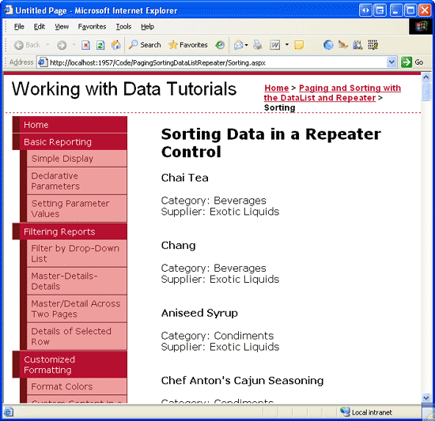](sorting-data-in-a-datalist-or-repeater-control-cs/_static/image7.png)

**Figure 3**: Each Product s Name, Supplier, and Category is Displayed ([Click to view full-size image](sorting-data-in-a-datalist-or-repeater-control-cs/_static/image9.png))

## Step 3: Instructing the ObjectDataSource to Sort the Data

To sort the data displayed in the Repeater, we need to inform the ObjectDataSource of the sort expression by which the data should be sorted. Before the ObjectDataSource retrieves its data, it first fires its [`Selecting` event](https://msdn.microsoft.com/en-us/library/system.web.ui.webcontrols.objectdatasource.selecting.aspx), which provides an opportunity for us to specify a sort expression. The `Selecting` event handler is passed an object of type [`ObjectDataSourceSelectingEventArgs`](https://msdn.microsoft.com/en-us/library/system.web.ui.webcontrols.objectdatasourceselectingeventargs.aspx), which has a property named [`Arguments`](https://msdn.microsoft.com/en-us/library/system.web.ui.webcontrols.objectdatasourceselectingeventargs.arguments.aspx) of type [`DataSourceSelectArguments`](https://msdn.microsoft.com/en-us/library/system.web.ui.datasourceselectarguments.aspx). The `DataSourceSelectArguments` class is designed to pass data-related requests from a consumer of data to the data source control, and includes a [`SortExpression` property](https://msdn.microsoft.com/en-us/library/system.web.ui.datasourceselectarguments.sortexpression.aspx).

To pass sorting information from the ASP.NET page to the ObjectDataSource, create an event handler for the `Selecting` event and use the following code:

[!code[Main](sorting-data-in-a-datalist-or-repeater-control-cs/samples/sample2.xml)]

The *sortExpression* value should be assigned the name of the data field to sort the data by (such as ProductName ). There is no sort direction-related property, so if you want to sort the data in descending order, append the string DESC to the *sortExpression* value (such as ProductName DESC ).

Go ahead and try some different hard-coded values for *sortExpression* and test the results in a browser. As Figure 4 shows, when using ProductName DESC as the *sortExpression*, the products are sorted by their name in reverse alphabetical order.

[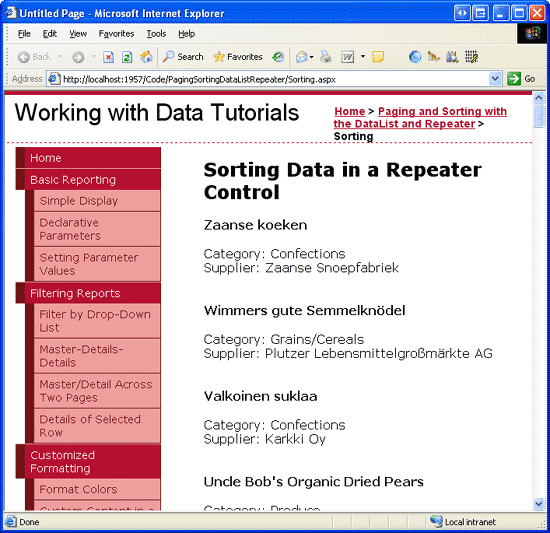](sorting-data-in-a-datalist-or-repeater-control-cs/_static/image10.png)

**Figure 4**: The Products are Sorted by their Name in Reverse Alphabetical Order ([Click to view full-size image](sorting-data-in-a-datalist-or-repeater-control-cs/_static/image12.png))

## Step 4: Creating the Sorting Interface and Remembering the Sort Expression and Direction

Turning on sorting support in the GridView converts each sortable field s header text into a LinkButton that, when clicked, sorts the data accordingly. Such a sorting interface makes sense for the GridView, where its data is neatly laid out in columns. For the DataList and Repeater controls, however, a different sorting interface is needed. A common sorting interface for a list of data (as opposed to a grid of data), is a drop-down list that provides the fields by which the data can be sorted. Let s implement such an interface for this tutorial.

Add a DropDownList Web control above the `SortableProducts` Repeater and set its `ID` property to `SortBy`. From the Properties window, click the ellipses in the `Items` property to bring up the ListItem Collection Editor. Add `ListItem` s to sort the data by the `ProductName`, `CategoryName`, and `SupplierName` fields. Also add a `ListItem` to sort the products by their name in reverse alphabetical order.

The `ListItem` `Text` properties can be set to any value (such as Name ), but the `Value` properties must be set to the name of the data field (such as ProductName ). To sort the results in descending order, append the string DESC to the data field name, like ProductName DESC .

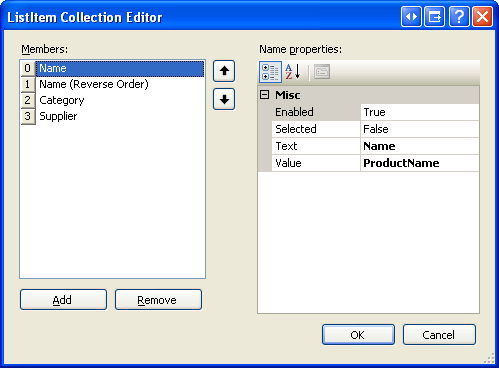

**Figure 5**: Add a `ListItem` for Each of the Sortable Data Fields

Finally, add a Button Web control to the right of the DropDownList. Set its `ID` to `RefreshRepeater` and its `Text` property to Refresh .

After creating the `ListItem` s and adding the Refresh button, the DropDownList and Button s declarative syntax should look similar to the following:

[!code[Main](sorting-data-in-a-datalist-or-repeater-control-cs/samples/sample3.xml)]

With the sorting DropDownList complete, we next need to update the ObjectDataSource s `Selecting` event handler so that it uses the selected `SortBy``ListItem` s `Value` property as opposed to a hard-coded sort expression.

[!code[Main](sorting-data-in-a-datalist-or-repeater-control-cs/samples/sample4.xml)]

At this point when first visiting the page the products will initially be sorted by the `ProductName` data field, as it s the `SortBy` `ListItem` selected by default (see Figure 6). Selecting a different sorting option such as Category and clicking Refresh will cause a postback and re-sort the data by the category name, as Figure 7 shows.

[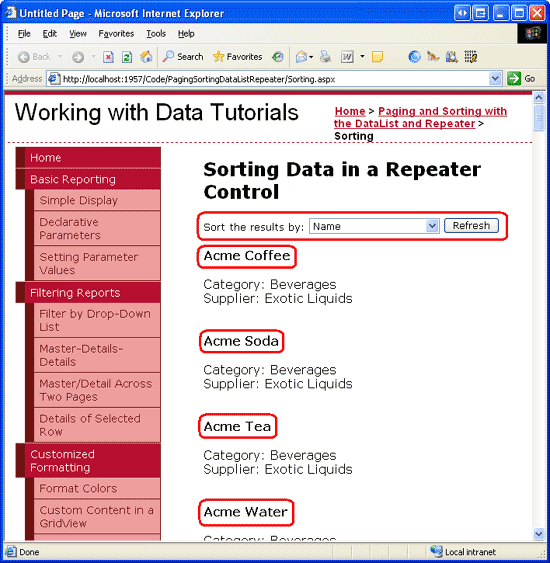](sorting-data-in-a-datalist-or-repeater-control-cs/_static/image14.png)

**Figure 6**: The Products are Initially Sorted by their Name ([Click to view full-size image](sorting-data-in-a-datalist-or-repeater-control-cs/_static/image16.png))

[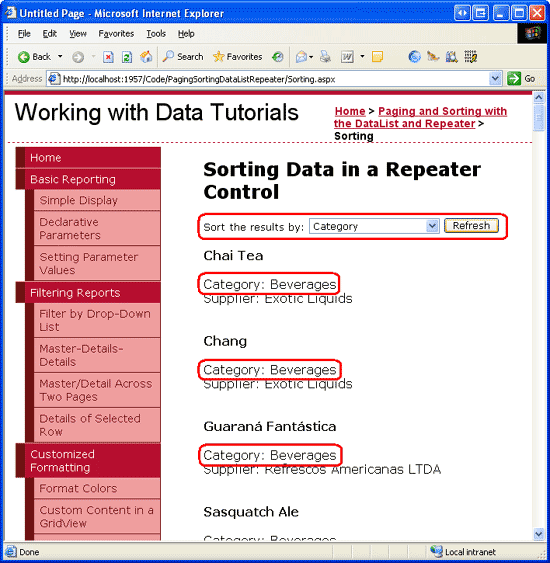](sorting-data-in-a-datalist-or-repeater-control-cs/_static/image17.png)

**Figure 7**: The Products are Now Sorted by Category ([Click to view full-size image](sorting-data-in-a-datalist-or-repeater-control-cs/_static/image19.png))

> [!NOTE] Clicking the Refresh button causes the data to automatically be re-sorted because the Repeater s view state has been disabled, thereby causing the Repeater to rebind to its data source on every postback. If you ve left the Repeater s view state enabled, changing the sorting drop-down list won t have any affect on the sort order. To remedy this, create an event handler for the Refresh Button s `Click` event and rebind the Repeater to its data source (by calling the Repeater s `DataBind()` method).

## Remembering the Sort Expression and Direction

When creating a sortable DataList or Repeater on a page where non-sort related postbacks may occur, it s imperative that the sort expression and direction be remembered across postbacks. For example, imagine that we updated the Repeater in this tutorial to include a Delete button with each product. When the user clicks the Delete button we d run some code to delete the selected product and then rebind the data to the Repeater. If the sort details are not persisted across postback, the data displayed on screen will revert to the original sort order.

For this tutorial, the DropDownList implicitly saves the sort expression and direction in its view state for us. If we were using a different sorting interface one with, say, LinkButtons that provided the various sorting options we d need to take care to remember the sort order across postbacks. This could be accomplished by storing the sorting parameters in the page s view state, by including the sort parameter in the querystring, or through some other state persistence technique.

Future examples in this tutorial explore how to persist the sorting details in the page s view state.

## Step 5: Adding Sorting Support to a DataList that Uses Default Paging

In the [preceding tutorial](paging-report-data-in-a-datalist-or-repeater-control-cs.md) we examined how to implement default paging with a DataList. Let s extend this previous example to include the ability to sort the paged data. Start by opening the `SortingWithDefaultPaging.aspx` and `Paging.aspx` pages in the `PagingSortingDataListRepeater` folder. From the `Paging.aspx` page, click on the Source button to view the page s declarative markup. Copy the selected text (see Figure 8) and paste it into the declarative markup of `SortingWithDefaultPaging.aspx` between the `<asp:Content>` tags.

[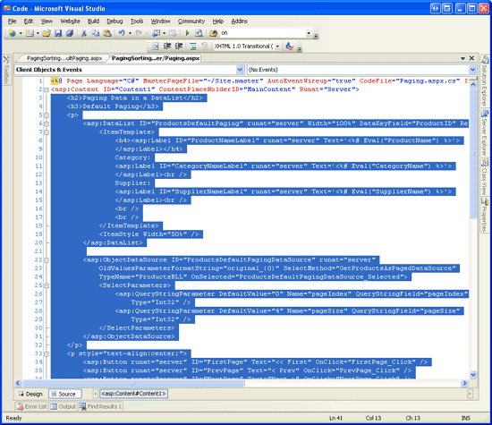](sorting-data-in-a-datalist-or-repeater-control-cs/_static/image20.png)

**Figure 8**: Replicate the Declarative Markup in the `<asp:Content>` Tags from `Paging.aspx` to `SortingWithDefaultPaging.aspx` ([Click to view full-size image](sorting-data-in-a-datalist-or-repeater-control-cs/_static/image22.png))

After copying the declarative markup, copy the methods and properties in the `Paging.aspx` page s code-behind class to the code-behind class for `SortingWithDefaultPaging.aspx`. Next, take a moment to view the `SortingWithDefaultPaging.aspx` page in a browser. It should exhibit the same functionality and appearance as `Paging.aspx`.

## Enhancing ProductsBLL to Include a Default Paging and Sorting Method

In the previous tutorial we created a `GetProductsAsPagedDataSource(pageIndex, pageSize)` method in the `ProductsBLL` class that returned a `PagedDataSource` object. This `PagedDataSource` object was populated with *all* of the products (via the BLL s `GetProducts()` method), but when bound to the DataList only those records corresponding to the specified *pageIndex* and *pageSize* input parameters were displayed.

Earlier in this tutorial we added sorting support by specifying the sort expression from the ObjectDataSource s `Selecting` event handler. This works well when the ObjectDataSource is returned an object that can be sorted, like the `ProductsDataTable` returned by the `GetProducts()` method. However, the `PagedDataSource` object returned by the `GetProductsAsPagedDataSource` method does not support sorting of its inner data source. Instead, we need to sort the results returned from the `GetProducts()` method *before* we put it in the `PagedDataSource`.

To accomplish this, create a new method in the `ProductsBLL` class, `GetProductsSortedAsPagedDataSource(sortExpression, pageIndex, pageSize)`. To sort the `ProductsDataTable` returned by the `GetProducts()` method, specify the `Sort` property of its default `DataTableView`:

[!code[Main](sorting-data-in-a-datalist-or-repeater-control-cs/samples/sample5.xml)]

The `GetProductsSortedAsPagedDataSource` method differs only slightly from the `GetProductsAsPagedDataSource` method created in the previous tutorial. In particular, `GetProductsSortedAsPagedDataSource` accepts an additional input parameter `sortExpression` and assigns this value to the `Sort` property of the `ProductDataTable` s `DefaultView`. A few lines of code later, the `PagedDataSource` object s DataSource is assigned the `ProductDataTable` s `DefaultView`.

## Calling the GetProductsSortedAsPagedDataSource Method and Specifying the Value for the SortExpression Input Parameter

With the `GetProductsSortedAsPagedDataSource` method complete, the next step is to provide the value for this parameter. The ObjectDataSource in `SortingWithDefaultPaging.aspx` is currently configured to call the `GetProductsAsPagedDataSource` method and passes in the two input parameters through its two `QueryStringParameters`, which are specified in the `SelectParameters` collection. These two `QueryStringParameters` indicate that the source for the `GetProductsAsPagedDataSource` method s *pageIndex* and *pageSize* parameters come from the querystring fields `pageIndex` and `pageSize`.

Update the ObjectDataSource s `SelectMethod` property so that it invokes the new `GetProductsSortedAsPagedDataSource` method. Then, add a new `QueryStringParameter` so that the *sortExpression* input parameter is accessed from the querystring field `sortExpression`. Set the `QueryStringParameter` s `DefaultValue` to ProductName .

After these changes, the ObjectDataSource s declarative markup should look like:

[!code[Main](sorting-data-in-a-datalist-or-repeater-control-cs/samples/sample6.xml)]

At this point, the `SortingWithDefaultPaging.aspx` page will sort its results alphabetically by the product name (see Figure 9). This is because, by default, a value of ProductName is passed in as the `GetProductsSortedAsPagedDataSource` method s *sortExpression* parameter.

[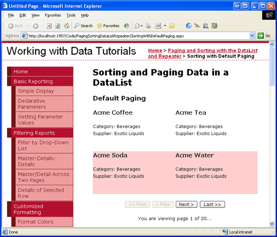](sorting-data-in-a-datalist-or-repeater-control-cs/_static/image23.png)

**Figure 9**: By Default, the Results are Sorted by `ProductName` ([Click to view full-size image](sorting-data-in-a-datalist-or-repeater-control-cs/_static/image25.png))

If you manually add a `sortExpression` querystring field such as `SortingWithDefaultPaging.aspx?sortExpression=CategoryName` the results will be sorted by the specified `sortExpression`. However, this `sortExpression` parameter is not included in the querystring when moving to a different page of data. In fact, clicking on the Next or Last page buttons takes us back to `Paging.aspx`! Furthermore, there s currently no sorting interface. The only way a user can change the sort order of the paged data is by manipulating the querystring directly.

## Creating the Sorting Interface

We first need to update the `RedirectUser` method to send the user to `SortingWithDefaultPaging.aspx` (instead of `Paging.aspx`) and to include the `sortExpression` value in the querystring. We should also add a read-only, page-level named `SortExpression` property. This property, similar to the `PageIndex` and `PageSize` properties created in the previous tutorial, returns the value of the `sortExpression` querystring field if it exists, and the default value ( ProductName ) otherwise.

Currently the `RedirectUser` method accepts only a single input parameter the index of the page to display. However, there may be times when we want to redirect the user to a particular page of data using a sort expression other than what s specified in the querystring. In a moment we'll create the sorting interface for this page, which will include a series of Button Web controls for sorting the data by a specified column. When one of those Buttons is clicked, we want to redirect the user passing in the appropriate sort expression value. To provide this functionality, create two versions of the `RedirectUser` method. The first one should accept just the page index to display, while the second one accepts the page index and sort expression.

[!code[Main](sorting-data-in-a-datalist-or-repeater-control-cs/samples/sample7.xml)]

In the first example in this tutorial, we created a sorting interface using a DropDownList. For this example, let s use three Button Web controls positioned above the DataList one for sorting by `ProductName`, one for `CategoryName`, and one for `SupplierName`. Add the three Button Web controls, setting their `ID` and `Text` properties appropriately:

[!code[Main](sorting-data-in-a-datalist-or-repeater-control-cs/samples/sample8.xml)]

Next, create a `Click` event handler for each. The event handlers should call the `RedirectUser` method, returning the user to the first page using the appropriate sort expression.

[!code[Main](sorting-data-in-a-datalist-or-repeater-control-cs/samples/sample9.xml)]

When first visiting the page, the data is sorted by the product name alphabetically (refer back to Figure 9). Click the Next button to advance to the second page of data and then click the Sort by Category button. This returns us to the first page of data, sorted by category name (see Figure 10). Likewise, clicking the Sort by Supplier button sorts the data by supplier starting from the first page of data. The sort choice is remembered as the data is paged through. Figure 11 shows the page after sorting by category and then advancing to the thirteenth page of data.

[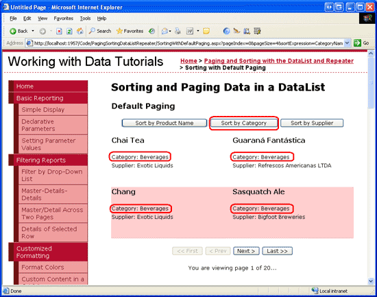](sorting-data-in-a-datalist-or-repeater-control-cs/_static/image26.png)

**Figure 10**: The Products are Sorted by Category ([Click to view full-size image](sorting-data-in-a-datalist-or-repeater-control-cs/_static/image28.png))

[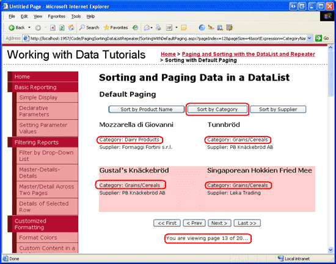](sorting-data-in-a-datalist-or-repeater-control-cs/_static/image29.png)

**Figure 11**: The Sort Expression is Remembered When Paging Through the Data ([Click to view full-size image](sorting-data-in-a-datalist-or-repeater-control-cs/_static/image31.png))

## Step 6: Custom Paging Through Records in a Repeater

The DataList example examined in step 5 pages through its data using the inefficient default paging technique. When paging through sufficiently large amounts of data, it is imperative that custom paging be used. Back in the [Efficiently Paging Through Large Amounts of Data](../paging-and-sorting/efficiently-paging-through-large-amounts-of-data-cs.md) and [Sorting Custom Paged Data](../paging-and-sorting/sorting-custom-paged-data-cs.md) tutorials, we examined the differences between default and custom paging and created methods in the BLL for utilizing custom paging and sorting custom paged data. In particular, in these two previous tutorials we added the following three methods to the `ProductsBLL` class:

- `GetProductsPaged(startRowIndex, maximumRows)` returns a particular subset of records starting at *startRowIndex* and not exceeding *maximumRows*.
- `GetProductsPagedAndSorted(sortExpression, startRowIndex, maximumRows)` returns a particular subset of records sorted by the specified *sortExpression* input parameter.
- `TotalNumberOfProducts()` provides the total number of records in the `Products` database table.

These methods can be used to efficiently page and sort through data using a DataList or Repeater control. To illustrate this, let s start by creating a Repeater control with custom paging support; we'll then add sorting capabilities.

Open the `SortingWithCustomPaging.aspx` page in the `PagingSortingDataListRepeater` folder and add a Repeater to the page, setting its `ID` property to `Products`. From the Repeater s smart tag, create a new ObjectDataSource named `ProductsDataSource`. Configure it to select its data from the `ProductsBLL` class s `GetProductsPaged` method.

[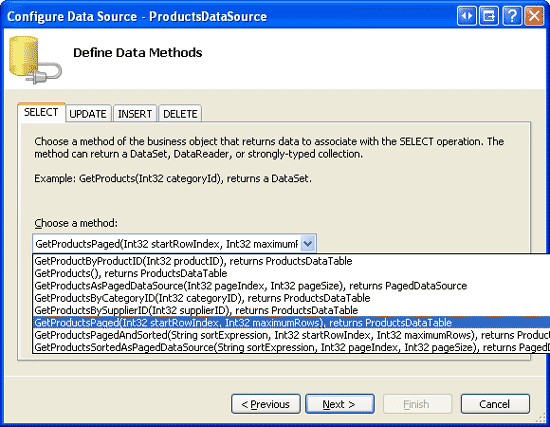](sorting-data-in-a-datalist-or-repeater-control-cs/_static/image32.png)

**Figure 12**: Configure the ObjectDataSource to Use the `ProductsBLL` Class s `GetProductsPaged` Method ([Click to view full-size image](sorting-data-in-a-datalist-or-repeater-control-cs/_static/image34.png))

Set the drop-down lists in the UPDATE, INSERT, and DELETE tabs to (None) and then click the Next button. The Configure Data Source wizard now prompts for the sources of the `GetProductsPaged` method s *startRowIndex* and *maximumRows* input parameters. In actuality, these input parameters are ignored. Instead, the *startRowIndex* and *maximumRows* values will be passed in through the `Arguments` property in the ObjectDataSource s `Selecting` event handler, just like how we specified the *sortExpression* in this tutorial s first demo. Therefore, leave the parameter source drop-down lists in the wizard set at None .

[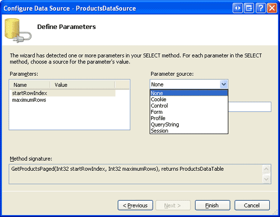](sorting-data-in-a-datalist-or-repeater-control-cs/_static/image35.png)

**Figure 13**: Leave the Parameter Sources Set to None ([Click to view full-size image](sorting-data-in-a-datalist-or-repeater-control-cs/_static/image37.png))

> [!NOTE] Do *not* set the ObjectDataSource s `EnablePaging` property to `true`. This will cause the ObjectDataSource to automatically include its own *startRowIndex* and *maximumRows* parameters to the `SelectMethod` s existing parameter list. The `EnablePaging` property is useful when binding custom paged data to a GridView, DetailsView, or FormView control because these controls expect certain behavior from the ObjectDataSource that s only available when `EnablePaging` property is `true`. Since we have to manually add the paging support for the DataList and Repeater, leave this property set to `false` (the default), as we'll bake in the needed functionality directly within our ASP.NET page.

Finally, define the Repeater s `ItemTemplate` so that the product s name, category, and supplier are shown. After these changes, the Repeater and ObjectDataSource s declarative syntax should look similar to the following:

[!code[Main](sorting-data-in-a-datalist-or-repeater-control-cs/samples/sample10.xml)]

Take a moment to visit the page through a browser and note that no records are returned. This is because we ve yet to specify the *startRowIndex* and *maximumRows* parameter values; therefore, values of 0 are being passed in for both. To specify these values, create an event handler for the ObjectDataSource s `Selecting` event and set these parameters values programmatically to hard-coded values of 0 and 5, respectively:

[!code[Main](sorting-data-in-a-datalist-or-repeater-control-cs/samples/sample11.xml)]

With this change, the page, when viewed through a browser, shows the first five products.

[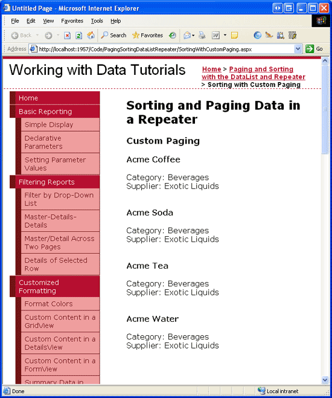](sorting-data-in-a-datalist-or-repeater-control-cs/_static/image38.png)

**Figure 14**: The First Five Records are Displayed ([Click to view full-size image](sorting-data-in-a-datalist-or-repeater-control-cs/_static/image40.png))

> [!NOTE] The products listed in Figure 14 happen to be sorted by product name because the `GetProductsPaged` stored procedure that performs the efficient custom paging query orders the results by `ProductName`.

In order to allow the user to step through the pages, we need to keep track of the start row index and maximum rows and remember these values across postbacks. In the default paging example we used querystring fields to persist these values; for this demo, let s persist this information in the page s view state. Create the following two properties:

[!code[Main](sorting-data-in-a-datalist-or-repeater-control-cs/samples/sample12.xml)]

Next, update the code in the Selecting event handler so that it uses the `StartRowIndex` and `MaximumRows` properties instead of the hard-coded values of 0 and 5:

[!code[Main](sorting-data-in-a-datalist-or-repeater-control-cs/samples/sample13.xml)]

At this point our page still shows just the first five records. However, with these properties in place, we re ready to create our paging interface.

## Adding the Paging Interface

Let s use the same First, Previous, Next, Last paging interface used in the default paging example, including the Label Web control that displays what page of data is being viewed and how many total pages exist. Add the four Button Web controls and Label below the Repeater.

[!code[Main](sorting-data-in-a-datalist-or-repeater-control-cs/samples/sample14.xml)]

Next, create `Click` event handlers for the four Buttons. When one of these Buttons is clicked, we need to update the `StartRowIndex` and rebind the data to the Repeater. The code for the First, Previous, and Next buttons is simple enough, but for the Last button how do we determine the start row index for the last page of data? To compute this index as well as being able to determine whether the Next and Last buttons should be enabled we need to know how many records in total are being paged through. We can determine this by calling the `ProductsBLL` class s `TotalNumberOfProducts()` method. Let s create a read-only, page-level property named `TotalRowCount` that returns the results of the `TotalNumberOfProducts()` method:

[!code[Main](sorting-data-in-a-datalist-or-repeater-control-cs/samples/sample15.xml)]

With this property we can now determine the last page s start row index. Specifically, it s the integer result of the `TotalRowCount` minus 1 divided by `MaximumRows`, multiplied by `MaximumRows`. We can now write the `Click` event handlers for the four paging interface buttons:

[!code[Main](sorting-data-in-a-datalist-or-repeater-control-cs/samples/sample16.xml)]

Finally, we need to disable the First and Previous buttons in the paging interface when viewing the first page of data and the Next and Last buttons when viewing the last page. To accomplish this, add the following code to the ObjectDataSource s `Selecting` event handler:

[!code[Main](sorting-data-in-a-datalist-or-repeater-control-cs/samples/sample17.xml)]

After adding these `Click` event handlers and the code to enable or disable the paging interface elements based on the current start row index, test the page in a browser. As Figure 15 illustrates, when first visiting the page the First and Previous buttons will are disabled. Clicking Next shows the second page of data, while clicking Last displays the final page (see Figures 16 and 17). When viewing the last page of data both the Next and Last buttons are disabled.

[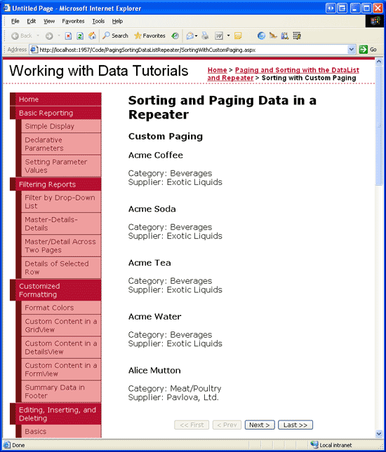](sorting-data-in-a-datalist-or-repeater-control-cs/_static/image41.png)

**Figure 15**: The Previous and Last Buttons are Disabled When Viewing the First Page of Products ([Click to view full-size image](sorting-data-in-a-datalist-or-repeater-control-cs/_static/image43.png))

[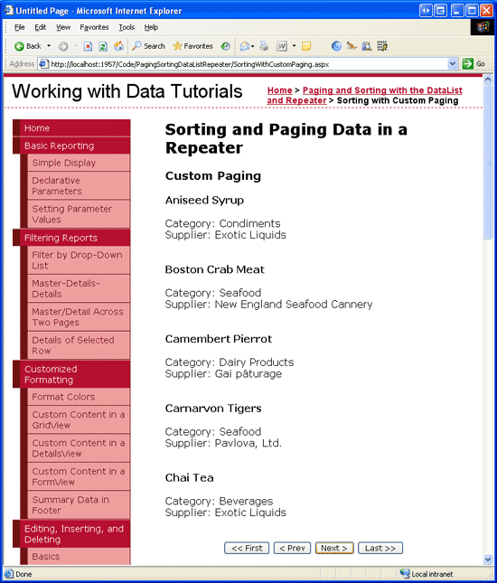](sorting-data-in-a-datalist-or-repeater-control-cs/_static/image44.png)

**Figure 16**: The Second Page of Products are Dispalyed ([Click to view full-size image](sorting-data-in-a-datalist-or-repeater-control-cs/_static/image46.png))

[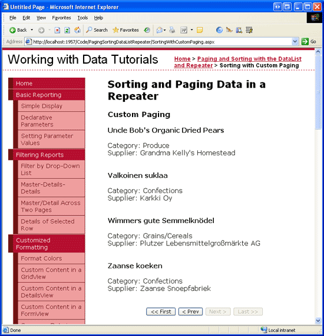](sorting-data-in-a-datalist-or-repeater-control-cs/_static/image47.png)

**Figure 17**: Clicking Last Displays the Final Page of Data ([Click to view full-size image](sorting-data-in-a-datalist-or-repeater-control-cs/_static/image49.png))

## Step 7: Including Sorting Support with the Custom Paged Repeater

Now that custom paging has been implemented, we re ready to include sorting support. The `ProductsBLL` class s `GetProductsPagedAndSorted` method has the same *startRowIndex* and *maximumRows* input parameters as `GetProductsPaged`, but permits an additional *sortExpression* input parameter. To use the `GetProductsPagedAndSorted` method from `SortingWithCustomPaging.aspx`, we need to perform the following steps:

1. Change the ObjectDataSource s `SelectMethod` property from `GetProductsPaged` to `GetProductsPagedAndSorted`.
2. Add a *sortExpression* `Parameter` object to the ObjectDataSource s `SelectParameters` collection.
3. Create a private, page-level `SortExpression` property that persists its value across postbacks through the page s view state.
4. Update the ObjectDataSource s `Selecting` event handler to assign the ObjectDataSource s *sortExpression* parameter the value of the page-level `SortExpression` property.
5. Create the sorting interface.

Start by updating the ObjectDataSource s `SelectMethod` property and adding a *sortExpression* `Parameter`. Make sure that the *sortExpression* `Parameter` s `Type` property is set to `String`. After completing these first two tasks, the ObjectDataSource s declarative markup should look like the following:

[!code[Main](sorting-data-in-a-datalist-or-repeater-control-cs/samples/sample18.xml)]

Next, we need a page-level `SortExpression` property whose value is serialized to view state. If no sort expression value has been set, use ProductName as the default:

[!code[Main](sorting-data-in-a-datalist-or-repeater-control-cs/samples/sample19.xml)]

Before the ObjectDataSource invokes the `GetProductsPagedAndSorted` method we need to set the *sortExpression* `Parameter` to the value of the `SortExpression` property. In the `Selecting` event handler, add the following line of code:

[!code[Main](sorting-data-in-a-datalist-or-repeater-control-cs/samples/sample20.xml)]

All that remains is to implement the sorting interface. As we did in the last example, let s have the sorting interface implemented using three Button Web controls that allow the user to sort the results by product name, category, or supplier.

[!code[Main](sorting-data-in-a-datalist-or-repeater-control-cs/samples/sample21.xml)]

Create `Click` event handlers for these three Button controls. In the event handler, reset the `StartRowIndex` to 0, set the `SortExpression` to the appropriate value, and rebind the data to the Repeater:

[!code[Main](sorting-data-in-a-datalist-or-repeater-control-cs/samples/sample22.xml)]

That s all there is to it! While there were a number of steps to get custom paging and sorting implemented, the steps were very similar to those needed for default paging. Figure 18 shows the products when viewing the last page of data when sorted by category.

[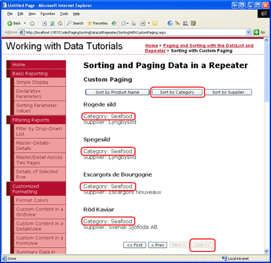](sorting-data-in-a-datalist-or-repeater-control-cs/_static/image50.png)

**Figure 18**: The Last Page of Data, Sorted by Category, is Displayed ([Click to view full-size image](sorting-data-in-a-datalist-or-repeater-control-cs/_static/image52.png))

> [!NOTE] In previous examples, when sorting by the supplier SupplierName was used as the sort expression. However, for the custom paging implementation, we need to use CompanyName . This is because the stored procedure responsible for implementing custom paging `GetProductsPagedAndSorted` passes the sort expression into the `ROW_NUMBER()` keyword, The `ROW_NUMBER()` keyword requires the actual column name rather than an alias. Therefore, we must use `CompanyName` (the name of the column in the `Suppliers` table) rather than the alias used in the `SELECT` query (`SupplierName`) for the sort expression.

## Summary

Neither the DataList nor Repeater offer built-in sorting support, but with a bit of code and a custom sorting interface, such functionality can be added. When implementing sorting, but not paging, the sort expression can be specified through the `DataSourceSelectArguments` object passed into the ObjectDataSource s `Select` method. This `DataSourceSelectArguments` object s `SortExpression` property can be assigned in the ObjectDataSource s `Selecting` event handler.

To add sorting capabilities to a DataList or Repeater that already provides paging support, the easiest approach is to customize the Business Logic Layer to include a method that accepts a sort expression. This information can then be passed in through a parameter in the ObjectDataSource s `SelectParameters`.

This tutorial completes our examination of paging and sorting with the DataList and Repeater controls. Our next and final tutorial will examine how to add Button Web controls to the DataList and Repeater s templates in order to provide some custom, user-initiated functionality on a per-item basis.

Happy Programming!

## About the Author

[Scott Mitchell](http://www.4guysfromrolla.com/ScottMitchell.shtml), author of seven ASP/ASP.NET books and founder of [4GuysFromRolla.com](http://www.4guysfromrolla.com), has been working with Microsoft Web technologies since 1998. Scott works as an independent consultant, trainer, and writer. His latest book is [*Sams Teach Yourself ASP.NET 2.0 in 24 Hours*](https://www.amazon.com/exec/obidos/ASIN/0672327384/4guysfromrollaco). He can be reached at [mitchell@4GuysFromRolla.com.](mailto:mitchell@4GuysFromRolla.com) or via his blog, which can be found at [http://ScottOnWriting.NET](http://ScottOnWriting.NET).

## Special Thanks To

This tutorial series was reviewed by many helpful reviewers. Lead reviewer for this tutorial was David Suru. Interested in reviewing my upcoming MSDN articles? If so, drop me a line at [mitchell@4GuysFromRolla.com.](mailto:mitchell@4GuysFromRolla.com)

>[!div class="step-by-step"] [Previous](paging-report-data-in-a-datalist-or-repeater-control-cs.md) [Next](paging-report-data-in-a-datalist-or-repeater-control-vb.md)