Batch Updating (C#)
====================
by [Scott Mitchell](https://twitter.com/ScottOnWriting)

[Download Code](http://download.microsoft.com/download/3/9/f/39f92b37-e92e-4ab3-909e-b4ef23d01aa3/ASPNET_Data_Tutorial_64_CS.zip) or [Download PDF](batch-updating-cs/_static/datatutorial64cs1.pdf)

> Learn how to update multiple database records in a single operation. In the User Interface Layer we build a GridView where each row is editable. In the Data Access Layer we wrap the multiple Update operations within a transaction to ensure that all updates succeed or all updates are rolled back.

## Introduction

In the [preceding tutorial](wrapping-database-modifications-within-a-transaction-cs.md) we saw how to extend the Data Access Layer to add support for database transactions. Database transactions guarantee that a series of data modification statements will be treated as one atomic operation, which ensures that all modifications will fail or all will succeed. With this low-level DAL functionality out of the way, we re ready to turn our attention to creating batch data modification interfaces.

In this tutorial we'll build a GridView where each row is editable (see Figure 1). Since each row is rendered in its editing interface, there s no need for a column of Edit, Update, and Cancel buttons. Instead, there are two Update Products buttons on the page that, when clicked, enumerate the GridView rows and update the database.

**Figure 1**: Each Row in the GridView is Editable ([Click to view full-size image](batch-updating-cs/_static/image2.png))

Let s get started!

> [!NOTE] In the [Performing Batch Updates](../editing-and-deleting-data-through-the-datalist/performing-batch-updates-cs.md) tutorial we created a batch editing interface using the DataList control. This tutorial differs from the previous one in that is uses a GridView and the batch update is performed within the scope of a transaction. After completing this tutorial I encourage you to return to the earlier tutorial and update it to use the database transaction-related functionality added in the preceding tutorial.

## Examining the Steps for Making All GridView Rows Editable

As discussed in the [An Overview of Inserting, Updating, and Deleting Data](../editing-inserting-and-deleting-data/an-overview-of-inserting-updating-and-deleting-data-cs.md) tutorial, the GridView offers built-in support for editing its underlying data on a per-row basis. Internally, the GridView notes what row is editable through its [`EditIndex` property](https://msdn.microsoft.com/en-us/library/system.web.ui.webcontrols.gridview.editindex(VS.80).aspx). As the GridView is being bound to its data source, it checks each row to see if the index of the row equals the value of `EditIndex`. If so, that row s fields are rendered using their editing interfaces. For BoundFields, the editing interface is a TextBox whose `Text` property is assigned the value of the data field specified by the BoundField s `DataField` property. For TemplateFields, the `EditItemTemplate` is used in place of the `ItemTemplate`.

Recall that the editing workflow starts when a user clicks a row s Edit button. This causes a postback, sets the GridView s `EditIndex` property to the clicked row s index, and rebinds the data to the grid. When a row s Cancel button is clicked, on postback the `EditIndex` is set to a value of `-1` before rebinding the data to the grid. Since the GridView s rows start indexing at zero, setting `EditIndex` to `-1` has the effect of displaying the GridView in read-only mode.

The `EditIndex` property works well for per-row editing, but is not designed for batch editing. To make the entire GridView editable, we need to have each row render using its editing interface. The easiest way to accomplish this is to create where each editable field is implemented as a TemplateField with its editing interface defined in the `ItemTemplate`.

Over the next several steps we'll create a completely editable GridView. In Step 1 we'll start by creating the GridView and its ObjectDataSource and convert its BoundFields and CheckBoxField into TemplateFields. In Steps 2 and 3 we'll move the editing interfaces from the TemplateFields `EditItemTemplate` s to their `ItemTemplate` s.

## Step 1: Displaying Product Information

Before we worry about creating a GridView where are rows are editable, let s start by simply displaying the product information. Open the `BatchUpdate.aspx` page in the `BatchData` folder and drag a GridView from the Toolbox onto the Designer. Set the GridView s `ID` to `ProductsGrid` and, from its smart tag, choose to bind it to a new ObjectDataSource named `ProductsDataSource`. Configure the ObjectDataSource to retrieve its data from the `ProductsBLL` class s `GetProducts` method.

[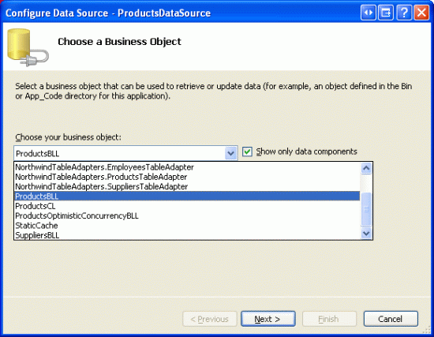](batch-updating-cs/_static/image3.png)

**Figure 2**: Configure the ObjectDataSource to Use the `ProductsBLL` Class ([Click to view full-size image](batch-updating-cs/_static/image4.png))

[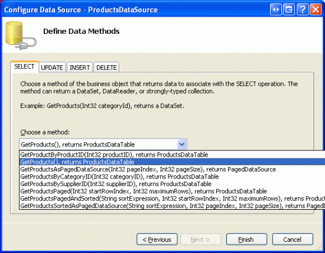](batch-updating-cs/_static/image5.png)

**Figure 3**: Retrieve the Product Data Using the `GetProducts` Method ([Click to view full-size image](batch-updating-cs/_static/image6.png))

Like the GridView, the ObjectDataSource s modification features are designed to work on a per-row basis. In order to update a set of records, we'll need to write a bit of code in the ASP.NET page s code-behind class that batches the data and passes it to the BLL. Therefore, set the drop-down lists in the ObjectDataSource s UPDATE, INSERT, and DELETE tabs to (None) . Click Finish to complete the wizard.

[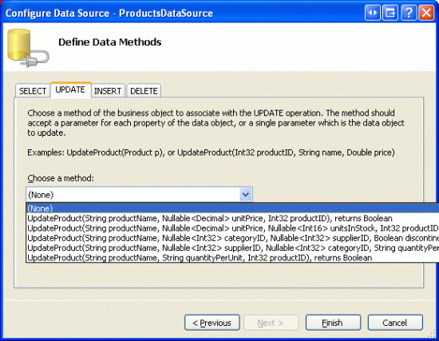](batch-updating-cs/_static/image7.png)

**Figure 4**: Set the Drop-Down Lists in the UPDATE, INSERT, and DELETE Tabs to (None) ([Click to view full-size image](batch-updating-cs/_static/image8.png))

After completing the Configure Data Source wizard, the ObjectDataSource s declarative markup should look like the following:

    <asp:ObjectDataSource ID="ProductsDataSource" runat="server" 
        OldValuesParameterFormatString="original_{0}"
        SelectMethod="GetProducts" TypeName="ProductsBLL">
    </asp:ObjectDataSource>

Completing the Configure Data Source wizard also causes Visual Studio to create BoundFields and a CheckBoxField for the product data fields in the GridView. For this tutorial, let s only allow the user to view and edit the product s name, category, price, and discontinued status. Remove all but the `ProductName`, `CategoryName`, `UnitPrice`, and `Discontinued` fields and rename the `HeaderText` properties of the first three fields to Product , Category , and Price , respectively. Lastly, check the Enable Paging and Enable Sorting checkboxes in the GridView s smart tag.

At this point the GridView has three BoundFields (`ProductName`, `CategoryName`, and `UnitPrice`) and a CheckBoxField (`Discontinued`). We need to convert these four fields into TemplateFields and then move the editing interface from the TemplateField s `EditItemTemplate` to its `ItemTemplate`.

> [!NOTE] We explored creating and customizing TemplateFields in the [Customizing the Data Modification Interface](../editing-inserting-and-deleting-data/customizing-the-data-modification-interface-cs.md) tutorial. We'll walk through the steps of converting the BoundFields and CheckBoxField into TemplateFields and defining their editing interfaces in their `ItemTemplate` s, but if you get stuck or need a refresher, don t hesitate to refer back to this earlier tutorial.

From the GridView s smart tag, click the Edit Columns link to open the Fields dialog box. Next, select each field and click the Convert this field into a TemplateField link.

**Figure 5**: Convert the Existing BoundFields and CheckBoxField Into TemplateField

Now that each field is a TemplateField, we re ready to move the editing interface from the `EditItemTemplate` s to the `ItemTemplate` s.

## Step 2: Creating the`ProductName`,`UnitPrice`, and`Discontinued`Editing Interfaces

Creating the `ProductName`, `UnitPrice`, and `Discontinued` editing interfaces are the topic of this step and are pretty straightforward, as each interface is already defined in the TemplateField s `EditItemTemplate`. Creating the `CategoryName` editing interface is a bit more involved since we need to create a DropDownList of the applicable categories. This `CategoryName` editing interface is tackled in Step 3.

Let s start with the `ProductName` TemplateField. Click on the Edit Templates link from the GridView s smart tag and drill down to the `ProductName` TemplateField s `EditItemTemplate`. Select the TextBox, copy it to the clipboard, and then paste it to the `ProductName` TemplateField s `ItemTemplate`. Change the TextBox s `ID` property to `ProductName`.

Next, add a RequiredFieldValidator to the `ItemTemplate` to ensure that the user provides a value for each product s name. Set the `ControlToValidate` property to ProductName , the `ErrorMessage` property to You must provide the product's name. and the `Text` property to \* . After making these additions to the `ItemTemplate`, your screen should look similar to Figure 6.

[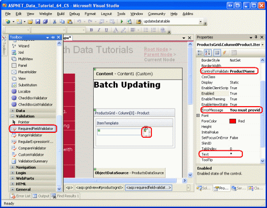](batch-updating-cs/_static/image9.png)

**Figure 6**: The `ProductName` TemplateField Now Includes a TextBox and a RequiredFieldValidator ([Click to view full-size image](batch-updating-cs/_static/image10.png))

For the `UnitPrice` editing interface, start by copying the TextBox from the `EditItemTemplate` to the `ItemTemplate`. Next, place a $ in front of the TextBox and set its `ID` property to UnitPrice and its `Columns` property to 8 .

Also add a CompareValidator to the `UnitPrice` s `ItemTemplate` to ensure that the value entered by the user is a valid currency value greater than or equal to $0.00. Set the validator s `ControlToValidate` property to UnitPrice , its `ErrorMessage` property to You must enter a valid currency value. Please omit any currency symbols. , its `Text` property to \* , its `Type` property to `Currency`, its `Operator` property to `GreaterThanEqual`, and its `ValueToCompare` property to 0 .

[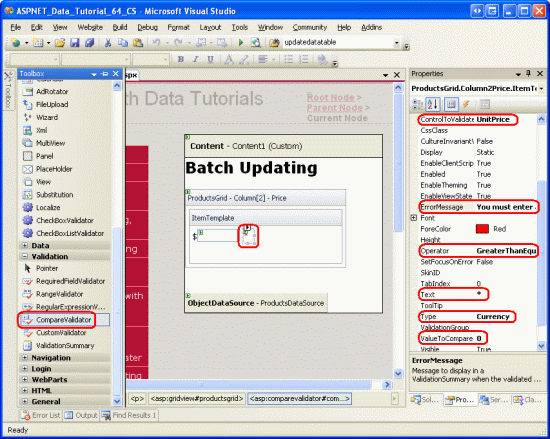](batch-updating-cs/_static/image11.png)

**Figure 7**: Add a CompareValidator to Ensure the Price Entered is a Non-Negative Currency Value ([Click to view full-size image](batch-updating-cs/_static/image12.png))

For the `Discontinued` TemplateField you can use the CheckBox already defined in the `ItemTemplate`. Simply set its `ID` to Discontinued and its `Enabled` property to `true`.

## Step 3: Creating the`CategoryName`Editing Interface

The editing interface in the `CategoryName` TemplateField s `EditItemTemplate` contains a TextBox that displays the value of the `CategoryName` data field. We need to replace this with a DropDownList that lists the possible categories.

> [!NOTE] The [Customizing the Data Modification Interface](../editing-inserting-and-deleting-data/customizing-the-data-modification-interface-cs.md) tutorial contains a more thorough and complete discussion on customizing a template to include a DropDownList as opposed to a TextBox. While the steps here are complete, they are presented tersely. For a more in-depth look at creating and configuring the categories DropDownList, refer back to the [Customizing the Data Modification Interface](../editing-inserting-and-deleting-data/customizing-the-data-modification-interface-cs.md) tutorial.

Drag a DropDownList from the Toolbox onto the `CategoryName` TemplateField s `ItemTemplate`, setting its `ID` to `Categories`. At this point we would usually define the DropDownLists s data source through its smart tag, creating a new ObjectDataSource. However, this will add the ObjectDataSource within the `ItemTemplate`, which will result in an ObjectDataSource instance created for each GridView row. Instead, let s create the ObjectDataSource outside of the GridView s TemplateFields. End the template editing and drag an ObjectDataSource from the Toolbox onto the Designer beneath the `ProductsDataSource` ObjectDataSource. Name the new ObjectDataSource `CategoriesDataSource` and configure it to use the `CategoriesBLL` class s `GetCategories` method.

[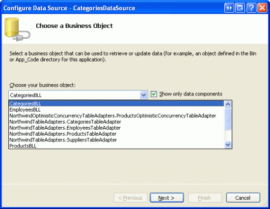](batch-updating-cs/_static/image13.png)

**Figure 8**: Configure the ObjectDataSource to Use the `CategoriesBLL` Clas ([Click to view full-size image](batch-updating-cs/_static/image14.png))

[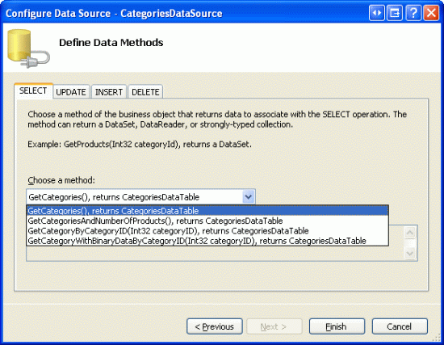](batch-updating-cs/_static/image15.png)

**Figure 9**: Retrieve the Category Data Using the `GetCategories` Method ([Click to view full-size image](batch-updating-cs/_static/image16.png))

Since this ObjectDataSource is used merely to retrieve data, set the drop-down lists in the UPDATE and DELETE tabs to (None) . Click Finish to complete the wizard.

[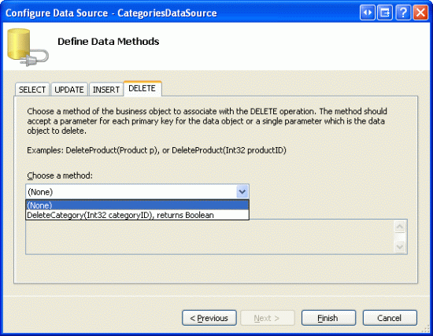](batch-updating-cs/_static/image17.png)

**Figure 10**: Set the Drop-Down Lists in the UPDATE and DELETE Tabs to (None) ([Click to view full-size image](batch-updating-cs/_static/image18.png))

After completing the wizard, the `CategoriesDataSource` s declarative markup should look like the following:

    <asp:ObjectDataSource ID="CategoriesDataSource" runat="server" 
        OldValuesParameterFormatString="original_{0}"
        SelectMethod="GetCategories" TypeName="CategoriesBLL">
    </asp:ObjectDataSource>

With the `CategoriesDataSource` created and configured, return to the `CategoryName` TemplateField s `ItemTemplate` and, from the DropDownList s smart tag, click on the Choose Data Source link. In the Data Source Configuration wizard, select the `CategoriesDataSource` option from the first drop-down list and choose to have `CategoryName` used for the display and `CategoryID` as the value.

[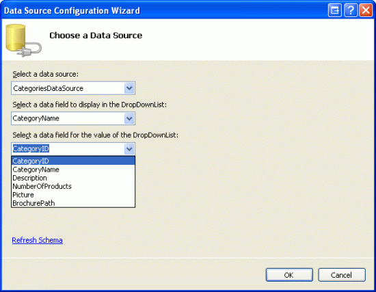](batch-updating-cs/_static/image19.png)

**Figure 11**: Bind the DropDownList to the `CategoriesDataSource` ([Click to view full-size image](batch-updating-cs/_static/image20.png))

At this point the `Categories` DropDownList lists all of the categories, but it does not yet automatically select the appropriate category for the product bound to the GridView row. To accomplish this we need to set the `Categories` DropDownList s `SelectedValue` to the product s `CategoryID` value. Click on the Edit DataBindings link from the DropDownList s smart tag and associate the `SelectedValue` property with the `CategoryID` data field as shown in Figure 12.

**Figure 12**: Bind the Product s `CategoryID` Value to the DropDownList s `SelectedValue` Property

One last problem remains: if the product doesn t have a `CategoryID` value specified then the databinding statement on `SelectedValue` will result in an exception. This is because the DropDownList contains only items for the categories and does not offer an option for those products that have a `NULL` database value for `CategoryID`. To remedy this, set the DropDownList s `AppendDataBoundItems` property to `true` and add a new item to the DropDownList, omitting the `Value` property from the declarative syntax. That is, make sure that the `Categories` DropDownList s declarative syntax looks like the following:

    <asp:DropDownList ID="Categories" runat="server" AppendDataBoundItems="True" 
        DataSourceID="CategoriesDataSource" DataTextField="CategoryName" 
        DataValueField="CategoryID" SelectedValue='<%# Bind("CategoryID") %>'>
        <asp:ListItem Value=">-- Select One --</asp:ListItem>
    </asp:DropDownList>

Note how the `<asp:ListItem Value="">` -- Select One -- has its `Value` attribute explicitly set to an empty string. Refer back to the [Customizing the Data Modification Interface](../editing-inserting-and-deleting-data/customizing-the-data-modification-interface-cs.md) tutorial for a more thorough discussion on why this additional DropDownList item is needed to handle the `NULL` case and why assignment of the `Value` property to an empty string is essential.

> [!NOTE] There is a potential performance and scalability issue here that is worth mentioning. Since each row has a DropDownList that uses the `CategoriesDataSource` as its data source, the `CategoriesBLL` class s `GetCategories` method will be called *n* times per page visit, where *n* is the number of rows in the GridView. These *n* calls to `GetCategories` result in *n* queries to the database. This impact on the database could be lessened by caching the returned categories either in a per-request cache or through the Caching Layer using a SQL caching dependency or a very short time-based expiry. For more information on the per-request caching option, see [`HttpContext.Items` a Per-Request Cache Store](http://aspnet.4guysfromrolla.com/articles/060904-1.aspx).

## Step 4: Completing the Editing Interface

We ve made a number of changes to the GridView s templates without pausing to view our progress. Take a moment to view our progress through a browser. As Figure 13 shows, each row is rendered using its `ItemTemplate`, which contains the cell s editing interface.

[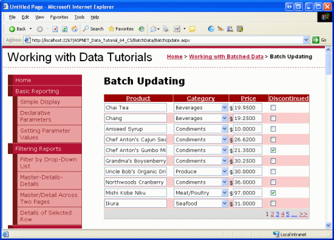](batch-updating-cs/_static/image21.png)

**Figure 13**: Each GridView Row is Editable ([Click to view full-size image](batch-updating-cs/_static/image22.png))

There are a few minor formatting issues that we should take care of at this point. First, note that the `UnitPrice` value contains four decimal points. To fix this, return to the `UnitPrice` TemplateField s `ItemTemplate` and, from the TextBox s smart tag, click on the Edit DataBindings link. Next, specify that the `Text` property should be formatted as a number.

**Figure 14**: Format the `Text` Property as a Number

Second, let s center the checkbox in the `Discontinued` column (rather than having it left-aligned). Click on Edit Columns from the GridView s smart tag and select the `Discontinued` TemplateField from the list of fields in the bottom left corner. Drill down into `ItemStyle` and set the `HorizontalAlign` property to Center as shown in Figure 15.

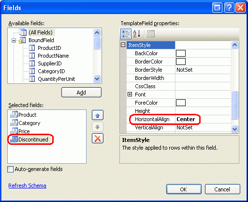

**Figure 15**: Center the `Discontinued` CheckBox

Next, add a ValidationSummary control to the page and set its `ShowMessageBox` property to `true` and its `ShowSummary` property to `false`. Also add the Button Web controls that, when clicked, will update the user s changes. Specifically, add two Button Web controls, one above the GridView and one below it, setting both controls `Text` properties to Update Products .

Since the GridView s editing interface is defined in its TemplateFields `ItemTemplate` s, the `EditItemTemplate` s are superfluous and may be deleted.

After making the above mentioned formatting changes, adding the Button controls, and removing the unnecessary `EditItemTemplate` s, your page s declarative syntax should look like the following:

    

        <asp:Button ID="UpdateAllProducts1" runat="server" Text="Update Products" />
    

    

        <asp:GridView ID="ProductsGrid" runat="server" AutoGenerateColumns="False" 
            DataKeyNames="ProductID" DataSourceID="ProductsDataSource" 
            AllowPaging="True" AllowSorting="True">
            <Columns>
                <asp:TemplateField HeaderText="Product" SortExpression="ProductName">
                    <ItemTemplate>
                        <asp:TextBox ID="ProductName" runat="server" 
                            Text='<%# Bind("ProductName") %>'></asp:TextBox>
                        <asp:RequiredFieldValidator ID="RequiredFieldValidator1" 
                            ControlToValidate="ProductName"
                            ErrorMessage="You must provide the product's name." 
                            runat="server">*</asp:RequiredFieldValidator>
                    </ItemTemplate>
                </asp:TemplateField>
                <asp:TemplateField HeaderText="Category" 
                    SortExpression="CategoryName">
                    <ItemTemplate>
                        <asp:DropDownList ID="Categories" runat="server" 
                            AppendDataBoundItems="True" 
                            DataSourceID="CategoriesDataSource"
                            DataTextField="CategoryName" 
                            DataValueField="CategoryID" 
                            SelectedValue='<%# Bind("CategoryID") %>'>
                            <asp:ListItem>-- Select One --</asp:ListItem>
                        </asp:DropDownList>
                    </ItemTemplate>
                </asp:TemplateField>
                <asp:TemplateField HeaderText="Price" 
                    SortExpression="UnitPrice">
                    <ItemTemplate>
                        $<asp:TextBox ID="UnitPrice" runat="server" Columns="8" 
                            Text='<%# Bind("UnitPrice", "{0:N}") %>'></asp:TextBox>
                        <asp:CompareValidator ID="CompareValidator1" runat="server" 
                            ControlToValidate="UnitPrice"
                            ErrorMessage="You must enter a valid currency value. 
                                          Please omit any currency symbols."
                            Operator="GreaterThanEqual" Type="Currency" 
                            ValueToCompare="0">*</asp:CompareValidator>
                    </ItemTemplate>
                </asp:TemplateField>
                <asp:TemplateField HeaderText="Discontinued" SortExpression="Discontinued">
                    <ItemTemplate>
                        <asp:CheckBox ID="Discontinued" runat="server" 
                            Checked='<%# Bind("Discontinued") %>' />
                    </ItemTemplate>
                    <ItemStyle HorizontalAlign="Center" />
                </asp:TemplateField>
            </Columns>
        </asp:GridView>
    

    

        <asp:Button ID="UpdateAllProducts2" runat="server" Text="Update Products" />
        <asp:ObjectDataSource ID="ProductsDataSource" runat="server" 
            OldValuesParameterFormatString="original_{0}"
            SelectMethod="GetProducts" TypeName="ProductsBLL">
        </asp:ObjectDataSource>
        <asp:ObjectDataSource ID="CategoriesDataSource" runat="server" 
            OldValuesParameterFormatString="original_{0}"
            SelectMethod="GetCategories" TypeName="CategoriesBLL">
        </asp:ObjectDataSource>
        <asp:ValidationSummary ID="ValidationSummary1" runat="server" 
            ShowMessageBox="True" ShowSummary="False" />
    

Figure 16 shows this page when viewed through a browser after the Button Web controls have been added and the formatting changes made.

[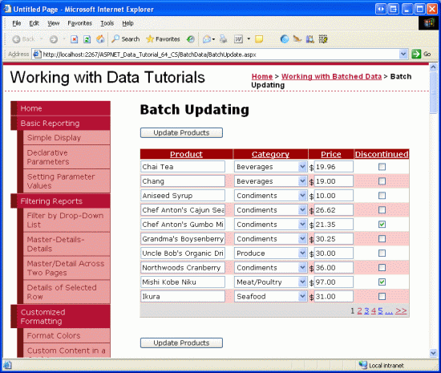](batch-updating-cs/_static/image23.png)

**Figure 16**: The Page Now Includes Two Update Products Buttons ([Click to view full-size image](batch-updating-cs/_static/image24.png))

## Step 5: Updating the Products

When a user visits this page they will make their modifications and then click one of the two Update Products buttons. At that point we need to somehow save the user-entered values for each row into a `ProductsDataTable` instance and then pass that to a BLL method that will then pass that `ProductsDataTable` instance to the DAL s `UpdateWithTransaction` method. The `UpdateWithTransaction` method, which we created in the [preceding tutorial](wrapping-database-modifications-within-a-transaction-cs.md), ensures that the batch of changes will be updated as an atomic operation.

Create a method named `BatchUpdate` in `BatchUpdate.aspx.cs` and add the following code:

    private void BatchUpdate()
    {
        // Enumerate the GridView's Rows collection and create a ProductRow
        ProductsBLL productsAPI = new ProductsBLL();
        Northwind.ProductsDataTable products = productsAPI.GetProducts();
        foreach (GridViewRow gvRow in ProductsGrid.Rows)
        {
            // Find the ProductsRow instance in products that maps to gvRow
            int productID = Convert.ToInt32(ProductsGrid.DataKeys[gvRow.RowIndex].Value);
            Northwind.ProductsRow product = products.FindByProductID(productID);
            if (product != null)
            {
                // Programmatically access the form field elements in the 
                // current GridViewRow
                TextBox productName = (TextBox)gvRow.FindControl("ProductName");
                DropDownList categories = 
                    (DropDownList)gvRow.FindControl("Categories");
                TextBox unitPrice = (TextBox)gvRow.FindControl("UnitPrice");
                CheckBox discontinued = 
                    (CheckBox)gvRow.FindControl("Discontinued");
                // Assign the user-entered values to the current ProductRow
                product.ProductName = productName.Text.Trim();
                if (categories.SelectedIndex == 0) 
                    product.SetCategoryIDNull(); 
                else 
                    product.CategoryID = Convert.ToInt32(categories.SelectedValue);
                if (unitPrice.Text.Trim().Length == 0) 
                    product.SetUnitPriceNull(); 
                else 
                    product.UnitPrice = Convert.ToDecimal(unitPrice.Text);
                product.Discontinued = discontinued.Checked;
            }
        }
        // Now have the BLL update the products data using a transaction
        productsAPI.UpdateWithTransaction(products);
    }

This method starts out by getting all of the products back in a `ProductsDataTable` via a call to the BLL s `GetProducts` method. It then enumerates the `ProductGrid` GridView s [`Rows` collection](https://msdn.microsoft.com/en-us/library/system.web.ui.webcontrols.gridview.rows(VS.80).aspx). The `Rows` collection contains a [`GridViewRow` instance](https://msdn.microsoft.com/en-us/library/system.web.ui.webcontrols.gridviewrow.aspx) for each row displayed in the GridView. Since we are showing at most ten rows per page, the GridView s `Rows` collection will have no more than ten items.

For each row the `ProductID` is grabbed from the `DataKeys` collection and the appropriate `ProductsRow` is selected from the `ProductsDataTable`. The four TemplateField input controls are programmatically referenced and their values assigned to the `ProductsRow` instance s properties. After each GridView row s values have been used to update the `ProductsDataTable`, it s passed to the BLL s `UpdateWithTransaction` method which, as we saw in the preceding tutorial, simply calls down into the DAL s `UpdateWithTransaction` method.

The batch update algorithm used for this tutorial updates each row in the `ProductsDataTable` that corresponds to a row in the GridView, regardless of whether the product s information has been changed. While such blind updates aren t usually a performance issue, they can lead to superfluous records if you re auditing changes to the database table. Back in the [Performing Batch Updates](../editing-and-deleting-data-through-the-datalist/performing-batch-updates-cs.md) tutorial we explored a batch updating interface with the DataList and added code that would only update those records that were actually modified by the user. Feel free to use the techniques from [Performing Batch Updates](../editing-and-deleting-data-through-the-datalist/performing-batch-updates-cs.md) to update the code in this tutorial, if desired.

> [!NOTE] When binding the data source to the GridView through its smart tag, Visual Studio automatically assigns the data source s primary key value(s) to the GridView s `DataKeyNames` property. If you did not bind the ObjectDataSource to the GridView through the GridView s smart tag as outlined in Step 1, then you will need to manually set the GridView s `DataKeyNames` property to ProductID in order to access the `ProductID` value for each row through the `DataKeys` collection.

The code used in `BatchUpdate` is similar to that used in the BLL s `UpdateProduct` methods, the main difference being that in the `UpdateProduct` methods only a single `ProductRow` instance is retrieved from the architecture. The code that assigns the properties of the `ProductRow` is the same between the `UpdateProducts` methods and the code within the `foreach` loop in `BatchUpdate`, as is the overall pattern.

To complete this tutorial, we need to have the `BatchUpdate` method invoked when either of the Update Products buttons is clicked. Create event handlers for the `Click` events of these two Button controls and add the following code in the event handlers:

    BatchUpdate();
    ClientScript.RegisterStartupScript(this.GetType(), "message", 
        "alert('The products have been updated.');", true);

First a call is made to `BatchUpdate`. Next, the `ClientScript property` is used to inject JavaScript that will display a messagebox that reads The products have been updated.

Take a minute to test out this code. Visit `BatchUpdate.aspx` through a browser, edit a number of rows, and click one of the Update Products buttons. Assuming there are no input validation errors, you should see a messagebox that reads The products have been updated. To verify the atomicity of the update, consider adding a random `CHECK` constraint, like one that disallows `UnitPrice` values of 1234.56 . Then from `BatchUpdate.aspx`, edit a number of records, making sure to set one of the product s `UnitPrice` value to the forbidden value ( 1234.56 ). This should result in an error when clicking Update Products with the other changes during that batch operation rolled back to their original values.

## An Alternative`BatchUpdate`Method

The `BatchUpdate` method we just examined retrieves *all* of the products from the BLL s `GetProducts` method and then updates just those records that appear in the GridView. This approach is ideal if the GridView does not use paging, but if it does, there may be hundreds, thousands, or tens of thousands of products, but only ten rows in the GridView. In such a case, getting all of the products from the database only to modify 10 of them is less than ideal.

For those types of situations, consider using the following `BatchUpdateAlternate` method instead:

    private void BatchUpdateAlternate()
    {
        // Enumerate the GridView's Rows collection and create a ProductRow
        ProductsBLL productsAPI = new ProductsBLL();
        Northwind.ProductsDataTable products = new Northwind.ProductsDataTable();
        foreach (GridViewRow gvRow in ProductsGrid.Rows)
        {
            // Create a new ProductRow instance
            int productID = Convert.ToInt32(ProductsGrid.DataKeys[gvRow.RowIndex].Value);
            
            Northwind.ProductsDataTable currentProductDataTable = 
                productsAPI.GetProductByProductID(productID);
            if (currentProductDataTable.Rows.Count > 0)
            {
                Northwind.ProductsRow product = currentProductDataTable[0];
                // Programmatically access the form field elements in the 
                // current GridViewRow
                TextBox productName = (TextBox)gvRow.FindControl("ProductName");
                DropDownList categories = 
                    (DropDownList)gvRow.FindControl("Categories");
                TextBox unitPrice = (TextBox)gvRow.FindControl("UnitPrice");
                CheckBox discontinued = 
                    (CheckBox)gvRow.FindControl("Discontinued");
                // Assign the user-entered values to the current ProductRow
                product.ProductName = productName.Text.Trim();
                if (categories.SelectedIndex == 0) 
                    product.SetCategoryIDNull(); 
                else 
                    product.CategoryID = Convert.ToInt32(categories.SelectedValue);
                if (unitPrice.Text.Trim().Length == 0) 
                    product.SetUnitPriceNull(); 
                else 
                    product.UnitPrice = Convert.ToDecimal(unitPrice.Text);
                product.Discontinued = discontinued.Checked;
                // Import the ProductRow into the products DataTable
                products.ImportRow(product);
            }
        }
        // Now have the BLL update the products data using a transaction
        productsAPI.UpdateProductsWithTransaction(products);
    }

`BatchMethodAlternate` starts by creating a new empty `ProductsDataTable` named `products`. It then steps through the GridView s `Rows` collection and for each row gets the particular product information using the BLL s `GetProductByProductID(productID)` method. The retrieved `ProductsRow` instance has its properties updated in the same fashion as `BatchUpdate`, but after updating the row it is imported into the `products``ProductsDataTable` via the DataTable s [`ImportRow(DataRow)` method](https://msdn.microsoft.com/en-us/library/system.data.datatable.importrow(VS.80).aspx).

After the `foreach` loop completes, `products` contains one `ProductsRow` instance for each row in the GridView. Since each of the `ProductsRow` instances have been added to the `products` (instead of updated), if we blindly pass it to the `UpdateWithTransaction` method the `ProductsTableAdatper` will try to insert each of the records into the database. Instead, we need to specify that each of these rows has been modified (not added).

This can be accomplished by adding a new method to the BLL named `UpdateProductsWithTransaction`. `UpdateProductsWithTransaction`, shown below, sets the `RowState` of each of the `ProductsRow` instances in the `ProductsDataTable` to `Modified` and then passes the `ProductsDataTable` to the DAL s `UpdateWithTransaction` method.

    public int UpdateProductsWithTransaction(Northwind.ProductsDataTable products)
    {
        // Mark each product as Modified
        products.AcceptChanges();
        foreach (Northwind.ProductsRow product in products)
            product.SetModified();
        // Update the data via a transaction
        return UpdateWithTransaction(products);
    }

## Summary

The GridView provides built-in per-row editing capabilities, but lacks support for creating fully editable interfaces. As we saw in this tutorial, such interfaces are possible, but require a bit of work. To create a GridView where every row is editable, we need to convert the GridView s fields into TemplateFields and define the editing interface within the `ItemTemplate` s. Additionally, Update All -type Button Web controls must be added to the page, separate from the GridView. These Buttons `Click` event handlers need to enumerate the GridView s `Rows` collection, store the changes in a `ProductsDataTable`, and pass the updated information into the appropriate BLL method.

In the next tutorial we'll see how to create an interface for batch deleting. In particular, each GridView row will include a checkbox and instead of Update All -type buttons, we'll have Delete Selected Rows buttons.

Happy Programming!

## About the Author

[Scott Mitchell](http://www.4guysfromrolla.com/ScottMitchell.shtml), author of seven ASP/ASP.NET books and founder of [4GuysFromRolla.com](http://www.4guysfromrolla.com), has been working with Microsoft Web technologies since 1998. Scott works as an independent consultant, trainer, and writer. His latest book is [*Sams Teach Yourself ASP.NET 2.0 in 24 Hours*](https://www.amazon.com/exec/obidos/ASIN/0672327384/4guysfromrollaco). He can be reached at [mitchell@4GuysFromRolla.com.](mailto:mitchell@4GuysFromRolla.com) or via his blog, which can be found at [http://ScottOnWriting.NET](http://ScottOnWriting.NET).

## Special Thanks To

This tutorial series was reviewed by many helpful reviewers. Lead reviewers for this tutorial were Teresa Murphy and David Suru. Interested in reviewing my upcoming MSDN articles? If so, drop me a line at [mitchell@4GuysFromRolla.com.](mailto:mitchell@4GuysFromRolla.com)

>[!div class="step-by-step"] [Previous](wrapping-database-modifications-within-a-transaction-cs.md) [Next](batch-deleting-cs.md)