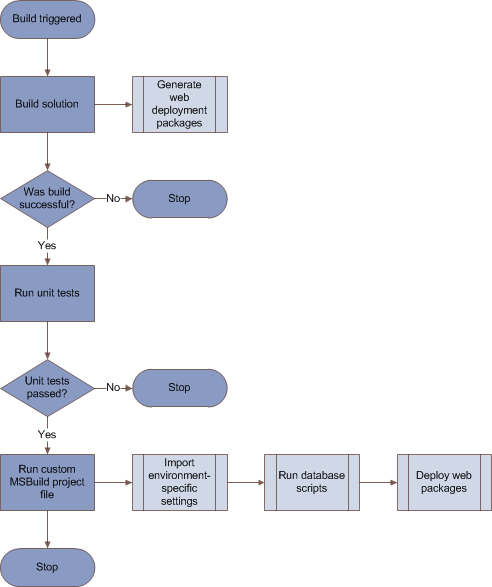
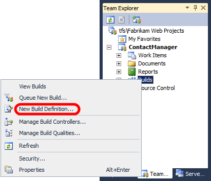
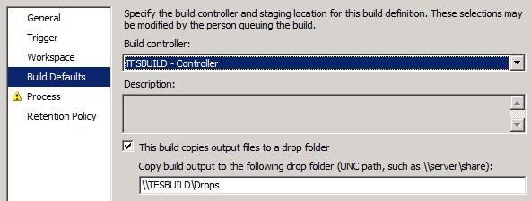
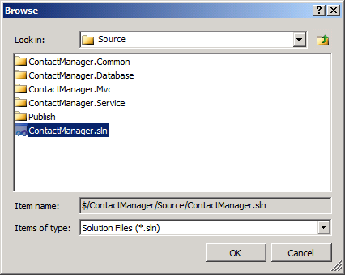
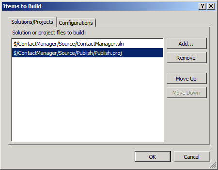
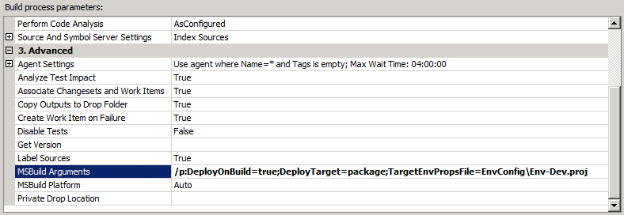
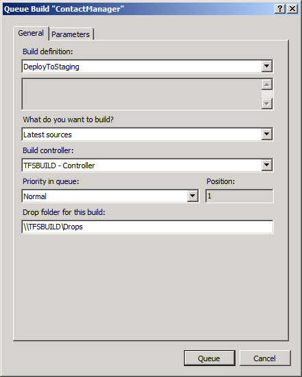
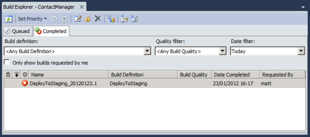
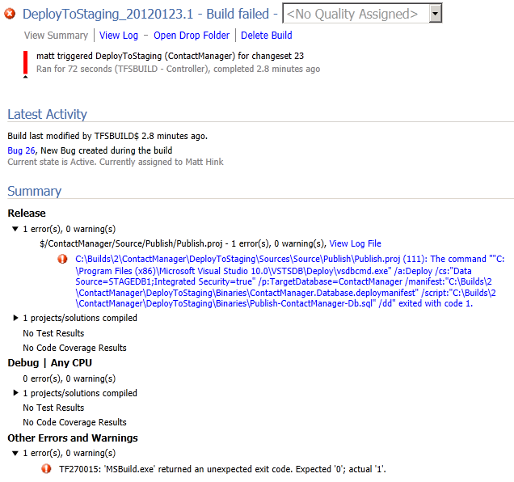

Creating a Build Definition That Supports Deployment
====================
by [Jason Lee](https://github.com/jrjlee)

[Download PDF](https://msdnshared.blob.core.windows.net/media/MSDNBlogsFS/prod.evol.blogs.msdn.com/CommunityServer.Blogs.Components.WeblogFiles/00/00/00/63/56/8130.DeployingWebAppsInEnterpriseScenarios.pdf)

> If you want to perform any kind of build in Team Foundation Server (TFS) 2010, you need to create a build definition within your team project. This topic describes how to create a new build definition in TFS and how to control web deployment as part of the build process in Team Build.

This topic forms part of a series of tutorials based around the enterprise deployment requirements of a fictional company named Fabrikam, Inc. This tutorial series uses a sample solution&#x2014;the [Contact Manager solution](../web-deployment-in-the-enterprise/the-contact-manager-solution.md)&#x2014;to represent a web application with a realistic level of complexity, including an ASP.NET MVC 3 application, a Windows Communication Foundation (WCF) service, and a database project.

The deployment method at the heart of these tutorials is based on the split project file approach described in [Understanding the Project File](../web-deployment-in-the-enterprise/understanding-the-project-file.md), in which the build and deployment process is controlled by two project files&#x2014;one containing build instructions that apply to every destination environment, and one containing environment-specific build and deployment settings. At build time, the environment-specific project file is merged into the environment-agnostic project file to form a complete set of build instructions.

## Task Overview

A build definition is the mechanism that controls how and when builds occur for team projects in TFS. Each build definition specifies:

- The things you want to build, like Visual Studio solution files or custom Microsoft Build Engine (MSBuild) project files.
- The criteria that determine when a build should take place, like manual triggers, continuous integration (CI), or gated check-ins.
- The location to which Team Build should send build outputs, including deployment artifacts like web packages and database scripts.
- The amount of time that each build should be retained.
- Various other parameters of the build process.

> [!NOTE] For more information on build definitions, see [Define Your Build Process](https://msdn.microsoft.com/en-us/library/ms181715.aspx).

This topic will show you how to create a build definition that uses CI, so that a build is triggered when a developer checks in new content. If the build succeeds, the build service runs a custom project file to deploy the solution to a test environment.

When you trigger a build, these actions need to happen:

- First, Team Build should build the solution. As part of this process, Team Build will invoke the Web Publishing Pipeline (WPP) to generate web deployment packages for each of the web application projects in the solution. Team Build will also run any unit tests associated with the solution.
- If the solution build fails, Team Build should take no further action. Unit test failures should be treated as a build failure.
- If the solution build succeeds, Team Build should run the custom project file that controls the deployment of the solution. As part of this process, Team Build will invoke the Internet Information Services (IIS) Web Deployment Tool (Web Deploy) to install the packaged web applications on the destination web servers, and it will invoke the VSDBCMD.exe utility to run database creation scripts on the destination database servers.

This illustrates the process:

The [Contact Manager](../web-deployment-in-the-enterprise/the-contact-manager-solution.md) sample solution includes a custom MSBuild project file, *Publish.proj*, that you can run from MSBuild or Team Build. As described in [Understanding the Build Process](../web-deployment-in-the-enterprise/understanding-the-build-process.md), this project file defines the logic that deploys your web packages and databases to a target environment. The file includes logic that omits the building and packaging process if it&#x27;s running in Team Build, leaving just the deployment tasks to run. This is because when you automate deployment in this way, you&#x27;ll typically want to ensure that the solution builds successfully and passes any unit tests before the deployment process commences.

The next section explains how to implement this process by creating a new build definition.

> [!NOTE] This procedure&#x2014;in which a single automated process builds, tests, and deploys a solution&#x2014;is likely to be most suited to deployment to test environments. For staging and production environments you&#x27;re a lot more likely to want to deploy content from a previous build that you&#x27;ve already verified and validated in a test environment. This approach is described in the next topic, [Deploying a Specific Build](deploying-a-specific-build.md).

### Who Performs This Procedure?

Typically, a TFS administrator performs this procedure. In some cases, a developer team leader may take responsibility for the team project collection in TFS. In order to create a new build definition, you need to be a member of the **Project Collection Build Administrators** group for the team project collection that contains your solution.

## Create a Build Definition for CI and Deployment

The next procedure describes how to create a build definition that CI triggers. If the build succeeds, the solution is deployed using the logic in a custom MSBuild project file.

**To create a build definition for CI and deployment**

1. In Visual Studio 2010, in the **Team Explorer** window, expand your team project node, right-click **Builds**, and then click **New Build Definition**.

    
2. On the **General** tab, give the build definition a name (for example, **DeployToTest**) and an optional description.
3. On the **Trigger** tab, select the criteria on which you want to trigger a new build. For example, if you want to build the solution and deploy to the test environment every time a developer checks in new code, select **Continuous Integration**.
4. On the **Build Defaults** tab, in the **Copy build output to the following drop folder** box, type the Universal Naming Convention (UNC) path of your drop folder (for example, **\\TFSBUILD\Drops**).

    

    > [!NOTE] This drop location stores several builds, depending on the retention policy you configure. When you want to publish deployment artifacts from a specific build to a staging or production environment, this is where you&#x27;ll find them.
5. On the **Process** tab, in the **Build process file** dropdown list, leave **DefaultTemplate.xaml** selected. This is one of the default build process templates that get added to all new team projects.
6. In the **Build process parameters** table, click in the **Items to Build** row, and then click the **ellipsis** button.

    
7. In the **Items to Build** dialog box, click **Add**.
8. Browse to the location of your solution file, and then click **OK**.

    
9. In the **Items to Build** dialog box, click **Add**.
10. In the **Items of type** dropdown list, select **MSBuild Project files**.
11. Browse to the location of the custom project file with which you control the deployment process, select the file, and then click **OK**.

    
12. The **Items to Build** dialog box should now show two items. Click **OK**.

    
13. On the **Process** tab, in the **Build process parameters** table, expand the **Advanced** section.
14. In the **MSBuild Arguments** row, add any MSBuild command-line arguments that *either* of your items to build requires. In the Contact Manager solution scenario, these arguments are required:

    [!code[Main](creating-a-build-definition-that-supports-deployment/samples/sample1.xml)]

    
15. In this example:

    1. The **DeployOnBuild=true** and **DeployTarget=package** arguments are required when you build the Contact Manager solution. This instructs MSBuild to create web deployment packages after building each web application project, as described in [Building and Packaging Web Application Projects](../web-deployment-in-the-enterprise/building-and-packaging-web-application-projects.md).
    2. The **TargetEnvPropsFile** argument is required when you build the *Publish.proj* file. This property indicates the location of the environment-specific configuration file, as described in [Understanding the Build Process](../web-deployment-in-the-enterprise/understanding-the-build-process.md).
16. On the **Retention Policy** tab, configure how many builds of each type you want to retain as required.
17. Click **Save**.

## Queue a Build

At this point, you have created at least one new build definition. The build process you defined will now run according to the triggers you specified in the build definition.

If you&#x27;ve configured your build definition to use CI, you can test your build definition in two ways:

- Check in some content to the team project to trigger an automatic build.
- Queue a build manually.

**To queue a build manually**

1. In the **Team Explorer** window, right-click the build definition, and then click **Queue New Build**.

    
2. In the **Queue Build** dialog box, review the build properties, and then click **Queue**.

    

To review the progress and the outcome of a build&#x2014;regardless of whether it was triggered manually or automatically&#x2014;double-click the build definition in the **Team Explorer** window. This will open a **Build Explorer** tab.

From here, you can troubleshoot failed builds. If you double-click an individual build, you can view summary information and click through to detailed log files.

You can use this information to troubleshoot failed builds and address any problems before you attempt another build.

> [!NOTE] Builds that execute deployment logic are likely to fail until you have granted the build server any permissions required in the destination environment. For more information, see [Configuring Permissions for Team Build Deployment](configuring-permissions-for-team-build-deployment.md).

## Monitor the Build Process

TFS provides a broad range of functionality to help you monitor the build process. For example, TFS can send you an email or display alerts in your taskbar notification area when a build has completed. For more information, see [Run and Monitor Builds](https://msdn.microsoft.com/en-us/library/ms181721.aspx).

## Conclusion

This topic described how to create a build definition in TFS. The build definition is configured for CI, so the build process runs whenever a developer checks in content to the team project. The build definition executes a custom MSBuild project file to deploy web packages and database scripts to a target server environment.

In order for an automated deployment to succeed as part of a build process, you&#x27;ll need to grant appropriate permissions to the build service account on the target web servers and the target database server. The final topic in this tutorial, [Configuring Permissions for Team Build Deployment](configuring-permissions-for-team-build-deployment.md), describes how to identify and configure the permissions required for automated deployment from a Team Build server.

## Further Reading

For more information on creating build definitions, see [Create a Basic Build Definition](https://msdn.microsoft.com/en-us/library/ms181716.aspx) and [Define Your Build Process](https://msdn.microsoft.com/en-us/library/ms181715.aspx). For more guidance on queuing builds, see [Queue a Build](https://msdn.microsoft.com/en-us/library/ms181722.aspx).

>[!div class="step-by-step"] [Previous](configuring-a-tfs-build-server-for-web-deployment.md) [Next](deploying-a-specific-build.md)