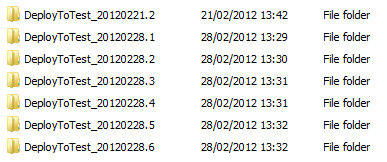
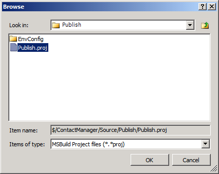
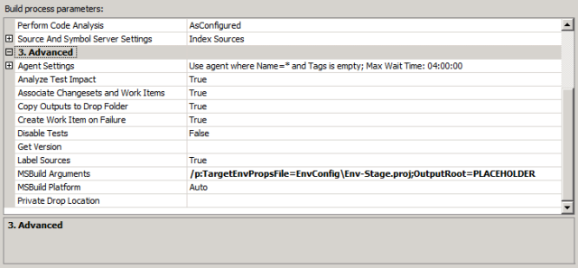
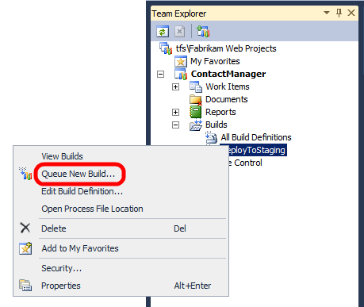

[Edit .md file](C:\Projects\msc\dev\Msc.Www\Web.ASP\App_Data\github\web-forms\overview\deployment\configuring-team-foundation-server-for-web-deployment\deploying-a-specific-build.md) | [Edit dev content](http://www.aspdev.net/umbraco#/content/content/edit/38176) | [View dev content](http://docs.aspdev.net/tutorials/web-forms/overview/deployment/configuring-team-foundation-server-for-web-deployment/deploying-a-specific-build.html) | [View prod content](http://www.asp.net/web-forms/overview/deployment/configuring-team-foundation-server-for-web-deployment/deploying-a-specific-build) | Picker: 38242

Deploying a Specific Build
====================
by [Jason Lee](https://github.com/jrjlee)

[Download PDF](https://msdnshared.blob.core.windows.net/media/MSDNBlogsFS/prod.evol.blogs.msdn.com/CommunityServer.Blogs.Components.WeblogFiles/00/00/00/63/56/8130.DeployingWebAppsInEnterpriseScenarios.pdf)

> This topic describes how to deploy web packages and database scripts from a specific previous build to a new destination, like a staging or production environment.

This topic forms part of a series of tutorials based around the enterprise deployment requirements of a fictional company named Fabrikam, Inc. This tutorial series uses a sample solution&#x2014;the [Contact Manager solution](../web-deployment-in-the-enterprise/the-contact-manager-solution.md)&#x2014;to represent a web application with a realistic level of complexity, including an ASP.NET MVC 3 application, a Windows Communication Foundation (WCF) service, and a database project.

The deployment method at the heart of these tutorials is based on the split project file approach described in [Understanding the Project File](../web-deployment-in-the-enterprise/understanding-the-project-file.md), in which the build and deployment process is controlled by two project files&#x2014;one containing build instructions that apply to every destination environment, and one containing environment-specific build and deployment settings. At build time, the environment-specific project file is merged into the environment-agnostic project file to form a complete set of build instructions.

## Task Overview

Until now, the topics in this tutorial set have focused on how to build, package, and deploy web applications and databases as part of a single-step or automated process. However, in some common scenarios, you&#x27;ll want to select the resources that you deploy from a list of builds in a drop folder. In other words, the latest build may not be the build you want to deploy.

Consider the continuous integration (CI) scenario described in the previous topic, [Creating a Build Definition That Supports Deployment](creating-a-build-definition-that-supports-deployment.md). You&#x27;ve created a build definition in Team Foundation Server (TFS) 2010. Every time a developer checks code into TFS, Team Build will build your code, create web packages and database scripts as part of the build process, run any unit tests, and deploy your resources to a test environment. Depending on the retention policy you configured when you created the build definition, TFS will retain a certain number of previous builds.

Now, suppose you&#x27;ve performed verification and validation testing against one of these builds in your test environment, and you&#x27;re ready to deploy your application to a staging environment. In the meantime, developers may have checked in new code. You don&#x27;t want to rebuild the solution and deploy to the staging environment, and you don&#x27;t want to deploy the latest build to the staging environment. Instead, you want to deploy the specific build that you&#x27;ve verified and validated on the test servers.

To accomplish this, you need to tell the Microsoft Build Engine (MSBuild) where to find the web packages and database scripts that a specific build generated.

## Overriding the OutputRoot Property

In the [sample solution](../web-deployment-in-the-enterprise/the-contact-manager-solution.md), the *Publish.proj* file declares a property named **OutputRoot**. As the name suggests, this is the root folder that contains everything that the build process generates. In the *Publish.proj* file, you can see that the **OutputRoot** property refers to the root location for all deployment resources.

> [!NOTE] **OutputRoot** is a commonly used property name. Visual C# and Visual Basic project files also declare this property to store the root location for all build outputs.

    <PropertyGroup>
      <!--This is where the .deploymanifest file will be written to during a build-->    
      <_DbDeployManifestPath>
        $(OutputRoot)ContactManager.Database.deploymanifest
      </_DbDeployManifestPath>    
      
      <!-- The folder where the .zip and .cmd file will be located for 
                    ContactManager.Mvc Web project -->
      <_ContactManagerDest>
        $(OutputRoot)_PublishedWebsites\ContactManager.Mvc_Package\
      </_ContactManagerDest>
      
      <!-- The folder where the .zip and .cmd file will be located for 
                    ContactManager.Service Web project -->
       <_ContactManagerSvcDest>
        $(OutputRoot)_PublishedWebsites\ContactManager.Service_Package\
      </_ContactManagerSvcDest>
      
      <!-- ... -->
    </PropertyGroup>

If you want your project file to deploy web packages and database scripts from a different location&#x2014;like the outputs of a previous TFS build&#x2014;you simply need to override the **OutputRoot** property. You should set the property value to the relevant build folder on the Team Build server. If you were running MSBuild from the command line, you could specify a value for **OutputRoot** as a command-line argument:

    msbuild.exe Publish.proj /p:TargetEnvPropsFile=EnvConfig\Env-Dev.proj 
      /p:OutputRoot=\\TFSBUILD\Drops\DeployToTest\DeployToTest_20120228.3\

In practice, however, you&#x27;d also want to skip the **Build** target&#x2014;there&#x27;s no point in building your solution if you don&#x27;t plan to use the build outputs. You could do this by specifying the targets you want to execute from the command line:

    msbuild.exe Publish.proj /p:TargetEnvPropsFile=EnvConfig\Env-Dev.proj 
      /p:OutputRoot=\\TFSBUILD\Drops\DeployToTest\DeployToTest_20120228.3\
      /target:GatherPackagesForPublishing;PublishDBPackages;PublishWebPackages

However, in most cases, you&#x27;ll want to build your deployment logic into a TFS build definition. This enables users with the **Queue builds** permission to trigger the deployment from any Visual Studio installation with a connection to the TFS server.

## Creating a Build Definition to Deploy Specific Builds

The next procedure describes how to create a build definition that enables users to trigger deployments to a staging environment with a single command.

In this case, you don&#x27;t want the build definition to actually build anything&#x2014;you just want it to execute the deployment logic in your custom project file. The *Publish.proj* file includes conditional logic that skips the **Build** target if the file is running in Team Build. It does this by evaluating the built-in **BuildingInTeamBuild** property, which is automatically set to **true** if you run your project file in Team Build. As a result, you can skip the build process and simply run the project file to deploy an existing build.

**To create a build definition to trigger deployment manually**

1. In Visual Studio 2010, in the **Team Explorer** window, expand your team project node, right-click **Builds**, and then click **New Build Definition**.

    
2. On the **General** tab, give the build definition a name (for example, **DeployToStaging**) and an optional description.
3. On the **Trigger** tab, select **Manual – Check-ins do not trigger a new build**.
4. On the **Build Defaults** tab, in the **Copy build output to the following drop folder** box, type the Universal Naming Convention (UNC) path of your drop folder (for example, **\\TFSBUILD\Drops**).

    
5. On the **Process** tab, in the **Build process file** dropdown list, leave **DefaultTemplate.xaml** selected. This is one of the default build process templates that get added to all new team projects.
6. In the **Build process parameters** table, click in the **Items to Build** row, and then click the **ellipsis** button.

    
7. In the **Items to Build** dialog box, click **Add**.
8. In the **Items of type** dropdown list, select **MSBuild Project files**.
9. Browse to the location of the custom project file with which you control the deployment process, select the file, and then click **OK**.

    
10. In the **Items to Build** dialog box, click **OK**.
11. In the **Build process parameters** table, expand the **Advanced** section.
12. In the **MSBuild Arguments** row, specify the location of your environment-specific project file and add a placeholder for the location of your build folder:

        /p:TargetEnvPropsFile=EnvConfig\Env-Stage.proj;
        OutputRoot=PLACEHOLDER

    

    > [!NOTE] You&#x27;ll need to override the **OutputRoot** value every time you queue a build. This is covered in the next procedure.
13. Click **Save**.

When you trigger a build, you need to update the **OutputRoot** property to point to the build you want to deploy.

**To deploy a specific build from a build definition**

1. In the **Team Explorer** window, right-click the build definition, and then click **Queue New Build**.

    
2. In the **Queue Build** dialog box, on the **Parameters** tab, expand the **Advanced** section.
3. In the **MSBuild Arguments** row, replace the value of the **OutputRoot** property with the location of your build folder. For example:

        /p:TargetEnvPropsFile=EnvConfig\Env-Stage.proj;
           OutputRoot=\\TFSBUILD\Drops\DeployToTest\DeployToTest_20120228.3\

    

    > [!NOTE] Be sure to include a trailing slash at the end of the path to your build folder.
4. Click **Queue**.

When you queue the build, the project file will deploy the database scripts and web packages from the build drop folder you specified in the **OutputRoot** property.

## Conclusion

This topic described how to publish deployment resources, like web packages and database scripts, from a specific previous build using the split project file deployment model. It explained how to override the **OutputRoot** property and how to incorporate the deployment logic into a TFS build definition.

## Further Reading

For more information on creating build definitions, see [Create a Basic Build Definition](https://msdn.microsoft.com/en-us/library/ms181716.aspx) and [Define Your Build Process](https://msdn.microsoft.com/en-us/library/ms181715.aspx). For more guidance on queuing builds, see [Queue a Build](https://msdn.microsoft.com/en-us/library/ms181722.aspx).

>[!div class="step-by-step"] [Previous](creating-a-build-definition-that-supports-deployment.md) [Next](configuring-permissions-for-team-build-deployment.md)