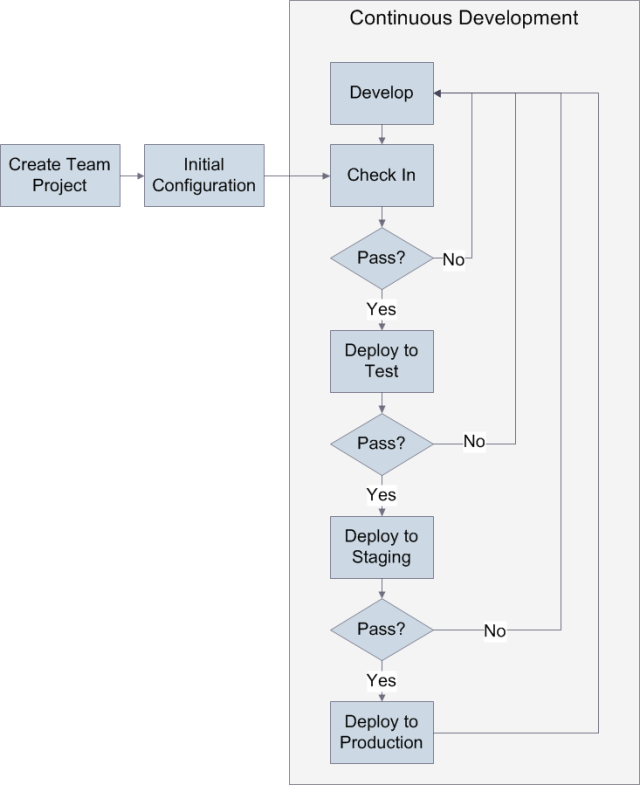
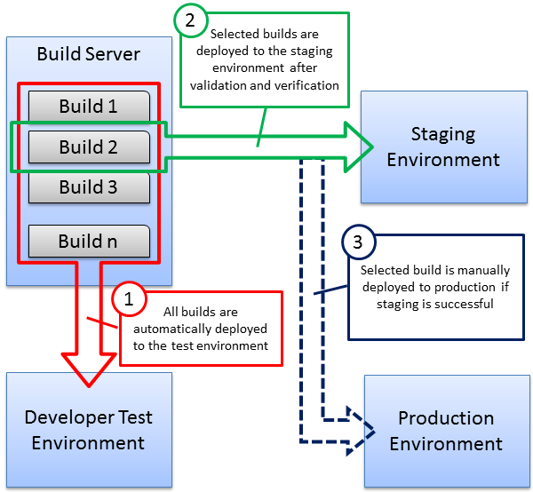
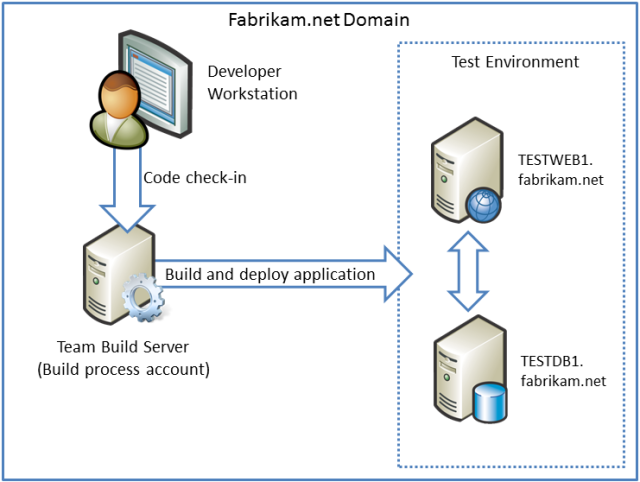
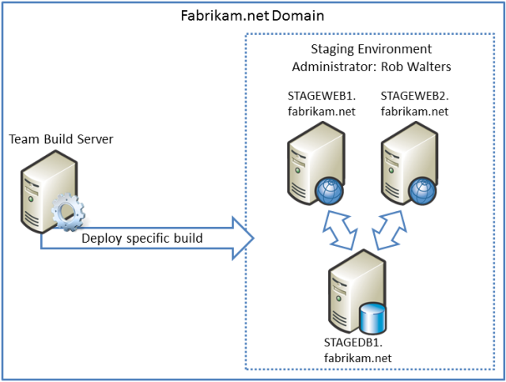
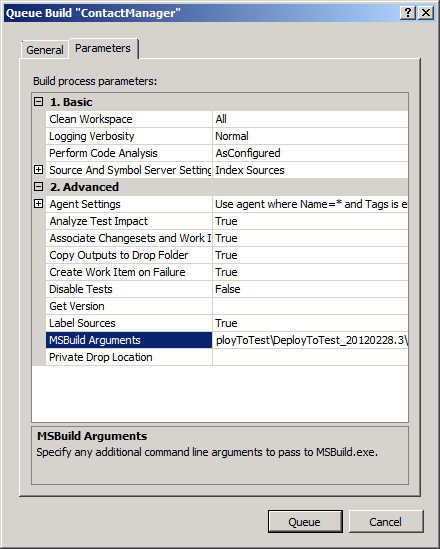
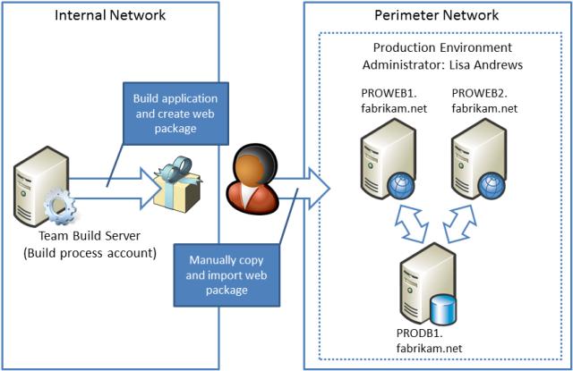

Application Lifecycle Management: From Development to Production
====================
by [Jason Lee](https://github.com/jrjlee)

[Download PDF](https://msdnshared.blob.core.windows.net/media/MSDNBlogsFS/prod.evol.blogs.msdn.com/CommunityServer.Blogs.Components.WeblogFiles/00/00/00/63/56/8130.DeployingWebAppsInEnterpriseScenarios.pdf)

> This topic illustrates how a fictional company manages the deployment of an ASP.NET web application through test, staging, and production environments as part of a continuous development process. Throughout the topic, links are provided to further information and walkthroughs on how to perform specific tasks.
> 
> The topic is designed to provide a high-level overview for a [series of tutorials](deploying-web-applications-in-enterprise-scenarios.md) on web deployment in the enterprise. Don&#x27;t worry if you&#x27;re not familiar with some of the concepts described here&#x2014;the tutorials that follow provide detailed information on all of these tasks and techniques.
> 
> > [!NOTE] Forthe sake of simplicity, this topic doesn&#x27;t discuss updating databases as part of the deployment process. However, making incremental updates to databases features is a requirement of many enterprise deployment scenarios, and you can find guidance on how to accomplish this later in this tutorial series. For more information, see [Deploying Database Projects](../web-deployment-in-the-enterprise/deploying-database-projects.md).

## Overview

The deployment process illustrated here is based on the Fabrikam, Inc. deployment scenario described in [Enterprise Web Deployment: Scenario Overview](enterprise-web-deployment-scenario-overview.md). You should read the scenario overview before you study this topic. Essentially, the scenario examines how an organization manages the deployment of a reasonably complex web application, the [Contact Manager solution](../web-deployment-in-the-enterprise/the-contact-manager-solution.md), through various phases in a typical enterprise environment.

At a high level, the Contact Manager solution goes through these stages as part of the development and deployment process:

1. A developer checks some code into Team Foundation Server (TFS) 2010.
2. TFS builds the code and runs any unit tests associated with the team project.
3. TFS deploys the solution to the test environment.
4. The developer team verifies and validates the solution in the test environment.
5. The staging environment administrator performs a "what if" deployment to the staging environment, to establish whether the deployment will cause any problems.
6. The staging environment administrator performs a live deployment to the staging environment.
7. The solution undergoes user acceptance testing in the staging environment.
8. The web deployment packages are manually imported into the production environment.

These stages form part of a continuous development cycle.

In practice, the process is slightly more complicated than this, as you&#x27;ll see when we look at each stage in more detail. Fabrikam, Inc. uses a different approach to deployment for each target environment.

The rest of this topic examines these key stages of this deployment lifecycle:

- **Prerequisites**: How you need to configure your server infrastructure before you put your deployment logic in place.
- **Initial development and deployment**: What you need to do before you deploy your solution for the first time.
- **Deployment to test**: How to package and deploy content to a test environment automatically when a developer checks in new code.
- **Deployment to staging**: How to deploy specific builds to a staging environment and how to perform "what if" deployments to ensure that a deployment won&#x27;t cause any problems.
- **Deployment to production**: How to import web packages into a production environment when network infrastructure prevents remote deployment.

## Prerequisites

The first task in any deployment scenario is to ensure that your server infrastructure meets the requirements of your deployment tools and techniques. In this case, Fabrikam, Inc. has configured its server infrastructure like this:

- TFS is configured to include a team project collection, build controllers, and build agents. See [Configuring Team Foundation Server for Automated Web Deployment](../configuring-team-foundation-server-for-web-deployment/configuring-team-foundation-server-for-web-deployment.md) for more information.
- The test environment is configured to accept remote deployments using the Web Deployment Agent Service (the "remote agent"), as described in [Scenario: Configuring a Test Environment for Web Deployment](../configuring-server-environments-for-web-deployment/scenario-configuring-a-test-environment-for-web-deployment.md) and [Configure a Web Server for Web Deploy Publishing (Remote Agent)](../configuring-server-environments-for-web-deployment/configuring-a-web-server-for-web-deploy-publishing-remote-agent.md).
- The staging environment is configured to accept remote deployments using the Web Deploy Handler endpoint, as described in [Scenario: Configuring a Staging Environment for Web Deployment](../configuring-server-environments-for-web-deployment/scenario-configuring-a-staging-environment-for-web-deployment.md) and [Configure a Web Server for Web Deploy Publishing (Web Deploy Handler)](../configuring-server-environments-for-web-deployment/configuring-a-web-server-for-web-deploy-publishing-web-deploy-handler.md).
- The production environment is configured to allow an administrator to manually import web deployment packages into Internet Information Services (IIS), as described in [Scenario: Configuring a Production Environment for Web Deployment](../configuring-server-environments-for-web-deployment/scenario-configuring-a-production-environment-for-web-deployment.md) and [Configure a Web Server for Web Deploy Publishing (Offline Deployment)](../configuring-server-environments-for-web-deployment/configuring-a-web-server-for-web-deploy-publishing-offline-deployment.md).

## Initial Development and Deployment

Before the Fabrikam, Inc. development team can deploy the Contact Manager solution for the first time, it needs to perform these tasks:

- Create a new team project in TFS.
- Create the Microsoft Build Engine (MSBuild) project files that contain the deployment logic.
- Create the TFS build definitions that trigger the deployment processes.

### Create a New Team Project

- The TFS administrator, Rob Walters, creates a new team project for the application, as described in [Creating a Team Project in TFS](../configuring-team-foundation-server-for-web-deployment/creating-a-team-project-in-tfs.md). Next, the lead developer, Matt Hink, creates a skeleton solution. He checks his files into the new team project in TFS, as described in [Adding Content to Source Control](../configuring-team-foundation-server-for-web-deployment/adding-content-to-source-control.md).

### Create the Deployment Logic

Matt Hink creates various custom MSBuild project files, using the split project file approach described in [Understanding the Project File](../web-deployment-in-the-enterprise/understanding-the-project-file.md). Matt creates:

- A project file named *Publish.proj* that runs the deployment process. This file contains MSBuild targets that build the projects in the solution, create web packages, and deploy the packages to a destination server environment.
- Environment-specific project files named *Env-Dev.proj* and *Env-Stage.proj*. These contain settings that are specific to the test environment and the staging environment respectively, like connection strings, service endpoints, and the details of the remote service that will receive the web package. For guidance on choosing the right settings for specific destination environments, see [Configure Deployment Properties for a Target Environment](../configuring-server-environments-for-web-deployment/configuring-deployment-properties-for-a-target-environment.md).

To run the deployment, a user executes the *Publish.proj* file using MSBuild or Team Build and specifies the location of the relevant environment-specific project file (*Env-Dev.proj* or *Env-Stage.proj*) as a command-line argument. The *Publish.proj* file then imports the environment-specific project file to create a complete set of publishing instructions for each target environment.

> [!NOTE] The way these custom project files work is independent of the mechanism you use to invoke MSBuild. For example, you can use the MSBuild command line directly, as described in [Understanding the Project File](../web-deployment-in-the-enterprise/understanding-the-project-file.md). You can run the project files from a command file, as described in [Create and Run a Deployment Command File](../web-deployment-in-the-enterprise/creating-and-running-a-deployment-command-file.md). Alternatively, you can run the project files from a build definition in TFS, as described in [Creating a Build Definition that Supports Deployment](../configuring-team-foundation-server-for-web-deployment/creating-a-build-definition-that-supports-deployment.md).  
> In each case the end result is the same&#x2014;MSBuild executes the merged project file and deploys your solution to the target environment. This provides you with a great deal of flexibility in how you trigger your publishing process.

Once he has created the custom project files, Matt adds them to a solution folder and checks them into source control.

### Create Build Definitions

As a final preparation task, Matt and Rob work together to create three build definitions for the new team project:

- **DeployToTest**. This builds the Contact Manager solution and deploys it to the test environment every time a check-in occurs.
- **DeployToStaging**. This deploys resources from a specified previous build to the staging environment when a developer queues the build.
- **DeployToStaging-WhatIf**. This performs a "what if" deployment to the staging environment when a developer queues the build.

The sections that follow provide more detail on each of these build definitions.

## Deployment to Test

The development team at Fabrikam, Inc. maintains test environments to conduct a variety of software testing activities, like verification and validation, usability testing, compatibility testing, and ad hoc or exploratory testing.

The development team has created a build definition in TFS named **DeployToTest**. This build definition uses a continuous integration trigger, which means the build process runs every time a member of the Fabrikam, Inc. development team performs a check-in. When a build is triggered, the build definition will:

- Build the ContactManager.sln solution. This in turn builds every project within the solution.
- Run any unit tests in the solution folder structure (if the solution builds successfully).
- Run the custom project files that control the deployment process (if the solution builds successfully and passes any unit tests).

The end result is that if the solution builds successfully and passes unit tests, the web packages and any other deployment resources are deployed to the test environment.

### How Does the Deployment Process Work?

The **DeployToTest** build definition supplies these arguments to MSBuild:

    /p:DeployOnBuild=true;DeployTarget=package;TargetEnvPropsFile=[path]\Env-Dev.proj

The **DeployOnBuild=true** and **DeployTarget=package** properties are used when Team Build builds the projects within the solution. When the project is a web application project, these properties instruct MSBuild to create a web deployment package for the project. The **TargetEnvPropsFile** property tells the *Publish.proj* file where to find the environment-specific project file to import.

> [!NOTE] For a detailed walkthrough on how to create a build definition like this, see [Creating a Build Definition that Supports Deployment](../configuring-team-foundation-server-for-web-deployment/creating-a-build-definition-that-supports-deployment.md).

The *Publish.proj* file contains targets that build each project in the solution. However, it also includes conditional logic that skips these build targets if you&#x27;re executing the file in Team Build. This lets you take advantage of the additional build functionality that Team Build offers, like the ability to run unit tests. If the solution build or the unit tests fail, the *Publish.proj* file will not be executed and the application will not be deployed.

The conditional logic is accomplished by evaluating the **BuildingInTeamBuild** property. This is an MSBuild property that is automatically set to **true** when you use Team Build to build your projects.

## Deployment to Staging

When a build meets all of the requirements of the developer team in the test environment, the team may want to deploy the same build to a staging environment. Staging environments are typically configured to match the characteristics of the production or "live" environment as closely as possible, for example, in terms of server specifications, operating systems and software, and network configuration. Staging environments are often used for load testing, user acceptance testing, and broader internal reviews. Builds are deployed to the staging environment directly from the build server.

The build definitions used to deploy the solution to the staging environment, **DeployToStaging-WhatIf** and **DeployToStaging**, share these characteristics:

- They don&#x27;t actually build anything. When Rob deploys the solution to the staging environment, he wants to deploy a specific, existing build that&#x27;s already been verified and validated in the test environment. The build definitions just need to run the custom project files that control the deployment process.
- When Rob triggers a build, he uses the build parameters to specify which build contains the resources he wants to deploy from the build server.
- The build definitions are not triggered automatically. Rob manually queues a build when he wants to deploy the solution to the staging environment.

This is the high-level process for a deployment to the staging environment:

1. The staging environment administrator, Rob Walters, queues a build using the **DeployToStaging-WhatIf** build definition. Rob uses the build definition parameters to specify which build he wants to deploy.
2. The **DeployToStaging-WhatIf** build definition runs the custom project files in "what if" mode. This generates log files as if Rob was performing a live deployment, but it doesn&#x27;t actually make any changes to the destination environment.
3. Rob reviews the log files to ascertain the effects of the deployment on the staging environment. In particular, Rob wants to check what will be added, what will be updated, and what will be deleted.
4. If Rob is satisfied that the deployment won&#x27;t make any undesirable changes to existing resources or data, he queues a build using the **DeployToStaging** build definition.
5. The **DeployToStaging** build definition runs the custom project files. These publish the deployment resources to the primary web server in the staging environment.
6. The Web Farm Framework (WFF) controller synchronizes the web servers in the staging environment. This makes the application available on all the web servers in the server farm.

### How Does the Deployment Process Work?

The **DeployToStaging** build definition supplies these arguments to MSBuild:

    /p:TargetEnvPropsFile=[path]\Env-Stage.proj;OutputRoot=[path to build folder]

The **TargetEnvPropsFile** property tells the *Publish.proj* file where to find the environment-specific project file to import. The **OutputRoot** property overrides the built-in value and indicates the location of the build folder that contains the resources you want to deploy. When Rob queues the build, he uses the **Parameters** tab to provide an updated value for the **OutputRoot** property.

> [!NOTE] For more information on how to create a build definition like this, see [Deploy a Specific Build](../configuring-team-foundation-server-for-web-deployment/deploying-a-specific-build.md).

The **DeployToStaging-WhatIf** build definition contains the same deployment logic as the **DeployToStaging** build definition. However, it includes the additional argument **WhatIf=true**:

    /p:TargetEnvPropsFile=[path]\Env-Stage.proj;
       OutputRoot=[path to build folder];
       WhatIf=true

Within the *Publish.proj* file, the **WhatIf** property indicates that all deployment resources should be published in "what if" mode. In other words, log files are generated as if the deployment had gone ahead, but nothing is actually changed in the destination environment. This lets you evaluate the impact of a proposed deployment&#x2014;in particular, what will get added, what will get updated, and what will get deleted&#x2014;before you actually make any changes.

> [!NOTE] For more information on how to configure "what if" deployments, see [Performing a "What If" Deployment](../advanced-enterprise-web-deployment/performing-a-what-if-deployment.md).

Once you&#x27;ve deployed your application to the primary web server in the staging environment, the WFF will automatically synchronize the application across all the servers in the server farm.

> [!NOTE] For more information on configuring the WFF to synchronize web servers, see [Create a Server Farm with the Web Farm Framework](../configuring-server-environments-for-web-deployment/creating-a-server-farm-with-the-web-farm-framework.md).

## Deployment to Production

When a build has been approved in the staging environment, the Fabrikam, Inc. team can publish the application to the production environment. The production environment is where the application goes "live" and reaches its target audience of end users.

The production environment is in an Internet-facing perimeter network. This is isolated from the internal network that contains the build server. The production environment administrator, Lisa Andrews, must manually copy the web deployment packages from the build server and import them into IIS on the primary production web server.

This is the high-level process for a deployment to the production environment:

1. The developer team advises Lisa that a build is ready for deployment to production. The team advises Lisa of the location of the web deployment packages within the drop folder on the build server.
2. Lisa collects the web packages from the build server and copies them to the primary web server in the production environment.
3. Lisa uses IIS Manager to import and publish the web packages on the primary web server.
4. The WFF controller synchronizes the web servers in the production environment. This makes the application available on all the web servers in the server farm.

### How Does the Deployment Process Work?

IIS Manager includes an Import Application Package Wizard that makes it easy to publish web packages to an IIS website. For a walkthrough on how to perform this procedure, see [Manually Installing Web Packages](../web-deployment-in-the-enterprise/manually-installing-web-packages.md).

## Conclusion

This topic provided an illustration of the deployment lifecycle for a typical enterprise-scale web application.

This topic forms part of a series of tutorials that provide guidance on various aspects of web application deployment. In practice, there are lots of additional tasks and considerations at each stage of the deployment process, and it&#x27;s not possible to cover them all in a single walkthrough. For more information, consult these tutorials:

- [Web Deployment in the Enterprise](../web-deployment-in-the-enterprise/web-deployment-in-the-enterprise.md). This tutorial provides a comprehensive introduction to web deployment techniques using MSBuild and the IIS Web Deployment Tool (Web Deploy).
- [Configuring Server Environments for Web Deployment](../configuring-server-environments-for-web-deployment/configuring-server-environments-for-web-deployment.md). This tutorial provides guidance on how to configure Windows server environments to support various deployment scenarios.
- [Configuring Team Foundation Server for Automated Web Deployment](../configuring-team-foundation-server-for-web-deployment/configuring-team-foundation-server-for-web-deployment.md). This tutorial provides guidance on how to integrate deployment logic into TFS build processes.
- [Advanced Enterprise Web Deployment](../advanced-enterprise-web-deployment/advanced-enterprise-web-deployment.md). This tutorial provides guidance on how to meet some of the more complex deployment challenges that organizations face.

>[!div class="step-by-step"] [Previous](enterprise-web-deployment-scenario-overview.md)