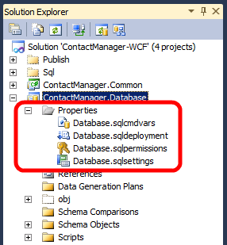
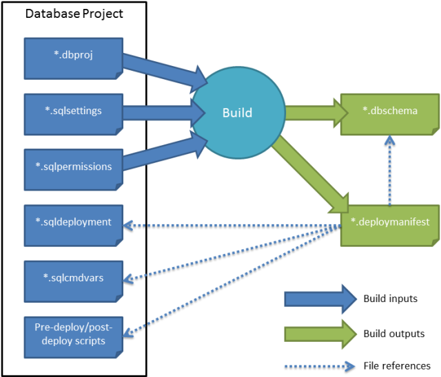
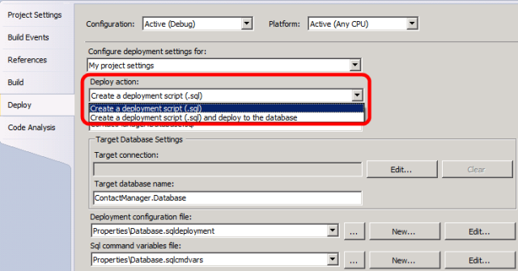

Deploying Database Projects
====================
by [Jason Lee](https://github.com/jrjlee)

[Download PDF](https://msdnshared.blob.core.windows.net/media/MSDNBlogsFS/prod.evol.blogs.msdn.com/CommunityServer.Blogs.Components.WeblogFiles/00/00/00/63/56/8130.DeployingWebAppsInEnterpriseScenarios.pdf)

> [!NOTE] In lots of enterprise deployment scenarios, you need the ability to publish incremental updates to a deployed database. The alternative is to recreate the database on every deployment, which means you lose any data in the existing database. When you work with Visual Studio 2010, using VSDBCMD is the recommended approach to incremental database publishing. However, the next version of Visual Studio and the Web Publishing Pipeline (WPP) will include tooling that supports incremental publishing directly.

If you open the Contact Manager sample solution in Visual Studio 2010, you&#x27;ll see that the database project includes a Properties folder that contains four files.

Together with the project file (*ContactManager.Database.dbproj* in this case), these files control various aspects of the build and deployment process:

- The *Database.sqlcmdvars* file provides values for any SQLCMD variables you use when you deploy the project. Each solution configuration (for example, debug and release) can specify a different .sqlcmdvars file.
- The *Database.sqldeployment* file provides deployment-specific settings, like whether to use the collation defined in your project or the collation of the destination server, whether to recreate the destination database every time or simply amend the existing database to bring it up to date, and so on. Each solution configuration can specify a different .sqldeployment file.
- The *Database.sqlpermissions* file is an XML document that you can use to define any permissions you want to add to the target database. All solution configurations share the same .sqlpermissions file.
- The *Database.sqlsettings* file specifies the database-level properties to use when creating the database, like the collation to use, the behavior of comparison operators, and so on. All solution configurations share the same .sqlsettings file.

It&#x27;s worth taking a moment to open these files in Visual Studio and familiarize yourself with the contents.

When you build a database project, the build process creates two files:

- A *database schema* (.dbschema file). This describes the schema of the database you want to create in XML format.
- A *deployment manifest* (.deploymanifest file). This contains all the information required to create and deploy your database. It references the .dbschema file along with other resources, like the deployment instructions (the .sqldeployment file) and any pre-deployment or post-deployment SQL scripts.

This shows the relationship between these resources:

As you can see, the .sqlsettings file and the .sqlpermissions file are inputs to the build process. Along with the database project file, these files are used to create the database schema file. The .sqldeployment file and the .sqlcmdvars file pass through the build process unchanged. The deployment manifest indicates the location of the database schema, the .sqldeployment file, the .sqlcmdvars file, and any pre-deployment or post-deployment SQL scripts.

## Why Use VSDBCMD to Deploy a Database Project?

There are various different approaches to deploying database projects. However, not all of them are suitable for deploying a database project to remote servers in an enterprise environment. Consider what you want from a database project deployment. In enterprise deployment scenarios, you&#x27;re likely to want:

- The ability to deploy the database project from a remote location.
- The ability to make incremental updates to an existing database.
- The ability to include pre-deployment scripts or post-deployment scripts.
- The ability to tailor the deployment to multiple destination environments.
- The ability to deploy the database project as part of a larger, typically scripted, single-step solution deployment.

There are three main approaches you can use to deploy a database project:

- You can use the deployment functionality with the database project type in Visual Studio 2010. When you build and deploy a database project in Visual Studio 2010, the deployment process uses the deployment manifest to generate a SQL-based deployment file specific to the build configuration. This will create the database if it doesn&#x27;t already exist or make any necessary changes to the database if it does already exist. You can use SQLCMD.exe to run this file on your destination server, or you can set Visual Studio to create and run the file. The disadvantage of this approach is that you have only limited control over the deployment settings. You may often also need to modify the SQL deployment file to provide environment-specific variable values. You can only use this approach from a computer with Visual Studio 2010 installed, and the developer would need to know and provide connection strings and credentials for all destination environments.
- You can use the Internet Information Services (IIS) Web Deployment Tool (Web Deploy) to [deploy a database as part of a web application project](https://msdn.microsoft.com/en-us/library/dd465343.aspx). However, this approach is a lot more complex if you want to deploy a database project rather than simply replicate an existing local database on a destination server. You can configure Web Deploy to run the SQL deployment script that the database project generates, but in order to do this, you need to create a custom WPP targets file for your web application project. This adds a substantial amount of complexity to the deployment process. In addition, Web Deploy does not directly support incremental updates to existing databases. For more information on this approach, see [Extending the Web Publishing Pipeline to package database project deployed SQL file](https://go.microsoft.com/?linkid=9805121).
- You can use the VSDBCMD utility to deploy the database, using either the database schema or the deployment manifest. You can call VSDBCMD.exe from an MSBuild target, which lets you publish databases as part of a larger, scripted deployment process. You can override the variables in your .sqlcmdvars file and lots of other database properties from a VSDBCMD command, which allows you to customize your deployment for different environments without creating multiple build configurations. VSDBCMD provides differentiation functionality, which means it will make only the necessary changes to align a destination database with your database schema. VSDBCMD also offers a wide range of command-line options, which give you fine-grained control over the deployment process.

From this overview, you can see that using VSDBCMD with MSBuild is the approach best suited to a typical enterprise deployment scenario:

|  | Visual Studio 2010 | Web Deploy 2.0 | VSDBCMD.exe |
| --- | --- | --- | --- |
| Supports remote deployment? | Yes | Yes | Yes |
| Supports incremental updates? | Yes | No | Yes |
| Supports pre/post-deployment scripts? | Yes | Yes | Yes |
| Supports multi-environment deployment? | Limited | Limited | Yes |
| Supports scripted deployment? | Limited | Yes | Yes |

The remainder of this topic describes the use of VSDBCMD with MSBuild to deploy database projects.

## Understanding the Deployment Process

The VSDBCMD utility lets you deploy a database using either the database schema (the .dbschema file) or the deployment manifest (the .deploymanifest file). In practice, you&#x27;ll almost always use the deployment manifest, as the deployment manifest lets you provide default values for various deployment properties and identify any pre-deployment or post-deployment SQL scripts you want to run. For example, this VSDBCMD command is used to deploy the **ContactManager** database to a database server in a test environment:

    vsdbcmd.exe /a:Deploy
                /manifest:"…\ContactManager.Database.deploymanifest"
                /cs:"Data Source=TESTDB1;Integrated Security=true"
                /p:TargetDatabase=ContactManager
                /dd+
                /script:"…\Publish-ContactManager-Db.sql"

In this case:

- The **/a** (or **/Action**) switch specifies what you want VSDBCMD to do. You can set this to **Import** or **Deploy**. The **Import** option is used to generate a .dbschema file from an existing database, and the **Deploy** option is used to deploy a .dbschema file to a target database.
- The **/manifest** (or **/ManifestFile**) switch identifies the .deploymanifest file you want to deploy. If you wanted to use the .dbschema file instead, you&#x27;d use the **/model** (or **/ModelFile**) switch.
- The **/cs** (or **/ConnectionString**) switch provides the connection string for the target database server. Note that this doesn&#x27;t include the name of the database&#x2014;VSDBCMD needs to connect to the server to create the database; it doesn&#x27;t need to connect to an individual database. If your .deploymanifest file includes a connection string, you can omit this switch. If you use the switch anyway, the switch value will override the .deploymanifest value.
- The **/p:TargetDatabase** property provides the name you want to assign to the target database on creation. This overrides the value of the **TargetDatabase** property in the .deploymanifest file. You can use the **/p:** *[property name]*syntax to set a wide variety of deployment properties and to override any SQLCMD variables declared in your .sqlcmdvars file.
- The **/dd+** (or **/DeployToDatabase+**) switch indicates that you want to create a deployment and deploy it to the target environment. If you specify **/dd-**, or omit the switch, VSDBCMD will generate a deployment script but will not deploy it to the target environment. This switch is often the source of confusion and is explained in more detail in the next section.
- The **/script** (or **/DeploymentScriptFile**) switch specifies where you want to generate the deployment script. This value does not affect the deployment process.

For more information on VSDBCMD, see [Command-Line Reference for VSDBCMD.EXE (Deployment and Schema Import)](https://msdn.microsoft.com/en-us/library/dd193283.aspx) and [How to: Prepare a Database for Deployment From a Command Prompt by Using VSDBCMD.EXE](https://msdn.microsoft.com/en-us/library/dd193258.aspx).

For an example of how you can use VSDBCMD from an MSBuild project file, see [Understanding the Build Process](understanding-the-build-process.md). For examples of how to configure database deployment settings for multiple environments, see [Customizing Database Deployments for Multiple Environments](../advanced-enterprise-web-deployment/customizing-database-deployments-for-multiple-environments.md).

## Understanding the DeployToDatabase Switch

The behavior of the **/dd** or **/DeployToDatabase** switch depends on whether you're using VSDBCMD with a .dbschema file or a .deploymanifest file. If you&#x27;re using a .dbschema file, the behavior is fairly straightforward:

- If you specify **/dd+** or **/dd**, VSDBCMD will generate a deployment script and deploy the database.
- If you specify **/dd-** or omit the switch, VSDBCMD will generate a deployment script only.

If you&#x27;re using a .deploymanifest file, the behavior is a lot more complicated. This is because the .deploymanifest file contains a property name **DeployToDatabase** that also determines whether the database is deployed.

    <DeployToDatabase>False</DeployToDatabase>

The value of this property is set according to the properties of the database project. If you set the **Deploy action** to **Create a deployment script (.sql)**, the value will be **False**. If you set the **Deploy action** to **Create a deployment script (.sql) and deploy to the database**, the value will be **True**.

> [!NOTE] These settings are associated with a specific build configuration and platform. For example, if you configure settings for the **Debug** configuration and then publish using the **Release** configuration, your settings will not be used.

> [!NOTE] In this scenario, the **Deploy action** should always be set to **Create a deployment script (.sql)**, because you don&#x27;t want Visual Studio 2010 to deploy your database. In other words, the **DeployToDatabase** property should always be **False**.

When a **DeployToDatabase** property is specified, the **/dd** switch will only override the property if the property value is **false**:

- If the **DeployToDatabase** property is **False**, and you specify **/dd+** or **/dd**, VSDBCMD will override the **DeployToDatabase** property and deploy the database.
- If the **DeployToDatabase** property is **False**, and you specify **/dd-** or omit the switch, VSDBCMD will not deploy the database.
- If the **DeployToDatabase** property is **True**, VSDBCMD will ignore the switch and deploy the database.
- A deployment script is generated in each case, regardless of whether you&#x27;re deploying the database as well.

## Conclusion

This topic provided an overview of the build and deployment process for database projects in Visual Studio 2010. It also described how you can use VSDBCMD.exe with MSBuild to support enterprise-scale database deployment.

For more information on how this works in practice, see [Customizing Database Deployments for Multiple Environments](../advanced-enterprise-web-deployment/customizing-database-deployments-for-multiple-environments.md).

## Further Reading

For information on how to customize database deployments by creating a separate deployment configuration file for each environment, see [Customizing Database Deployments for Multiple Environments](../advanced-enterprise-web-deployment/customizing-database-deployments-for-multiple-environments.md). For guidance on how to configure database role memberships by running a post-deployment script, see [Deploying Database Role Memberships to Test Environments](../advanced-enterprise-web-deployment/deploying-database-role-memberships-to-test-environments.md). For guidance on managing some of the unique challenges that membership databases impose, see [Deploying Membership Databases to Enterprise Environments](../advanced-enterprise-web-deployment/deploying-membership-databases-to-enterprise-environments.md).

These topics on MSDN provide broader guidance and background information on Visual Studio database projects and the database deployment process:

- [Visual Studio 2010 SQL Server Database Projects](https://msdn.microsoft.com/en-us/library/ff678491.aspx)
- [Managing Database Change](https://msdn.microsoft.com/en-us/library/aa833404.aspx)
- [How to: Prepare a Database for Deployment From a Command Prompt by Using VSDBCMD.EXE](https://msdn.microsoft.com/en-us/library/dd193258.aspx)
- [An Overview of Database Build and Deployment](https://msdn.microsoft.com/en-us/library/aa833165.aspx)

>[!div class="step-by-step"] [Previous](deploying-web-packages.md) [Next](creating-and-running-a-deployment-command-file.md)