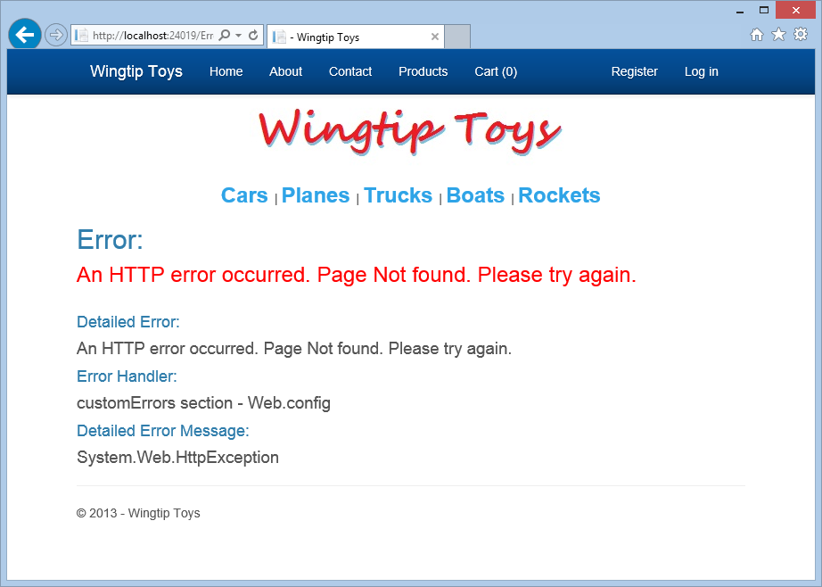
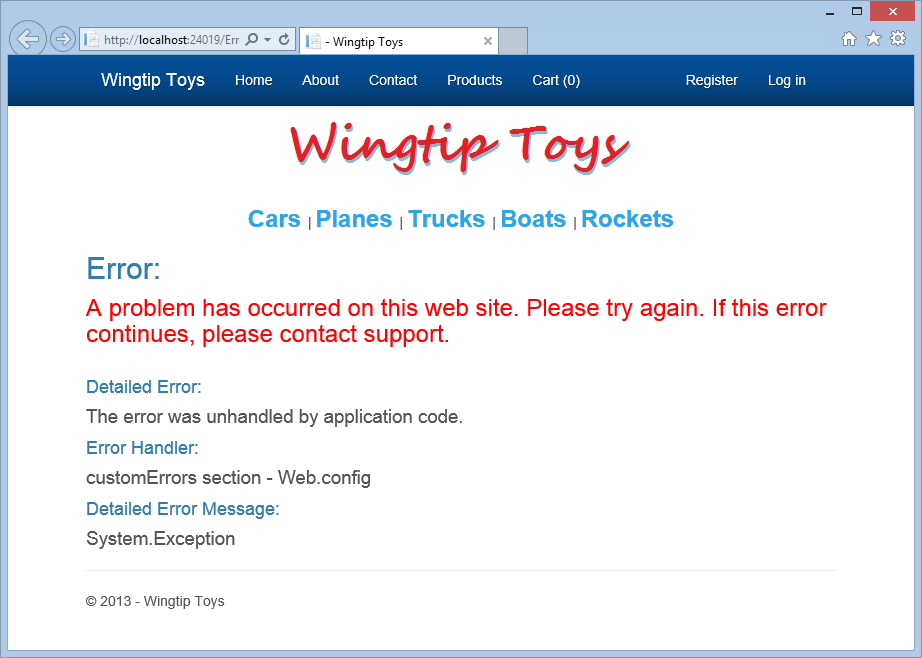
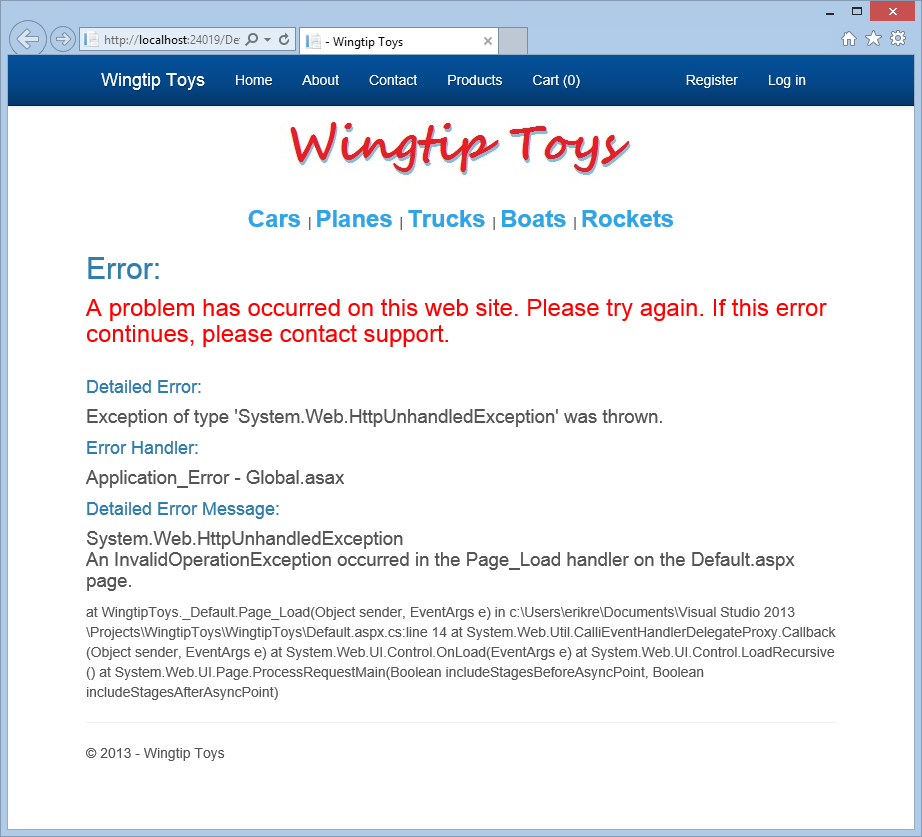
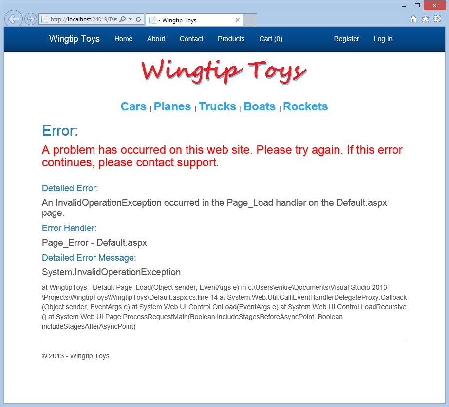
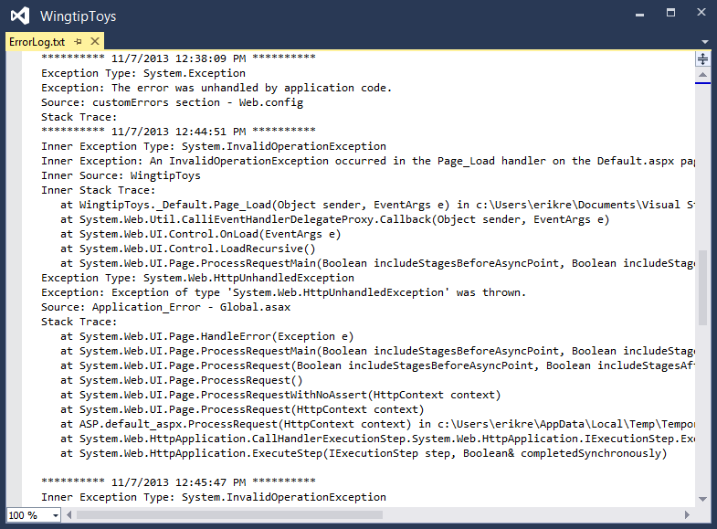
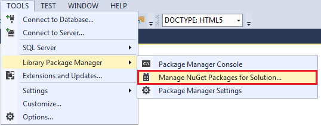
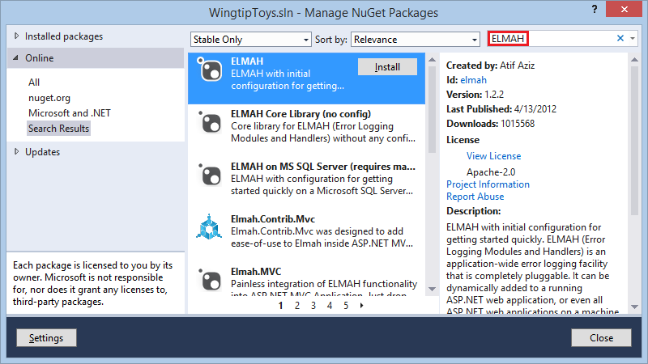
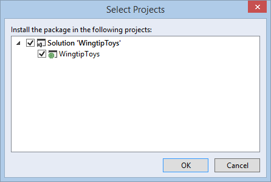
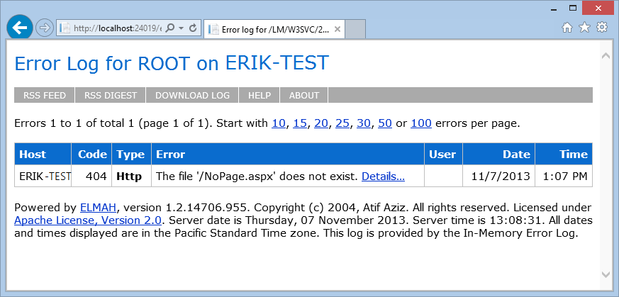

ASP.NET Error Handling
====================
by [Erik Reitan](https://github.com/Erikre)

[Download Wingtip Toys Sample Project (C#)](http://go.microsoft.com/fwlink/?LinkID=389434&clcid=0x409) or [Download E-book (PDF)](http://download.microsoft.com/download/0/F/B/0FBFAA46-2BFD-478F-8E56-7BF3C672DF9D/Getting%20Started%20with%20ASP.NET%204.5%20Web%20Forms%20and%20Visual%20Studio%202013.pdf)

> This tutorial series will teach you the basics of building an ASP.NET Web Forms application using ASP.NET 4.5 and Microsoft Visual Studio Express 2013 for Web. A Visual Studio 2013 [project with C# source code](https://go.microsoft.com/fwlink/?LinkID=389434&clcid=0x409) is available to accompany this tutorial series.

In this tutorial, you will modify the Wingtip Toys sample application to include error handling and error logging. Error handling will allow the application to gracefully handle errors and display error messages accordingly. Error logging will allow you to find and fix errors that have occurred. This tutorial builds on the previous tutorial "URL Routing" and is part of the Wingtip Toys tutorial series.

## What you'll learn:

- How to add global error handling to the application's configuration.
- How to add error handling at the application, page, and code levels.
- How to log errors for later review.
- How to display error messages that do not compromise security.
- How to implement Error Logging Modules and Handlers (ELMAH) error logging.

## Overview

ASP.NET applications must be able to handle errors that occur during execution in a consistent manner. ASP.NET uses the common language runtime (CLR), which provides a way of notifying applications of errors in a uniform way. When an error occurs, an exception is thrown. An exception is any error, condition, or unexpected behavior that an application encounters.

In the .NET Framework, an exception is an object that inherits from the `System.Exception` class. An exception is thrown from an area of code where a problem has occurred. The exception is passed up the call stack to a place where the application provides code to handle the exception. If the application does not handle the exception, the browser is forced to display the error details.

As a best practice, handle errors in at the code level in `Try`/`Catch`/`Finally` blocks within your code. Try to place these blocks so that the user can correct problems in the context in which they occur. If the error handling blocks are too far away from where the error occurred, it becomes more difficult to provide users with the information they need to fix the problem.

### Exception Class

The Exception class is the base class from which exceptions inherit. Most exception objects are instances of some derived class of the Exception class, such as the `SystemException` class, the `IndexOutOfRangeException` class, or the `ArgumentNullException` class. The Exception class has properties, such as the `StackTrace` property, the `InnerException` property, and the `Message` property, that provide specific information about the error that has occurred.

### Exception Inheritance Hierarchy

The runtime has a base set of exceptions deriving from the `SystemException` class that the runtime throws when an exception is encountered. Most of the classes that inherit from the Exception class, such as the `IndexOutOfRangeException` class and the `ArgumentNullException` class, do not implement additional members. Therefore, the most important information for an exception can be found in the hierarchy of exceptions, the exception name, and the information contained in the exception.

### Exception Handling Hierarchy

In an ASP.NET Web Forms application, exceptions can be handled based on a specific handling hierarchy. An exception can be handled at the following levels:

- Application level
- Page level
- Code level

When an application handles exceptions, additional information about the exception that is inherited from the Exception class can often be retrieved and displayed to the user. In addition to application, page, and code level, you can also handle exceptions at the HTTP module level and by using an IIS custom handler.

### Application Level Error Handling

You can handle default errors at the application level either by modifying your application's configuration or by adding an `Application_Error` handler in the *Global.asax* file of your application.

You can handle default errors and HTTP errors by adding a `customErrors` section to the *Web.config* file. The `customErrors` section allows you to specify a default page that users will be redirected to when an error occurs. It also allows you to specify individual pages for specific status code errors.

[!code[Main](aspnet-error-handling/samples/sample1.xml?highlight=3-5)]

Unfortunately, when you use the configuration to redirect the user to a different page, you do not have the details of the error that occurred.

However, you can trap errors that occur anywhere in your application by adding code to the `Application_Error` handler in the *Global.asax* file.

    void Application_Error(object sender, EventArgs e)
    {
        Exception exc = Server.GetLastError();
    
        if (exc is HttpUnhandledException)
        {
            // Pass the error on to the error page.
            Server.Transfer("ErrorPage.aspx?handler=Application_Error%20-%20Global.asax", true);
        }
    }

### Page Level Error Event Handling

A page-level handler returns the user to the page where the error occurred, but because instances of controls are not maintained, there will no longer be anything on the page. To provide the error details to the user of the application, you must specifically write the error details to the page.

You would typically use a page-level error handler to log unhandled errors or to take the user to a page that can display helpful information.

This code example shows a handler for the Error event in an ASP.NET Web page. This handler catches all exceptions that are not already handled within `try`/`catch` blocks in the page.

    private void Page_Error(object sender, EventArgs e)
            {
                Exception exc = Server.GetLastError();
    
                // Handle specific exception.
                if (exc is HttpUnhandledException)
                {
                    ErrorMsgTextBox.Text = "An error occurred on this page. Please verify your " +                  
                    "information to resolve the issue."
                }
                // Clear the error from the server.
                Server.ClearError();
            }

After you handle an error, you must clear it by calling the `ClearError` method of the Server object (`HttpServerUtility` class), otherwise you will see an error that has previously occurred.

### Code Level Error Handling

The try-catch statement consists of a try block followed by one or more catch clauses, which specify handlers for different exceptions. When an exception is thrown, the common language runtime (CLR) looks for the catch statement that handles this exception. If the currently executing method does not contain a catch block, the CLR looks at the method that called the current method, and so on, up the call stack. If no catch block is found, then the CLR displays an unhandled exception message to the user and stops execution of the program.

The following code example shows a common way of using `try`/`catch`/`finally` to handle errors.

    try
        {
            file.ReadBlock(buffer, index, buffer.Length);
        }
        catch (FileNotFoundException e)
        {
            Server.Transfer("NoFileErrorPage.aspx", true);
        }
        catch (System.IO.IOException e)
        {
            Server.Transfer("IOErrorPage.aspx", true);
        }
    
        finally
        {
            if (file != null)
            {
                file.Close();
            }
        }

In the above code, the try block contains the code that needs to be guarded against a possible exception. The block is executed until either an exception is thrown or the block is completed successfully. If either a `FileNotFoundException` exception or an `IOException` exception occurs, the execution is transferred to a different page. Then, the code contained in the finally block is executed, whether an error occurred or not.

## Adding Error Logging Support

Before adding error handling to the Wingtip Toys sample application, you will add error logging support by adding an `ExceptionUtility` class to the *Logic* folder. By doing this, each time the application handles an error, the error details will be added to the error log file.

1. Right-click the *Logic* folder and then select **Add** -&gt; **New Item**.   
 The     **Add New Item** dialog box is displayed.
2. Select the **Visual C#** -&gt; **Code** templates group on the left. Then, select **Class**from the middle list and name it **ExceptionUtility.cs**.
3. Choose **Add**. The new class file is displayed.
4. Replace the existing code with the following:  

        using System;
        using System.Collections.Generic;
        using System.Linq;
        using System.Web;
        using System.IO;
        
        namespace WingtipToys.Logic
        {
          // Create our own utility for exceptions
          public sealed class ExceptionUtility
          {
            // All methods are static, so this can be private
            private ExceptionUtility()
            { }
        
            // Log an Exception
            public static void LogException(Exception exc, string source)
            {
              // Include logic for logging exceptions
              // Get the absolute path to the log file
              string logFile = "App_Data/ErrorLog.txt";
              logFile = HttpContext.Current.Server.MapPath(logFile);
        
              // Open the log file for append and write the log
              StreamWriter sw = new StreamWriter(logFile, true);
              sw.WriteLine("********** {0} **********", DateTime.Now);
              if (exc.InnerException != null)
              {
                sw.Write("Inner Exception Type: ");
                sw.WriteLine(exc.InnerException.GetType().ToString());
                sw.Write("Inner Exception: ");
                sw.WriteLine(exc.InnerException.Message);
                sw.Write("Inner Source: ");
                sw.WriteLine(exc.InnerException.Source);
                if (exc.InnerException.StackTrace != null)
                {
                  sw.WriteLine("Inner Stack Trace: ");
                  sw.WriteLine(exc.InnerException.StackTrace);
                }
              }
              sw.Write("Exception Type: ");
              sw.WriteLine(exc.GetType().ToString());
              sw.WriteLine("Exception: " + exc.Message);
              sw.WriteLine("Source: " + source);
              sw.WriteLine("Stack Trace: ");
              if (exc.StackTrace != null)
              {
                sw.WriteLine(exc.StackTrace);
                sw.WriteLine();
              }
              sw.Close();
            }
          }
        }

When an exception occurs, the exception can be written to an exception log file by calling the `LogException` method. This method takes two parameters, the exception object and a string containing details about the source of the exception. The exception log is written to the *ErrorLog.txt* file in the *App\_Data* folder.

### Adding an Error Page

In the Wingtip Toys sample application, one page will be used to display errors. The error page is designed to show a secure error message to users of the site. However, if the user is a developer making an HTTP request that is being served locally on the machine where the code lives, additional error details will be displayed on the error page.

1. Right-click the project name (**Wingtip Toys**) in **Solution Explorer** and select **Add** -&gt; **New Item**.   
 The     **Add New Item** dialog box is displayed.
2. Select the **Visual C#** -&gt; **Web** templates group on the left. From the middle list, select **Web Form with Master Page**,and name it **ErrorPage.aspx**.
3. Click **Add**.
4. Select the *Site.Master* file as the master page, and then choose **OK**.
5. Replace the existing markup with the following:   

        <%@ Page Title="" Language="C#" AutoEventWireup="true" MasterPageFile="~/Site.Master"  CodeBehind="ErrorPage.aspx.cs" Inherits="WingtipToys.ErrorPage" %>
        <asp:Content ID="Content1" ContentPlaceHolderID="MainContent" runat="server">
            <h2>Error:</h2>
            

            <asp:Label ID="FriendlyErrorMsg" runat="server" Text="Label" Font-Size="Large" style="color: red"></asp:Label>
        
            <asp:Panel ID="DetailedErrorPanel" runat="server" Visible="false">
                
 

                <h4>Detailed Error:</h4>
                

                    <asp:Label ID="ErrorDetailedMsg" runat="server" Font-Size="Small" /> 
                

        
                <h4>Error Handler:</h4>
                

                    <asp:Label ID="ErrorHandler" runat="server" Font-Size="Small" /> 
                

        
                <h4>Detailed Error Message:</h4>
                

                    <asp:Label ID="InnerMessage" runat="server" Font-Size="Small" /> 
                

                

                    <asp:Label ID="InnerTrace" runat="server"  />
                

            </asp:Panel>
        </asp:Content>
6. Replace the existing code of the code-behind (*ErrorPage.aspx.cs*) so that it appears as follows:   

        using System;
        using System.Collections.Generic;
        using System.Linq;
        using System.Web;
        using System.Web.UI;
        using System.Web.UI.WebControls;
        using WingtipToys.Logic;
        
        namespace WingtipToys
        {
          public partial class ErrorPage : System.Web.UI.Page
          {
            protected void Page_Load(object sender, EventArgs e)
            {
              // Create safe error messages.
              string generalErrorMsg = "A problem has occurred on this web site. Please try again. " +
                  "If this error continues, please contact support.";
              string httpErrorMsg = "An HTTP error occurred. Page Not found. Please try again.";
              string unhandledErrorMsg = "The error was unhandled by application code.";
        
              // Display safe error message.
              FriendlyErrorMsg.Text = generalErrorMsg;
        
              // Determine where error was handled.
              string errorHandler = Request.QueryString["handler"];
              if (errorHandler == null)
              {
                errorHandler = "Error Page";
              }
        
              // Get the last error from the server.
              Exception ex = Server.GetLastError();
        
              // Get the error number passed as a querystring value.
              string errorMsg = Request.QueryString["msg"];
              if (errorMsg == "404")
              {
                ex = new HttpException(404, httpErrorMsg, ex);
                FriendlyErrorMsg.Text = ex.Message;
              }
        
              // If the exception no longer exists, create a generic exception.
              if (ex == null)
              {
                ex = new Exception(unhandledErrorMsg);
              }
        
              // Show error details to only you (developer). LOCAL ACCESS ONLY.
              if (Request.IsLocal)
              {
                // Detailed Error Message.
                ErrorDetailedMsg.Text = ex.Message;
        
                // Show where the error was handled.
                ErrorHandler.Text = errorHandler;
        
                // Show local access details.
                DetailedErrorPanel.Visible = true;
        
                if (ex.InnerException != null)
                {
                  InnerMessage.Text = ex.GetType().ToString() + " " +
                      ex.InnerException.Message;
                  InnerTrace.Text = ex.InnerException.StackTrace;
                }
                else
                {
                  InnerMessage.Text = ex.GetType().ToString();
                  if (ex.StackTrace != null)
                  {
                    InnerTrace.Text = ex.StackTrace.ToString().TrimStart();
                  }
                }
              }
        
              // Log the exception.
              ExceptionUtility.LogException(ex, errorHandler);
        
              // Clear the error from the server.
              Server.ClearError();
            }
          }
        }

When the error page is displayed, the `Page_Load` event handler is executed. In the `Page_Load` handler, the location of where the error was first handled is determined. Then, the last error that occurred is determined by call the `GetLastError` method of the Server object. If the exception no longer exists, a generic exception is created. Then, if the HTTP request was made locally, all error details are shown. In this case, only the local machine running the web application will see these error details. After the error information has been displayed, the error is added to the log file and the error is cleared from the server.

### Displaying Unhandled Error Messages for the Application

By adding a `customErrors` section to the *Web.config* file, you can quickly handle simple errors that occur throughout the application. You can also specify how to handle errors based on their status code value, such as 404 - File not found.

#### Update the Configuration

Update the configuration by adding a `customErrors` section to the *Web.config* file.

1. In **Solution Explorer**, find and open the *Web.config* file at the root of the Wingtip Toys sample application.
2. Add the `customErrors` section to the *Web.config* file within the `<system.web>` node as follows:   

    [!code[Main](aspnet-error-handling/samples/sample2.xml?highlight=3-5)]
3. Save the *Web.config* file.

The `customErrors` section specifies the mode, which is set to "On". It also specifies the `defaultRedirect`, which tells the application which page to navigate to when an error occurs. In addition, you have added a specific error element that specifies how to handle a 404 error when a page is not found. Later in this tutorial, you will add additional error handling that will capture the details of an error at the application level.

#### Running the Application

You can run the application now to see the updated routes.

1. Press **F5** to run the Wingtip Toys sample application.  
 The browser opens and shows the     *Default.aspx* page.
2. Enter the following URL into the browser (be sure to use **your** port number):  
    `https://localhost:44300/NoPage.aspx`
3. Review the *ErrorPage.aspx* displayed in the browser. 

    

When you request the *NoPage.aspx* page, which does not exist, the error page will show the simple error message and the detailed error information if additional details are available. However, if the user requested a non-existent page from a remote location, the error page would only show the error message in red.

### Including an Exception for Testing Purposes

To verify how your application will function when an error occurs, you can deliberately create error conditions in ASP.NET. In the Wingtip Toys sample application, you will throw a test exception when the default page loads to see what happens.

1. Open the code-behind of the *Default.aspx* page in Visual Studio.   
 The     *Default.aspx.cs* code-behind page will be displayed.
2. In the `Page_Load` handler, add code so that the handler appears as follows:   

    [!code[Main](aspnet-error-handling/samples/sample3.xml?highlight=3-4)]

It is possible to create various different types of exceptions. In the above code, you are creating an `InvalidOperationException` when the *Default.aspx* page is loaded.

#### Running the Application

You can run the application to see how the application handles the exception.

1. Press **CTRL+F5** to run the Wingtip Toys sample application.  
 The application throws the InvalidOperationException. 

    > [!NOTE] 
    > 
    > You must press **CTRL+F5** to display the page without breaking into the code to view the source of the error in Visual Studio.
2. Review the *ErrorPage.aspx* displayed in the browser. 

    

As you can see in the error details, the exception was trapped by the `customError` section in the *Web.config* file.

### Adding Application-Level Error Handling

Rather than trap the exception using the `customErrors` section in the *Web.config* file, where you gain little information about the exception, you can trap the error at the application level and retrieve error details.

1. In **Solution Explorer**, find and open the *Global.asax.cs* file.
2. Add an **Application\_Error** handler so that it appears as follows:   

        void Application_Error(object sender, EventArgs e)
        {
          // Code that runs when an unhandled error occurs.
        
          // Get last error from the server
          Exception exc = Server.GetLastError();
        
          if (exc is HttpUnhandledException)
          {
            if (exc.InnerException != null)
            {
              exc = new Exception(exc.InnerException.Message);
              Server.Transfer("ErrorPage.aspx?handler=Application_Error%20-%20Global.asax",
                  true);
            }
          }
        }

When an error occurs in the application, the `Application_Error` handler is called. In this handler, the last exception is retrieved and reviewed. If the exception was unhandled and the exception contains inner-exception details (that is, `InnerException` is not null), the application transfers execution to the error page where the exception details are displayed.

#### Running the Application

You can run the application to see the additional error details provided by handling the exception at the application level.

1. Press **CTRL+F5** to run the Wingtip Toys sample application.  
 The application throws the     `InvalidOperationException` .
2. Review the *ErrorPage.aspx* displayed in the browser. 

    

### Adding Page-Level Error Handling

You can add page-level error handling to a page either by using adding an `ErrorPage` attribute to the `@Page` directive of the page, or by adding a `Page_Error` event handler to the code-behind of a page. In this section, you will add a `Page_Error` event handler that will transfer execution to the *ErrorPage.aspx* page.

1. In **Solution Explorer**, find and open the *Default.aspx.cs* file.
2. Add a `Page_Error` handler so that the code-behind appears as follows:   

    [!code[Main](aspnet-error-handling/samples/sample4.xml?highlight=18-30)]

When an error occurs on the page, the `Page_Error` event handler is called. In this handler, the last exception is retrieved and reviewed. If an `InvalidOperationException` occurs, the `Page_Error` event handler transfers execution to the error page where the exception details are displayed.

#### Running the Application

You can run the application now to see the updated routes.

1. Press **CTRL+F5** to run the Wingtip Toys sample application.  
 The application throws the     `InvalidOperationException` .
2. Review the *ErrorPage.aspx* displayed in the browser. 

    
3. Close your browser window.

### Removing the Exception Used for Testing

To allow the Wingtip Toys sample application to function without throwing the exception you added earlier in this tutorial, remove the exception.

1. Open the code-behind of the *Default.aspx* page.
2. In the `Page_Load` handler, remove the code that throws the exception so that the handler appears as follows:   

        protected void Page_Load(object sender, EventArgs e)
            {
        
            }

### Adding Code-Level Error Logging

As mentioned earlier in this tutorial, you can add try/catch statements to attempt to run a section of code and handle the first error that occurs. In this example, you will only write the error details to the error log file so that the error can be reviewed later.

1. In **Solution Explorer**, in the *Logic* folder, find and open the *PayPalFunctions.cs* file.
2. Update the `HttpCall` method so that the code appears as follows:   

    [!code[Main](aspnet-error-handling/samples/sample5.xml?highlight=20,22-23)]

The above code calls the `LogException` method that is contained in the `ExceptionUtility` class. You added the *ExceptionUtility.cs* class file to the *Logic* folder earlier in this tutorial. The `LogException` method takes two parameters. The first parameter is the exception object. The second parameter is a string used to recognize the source of the error.

### Inspecting the Error Logging Information

As mentioned previously, you can use the error log to determine which errors in your application should be fixed first. Of course, only errors that have been trapped and written to the error log will be recorded.

1. In **Solution Explorer**, find and open the *ErrorLog.txt* file in the *App\_Data* folder.   
 You may need to select the "    **Show All Files** " option or the "    **Refresh** " option from the top of     **Solution Explorer** to see the     *ErrorLog.txt* file.
2. Review the error log displayed in Visual Studio: 

    

### Safe Error Messages

It is **important to note** that when your application displays error messages, it should not give away information that a malicious user might find helpful in attacking your application. For example, if your application unsuccessfully tries to write in to a database, it should not display an error message that includes the user name it is using. For this reason, a generic error message in red is displayed to the user. All additional error details are only displayed to the developer on the local machine.

## Using ELMAH

ELMAH (Error Logging Modules and Handlers) is an error logging facility that you plug into your ASP.NET application as a NuGet package. ELMAH provides the following capabilities:

- Logging of unhandled exceptions.
- A web page to view the entire log of recoded unhandled exceptions.
- A web page to view the full details of each logged exception.
- An e-mail notification of each error at the time it occurs.
- An RSS feed of the last 15 errors from the log.

Before you can work with the ELMAH, you must install it. This is easy using the *NuGet* package installer. As mentioned earlier in this tutorial series, NuGet is a Visual Studio extension that makes it easy to install and update open source libraries and tools in Visual Studio.

1. Within Visual Studio, from the **Tools** menu, select **Library Package Manager** -&gt; **Manage NuGet Packages for Solution**. 

    
2. The **Manage NuGet Packages** dialog box is displayed within Visual Studio.
3. In the **Manage NuGet Packages** dialog box, expand **Online** on the left, and then select **nuget.org**. Then, find and install the **ELMAH** package from the list of available packages online. 

    
4. You will need to have an internet connection to download the package.
5. In the **Select Projects** dialog box, make sure the **WingtipToys** selection is selected, and then click **OK**. 

    
6. Click **Close** in **the Manage NuGet Packages** dialog box if needed.
7. If Visual Studio requests that you reload any open files, select "**Yes to All**".
8. The ELMAH package adds entries for itself in the *Web.config* file at the root of your project. If Visual Studio asks you if you want to reload the modified *Web.config* file, click **Yes**.

ELMAH is now ready to store any unhandled errors that occur.

### Viewing the ELMAH Log

Viewing the ELMAH log is easy, but first you will create an unhandled exception that will be recorded in the ELMAH log.

1. Press **CTRL+F5** to run the Wingtip Toys sample application.
2. To write an unhandled exception to the ELMAH log, navigate in your browser to the following URL (using your port number):  
    `https://localhost:44300/NoPage.aspx` The error page will be displayed.
3. To display the ELMAH log, navigate in your browser to the following URL (using your port number):  
    `https://localhost:44300/elmah.axd`

    

## Summary

In this tutorial, you have learned about handling errors at the application level, the page level, and the code level. You have also learned how to log handled and unhandled errors for later review. You added the ELMAH utility to provide exception logging and notification to your application using NuGet. Additionally, you have learned about the importance of safe error messages.

## Tutorial Series Conclusion

*Thanks for following along. I hope this set of tutorials helped you become more familiar with ASP.NET Web Forms. If you need more information about Web Forms features available in ASP.NET 4.5 and Visual Studio 2013, see* [*ASP.NET and Web Tools for Visual Studio 2013 Release Notes*](../../../../visual-studio/overview/2013/release-notes.md)*. Also, be sure to take a look at the tutorial mentioned in the* ***Next Steps****section and defintely try out the* [*free Azure trial*](https://azure.microsoft.com/pricing/free-trial/)*.*

  

## Next Steps

Learn more about deploying your web application to Microsoft Azure, see [Deploy a Secure ASP.NET Web Forms App with Membership, OAuth, and SQL Database to an Azure Web Site](https://azure.microsoft.com/documentation/articles/web-sites-dotnet-deploy-aspnet-webforms-app-membership-oauth-sql-database/).

## Free Trial

[Microsoft Azure - Free Trial](https://azure.microsoft.com/pricing/free-trial/)  
 Publishing your website to Microsoft Azure will save you time, maintenance and expense. It's a quick process to deploying your web app to Azure. When you need to maintain and monitor your web app, Azure offers a variety of tools and services. Manage data, traffic, identity, backups, messaging, media and performance in Azure. And, all of this is provided in a very cost effective approach.

## Additional Resources

[Logging Error Details with ASP.NET Health Monitoring](../../older-versions-getting-started/deploying-web-site-projects/logging-error-details-with-asp-net-health-monitoring-cs.md)   
[ELMAH](https://code.google.com/p/elmah/)

## Acknowledgements

I would like to thank the following people who made significant contributions to the content of this tutorial series:

- [Alberto Poblacion, MVP &amp; MCT, Spain](https://mvp.microsoft.com/en-us/mvp/Alberto%20Poblacion%20Bolano-36772)
- [Alex Thissen, Netherlands](http://blog.alexthissen.nl/) (twitter: [@alexthissen](http://twitter.com/alexthissen))
- [Andre Tournier, USA](http://andret503.wordpress.com/)
- Apurva Joshi, Microsoft
- [Bojan Vrhovnik, Slovenia](http://twitter.com/bvrhovnik)
- [Bruno Sonnino, Brazil](http://msmvps.com/blogs/bsonnino) (twitter: [@bsonnino](http://twitter.com/bsonnino))
- [Carlos dos Santos, Brazil](http://www.carloscds.net/)
- [Dave Campbell, USA](http://www.wynapse.com/) (twitter: [@windowsdevnews](http://twitter.com/windowsdevnews))
- [Jon Galloway, Microsoft](https://weblogs.asp.net/jgalloway) (twitter: [@jongalloway](http://twitter.com/jongalloway))
- [Michael Sharps, USA](http://www.930solutions.com/) (twitter: [@mrsharps](http://twitter.com/mrsharps))
- Mike Pope
- [Mitchel Sellers, USA](http://www.mitchelsellers.com/) (twitter: [@MitchelSellers](http://twitter.com/MitchelSellers))
- [Paul Cociuba, Microsoft](http://linqto.me/Links/pcociuba)
- [Paulo Morgado, Portugal](http://paulomorgado.net/)
- [Pranav Rastogi, Microsoft](https://blogs.msdn.com/b/pranav_rastogi)
- [Tim Ammann, Microsoft](http://blogs.iis.net/timamm/default.aspx)
- [Tom Dykstra, Microsoft](https://blogs.msdn.com/aspnetue)

## Community Contributions

- Graham Mendick ([@grahammendick](http://twitter.com/grahammendick))  
 Visual Studio 2012 related code sample on MSDN:     [Navigation Wingtip Toys](https://code.msdn.microsoft.com/Navigation-Wingtip-Toys-5f0daba2)
- James Chaney ([jchaney@agvance.net](mailto:jchaney@agvance.net))  
 Visual Studio 2012 related code sample on MSDN:     [ASP.NET 4.5 Web Forms Tutorial Series in Visual Basic](https://code.msdn.microsoft.com/ASPNET-45-Web-Forms-f37f0f63)
- Andrielle Azevedo - Microsoft Technical Audience Contributor (twitter: @driazevedo)  
 Visual Studio 2012 translation:     [Iniciando com ASP.NET Web Forms 4.5 - Parte 1 - Introdução e Visão Geral](https://andrielleazevedo.wordpress.com/2013/01/24/iniciando-com-asp-net-web-forms-4-5-introducao-e-visao-geral/)

>[!div class="step-by-step"] [Previous](url-routing.md)