[Edit .md file](C:\Projects\msc\dev\Msc.Www\Web.ASP\App_Data\github\web-forms\overview\getting-started\getting-started-with-aspnet-45-web-forms\checkout-and-payment-with-paypal.md) | [Edit dev content](http://www.aspdev.net/umbraco#/content/content/edit/42864) | [View dev content](http://docs.aspdev.net/tutorials/web-forms/overview/getting-started/getting-started-with-aspnet-45-web-forms/checkout-and-payment-with-paypal.html) | [View prod content](http://www.asp.net/web-forms/overview/getting-started/getting-started-with-aspnet-45-web-forms/checkout-and-payment-with-paypal) | Picker: 42941

Checkout and Payment with PayPal
====================
by [Erik Reitan](https://github.com/Erikre)

[Download Wingtip Toys Sample Project (C#)](http://go.microsoft.com/fwlink/?LinkID=389434&clcid=0x409) or [Download E-book (PDF)](http://download.microsoft.com/download/0/F/B/0FBFAA46-2BFD-478F-8E56-7BF3C672DF9D/Getting%20Started%20with%20ASP.NET%204.5%20Web%20Forms%20and%20Visual%20Studio%202013.pdf)

> This tutorial series will teach you the basics of building an ASP.NET Web Forms application using ASP.NET 4.5 and Microsoft Visual Studio Express 2013 for Web. A Visual Studio 2013 [project with C# source code](https://go.microsoft.com/fwlink/?LinkID=389434&clcid=0x409) is available to accompany this tutorial series.

This tutorial describes how to modify the Wingtip Toys sample application to include user authorization, registration, and payment using PayPal. Only users who are logged in will have authorization to purchase products. The ASP.NET 4.5 Web Forms project template's built-in user registration functionality already includes much of what you need. You will add PayPal Express Checkout functionality. In this tutorial you be using the PayPal developer testing environment, so no actual funds will be transferred. At the end of the tutorial, you will test the application by selecting products to add to the shopping cart, clicking the checkout button, and transferring data to the PayPal testing web site. On the PayPal testing web site, you will confirm your shipping and payment information and then return to the local Wingtip Toys sample application to confirm and complete the purchase.

There are several experienced third-party payment processors that specialize in online shopping that address scalability and security. ASP.NET developers should consider the advantages of utilizing a third party payment solution before implementing a shopping and purchasing solution.

> [!NOTE] 
> 
> The Wingtip Toys sample application was designed to shown specific ASP.NET concepts and features available to ASP.NET web developers. This sample application was not optimized for all possible circumstances in regard to scalability and security.

## What you'll learn:

- How to restrict access to specific pages in a folder.
- How to create a known shopping cart from an anonymous shopping cart.
- How to enable SSL for the project.
- How to add an OAuth provider to the project.
- How to use PayPal to purchase products using the PayPal testing environment.
- How to display details from PayPal in a **DetailsView** control.
- How to update the database of the Wingtip Toys application with details obtained from PayPal.

## Adding Order Tracking

In this tutorial, you'll create two new classes to track data from the order a user has created. The classes will track data regarding shipping information, purchase total, and payment confirmation.

### Add the Order and OrderDetail Model Classes

Earlier in this tutorial series, you defined the schema for categories, products, and shopping cart items by creating the `Category`, `Product`, and `CartItem` classes in the *Models* folder. Now you will add two new classes to define the schema for the product order and the details of the order.

1. In the **Models** folder, add a new class named *Order.cs*.   
 The new class file is displayed in the editor.
2. Replace the default code with the following:   

        using System.ComponentModel.DataAnnotations;
        using System.Collections.Generic;
        using System.ComponentModel;
        
        namespace WingtipToys.Models
        {
          public class Order
          {
            public int OrderId { get; set; }
        
            public System.DateTime OrderDate { get; set; }
        
            public string Username { get; set; }
        
            [Required(ErrorMessage = "First Name is required")]
            [DisplayName("First Name")]
            [StringLength(160)]
            public string FirstName { get; set; }
        
            [Required(ErrorMessage = "Last Name is required")]
            [DisplayName("Last Name")]
            [StringLength(160)]
            public string LastName { get; set; }
        
            [Required(ErrorMessage = "Address is required")]
            [StringLength(70)]
            public string Address { get; set; }
        
            [Required(ErrorMessage = "City is required")]
            [StringLength(40)]
            public string City { get; set; }
        
            [Required(ErrorMessage = "State is required")]
            [StringLength(40)]
            public string State { get; set; }
        
            [Required(ErrorMessage = "Postal Code is required")]
            [DisplayName("Postal Code")]
            [StringLength(10)]
            public string PostalCode { get; set; }
        
            [Required(ErrorMessage = "Country is required")]
            [StringLength(40)]
            public string Country { get; set; }
        
            [StringLength(24)]
            public string Phone { get; set; }
        
            [Required(ErrorMessage = "Email Address is required")]
            [DisplayName("Email Address")]
            [RegularExpression(@"[A-Za-z0-9._%+-]+@[A-Za-z0-9.-]+\.[A-Za-z]{2,4}",
                ErrorMessage = "Email is is not valid.")]
            [DataType(DataType.EmailAddress)]
            public string Email { get; set; }
        
            [ScaffoldColumn(false)]
            public decimal Total { get; set; }
        
            [ScaffoldColumn(false)]
            public string PaymentTransactionId { get; set; }
        
            [ScaffoldColumn(false)]
            public bool HasBeenShipped { get; set; }
        
            public List<OrderDetail> OrderDetails { get; set; }
          }
        }
3. Add an *OrderDetail.cs* class to the *Models* folder.
4. Replace the default code with the following code:   

        using System.ComponentModel.DataAnnotations;
        
        namespace WingtipToys.Models
        {
          public class OrderDetail
          {
            public int OrderDetailId { get; set; }
        
            public int OrderId { get; set; }
        
            public string Username { get; set; }
        
            public int ProductId { get; set; }
        
            public int Quantity { get; set; }
        
            public double? UnitPrice { get; set; }
        
          }
        }

The `Order` and `OrderDetail` classes contain the schema to define the order information used for purchasing and shipping.

In addition, you will need to update the database context class that manages the entity classes and that provides data access to the database. To do this, you will add the newly created Order and `OrderDetail` model classes to `ProductContext` class.

1. In **Solution Explorer**, find and open the *ProductContext.cs* file.
2. Add the highlighted code to the *ProductContext.cs* file as shown below:   

    [!code[Main](checkout-and-payment-with-paypal/samples/sample1.xml?highlight=14-15)]

As mentioned previously in this tutorial series, the code in the *ProductContext.cs* file adds the `System.Data.Entity` namespace so that you have access to all the core functionality of the Entity Framework. This functionality includes the capability to query, insert, update, and delete data by working with strongly typed objects. The above code in the `ProductContext` class adds Entity Framework access to the newly added `Order` and `OrderDetail` classes.

## Adding Checkout Access

The Wingtip Toys sample application allows anonymous users to review and add products to a shopping cart. However, when anonymous users choose to purchase the products they added to the shopping cart, they must log on to the site. Once they have logged on, they can access the restricted pages of the Web application that handle the checkout and purchase process. These restricted pages are contained in the *Checkout* folder of the application.

### Add a Checkout Folder and Pages

You will now create the *Checkout* folder and the pages in it that the customer will see during the checkout process. You will update these pages later in this tutorial.

1. Right-click the project name (**Wingtip Toys**) in **Solution Explorer** and select **Add a New Folder**. 

    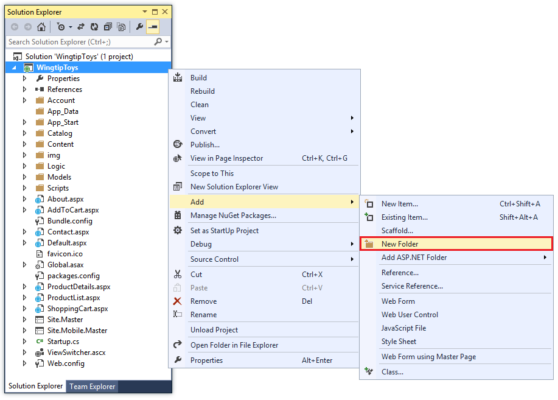
2. Name the new folder *Checkout*.
3. Right-click the *Checkout* folder and then select **Add**-&gt;**New Item**. 

    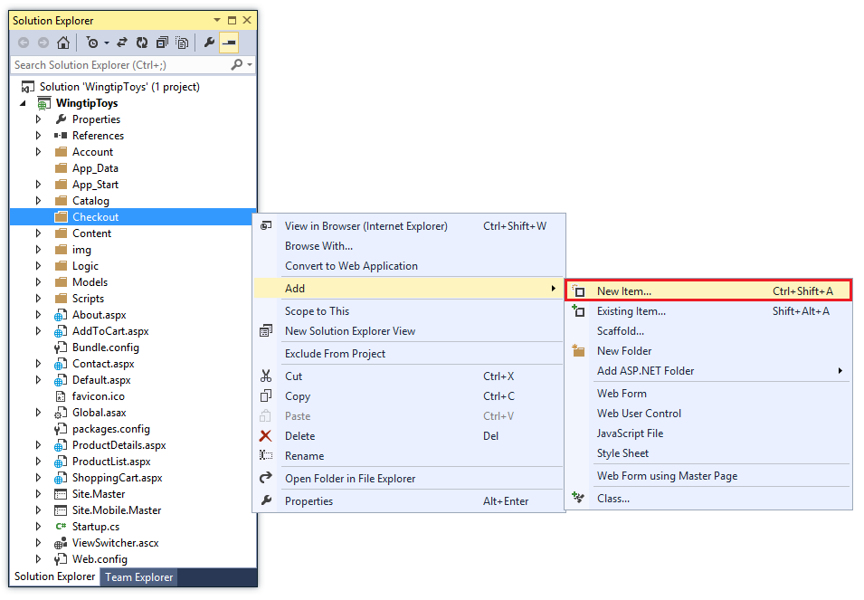
4. The **Add New Item** dialog box is displayed.
5. Select the **Visual C#** -&gt; **Web** templates group on the left. Then, from the middle pane, select **Web Form with Master Page**and name it *CheckoutStart.aspx*. 

    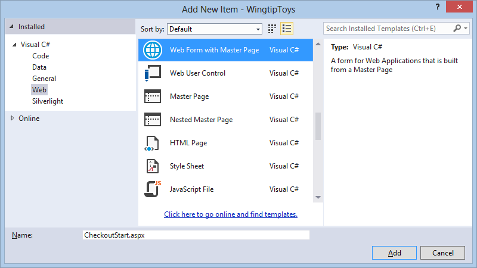
6. As before, select the *Site.Master* file as the master page.
7. Add the following additional pages to the *Checkout* folder using the same steps above:   

    - CheckoutReview.aspx
    - CheckoutComplete.aspx
    - CheckoutCancel.aspx
    - CheckoutError.aspx

### Add a Web.config File

By adding a new *Web.config* file to the *Checkout* folder, you will be able to restrict access to all the pages contained in the folder.

1. Right-click the *Checkout* folder and select **Add** -&gt; **New Item**.  
 The     **Add New Item** dialog box is displayed.
2. Select the **Visual C#** -&gt; **Web** templates group on the left. Then, from the middle pane, select **Web Configuration File**, accept the default name of *Web.config*, and then select **Add**.
3. Replace the existing XML content in the *Web.config* file with the following:  

        <?xml version="1.0"?>
        <configuration>
          <system.web>
            <authorization>
              <deny users="?"/>
            </authorization>
          </system.web>
        </configuration>
4. Save the *Web.config* file.

The *Web.config* file specifies that all unknown users of the Web application must be denied access to the pages contained in the *Checkout* folder. However, if the user has registered an account and is logged on, they will be a known user and will have access to the pages in the *Checkout* folder.

It's important to note that ASP.NET configuration follows a hierarchy, where each *Web.config* file applies configuration settings to the folder that it is in and to all of the child directories below it.

## Enable SSL for the Project

 Secure Sockets Layer (SSL) is a protocol defined to allow Web servers and Web clients to communicate more securely through the use of encryption. When SSL is not used, data sent between the client and server is open to packet sniffing by anyone with physical access to the network. Additionally, several common authentication schemes are not secure over plain HTTP. In particular, Basic authentication and forms authentication send unencrypted credentials. To be secure, these authentication schemes must use SSL. 

1. In **Solution Explorer**, click the **WingtipToys** project, then press **F4** to display the **Properties** window.
2. Change **SSL Enabled** to `true`.
3. Copy the **SSL URL** so you can use it later.   
 The SSL URL will be     `https://localhost:44300/` unless you've previously created SSL Web Sites (as shown below).   
    
4. In **Solution Explorer**, right click the **WingtipToys** project and click **Properties**.
5. In the left tab, click **Web**.
6. Change the **Project Url** to use the **SSL URL** that you saved earlier.   
    
7. Save the page by pressing **CTRL+S**.
8. Press **Ctrl+F5** to run the application. Visual Studio will display an option to allow you to avoid SSL warnings.
9. Click **Yes** to trust the IIS Express SSL certificate and continue.   
      
 A Security Warning is displayed.
10. Click **Yes** to install the certificate to your localhost.   
      
 The browser window will be displayed.

You can now easily test your Web application locally using SSL.

## Add an OAuth 2.0 Provider

ASP.NET Web Forms provides enhanced options for membership and authentication. These enhancements include OAuth. OAuth is an open protocol that allows secure authorization in a simple and standard method from web, mobile, and desktop applications. The ASP.NET Web Forms template uses OAuth to expose Facebook, Twitter, Google and Microsoft as authentication providers. Although this tutorial uses only Google as the authentication provider, you can easily modify the code to use any of the providers. The steps to implement other providers are very similar to the steps you will see in this tutorial.

In addition to authentication, the tutorial will also use roles to implement authorization. Only those users you add to the `canEdit` role will be able to change data (create, edit, or delete contacts).

> [!NOTE] 
> 
> Windows Live applications only accept a live URL for a working website, so you cannot use a local website URL for testing logins.

The following steps will allow you to add a Google authentication provider.

1. Open the *App\_Start\Startup.Auth.cs* file.
2. Remove the comment characters from the `app.UseGoogleAuthentication()` method so that the method appears as follows: 

        app.UseGoogleAuthentication(new GoogleOAuth2AuthenticationOptions()
                    {
                        ClientId = "",
                        ClientSecret = ""
                    });
3. Navigate to the [Google Developers Console](https://console.developers.google.com/). You will also need to sign-in with your Google developer email account (gmail.com). If you do not have a Google account, select the **Create an account** link.   
 Next, you'll see the     **Google Developers Console** .   
    
4. Click the **Create Project** button and enter a project name and ID (you can use the default values). Then, click the **agreement checkbox** and the **Create** button.  

    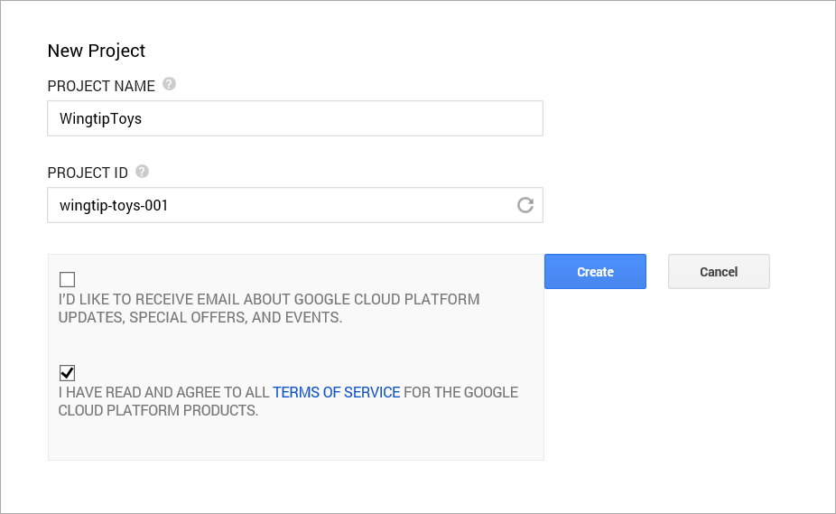

 In a few seconds the new project will be created and your browser will display the new projects page.
5. In the left tab, click **APIs &amp; auth**, and then click **Credentials**.
6. Click the **Create New Client ID** under **OAuth**.   
 The     **Create Client ID** dialog will be displayed.   
    
7. In the **Create Client ID** dialog, keep the default **Web application** for the application type.
8. Set the **Authorized JavaScript Origins** to the SSL URL you used earlier in this tutorial (`https://localhost:44300/` unless you've created other SSL projects).   
 This URL is the origin for your application. For this sample, you will only enter the localhost test URL. However, you can enter multiple URLs to account for localhost and production.
9. Set the **Authorized Redirect URI** to the following: 

        https://localhost:44300/signin-google

 This value is the URI that ASP.NET OAuth users to communicate with the google OAuth server. Remember the SSL URL you used above (    `https://localhost:44300/` unless you've created other SSL projects).
10. Click the **Create Client ID** button.
11. On the left menu of the Google Developers Console, click the **Consent screen** menu item, then set your email address and product name. When you have completed the form, click **Save**.
12. Click the **APIs** menu item, scroll down and click the **off** button next to **Google+ API**.   
 Accepting this option will enable the Google+ API.
13. You must also update the **Microsoft.Owin** NuGet package to version 3.0.0.   
 From the     **Tools** menu, select     **NuGet Package Manager** and then select     **Manage NuGet Packages for Solution** .  
 From the     **Manage NuGet Packages** window, find and update the     **Microsoft.Owin** package to version 3.0.0.
14. In Visual Studio, update the `UseGoogleAuthentication` method of the *Startup.Auth.cs* page by copying and pasting the **Client ID** and **Client Secret** into the method. The **Client ID** and **Client Secret** values shown below are samples and will not work. 

    [!code[Main](checkout-and-payment-with-paypal/samples/sample2.xml?highlight=64-65)]
15. Press **CTRL+F5** to build and run the application. Click the **Log in** link.
16. Under **Use another service to log in**, click **Google**.  
    
17. If you need to enter your credentials, you will be redirected to the google site where you will enter your credentials.  
    
18. After you enter your credentials, you will be prompted to give permissions to the web application you just created.  
    
19. Click **Accept**. You will now be redirected back to the **Register** page of the **WingtipToys** application where you can register your Google account.  
    
20. You have the option of changing the local email registration name used for your Gmail account, but you generally want to keep the default email alias (that is, the one you used for authentication). Click **Log in** as shown above.

### Modifying Login Functionality

As previously mentioned in this tutorial series, much of the user registration functionality has been included in the ASP.NET Web Forms template by default. Now you will modify the default *Login.aspx* and *Register.aspx* pages to call the `MigrateCart` method. The `MigrateCart` method associates a newly logged in user with an anonymous shopping cart. By associating the user and shopping cart, the Wingtip Toys sample application will be able to maintain the shopping cart of the user between visits.

1. In **Solution Explorer**, find and open the *Account* folder.
2. Modify the code-behind page named *Login.aspx.cs* to include the code highlighted in yellow, so that it appears as follows:   

    [!code[Main](checkout-and-payment-with-paypal/samples/sample3.xml?highlight=41-43)]
3. Save the *Login.aspx.cs* file.

For now, you can ignore the warning that there is no definition for the `MigrateCart` method. You will be adding it a bit later in this tutorial.

The *Login.aspx.cs* code-behind file supports a LogIn method. By inspecting the Login.aspx page, you'll see that this page includes a "Log in" button that when click triggers the `LogIn` handler on the code-behind.

When the `Login` method on the *Login.aspx.cs*is called, a new instance of the shopping cart named `usersShoppingCart` is created. The ID of the shopping cart (a GUID) is retrieved and set to the `cartId` variable. Then, the `MigrateCart` method is called, passing both the `cartId` and the name of the logged-in user to this method. When the shopping cart is migrated, the GUID used to identify the anonymous shopping cart is replaced with the user name.

In addition to modifying the *Login.aspx.cs* code-behind file to migrate the shopping cart when the user logs in, you must also modify the *Register.aspx.cs code-behind file* to migrate the shopping cart when the user creates a new account and logs in.

1. In the *Account* folder, open the code-behind file named *Register.aspx.cs*.
2. Modify the code-behind file by including the code in yellow, so that it appears as follows:   

    [!code[Main](checkout-and-payment-with-paypal/samples/sample4.xml?highlight=28-32)]
3. Save the *Register.aspx.cs* file. Once again, ignore the warning about the `MigrateCart` method.

Notice that the code you used in the `CreateUser_Click` event handler is very similar to the code you used in the `LogIn` method. When the user registers or logs in to the site, a call to the `MigrateCart` method will be made.

## Migrating the Shopping Cart

Now that you have the log-in and registration process updated, you can add the code to migrate the shopping cart using the `MigrateCart` method.

1. In **Solution Explorer**, find the *Logic* folder and open the *ShoppingCartActions.cs*class file.
2. Add the code highlighted in yellow to the existing code in the *ShoppingCartActions.cs* file, so that the code in the *ShoppingCartActions.cs* file appears as follows:   

    [!code[Main](checkout-and-payment-with-paypal/samples/sample5.xml?highlight=215-224)]

The `MigrateCart` method uses the existing cartId to find the shopping cart of the user. Next, the code loops through all the shopping cart items and replaces the `CartId` property (as specified by the `CartItem` schema) with the logged-in user name.

### Updating the Database Connection

If you are following this tutorial using the **prebuilt** Wingtip Toys sample application, you must recreate the default membership database. By modifying the default connection string, the membership database will be created the next time the application runs.

1. Open the *Web.config* file at the root of the project.
2. Update the default connection string so that it appears as follows:   

        <add name="DefaultConnection" connectionString="Data Source=(LocalDb)\v11.0;Initial Catalog=aspnet-WingtipToys;Integrated Security=True" providerName="System.Data.SqlClient" />

## Integrating PayPal

PayPal is a web-based billing platform that accepts payments by online merchants. This tutorial next explains how to integrate PayPal's Express Checkout functionality into your application. Express Checkout allows your customers to use PayPal to pay for the items they have added to their shopping cart.

### Create PaylPal Test Accounts

To use the PayPal testing environment, you must create and verify a developer test account. You will use the developer test account to create a buyer test account and a seller test account. The developer test account credentials also will allow the Wingtip Toys sample application to access the PayPal testing environment.

1. In a browser, navigate to the PayPal developer testing site:   
    [https://developer.paypal.com](https://developer.paypal.com/)
2. If you don't have a PayPal developer account, create a new account by clicking **Sign Up**and following the sign up steps. If you have an existing PayPal developer account, sign in by clicking **Log In**. You will need your PayPal developer account to test the Wingtip Toys sample application later in this tutorial.
3. If you have just signed up for your PayPal developer account, you may need to verify your PayPal developer account with PayPal. You can verify your account by following the steps that PayPal sent to your email account. Once you have verified your PayPal developer account, log back into the PayPal developer testing site.
4. After you are logged in to the PayPal developer site with your PayPal developer account you need to create a PayPal buyer test account if you don't already have one. To create a buyer test account, on the PayPal site click the **Applications** tab and then click **Sandbox accounts**.   
 The     **Sandbox test accounts** page is shown.   

    > [!NOTE] 
    > 
    > The PayPal Developer site already provides a merchant test account.

    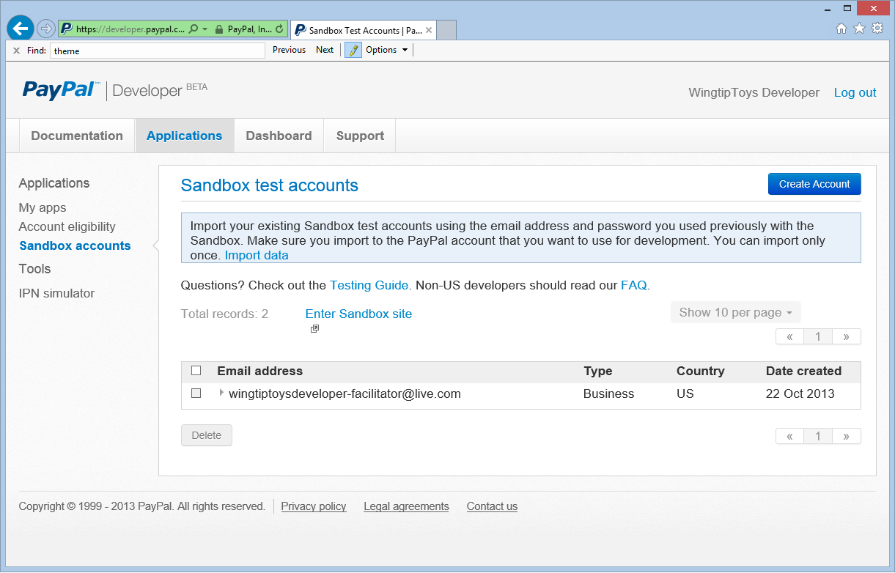
5. On the Sandbox test accounts page, click **Create Account**.
6. On the **Create test account** page choose a buyer test account email and password of your choice.   

    > [!NOTE] 
    > 
    > You will need the buyer email addresses and password to test the Wingtip Toys sample application at the end of this tutorial.

    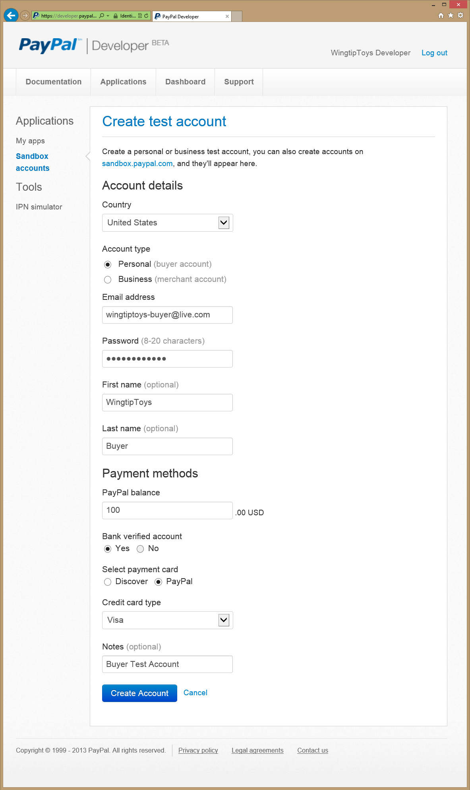
7. Create the buyer test account by clicking the **Create Account** button.  
 The     **Sandbox Test accounts** page is displayed. 

    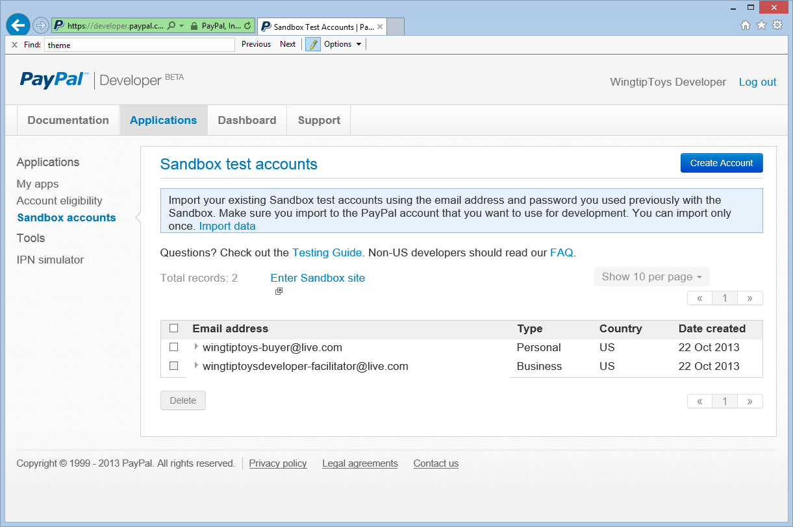
8. On the **Sandbox test accounts** page, click the **facilitator** email account.  
    **Profile** and     **Notification** options appear.
9. Select the **Profile** option, then click **API credentials** to view your API credentials for the merchant test account.
10. Copy the TEST API credentials to notepad.

You will need your displayed Classic TEST API credentials (Username, Password, and Signature) to make API calls from the Wingtip Toys sample application to the PayPal testing environment. You will add the credentials in the next step.

### Add PayPal Class and API Credentials

You will place the majority of the PayPal code into a single class. This class contains the methods used to communicate with PayPal. Also, you will add your PayPal credentials to this class.

1. In the Wingtip Toys sample application within Visual Studio, right-click the **Logic** folder and then select **Add** -&gt; **New Item**.   
 The     **Add New Item** dialog box is displayed.
2. Under **Visual C#** from the **Installed** pane on the left, select **Code**.
3. From the middle pane, select **Class**. Name this new class **PayPalFunctions.cs**.
4. Click **Add**.  
 The new class file is displayed in the editor.
5. Replace the default code with the following code:  

        using System;
        using System.Collections;
        using System.Collections.Specialized;
        using System.IO;
        using System.Net;
        using System.Text;
        using System.Data;
        using System.Configuration;
        using System.Web;
        using WingtipToys;
        using WingtipToys.Models;
        using System.Collections.Generic;
        using System.Linq;
        
        public class NVPAPICaller
        {
          //Flag that determines the PayPal environment (live or sandbox)
          private const bool bSandbox = true;
          private const string CVV2 = "CVV2";
        
          // Live strings.
          private string pEndPointURL = "https://api-3t.paypal.com/nvp";
          private string host = "www.paypal.com";
        
          // Sandbox strings.
          private string pEndPointURL_SB = "https://api-3t.sandbox.paypal.com/nvp";
          private string host_SB = "www.sandbox.paypal.com";
        
          private const string SIGNATURE = "SIGNATURE";
          private const string PWD = "PWD";
          private const string ACCT = "ACCT";
        
          //Replace <Your API Username> with your API Username
          //Replace <Your API Password> with your API Password
          //Replace <Your Signature> with your Signature
          public string APIUsername = "<Your API Username>";
          private string APIPassword = "<Your API Password>";
          private string APISignature = "<Your Signature>";
          private string Subject = "";
          private string BNCode = "PP-ECWizard";
        
          //HttpWebRequest Timeout specified in milliseconds 
          private const int Timeout = 15000;
          private static readonly string[] SECURED_NVPS = new string[] { ACCT, CVV2, SIGNATURE, PWD };
        
          public void SetCredentials(string Userid, string Pwd, string Signature)
          {
            APIUsername = Userid;
            APIPassword = Pwd;
            APISignature = Signature;
          }
        
          public bool ShortcutExpressCheckout(string amt, ref string token, ref string retMsg)
          {
            if (bSandbox)
            {
              pEndPointURL = pEndPointURL_SB;
              host = host_SB;
            }
        
            string returnURL = "https://localhost:44300/Checkout/CheckoutReview.aspx";
            string cancelURL = "https://localhost:44300/Checkout/CheckoutCancel.aspx";
        
            NVPCodec encoder = new NVPCodec();
            encoder["METHOD"] = "SetExpressCheckout";
            encoder["RETURNURL"] = returnURL;
            encoder["CANCELURL"] = cancelURL;
            encoder["BRANDNAME"] = "Wingtip Toys Sample Application";
            encoder["PAYMENTREQUEST_0_AMT"] = amt;
            encoder["PAYMENTREQUEST_0_ITEMAMT"] = amt;
            encoder["PAYMENTREQUEST_0_PAYMENTACTION"] = "Sale";
            encoder["PAYMENTREQUEST_0_CURRENCYCODE"] = "USD";
        
            // Get the Shopping Cart Products
            using (WingtipToys.Logic.ShoppingCartActions myCartOrders = new WingtipToys.Logic.ShoppingCartActions())
            {
              List<CartItem> myOrderList = myCartOrders.GetCartItems();
        
              for (int i = 0; i < myOrderList.Count; i++)
              {
                encoder["L_PAYMENTREQUEST_0_NAME" + i] = myOrderList[i].Product.ProductName.ToString();
                encoder["L_PAYMENTREQUEST_0_AMT" + i] = myOrderList[i].Product.UnitPrice.ToString();
                encoder["L_PAYMENTREQUEST_0_QTY" + i] = myOrderList[i].Quantity.ToString();
              }
            }
        
            string pStrrequestforNvp = encoder.Encode();
            string pStresponsenvp = HttpCall(pStrrequestforNvp);
        
            NVPCodec decoder = new NVPCodec();
            decoder.Decode(pStresponsenvp);
        
            string strAck = decoder["ACK"].ToLower();
            if (strAck != null && (strAck == "success" || strAck == "successwithwarning"))
            {
              token = decoder["TOKEN"];
              string ECURL = "https://" + host + "/cgi-bin/webscr?cmd=_express-checkout" + "&token=" + token;
              retMsg = ECURL;
              return true;
            }
            else
            {
              retMsg = "ErrorCode=" + decoder["L_ERRORCODE0"] + "&" +
                  "Desc=" + decoder["L_SHORTMESSAGE0"] + "&" +
                  "Desc2=" + decoder["L_LONGMESSAGE0"];
              return false;
            }
          }
        
          public bool GetCheckoutDetails(string token, ref string PayerID, ref NVPCodec decoder, ref string retMsg)
          {
            if (bSandbox)
            {
              pEndPointURL = pEndPointURL_SB;
            }
        
            NVPCodec encoder = new NVPCodec();
            encoder["METHOD"] = "GetExpressCheckoutDetails";
            encoder["TOKEN"] = token;
        
            string pStrrequestforNvp = encoder.Encode();
            string pStresponsenvp = HttpCall(pStrrequestforNvp);
        
            decoder = new NVPCodec();
            decoder.Decode(pStresponsenvp);
        
            string strAck = decoder["ACK"].ToLower();
            if (strAck != null && (strAck == "success" || strAck == "successwithwarning"))
            {
              PayerID = decoder["PAYERID"];
              return true;
            }
            else
            {
              retMsg = "ErrorCode=" + decoder["L_ERRORCODE0"] + "&" +
                  "Desc=" + decoder["L_SHORTMESSAGE0"] + "&" +
                  "Desc2=" + decoder["L_LONGMESSAGE0"];
        
              return false;
            }
          }
        
          public bool DoCheckoutPayment(string finalPaymentAmount, string token, string PayerID, ref NVPCodec decoder, ref string retMsg)
          {
            if (bSandbox)
            {
              pEndPointURL = pEndPointURL_SB;
            }
        
            NVPCodec encoder = new NVPCodec();
            encoder["METHOD"] = "DoExpressCheckoutPayment";
            encoder["TOKEN"] = token;
            encoder["PAYERID"] = PayerID;
            encoder["PAYMENTREQUEST_0_AMT"] = finalPaymentAmount;
            encoder["PAYMENTREQUEST_0_CURRENCYCODE"] = "USD";
            encoder["PAYMENTREQUEST_0_PAYMENTACTION"] = "Sale";
        
            string pStrrequestforNvp = encoder.Encode();
            string pStresponsenvp = HttpCall(pStrrequestforNvp);
        
            decoder = new NVPCodec();
            decoder.Decode(pStresponsenvp);
        
            string strAck = decoder["ACK"].ToLower();
            if (strAck != null && (strAck == "success" || strAck == "successwithwarning"))
            {
              return true;
            }
            else
            {
              retMsg = "ErrorCode=" + decoder["L_ERRORCODE0"] + "&" +
                  "Desc=" + decoder["L_SHORTMESSAGE0"] + "&" +
                  "Desc2=" + decoder["L_LONGMESSAGE0"];
        
              return false;
            }
          }
        
          public string HttpCall(string NvpRequest)
          {
            string url = pEndPointURL;
        
            string strPost = NvpRequest + "&" + buildCredentialsNVPString();
            strPost = strPost + "&BUTTONSOURCE=" + HttpUtility.UrlEncode(BNCode);
        
            HttpWebRequest objRequest = (HttpWebRequest)WebRequest.Create(url);
            objRequest.Timeout = Timeout;
            objRequest.Method = "POST";
            objRequest.ContentLength = strPost.Length;
        
            try
            {
              using (StreamWriter myWriter = new StreamWriter(objRequest.GetRequestStream()))
              {
                myWriter.Write(strPost);
              }
            }
            catch (Exception)
            {
              // No logging for this tutorial.
            }
        
            //Retrieve the Response returned from the NVP API call to PayPal.
            HttpWebResponse objResponse = (HttpWebResponse)objRequest.GetResponse();
            string result;
            using (StreamReader sr = new StreamReader(objResponse.GetResponseStream()))
            {
              result = sr.ReadToEnd();
            }
        
            return result;
          }
        
          private string buildCredentialsNVPString()
          {
            NVPCodec codec = new NVPCodec();
        
            if (!IsEmpty(APIUsername))
              codec["USER"] = APIUsername;
        
            if (!IsEmpty(APIPassword))
              codec[PWD] = APIPassword;
        
            if (!IsEmpty(APISignature))
              codec[SIGNATURE] = APISignature;
        
            if (!IsEmpty(Subject))
              codec["SUBJECT"] = Subject;
        
            codec["VERSION"] = "88.0";
        
            return codec.Encode();
          }
        
          public static bool IsEmpty(string s)
          {
            return s == null || s.Trim() == string.Empty;
          }
        }
        
        public sealed class NVPCodec : NameValueCollection
        {
          private const string AMPERSAND = "&";
          private const string EQUALS = "=";
          private static readonly char[] AMPERSAND_CHAR_ARRAY = AMPERSAND.ToCharArray();
          private static readonly char[] EQUALS_CHAR_ARRAY = EQUALS.ToCharArray();
        
          public string Encode()
          {
            StringBuilder sb = new StringBuilder();
            bool firstPair = true;
            foreach (string kv in AllKeys)
            {
              string name = HttpUtility.UrlEncode(kv);
              string value = HttpUtility.UrlEncode(this[kv]);
              if (!firstPair)
              {
                sb.Append(AMPERSAND);
              }
              sb.Append(name).Append(EQUALS).Append(value);
              firstPair = false;
            }
            return sb.ToString();
          }
        
          public void Decode(string nvpstring)
          {
            Clear();
            foreach (string nvp in nvpstring.Split(AMPERSAND_CHAR_ARRAY))
            {
              string[] tokens = nvp.Split(EQUALS_CHAR_ARRAY);
              if (tokens.Length >= 2)
              {
                string name = HttpUtility.UrlDecode(tokens[0]);
                string value = HttpUtility.UrlDecode(tokens[1]);
                Add(name, value);
              }
            }
          }
        
          public void Add(string name, string value, int index)
          {
            this.Add(GetArrayName(index, name), value);
          }
        
          public void Remove(string arrayName, int index)
          {
            this.Remove(GetArrayName(index, arrayName));
          }
        
          public string this[string name, int index]
          {
            get
            {
              return this[GetArrayName(index, name)];
            }
            set
            {
              this[GetArrayName(index, name)] = value;
            }
          }
        
          private static string GetArrayName(int index, string name)
          {
            if (index < 0)
            {
              throw new ArgumentOutOfRangeException("index", "index cannot be negative : " + index);
            }
            return name + index;
          }
        }
6. Add the Merchant API credentials (Username, Password, and Signature) that you displayed earlier in this tutorial so that you can make function calls to the PayPal testing environment.  

        public string APIUsername = "<Your API Username>";
            private string APIPassword = "<Your API Password>";
            private string APISignature = "<Your Signature>";

> [!NOTE] 
> 
> In this sample application you are simply adding credentials to a C# file (.cs). However, in a implemented solution, you should consider encrypting your credentials in a configuration file.

The NVPAPICaller class contains the majority of the PayPal functionality. The code in the class provides the methods needed to make a test purchase from the PayPal testing environment. The following three PayPal functions are used to make purchases:

- `SetExpressCheckout` function
- `GetExpressCheckoutDetails` function
- `DoExpressCheckoutPayment` function

The `ShortcutExpressCheckout` method collects the test purchase information and product details from the shopping cart and calls the `SetExpressCheckout` PayPal function. The `GetCheckoutDetails` method confirms purchase details and calls the `GetExpressCheckoutDetails` PayPal function before making the test purchase. The `DoCheckoutPayment` method completes the test purchase from the testing environment by calling the `DoExpressCheckoutPayment` PayPal function. The remaining code supports the PayPal methods and process, such as encoding strings, decoding strings, processing arrays, and determining credentials.

> [!NOTE] 
> 
> PayPal allows you to include optional purchase details based on [PayPal's API specification](https://cms.paypal.com/us/cgi-bin/?cmd=_render-content&amp;content_ID=developer/e_howto_api_nvp_r_SetExpressCheckout). By extending the code in the Wingtip Toys sample application, you can include localization details, product descriptions, tax, a customer service number, as well as many other optional fields.

Notice that the return and cancel URLs that are specified in the **ShortcutExpressCheckout** method use a port number.

    string returnURL = "https://localhost:44300/Checkout/CheckoutReview.aspx";
           string cancelURL = "https://localhost:44300/Checkout/CheckoutCancel.aspx";

When Visual Web Developer runs a web project using SSL, commonly the port 44300 is used for the web server. As shown above, the port number is 44300. When you run the application, you could see a different port number. Your port number needs to be correctly set in the code so that you can successful run the Wingtip Toys sample application at the end of this tutorial. The next section of this tutorial explains how to retrieve the local host port number and update the PayPal class.

### Update the LocalHost Port Number in the PayPal Class

The Wingtip Toys sample application purchases products by navigating to the PayPal testing site and returning to your local instance of the Wingtip Toys sample application. In order to have PayPal return to the correct URL, you need to specify the port number of the locally running sample application in the PayPal code mentioned above.

1. Right-click the project name (**WingtipToys**) in **Solution Explorer** and select **Properties**.
2. In the left column, select the **Web** tab.
3. Retrieve the port number from the **Project Url** box.
4. If needed, update the `returnURL` and `cancelURL` in the PayPal class (`NVPAPICaller`) in the *PayPalFunctions.cs* file to use the port number of your web application:   

    [!code[Main](checkout-and-payment-with-paypal/samples/sample6.xml?highlight=1-2)]

Now the code that you added will match the expected port for your local Web application. PayPal will be able to return to the correct URL on your local machine.

### Add the PayPal Checkout Button

Now that the primary PayPal functions have been added to the sample application, you can begin adding the markup and code needed to call these functions. First, you must add the checkout button that the user will see on the shopping cart page.

1. Open the *ShoppingCart.aspx* file.
2. Scroll to the bottom of the file and find the `<!--Checkout Placeholder -->` comment.
3. Replace the comment with an `ImageButton` control so that the mark up is replaced as follows:  

        <asp:ImageButton ID="CheckoutImageBtn" runat="server" 
                              ImageUrl="https://www.paypal.com/en_US/i/btn/btn_xpressCheckout.gif" 
                              Width="145" AlternateText="Check out with PayPal" 
                              OnClick="CheckoutBtn_Click" 
                              BackColor="Transparent" BorderWidth="0" />
4. In the *ShoppingCart.aspx.cs* file, after the `UpdateBtn_Click` event handler near the end of the file, add the `CheckOutBtn_Click` event handler:  

        protected void CheckoutBtn_Click(object sender, ImageClickEventArgs e)
        {
          using (ShoppingCartActions usersShoppingCart = new ShoppingCartActions())
          {
            Session["payment_amt"] = usersShoppingCart.GetTotal();
          }
          Response.Redirect("Checkout/CheckoutStart.aspx");
        }
5. Also in the *ShoppingCart.aspx.cs* file, add a reference to the `CheckoutBtn`, so that the new image button is referenced as follows:  

    [!code[Main](checkout-and-payment-with-paypal/samples/sample7.xml?highlight=18)]
6. Save your changes to both the *ShoppingCart.aspx* file and the *ShoppingCart.aspx.cs* file.
7. From the menu, select **Debug**-&gt;**Build WingtipToys**.  
 The project will be rebuilt with the newly added     **ImageButton** control.

### Send Purchase Details to PayPal

When the user clicks the **Checkout** button on the shopping cart page (*ShoppingCart.aspx*), they'll begin the purchase process. The following code calls the first PayPal function needed to purchase products.

1. From the *Checkout* folder, open the code-behind file named *CheckoutStart.aspx.cs*.   
 Be sure to open the code-behind file.
2. Replace the existing code with the following:   

        using System;
        using System.Collections.Generic;
        using System.Linq;
        using System.Web;
        using System.Web.UI;
        using System.Web.UI.WebControls;
        
        namespace WingtipToys.Checkout
        {
          public partial class CheckoutStart : System.Web.UI.Page
          {
            protected void Page_Load(object sender, EventArgs e)
            {
              NVPAPICaller payPalCaller = new NVPAPICaller();
              string retMsg = "";
              string token = "";
        
              if (Session["payment_amt"] != null)
              {
                string amt = Session["payment_amt"].ToString();
        
                bool ret = payPalCaller.ShortcutExpressCheckout(amt, ref token, ref retMsg);
                if (ret)
                {
                  Session["token"] = token;
                  Response.Redirect(retMsg);
                }
                else
                {
                  Response.Redirect("CheckoutError.aspx?" + retMsg);
                }
              }
              else
              {
                Response.Redirect("CheckoutError.aspx?ErrorCode=AmtMissing");
              }
            }
          }
        }

When the user of the application clicks the **Checkout** button on the shopping cart page, the browser will navigate to the *CheckoutStart.aspx* page. When the *CheckoutStart.aspx* page loads, the `ShortcutExpressCheckout` method is called. At this point, the user is transferred to the PayPal testing web site. On the PayPal site, the user enters their PayPal credentials, reviews the purchase details, accepts the PayPal agreement and returns to the Wingtip Toys sample application where the `ShortcutExpressCheckout` method completes. When the `ShortcutExpressCheckout` method is complete, it will redirect the user to the *CheckoutReview.aspx* page specified in the `ShortcutExpressCheckout` method. This allows the user to review the order details from within the Wingtip Toys sample application.

### Review Order Details

After returning from PayPal, the *CheckoutReview.aspx* page of the Wingtip Toys sample application displays the order details. This page allows the user to review the order details before purchasing the products. The *CheckoutReview.aspx* page must be created as follows:

1. In the *Checkout* folder, open the page named *CheckoutReview.aspx*.
2. Replace the existing markup with the following:   

        <%@ Page Title="" Language="C#" MasterPageFile="~/Site.Master" AutoEventWireup="true" CodeBehind="CheckoutReview.aspx.cs" Inherits="WingtipToys.Checkout.CheckoutReview" %>
        <asp:Content ID="Content1" ContentPlaceHolderID="MainContent" runat="server">
            <h1>Order Review</h1>
            

            <h3 style="padding-left: 33px">Products:</h3>
            <asp:GridView ID="OrderItemList" runat="server" AutoGenerateColumns="False" GridLines="Both" CellPadding="10" Width="500" BorderColor="#efeeef" BorderWidth="33">              
                <Columns>
                    <asp:BoundField DataField="ProductId" HeaderText=" Product ID" />        
                    <asp:BoundField DataField="Product.ProductName" HeaderText=" Product Name" />        
                    <asp:BoundField DataField="Product.UnitPrice" HeaderText="Price (each)" DataFormatString="{0:c}"/>     
                    <asp:BoundField DataField="Quantity" HeaderText="Quantity" />        
                </Columns>    
            </asp:GridView>
            <asp:DetailsView ID="ShipInfo" runat="server" AutoGenerateRows="false" GridLines="None" CellPadding="10" BorderStyle="None" CommandRowStyle-BorderStyle="None">
                <Fields>
                <asp:TemplateField>
                    <ItemTemplate>
                        <h3>Shipping Address:</h3>
                         
                        <asp:Label ID="FirstName" runat="server" Text='<%#: Eval("FirstName") %>'></asp:Label>  
                        <asp:Label ID="LastName" runat="server" Text='<%#: Eval("LastName") %>'></asp:Label>
                         
                        <asp:Label ID="Address" runat="server" Text='<%#: Eval("Address") %>'></asp:Label>
                         
                        <asp:Label ID="City" runat="server" Text='<%#: Eval("City") %>'></asp:Label>
                        <asp:Label ID="State" runat="server" Text='<%#: Eval("State") %>'></asp:Label>
                        <asp:Label ID="PostalCode" runat="server" Text='<%#: Eval("PostalCode") %>'></asp:Label>
                        

                        <h3>Order Total:</h3>
                         
                        <asp:Label ID="Total" runat="server" Text='<%#: Eval("Total", "{0:C}") %>'></asp:Label>
                    </ItemTemplate>
                    <ItemStyle HorizontalAlign="Left" />
                </asp:TemplateField>
                  </Fields>
            </asp:DetailsView>
            

            

            <asp:Button ID="CheckoutConfirm" runat="server" Text="Complete Order" OnClick="CheckoutConfirm_Click" />
        </asp:Content>
3. Open the code-behind page named *CheckoutReview.aspx.cs*and replace the existing code with the following:   

        using System;
        using System.Collections.Generic;
        using System.Linq;
        using System.Web;
        using System.Web.UI;
        using System.Web.UI.WebControls;
        using WingtipToys.Models;
        
        namespace WingtipToys.Checkout
        {
          public partial class CheckoutReview : System.Web.UI.Page
          {
            protected void Page_Load(object sender, EventArgs e)
            {
              if (!IsPostBack)
              {
                NVPAPICaller payPalCaller = new NVPAPICaller();
        
                string retMsg = "";
                string token = "";
                string PayerID = "";
                NVPCodec decoder = new NVPCodec();
                token = Session["token"].ToString();
        
                bool ret = payPalCaller.GetCheckoutDetails(token, ref PayerID, ref decoder, ref retMsg);
                if (ret)
                {
                  Session["payerId"] = PayerID;
        
                  var myOrder = new Order();
                  myOrder.OrderDate = Convert.ToDateTime(decoder["TIMESTAMP"].ToString());
                  myOrder.Username = User.Identity.Name;
                  myOrder.FirstName = decoder["FIRSTNAME"].ToString();
                  myOrder.LastName = decoder["LASTNAME"].ToString();
                  myOrder.Address = decoder["SHIPTOSTREET"].ToString();
                  myOrder.City = decoder["SHIPTOCITY"].ToString();
                  myOrder.State = decoder["SHIPTOSTATE"].ToString();
                  myOrder.PostalCode = decoder["SHIPTOZIP"].ToString();
                  myOrder.Country = decoder["SHIPTOCOUNTRYCODE"].ToString();
                  myOrder.Email = decoder["EMAIL"].ToString();
                  myOrder.Total = Convert.ToDecimal(decoder["AMT"].ToString());
        
                  // Verify total payment amount as set on CheckoutStart.aspx.
                  try
                  {
                    decimal paymentAmountOnCheckout = Convert.ToDecimal(Session["payment_amt"].ToString());
                    decimal paymentAmoutFromPayPal = Convert.ToDecimal(decoder["AMT"].ToString());
                    if (paymentAmountOnCheckout != paymentAmoutFromPayPal)
                    {
                      Response.Redirect("CheckoutError.aspx?" + "Desc=Amount%20total%20mismatch.");
                    }
                  }
                  catch (Exception)
                  {
                    Response.Redirect("CheckoutError.aspx?" + "Desc=Amount%20total%20mismatch.");
                  }
        
                  // Get DB context.
                  ProductContext _db = new ProductContext();
        
                  // Add order to DB.
                  _db.Orders.Add(myOrder);
                  _db.SaveChanges();
        
                  // Get the shopping cart items and process them.
                  using (WingtipToys.Logic.ShoppingCartActions usersShoppingCart = new WingtipToys.Logic.ShoppingCartActions())
                  {
                    List<CartItem> myOrderList = usersShoppingCart.GetCartItems();
        
                    // Add OrderDetail information to the DB for each product purchased.
                    for (int i = 0; i < myOrderList.Count; i++)
                    {
                      // Create a new OrderDetail object.
                      var myOrderDetail = new OrderDetail();
                      myOrderDetail.OrderId = myOrder.OrderId;
                      myOrderDetail.Username = User.Identity.Name;
                      myOrderDetail.ProductId = myOrderList[i].ProductId;
                      myOrderDetail.Quantity = myOrderList[i].Quantity;
                      myOrderDetail.UnitPrice = myOrderList[i].Product.UnitPrice;
        
                      // Add OrderDetail to DB.
                      _db.OrderDetails.Add(myOrderDetail);
                      _db.SaveChanges();
                    }
        
                    // Set OrderId.
                    Session["currentOrderId"] = myOrder.OrderId;
        
                    // Display Order information.
                    List<Order> orderList = new List<Order>();
                    orderList.Add(myOrder);
                    ShipInfo.DataSource = orderList;
                    ShipInfo.DataBind();
        
                    // Display OrderDetails.
                    OrderItemList.DataSource = myOrderList;
                    OrderItemList.DataBind();
                  }
                }
                else
                {
                  Response.Redirect("CheckoutError.aspx?" + retMsg);
                }
              }
            }
        
            protected void CheckoutConfirm_Click(object sender, EventArgs e)
            {
              Session["userCheckoutCompleted"] = "true";
              Response.Redirect("~/Checkout/CheckoutComplete.aspx");
            }
          }
        }

The **DetailsView** control is used to display the order details that have been returned from PayPal. Also, the above code saves the order details to the Wingtip Toys database as an `OrderDetail` object. When the user clicks on the **Complete Order** button, they are redirected to the *CheckoutComplete.aspx* page.

> [!NOTE] 
> 
> **Tip**
> 
> In the markup of the *CheckoutReview.aspx* page, notice that the `<ItemStyle>` tag is used to change the style of the items within the **DetailsView** control near the bottom of the page. By viewing the page in **Design View** (by selecting **Design** at the lower left corner of Visual Studio), then selecting the **DetailsView** control, and selecting the **Smart Tag** (the arrow icon at the top right of the control), you will be able to see the **DetailsView Tasks**.
> 
> 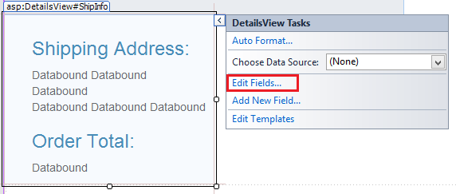
> 
> By selecting **Edit Fields**, the **Fields** dialog box will appear. In this dialog box you can easily control the visual properties, such as **ItemStyle**, of the **DetailsView** control.
> 
> 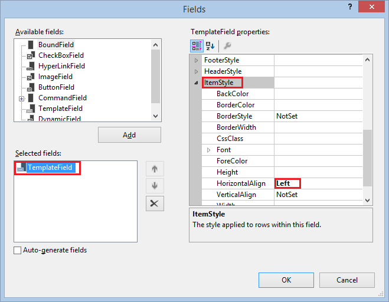

### Complete Purchase

*CheckoutComplete.aspx* page makes the purchase from PayPal. As mentioned above, the user must click on the **Complete Order** button before the application will navigate to the *CheckoutComplete.aspx* page.

1. In the *Checkout* folder, open the page named *CheckoutComplete.aspx*.
2. Replace the existing markup with the following:   

        <%@ Page Title="" Language="C#" MasterPageFile="~/Site.Master" AutoEventWireup="true" CodeBehind="CheckoutComplete.aspx.cs" Inherits="WingtipToys.Checkout.CheckoutComplete" %>
        <asp:Content ID="Content1" ContentPlaceHolderID="MainContent" runat="server">
            <h1>Checkout Complete</h1>
            

            <h3>Payment Transaction ID:</h3> <asp:Label ID="TransactionId" runat="server"></asp:Label>
            

            <h3>Thank You!</h3>
            

            

            <asp:Button ID="Continue" runat="server" Text="Continue Shopping" OnClick="Continue_Click" />
        </asp:Content>
3. Open the code-behind page named *CheckoutComplete.aspx.cs*and replace the existing code with the following:   

        using System;
        using System.Collections.Generic;
        using System.Linq;
        using System.Web;
        using System.Web.UI;
        using System.Web.UI.WebControls;
        using WingtipToys.Models;
        
        namespace WingtipToys.Checkout
        {
          public partial class CheckoutComplete : System.Web.UI.Page
          {
            protected void Page_Load(object sender, EventArgs e)
            {
              if (!IsPostBack)
              {
                // Verify user has completed the checkout process.
                if ((string)Session["userCheckoutCompleted"] != "true")
                {
                  Session["userCheckoutCompleted"] = string.Empty;
                  Response.Redirect("CheckoutError.aspx?" + "Desc=Unvalidated%20Checkout.");
                }
        
                NVPAPICaller payPalCaller = new NVPAPICaller();
        
                string retMsg = "";
                string token = "";
                string finalPaymentAmount = "";
                string PayerID = "";
                NVPCodec decoder = new NVPCodec();
        
                token = Session["token"].ToString();
                PayerID = Session["payerId"].ToString();
                finalPaymentAmount = Session["payment_amt"].ToString();
        
                bool ret = payPalCaller.DoCheckoutPayment(finalPaymentAmount, token, PayerID, ref decoder, ref retMsg);
                if (ret)
                {
                  // Retrieve PayPal confirmation value.
                  string PaymentConfirmation = decoder["PAYMENTINFO_0_TRANSACTIONID"].ToString();
                  TransactionId.Text = PaymentConfirmation;
        
                  ProductContext _db = new ProductContext();
                  // Get the current order id.
                  int currentOrderId = -1;
                  if (Session["currentOrderId"] != string.Empty)
                  {
                    currentOrderId = Convert.ToInt32(Session["currentOrderID"]);
                  }
                  Order myCurrentOrder;
                  if (currentOrderId >= 0)
                  {
                    // Get the order based on order id.
                    myCurrentOrder = _db.Orders.Single(o => o.OrderId == currentOrderId);
                    // Update the order to reflect payment has been completed.
                    myCurrentOrder.PaymentTransactionId = PaymentConfirmation;
                    // Save to DB.
                    _db.SaveChanges();
                  }
        
                  // Clear shopping cart.
                  using (WingtipToys.Logic.ShoppingCartActions usersShoppingCart =
                      new WingtipToys.Logic.ShoppingCartActions())
                  {
                    usersShoppingCart.EmptyCart();
                  }
        
                  // Clear order id.
                  Session["currentOrderId"] = string.Empty;
                }
                else
                {
                  Response.Redirect("CheckoutError.aspx?" + retMsg);
                }
              }
            }
        
            protected void Continue_Click(object sender, EventArgs e)
            {
              Response.Redirect("~/Default.aspx");
            }
          }
        }

When the *CheckoutComplete.aspx* page is loaded, the `DoCheckoutPayment` method is called. As mentioned earlier, the `DoCheckoutPayment` method completes the purchase from the PayPal testing environment. Once PayPal has completed the purchase of the order, the *CheckoutComplete.aspx* page displays a payment transaction `ID` to the purchaser.

### Handle Cancel Purchase

If the user decides to cancel the purchase, they will be directed to the *CheckoutCancel.aspx*page where they will see that their order has been cancelled.

1. Open the page named *CheckoutCancel.aspx* in the *Checkout* folder.
2. Replace the existing markup with the following:   

        <%@ Page Title="" Language="C#" MasterPageFile="~/Site.Master" AutoEventWireup="true" CodeBehind="CheckoutCancel.aspx.cs" Inherits="WingtipToys.Checkout.CheckoutCancel" %>
        <asp:Content ID="Content1" ContentPlaceHolderID="MainContent" runat="server">
            <h1>Checkout Cancelled</h1>
            

            <h3>Your purchase has been cancelled.</h3>
        </asp:Content>

### Handle Purchase Errors

Errors during the purchase process will be handled by the *CheckoutError.aspx* page. The code-behind of the *CheckoutStart.aspx* page, the *CheckoutReview.aspx* page, and the *CheckoutComplete.aspx* page will each redirect to the *CheckoutError.aspx* page if an error occurs.

1. Open the page named *CheckoutError.aspx* in the *Checkout* folder.
2. Replace the existing markup with the following:   

        <%@ Page Title="" Language="C#" MasterPageFile="~/Site.Master" AutoEventWireup="true" CodeBehind="CheckoutError.aspx.cs" Inherits="WingtipToys.Checkout.CheckoutError" %>
        <asp:Content ID="Content1" ContentPlaceHolderID="MainContent" runat="server">
            <h1>Checkout Error</h1>
            

        <table id="ErrorTable">
        	<tr>
        		<td class="field"></td>
        		<td><%=Request.QueryString.Get("ErrorCode")%></td>
        	</tr>
        	<tr>
        		<td class="field"></td>
        		<td><%=Request.QueryString.Get("Desc")%></td>
        	</tr>
        	<tr>
        		<td class="field"></td>
        		<td><%=Request.QueryString.Get("Desc2")%></td>
        	</tr>
        </table>
            

        </asp:Content>

The *CheckoutError.aspx* page is displayed with the error details when an error occurs during the checkout process.

## Running the Application

Run the application to see how to purchase products. Note that you will be running in the PayPal testing environment. No actual money is being exchanged.

1. Make sure all your files are saved in Visual Studio.
2. Open a Web browser and navigate to [https://developer.paypal.com](https://developer.paypal.com/).
3. Login with your PayPal developer account that you created earlier in this tutorial.  
 For PayPal's developer sandbox, you need to be logged in at     [https://developer.paypal.com](https://developer.paypal.com/) to test express checkout. This only applies to PayPal's sandbox testing, not to PayPal's live environment.
4. In Visual Studio, press **F5** to run the Wingtip Toys sample application.  
 After the database rebuilds, the browser will open and show the     *Default.aspx* page.
5. Add three different products to the shopping cart by selecting the product category, such as "Cars" and then clicking **Add to Cart** next to each product.  
 The shopping cart will display the product you have selected.
6. Click the **PayPal** button to checkout. 

    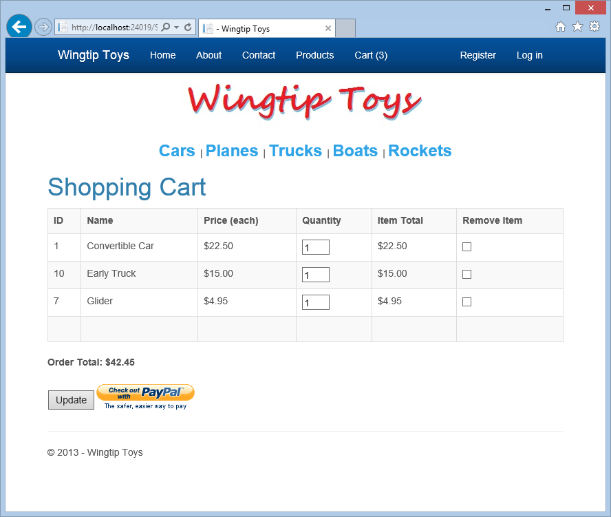

 Checking out will require that you have a user account for the Wingtip Toys sample application.
7. Click the **Google** link on the right of the page to log in with an existing gmail.com email account.  
 If you do not have a gmail.com account, you can create one for testing purposes at     [www.gmail.com](https://www.gmail.com/) . You can also use a standard local account by clicking "Register". 

    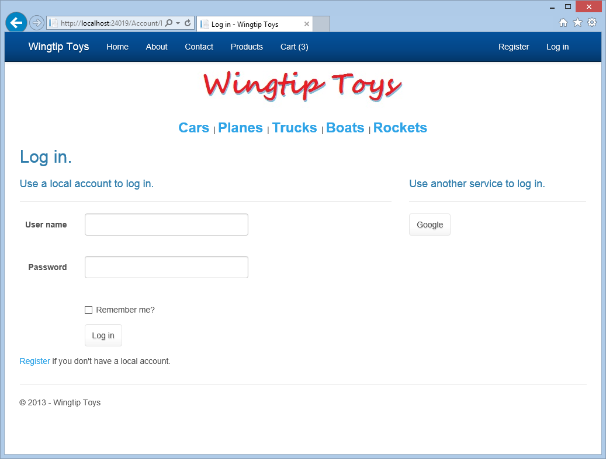
8. Sign in with your gmail account and password. 

    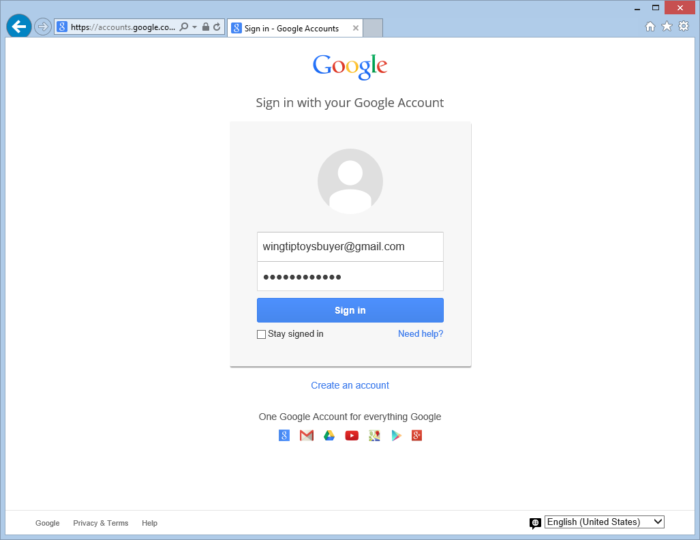
9. Click the **Log in** button to register your gmail account with your Wingtip Toys sample application user name. 

    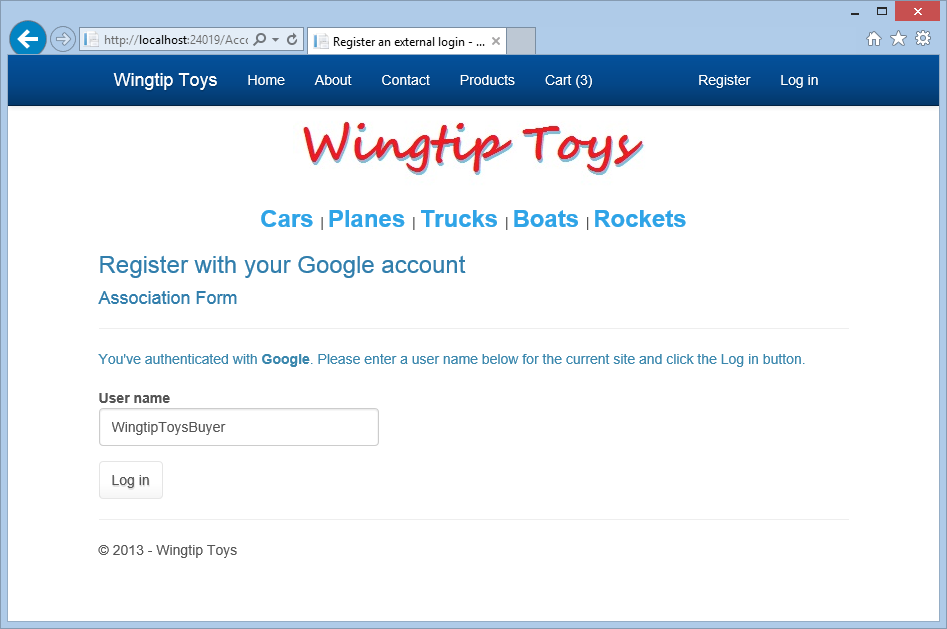
10. On the PayPal test site, add your **buyer** email address and password that you created earlier in this tutorial, then click the **Log In** button. 

    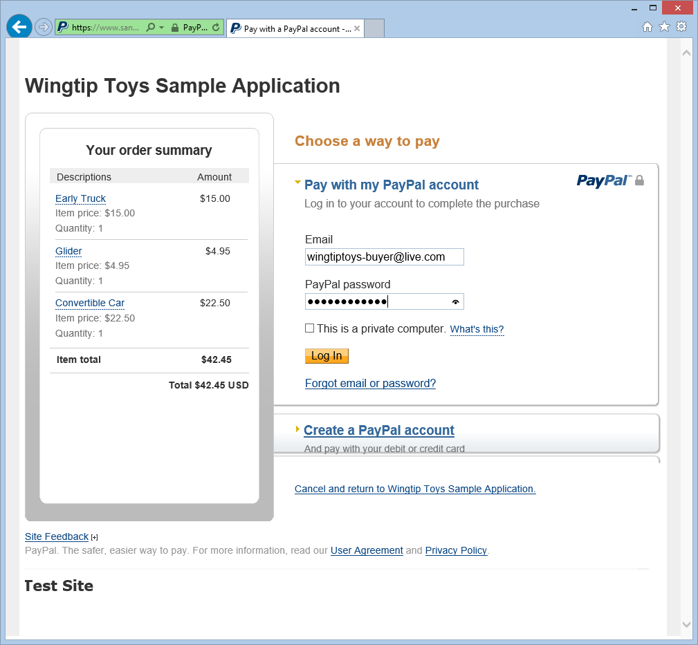
11. Agree to the PayPal policy and click the **Agree and Continue** button.  
 Note that this page is only displayed the first time you use this PayPal account. Again note that this is a test account, no real money is exchanged. 

    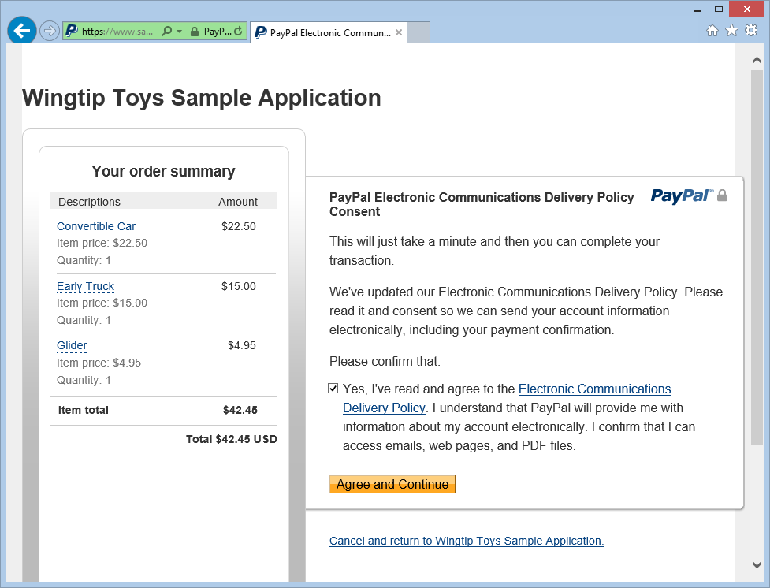
12. Review the order information on the PayPal testing environment review page and click **Continue**. 

    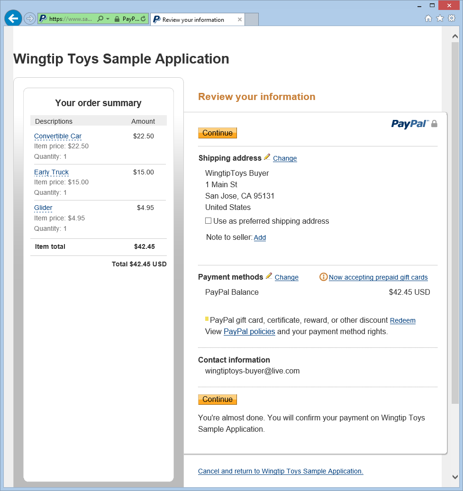
13. On the *CheckoutReview.aspx* page, verify the order amount and view the generated shipping address. Then, click the **Complete Order** button. 

    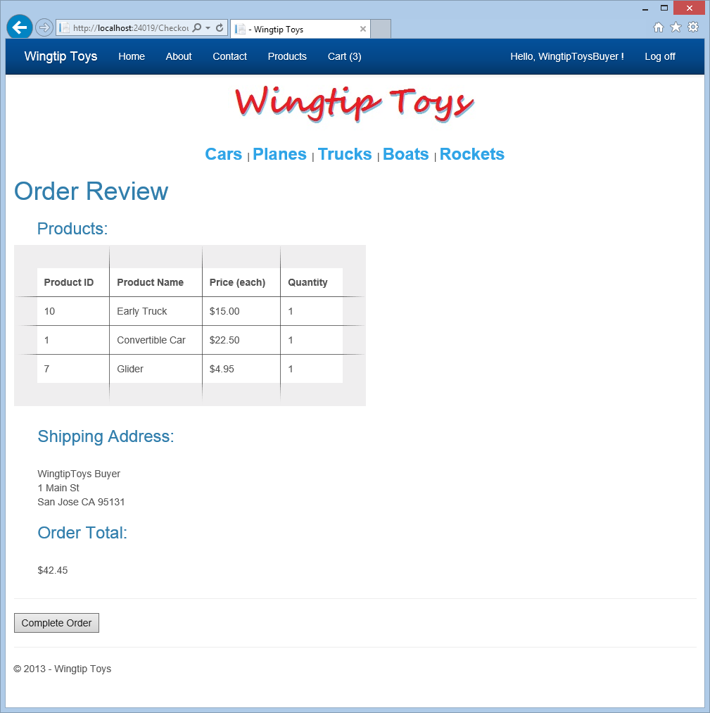
14. The **CheckoutComplete.aspx** page is displayed with a payment transaction ID. 

    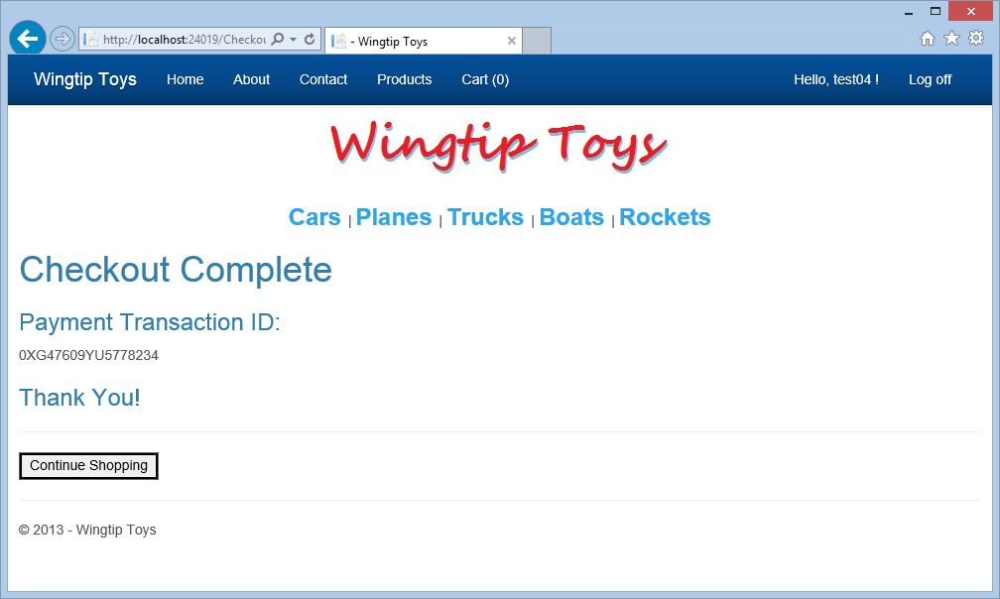

## Reviewing the Database

By reviewing the updated data in the Wingtip Toys sample application database after running the application, you can see that the application successfully recorded the purchase of the products.

You can inspect the data contained in the *Wingtiptoys.mdf* database file by using the **Database Explorer** window (**Server Explorer** window in Visual Studio) as you did earlier in this tutorial series.

1. Close the browser window if it is still open.
2. In Visual Studio, select the **Show All Files** icon at the top of **Solution Explorer** to allow you to expand the **App\_Data** folder.
3. Expand the **App\_Data** folder.  
 You may need to select the     **Show All Files** icon for the folder.
4. Right-click the *Wingtiptoys.mdf* database file and select **Open**.  
    **Server Explorer** is displayed.
5. Expand the **Tables** folder.
6. Right-click the **Orders**table and select **Show Table Data**.  
 The     **Orders** table is displayed.
7. Review the **PaymentTransactionID** column to confirm successful transactions. 

    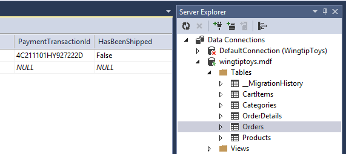
8. Close the **Orders** table window.
9. In the Server Explorer, right-click the **OrderDetails** table and select **Show Table Data**.
10. Review the `OrderId` and `Username` values in the **OrderDetails** table. Note that these values match the `OrderId` and `Username` values included in the **Orders** table.
11. Close the **OrderDetails** table window.
12. Right-click the Wingtip Toys database file (*Wingtiptoys.mdf*) and select **Close Connection**.
13. If you do not see the **Solution Explorer** window, click **Solution Explorer** at the bottom of the **Server Explorer** window to show the **Solution Explorer** again.

## Summary

In this tutorial you added order and order detail schemas to track the purchase of products. You also integrated PayPal functionality into the Wingtip Toys sample application.

## Additional Resources

[ASP.NET Configuration Overview](https://msdn.microsoft.com/library/ms178683(v=vs.100).aspx)  
[Deploy a Secure ASP.NET Web Forms App with Membership, OAuth, and SQL Database to Azure App Service](https://azure.microsoft.com/documentation/articles/web-sites-dotnet-deploy-aspnet-webforms-app-membership-oauth-sql-database/)  
[Microsoft Azure - Free Trial](https://azure.microsoft.com/pricing/free-trial/)

## Disclaimer

This tutorial contains sample code. Such sample code is provided "as is" without warranty of any kind. Accordingly, Microsoft does not guarantee the accuracy, integrity, or quality of the sample code. You agree to use the sample code at your own risk. Under no circumstances will Microsoft be liable to you in any way for any sample code, content, including but not limited to, any errors or omissions in any sample code, content, or any loss or damage of any kind incurred as a result of the use of any sample code. You are hereby notified and do hereby agree to indemnify, save and hold Microsoft harmless from and against any and all loss, claims of loss, injury or damage of any kind including, without limitation, those occasioned by or arising from material that you post, transmit, use or rely on including, but not limited to, the views expressed therein.

>[!div class="step-by-step"] [Previous](shopping-cart.md) [Next](membership-and-administration.md)