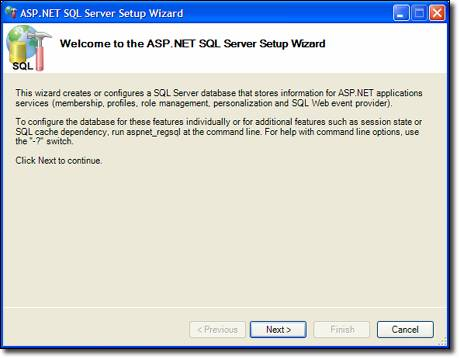
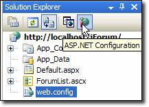
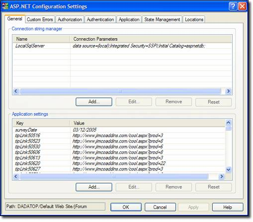
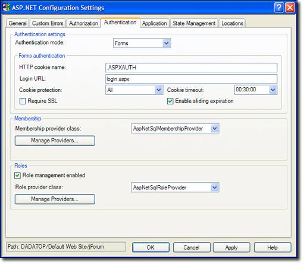
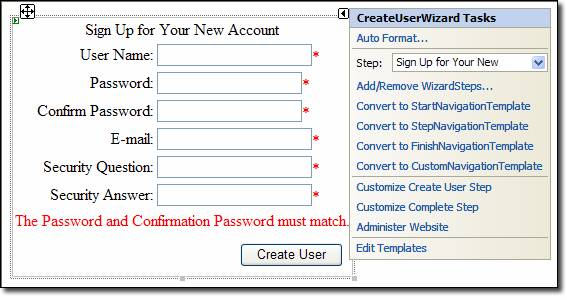
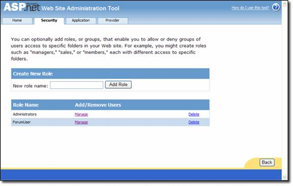
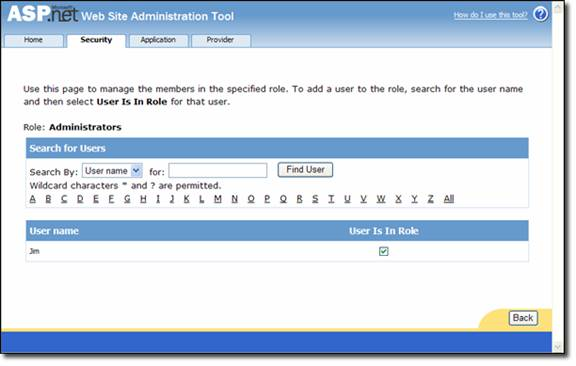
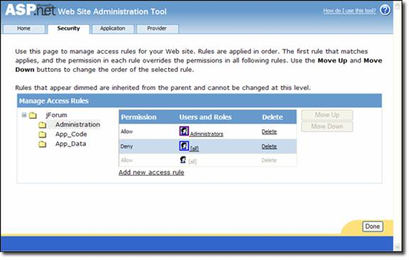
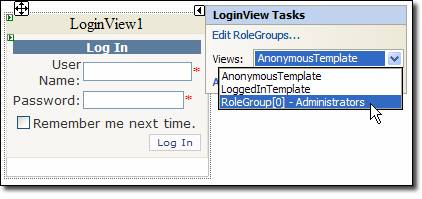
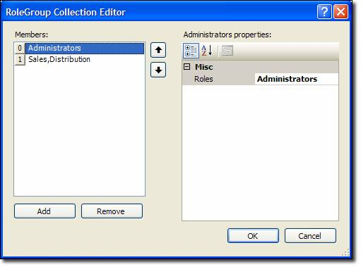

Membership
====================
by [Microsoft](https://github.com/microsoft)

> ASP.NET Membership builds on the success of the Forms authentication model from ASP.NET 1.x. ASP.NET Forms authentication provides a convenient way to incorporate a login form into your ASP.NET application and validate users against a database or other data store.

ASP.NET Membership builds on the success of the Forms authentication model from ASP.NET 1.x. ASP.NET Forms authentication provides a convenient way to incorporate a login form into your ASP.NET application and validate users against a database or other data store. The members of the FormsAuthentication class make it possible to handle cookies for authentication, check for a valid login, log a user out etc. However, implementing Forms authentication in an ASP.NET 1.x application can require a fair amount of code.

Membership in ASP.NET 2.0 is a major advancement over using Forms authentication alone. (Membership is most robust when coupled with Forms authentication, but using Forms authentication is not a requirement.) As you'll soon see, you can use ASP.NET Membership and the login controls in ASP.NET 2.0 to implement a powerful membership system without writing much code at all.

## Implementing Membership in ASP.NET 2.0

Membership is implemented by following four steps. Keep in mind that there are many sub-steps that are involved as well as optional configuration that can be implemented as well. These steps are meant to illustrate the big picture of configuring membership.

1. Create your membership database (if SQL Server is used as the membership store.)
2. Specify the membership options in your applications configuration files. (Membership is enabled by default.)
3. Determine the type of membership store you want to use. Options are: 

    - Microsoft SQL Server (version 7.0 or later)
    - Active Directory Store
    - Custom membership provider
4. Configure the application for ASP.NET Forms authentication. Once again, Membership is designed to take advantage of Forms authentication, but using Forms authentication is not a requirement.
5. Define user accounts for membership and configure roles if desired.

## Creating the Membership Database

If youre using SQL Server 7.0 or later as your membership store, you can use the aspnet\_regsql utility (available most easily from the Visual Studio .NET 2005 Command Prompt) to configure your database. The aspnet\_regsql utility can be used as a command prompt tool or via a GUI wizard. The wizard method is the easiest way to configure your database. To access the wizard, simply run the following command:

`aspnet_regsql W`

Once you run that command, you will be presented with the ASP.NET SQL Server Setup Wizard as shown below.

**Figure 1**

The ASP.NET SQL Server Setup Wizard creates the Web site in the instance you specify in the wizard. However, ASP.NET will use the connection string in the machine.config file to connect to your database. By default, this connection string will point to a SQL Server 2005 instance, so if you are using a SQL Server 2000 or SQL Server 7.0 instance, you will need to modify the connection string in the machine.config file. That connection string can be located here:

[!code[Main](membership/samples/sample1.xml)]

Unfortunately, if you dont modify the connection string, ASP.NET will not give you a descriptive error. It will just continue to complain saying that you havent created the database. In the case above, I have modified the connection string to point to my local SQL Server 2000 instance.

## Specifying Configuration and Adding Users and Roles

The next step in configuring Membership is to add the necessary information to the web.config file of the application. In ASP.NET 1.x, modifying the web.config file was sometimes difficult because of the use of lowerCamelCase and the lack of Intellisense. Visual Studio .NET 2005 makes the task much easier with Intellisense for configuration files, but ASP.NET 2.0 goes one step further by providing a Web interface for editing configuration files.

You can launch the Web interface by clicking the ASP.NET Configuration button on the Solution Explorer toolbar as shown below. You can also launch the Web interface via pop-ups that are displayed when Login controls are inserted.

**Figure 2**

This launches the ASP.NET Web Site Administration Tool shown below. The ASP.NET Web Site Administration is a four-tab interface that makes it easy to manage application settings. The following tabs are available:

- **Home**
- **Security** Configure users, roles, and access.
- **Application** Configure application settings.
- **Provider** Configure and test your applications membership provider.

The Web Site Administration Tool allows you to easily create new users, create new roles, and to manage users and roles. This ability is not available in the Windows interface. The Windows interface allows you to easily define authorization settings and to add, delete, and manage providers, capabilities that are not in the Web Site Administration Tool.

To launch the Windows interface, open the Internet Information Services snap-in, right-click on your application, and choose Properties. Click the ASP.NET tab and then click the Edit Configuration button. (The application must be running under ASP.NET 2.0 for the Edit Configuration button to be enabled. You can configure the ASP.NET version in the ASP.NET dialog as well.) The ASP.NET Configuration Settings dialog is displayed as shown below.

**Figure 3**

On the General tab, connection strings and application settings are listed. Any settings in italics are defined in a parent configuration file (either the machine.config or a web.config at a higher level) and settings not in italics are from the applications configuration file. If a setting is added, removed, or edited at the application level, ASP.NET will add, remove, or modify the setting at the application levels web.config instead of removing the setting from the configuration file from which it is inherited.

The Authentication tab is shown below. This is where you will configure your membership settings. Forms authentication settings, membership providers, and role providers can be configured here.

**Figure 4**

## Implementing Membership in Your Application

The easiest way to implement ASP.NET 2.0 membership in your application is to use the provided Logon controls. This method allows you to implement the basics of ASP.NET 2.0 membership without writing any code at all.

The following Logon controls are available in ASP.NET 2.0:

## Login Control

The Login control provides an interface for someone to log into your membership system. It provides you with a username and password textboxt and a login button. Many other common features such as a link to register for people who have not yet done so, a checkbox that allows the user to automatically login on subsequent visits, a link for a password reminder, etc. All features of the Login control are customizable via the properties of the control.

In ASP.NET 1.x, developers had to write a fair amount of code to do a lookup when using Forms authentication. With ASP.NET 2.0 membership, you can validate users without writing any code at all. ASP.NET will automatically do the look-up of the user for you. (If you are using the Login control without using ASP.NET membership, you can use the **OnAuthenticate** method to validate the user.)

## LoginView Control

The LoginView control is a templated control that provides two templates by default; the AnonymousTemplate and the LoggedInTemplate. The template that is displayed is determined by whether or not the user is logged into your membership system. This control is typically used to display a Login control when a user has not yet logged in and a LoginStatus control and/or other login controls when the user has logged in. If you are using role management in your ASP.NET application, the LoginView control can display a specific template based upon the users role. (More on ASP.NET role management will be covered later.)

## PasswordRecovery Control

The PasswordRecovery control allows users to receive an e-mail with his or her current password or reset his or her password. Clear text and encrypted passwords can be recovered and e-mailed to users. If the password is hashed, it cannot be recovered. Instead the user will be required to perform a password reset.

## LoginStatus Control

The LoginStatus control is used to display a login indicator to users who are not logged in and a logout indicator to users who are currently logged in. The Request.IsAuthenticated property is used to determine which indicator to display. The indicator displayed by the LoginStatus control can be text (implemented via the **LoginText** and **LogoutText** properties) or images (implemented via the **LoginImageUrl** and **LogoutImageUrl** properties.)

When a user logs out via the LoginStatus control, he or she is redirected to the URL specified by the **LogoutPageUrl** property. If that property is not set, the current page is refreshed. Since the site is likely protected by Forms authentication, the refresh of the current page will redirect the user to the login page for the site.

## LoginName Control

The LoginName control displays the username of the user currently logged into the site.

## CreateUserWizard Control

The CreateUserWizard control provides users with a convenient way to register for your membership system. You can add steps (implemented as a collection of WizardSteps) via the interface shown below.

**Figure 5**

The CreateUserWizard is a templated control that derives from the Wizard class and provides the following templates:

- **HeaderTemplate** This template controls the appearance of the header of the wizard.
- **SidebarTemplate** This template controls the appearance of the sidebar of the wizard.
- **StartNavigationTemplate** This template controls the appearance of the navigation are of the wizard at the start step.
- **StepNavigationTemplate** This template controls the appearance of the navigation area when not in the start or finish step.
- **FinishNavigationTemplate** This template controls the appearance of the navigation area when on the finish step.

Additionally, for each step that you add to the Wizard, ASP.NET will create a custom template that contains both a ContentTemplate and a CustomNavigationTemplate for that step. For full details on customizing the CreateUserWizard, see the VS.NET 2005 documentation:

## ChangePassword Control

The ChangePassword control allows users to change his or her password. If the DisplayUserName property is true (it is false by default), the user can change his or her password when they are not logged in. If the user *is* already logged in and the DisplayUserName property is true, the user will be able to change the password of another user that is not logged in providing they know the user ID of that user.

Keep in mind that if you want users to be able to change passwords without having to log in, you will need to ensure that the page on which the ChangePassword control is displayed allows anonymous access. Obviously, users will have to provide their old password in order to change their password.

## Role Management

Role management allows you to assign users to a particular role and then restrict access to certain file or folders based on that role. Role management also provides an API so that you can programmatically determine someones role or determine all users in a particular role and respond accordingly.

Role management is not a requirement in ASP.NET membership, nor is membership a requirement in order to use role management. However, the two supplement each other nicely and it is likely that developers will use them in conjunction with each other.

To enable role management in your application, make the following change in your web.config file:

[!code[Main](membership/samples/sample2.xml)]

When the **cacheRolesInCookie** attribute is set to true, ASP.NET caches a users role membership in a cookie on the client. This allows role lookups to occur without calls into the RoleProvider. When using this attribute, developers are encouraged to ensure that the **cookieProtection** attribute is set to All. (This is the default setting.) This ensures that the cookie data are encrypted and helps to ensure that the cookies contents havent been altered. Roles can be added using the Web Site Administration Tool. It allows you to easily define roles, configure access to parts of the site based on those roles, and assign users to roles.

**Figure 6**

As shown above, new roles can be added by simply entering the name of the role and then clicking Add Role. Existing roles can be managed or deleted by clicking the appropriate link in the list of existing roles.

When you manage a role, you can add or remove users as shown below.

**Figure 7**

By checking the User Is In Role checkbox, you can easily add a user to a specific role. ASP.NET will automatically update your membership database with the appropriate entries. You will also want to configure access rules for your application. ASP.NET 1.x developers are familiar with doing this via the &lt;authorization&gt; element in the web.config file, and that option is still available in ASP.NET 2.0. However, its easier to manage access rules using the Web Site Administration Tool as shown below.

**Figure 8**

In this case, the Administration folder is highlighted (its difficult to see because the tool highlights it in light gray) and the Administrators role has been granted access. All other users are denied. You can click on the head icon to select a rule and then use the Move Up and Move Down buttons to arrange the rules. As with the ASP.NET &lt;authorization&gt; element, rules are processed in the order in which they appear. In other words, if the order of rules in the shot above were reversed, no one would have access to the Administration folder because the first rule that ASP.NET would encounter would be the rule that denies everyone to the folder.

ASP.NET 2.0 adds a web.config file to the folder for which you are specifying an access rule. Access rules can be edited via the configuration file or via the Web Site Administration Tool. In other words, the Web Site Administration Tool is simply an interface through which the configuration file can be edited in a user-friendly environment.

## Using Roles in Code

The API for role management has not changed since version 1.x. The **IsInRole** method is used to determine if a user is in a particular role.

[!code[Main](membership/samples/sample3.xml)]

ASP.NET also creates a RolePrincipal instance as a member of the current context. The RolePrincipal object can be used to obtain all of the roles to which the user belongs as follows:

[!code[Main](membership/samples/sample4.xml)]

## Using RoleGroups with the LoginView Control

Now that you have an understanding of role management and membership, lets discuss briefly how the LoginView control takes advantage of this capability in ASP.NET 2.0. As previously discussed, the LoginView control is a templated control that contains two templates by default; the AnonymousTemplate and the LoggedInTemplate. Within the LoginView Tasks dialog is a link (shown below) that allows you to edit RoleGroups.

**Figure 9**

Each RoleGroup object contains an array of strings that defines which roles that RoleGroup applies to. To add a new RoleGroup to the LoginView control, click the Edit RoleGroups link. In the image above, you can see that I have added a new RoleGroup for Administrators. By selecting that RoleGroup (RoleGroup[0]) from the Views dropdown, I can configure a template that will only be displayed to members of the Administrators role. In the image below, I have added a new RoleGroup that applies to members of the Sales role and the Distribution role. This adds a second RoleGroup to the Views dropdown in the LoginView Tasks dialog and anything added to that template will be visible by any user in either the Sales or Distribution role.

**Figure 10**

## Overriding the Existing Membership Provider

There are a couple of ways that you can extend the functionality of ASP.NET membership. First of all, you can obviously change the existing functionality of the SqlMembershipProvider class by inheriting from it and overriding its methods. For example, if you want to implement your own functionality when users are created, you can create your own class that inherits from SqlMembershipProvider as follows:

[!code[Main](membership/samples/sample5.xml)]

If, on the other hand, you want to create your own provider (to store your membership information in an Access database, for example), you can create your own provider.

## Creating Your Own Membership Provider

To create your own membership provider, you will first need to create a class that inherits from the MembershipProvider class. If you are using VB.NET, Visual Studio 2005 will add the stubs for all of the methods that you need to override. If you are using C#, its up to you to add the stubs.

You will need to override the following:

- ApplicationName property
- ChangePassword function
- ChangePasswordQuestionAndAnswer function
- CreateUser function
- DeleteUser function
- EnablePasswordReset property
- EnablePasswordRetrieval property
- FindUsersByEmail function
- FindUsersByName function
- GetAllUsers function
- GetNumberOfUsersOnline function
- GetPassword function
- GetUser function
- GetUserNameByEmail function
- MaxInvalidPasswordAttempts property
- MinRequiredNonAlphanumericCharacters property
- MinRequiredPasswordLength property
- PasswordAttemptWindow property
- PasswordFormat property
- PasswordStrengthRegularExpression property
- RequiresQuestionAndAnswer property
- RequiresUniqueEmail property
- ResetPassword function
- Unlock user function
- UpdateUser function
- ValidateUser function

Thats quite a list to implement as a C# developer. You may find it easier to create the class in VB.NET without any implementation and then use .NET Reflector or a similar tool to convert the code to C#.

The connection string and other properties should be set to their defaults in the Initialize method. (The Initialize method is fired when the provider is loaded at runtime.) The second parameter to the Initialize method is of type System.Collections.Specialized.NameValueCollection and is a reference to the &lt;add&gt; element that is associated with your custom provider in the web.config file. That entry looks like the following:

[!code[Main](membership/samples/sample6.xml)]

Here is an example of the Initialize method.

[!code[Main](membership/samples/sample7.xml)]

In order to validate the user when they submit your login form, you will need to use the ValidateUser method. This method fires when the user clicks the login button in the Login control. You will place your code that does the user lookup in this method.

As you can see, writing your own membership provider is not difficult and allows you to extend this powerful functionality of ASP.NET 2.0.