Using the Entity Framework 4.0 and the ObjectDataSource Control, Part 1: Getting Started
====================
by [Tom Dykstra](https://github.com/tdykstra)

> This tutorial series builds on the Contoso University web application that is created by the [Getting Started with the Entity Framework 4.0](../getting-started-with-ef/the-entity-framework-and-aspnet-getting-started-part-1.md) tutorial series. If you didn't complete the earlier tutorials, as a starting point for this tutorial you can [download the application](https://code.msdn.microsoft.com/ASPNET-Web-Forms-97f8ee9a) that you would have created. You can also [download the application](https://code.msdn.microsoft.com/ASPNET-Web-Forms-6c7197aa) that is created by the complete tutorial series.
> 
> The Contoso University sample web application demonstrates how to create ASP.NET Web Forms applications using the Entity Framework 4.0 and Visual Studio 2010. The sample application is a website for a fictional Contoso University. It includes functionality such as student admission, course creation, and instructor assignments.
> 
> The tutorial shows examples in C#. The [downloadable sample](https://code.msdn.microsoft.com/ASPNET-Web-Forms-6c7197aa) contains code in both C# and Visual Basic.
> 
> ## Database First
> 
> There are three ways you can work with data in the Entity Framework: *Database First*, *Model First*, and *Code First*. This tutorial is for Database First. For information about the differences between these workflows and guidance on how to choose the best one for your scenario, see [Entity Framework Development Workflows](https://msdn.microsoft.com/en-us/library/ms178359.aspx#dbfmfcf).
> 
> ## Web Forms
> 
> Like the Getting Started series, this tutorial series uses the ASP.NET Web Forms model and assumes you know how to work with ASP.NET Web Forms in Visual Studio. If you don't, see [Getting Started with ASP.NET 4.5 Web Forms](../../getting-started/getting-started-with-aspnet-45-web-forms/introduction-and-overview.md). If you prefer to work with the ASP.NET MVC framework, see [Getting Started with the Entity Framework using ASP.NET MVC](../../../../mvc/overview/getting-started/getting-started-with-ef-using-mvc/creating-an-entity-framework-data-model-for-an-asp-net-mvc-application.md).
> 
> ## Software versions
> 
> | **Shown in the tutorial** | **Also works with** |
> | --- | --- |
> | Windows 7 | Windows 8 |
> | Visual Studio 2010 | Visual Studio 2010 Express for Web. The tutorial has not been tested with later versions of Visual Studio. There are many differences in menu selections, dialog boxes, and templates. |
> | .NET 4 | .NET 4.5 is backward compatible with .NET 4, but the tutorial has not been tested with .NET 4.5. |
> | Entity Framework 4 | The tutorial has not been tested with later versions of Entity Framework. Starting with Entity Framework 5, EF uses by default the `DbContext API` that was introduced with EF 4.1. The EntityDataSource control was designed to use the `ObjectContext` API. For information about how to use the EntityDataSource control with the `DbContext` API, see [this blog post](https://blogs.msdn.com/b/webdev/archive/2012/09/13/how-to-use-the-entitydatasource-control-with-entity-framework-code-first.aspx). |
> 
> ## Questions
> 
> If you have questions that are not directly related to the tutorial, you can post them to the [ASP.NET Entity Framework forum](https://forums.asp.net/1227.aspx), the [Entity Framework and LINQ to Entities forum](https://social.msdn.microsoft.com/forums/en-US/adodotnetentityframework/threads/), or [StackOverflow.com](http://stackoverflow.com/).

The `EntityDataSource` control enables you to create an application very quickly, but it typically requires you to keep a significant amount of business logic and data-access logic in your *.aspx* pages. If you expect your application to grow in complexity and to require ongoing maintenance, you can invest more development time up front in order to create an *n-tier* or *layered* application structure that's more maintainable. To implement this architecture, you separate the presentation layer from the business logic layer (BLL) and the data access layer (DAL). One way to implement this structure is to use the `ObjectDataSource` control instead of the `EntityDataSource` control. When you use the `ObjectDataSource` control, you implement your own data-access code and then invoke it in *.aspx* pages using a control that has many of the same features as other data-source controls. This lets you combine the advantages of an n-tier approach with the benefits of using a Web Forms control for data access.

The `ObjectDataSource` control gives you more flexibility in other ways as well. Because you write your own data-access code, it's easier to do more than just read, insert, update, or delete a specific entity type, which are the tasks that the `EntityDataSource` control is designed to perform. For example, you can perform logging every time an entity is updated, archive data whenever an entity is deleted, or automatically check and update related data as needed when inserting a row with a foreign key value.

## Business Logic and Repository Classes

An `ObjectDataSource` control works by invoking a class that you create. The class includes methods that retrieve and update data, and you provide the names of those methods to the `ObjectDataSource` control in markup. During rendering or postback processing, the `ObjectDataSource` calls the methods that you've specified.

Besides basic CRUD operations, the class that you create to use with the `ObjectDataSource` control might need to execute business logic when the `ObjectDataSource` reads or updates data. For example, when you update a department, you might need to validate that no other departments have the same administrator because one person cannot be administrator of more than one department.

In some `ObjectDataSource` documentation, such as the [ObjectDataSource Class overview](https://msdn.microsoft.com/en-us/library/system.web.ui.webcontrols.objectdatasource.aspx), the control calls a class referred to as a *business object* that includes both business logic and data-access logic. In this tutorial you will create separate classes for business logic and for data-access logic. The class that encapsulates data-access logic is called a *repository*. The business logic class includes both business-logic methods and data-access methods, but the data-access methods call the repository to perform data-access tasks.

You will also create an abstraction layer between your BLL and DAL that facilitates automated unit testing of the BLL. This abstraction layer is implemented by creating an interface and using the interface when you instantiate the repository in the business-logic class. This makes it possible for you to provide the business-logic class with a reference to any object that implements the repository interface. For normal operation, you provide a repository object that works with the Entity Framework. For testing, you provide a repository object that works with data stored in a way that you can easily manipulate, such as class variables defined as collections.

The following illustration shows the difference between a business-logic class that includes data-access logic without a repository and one that uses a repository.

[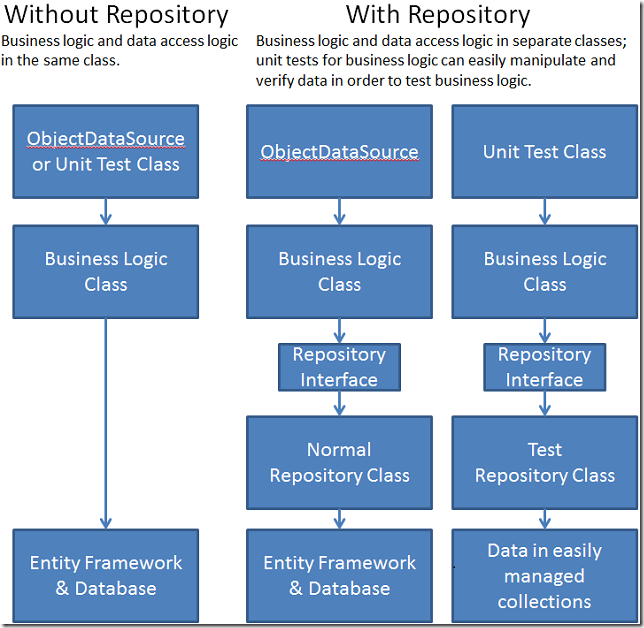](using-the-entity-framework-and-the-objectdatasource-control-part-1-getting-started/_static/image1.png)

You will begin by creating web pages in which the `ObjectDataSource` control is bound directly to a repository because it only performs basic data-access tasks. In the next tutorial you will create a business logic class with validation logic and bind the `ObjectDataSource` control to that class instead of to the repository class. You will also create unit tests for the validation logic. In the third tutorial in this series you will add sorting and filtering functionality to the application.

The pages you create in this tutorial work with the `Departments` entity set of the data model that you created in the [Getting Started tutorial series](../getting-started-with-ef/the-entity-framework-and-aspnet-getting-started-part-1.md).

[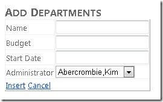](using-the-entity-framework-and-the-objectdatasource-control-part-1-getting-started/_static/image5.png)

## Updating the Database and the Data Model

You will begin this tutorial by making two changes to the database, both of which require corresponding changes to the data model that you created in the [Getting Started with the Entity Framework and Web Forms](../getting-started-with-ef/the-entity-framework-and-aspnet-getting-started-part-1.md) tutorials. In one of those tutorials, you made changes in the designer manually to synchronize the data model with the database after a database change. In this tutorial, you will use the designer's **Update Model From Database** tool to update the data model automatically.

### Adding a Relationship to the Database

In Visual Studio, open the Contoso University web application you created in the [Getting Started with the Entity Framework and Web Forms](../getting-started-with-ef/the-entity-framework-and-aspnet-getting-started-part-1.md) tutorial series, and then open the `SchoolDiagram` database diagram.

If you look at the `Department` table in the database diagram, you will see that it has an `Administrator` column. This column is a foreign key to the `Person` table, but no foreign key relationship is defined in the database. You need to create the relationship and update the data model so that the Entity Framework can automatically handle this relationship.

In the database diagram, right-click the `Department` table, and select **Relationships**.

[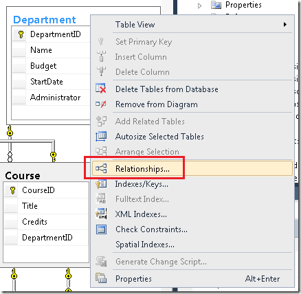](using-the-entity-framework-and-the-objectdatasource-control-part-1-getting-started/_static/image7.png)

In the **Foreign Key Relationships** box click **Add**, then click the ellipsis for **Tables and Columns Specification**.

[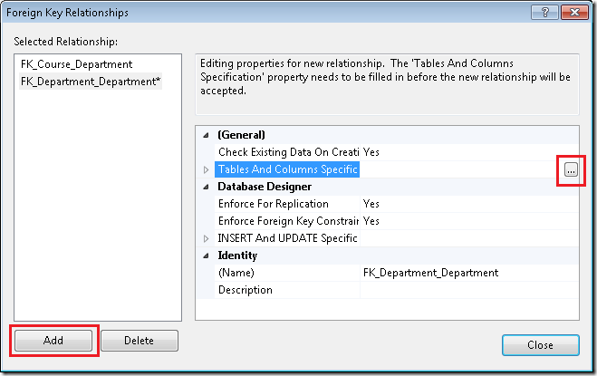](using-the-entity-framework-and-the-objectdatasource-control-part-1-getting-started/_static/image9.png)

In the **Tables and Columns** dialog box, set the primary key table and field to `Person` and `PersonID`, and set the foreign key table and field to `Department` and `Administrator`. (When you do this, the relationship name will change from `FK_Department_Department` to `FK_Department_Person`.)

[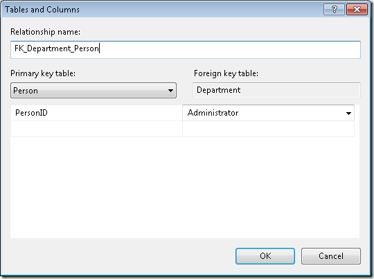](using-the-entity-framework-and-the-objectdatasource-control-part-1-getting-started/_static/image11.png)

Click **OK** in the **Tables and Columns** box, click **Close** in the **Foreign Key Relationships** box, and save the changes. If you're asked if you want to save the `Person` and `Department` tables, click **Yes**.

> [!NOTE] If you've deleted `Person` rows that correspond to data that's already in the `Administrator` column, you will not be able to save this change. In that case, use the table editor in **Server Explorer** to make sure that the `Administrator` value in every `Department` row contains the ID of a record that actually exists in the `Person` table.
> 
> After you save the change, you will not be able to delete a row from the `Person` table if that person is a department administrator. In a production application, you would provide a specific error message when a database constraint prevents a deletion, or you would specify a cascading delete. For an example of how to specify a cascading delete, see [The Entity Framework and ASP.NET – Getting Started Part 2](../getting-started-with-ef/the-entity-framework-and-aspnet-getting-started-part-2.md).

### Adding a View to the Database

In the new *Departments.aspx* page that you will be creating, you want to provide a drop-down list of instructors, with names in "last, first" format so that users can select department administrators. To make it easier to do that, you will create a view in the database. The view will consist of just the data needed by the drop-down list: the full name (properly formatted) and the record key.

In **Server Explorer**, expand *School.mdf*, right-click the **Views** folder, and select **Add New View**.

[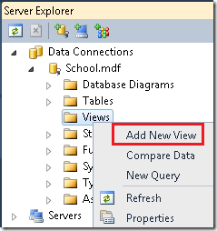](using-the-entity-framework-and-the-objectdatasource-control-part-1-getting-started/_static/image13.png)

Click **Close** when the **Add Table** dialog box appears, and paste the following SQL statement into the SQL pane:

[!code[Main](using-the-entity-framework-and-the-objectdatasource-control-part-1-getting-started/samples/sample1.xml)]

Save the view as `vInstructorName`.

### Updating the Data Model

In the *DAL* folder, open the *SchoolModel.edmx* file, right-click the design surface, and select **Update Model from Database**.

[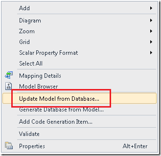](using-the-entity-framework-and-the-objectdatasource-control-part-1-getting-started/_static/image15.png)

In the **Choose Your Database Objects** dialog box, select the **Add** tab and select the view you just created.

[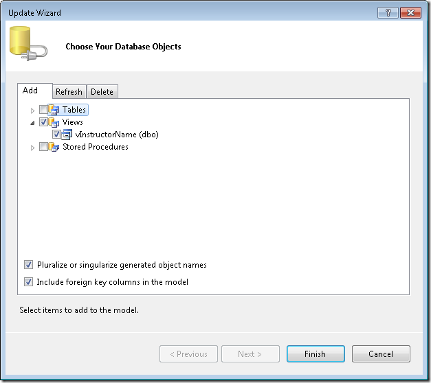](using-the-entity-framework-and-the-objectdatasource-control-part-1-getting-started/_static/image17.png)

Click **Finish**.

In the designer, you see that the tool created a `vInstructorName` entity and a new association between the `Department` and `Person` entities.

[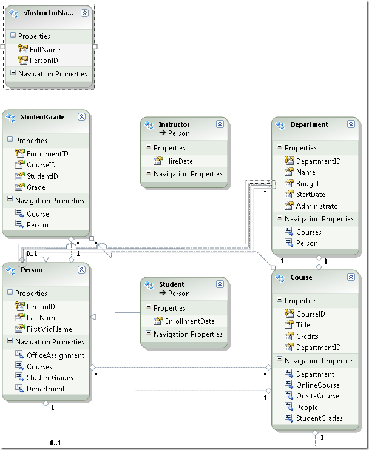](using-the-entity-framework-and-the-objectdatasource-control-part-1-getting-started/_static/image19.png)

> [!NOTE] In the **Output** and **Error List** windows you might see a warning message informing you that the tool automatically created a primary key for the new `vInstructorName` view. This is expected behavior.

When you refer to the new `vInstructorName` entity in code, you don't want to use the database convention of prefixing a lower-case "v" to it. Therefore, you will rename the entity and entity set in the model.

Open the **Model Browser**. You see `vInstructorName` listed as an entity type and a view.

[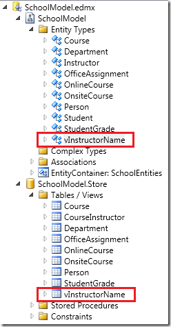](using-the-entity-framework-and-the-objectdatasource-control-part-1-getting-started/_static/image21.png)

Under **SchoolModel** (not **SchoolModel.Store**), right-click **vInstructorName** and select **Properties**. In the **Properties** window, change the **Name** property to "InstructorName" and change the **Entity Set Name** property to "InstructorNames".

[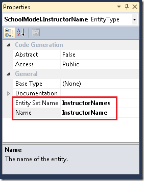](using-the-entity-framework-and-the-objectdatasource-control-part-1-getting-started/_static/image23.png)

Save and close the data model, and then rebuild the project.

## Using a Repository Class and an ObjectDataSource Control

Create a new class file in the *DAL* folder, name it *SchoolRepository.cs*, and replace the existing code with the following code:

[!code[Main](using-the-entity-framework-and-the-objectdatasource-control-part-1-getting-started/samples/sample2.xml)]

This code provides a single `GetDepartments` method that returns all of the entities in the `Departments` entity set. Because you know that you will be accessing the `Person` navigation property for every row returned, you specify eager loading for that property by using the `Include` method. The class also implements the `IDisposable` interface to ensure that the database connection is released when the object is disposed.

> [!NOTE] A common practice is to create a repository class for each entity type. In this tutorial, one repository class for multiple entity types is used. For more information about the repository pattern, see the posts in [the Entity Framework team's blog](https://blogs.msdn.com/b/adonet/archive/2009/06/16/using-repository-and-unit-of-work-patterns-with-entity-framework-4-0.aspx) and [Julie Lerman's blog](http://thedatafarm.com/blog/data-access/agile-ef4-repository-part-3-fine-tuning-the-repository/).

The `GetDepartments` method returns an `IEnumerable` object rather than an `IQueryable` object in order to ensure that the returned collection is usable even after the repository object itself is disposed. An `IQueryable` object can cause database access whenever it's accessed, but the repository object might be disposed by the time a databound control attempts to render the data. You could return another collection type, such as an `IList` object instead of an `IEnumerable` object. However, returning an `IEnumerable` object ensures that you can perform typical read-only list processing tasks such as `foreach` loops and LINQ queries, but you cannot add to or remove items in the collection, which might imply that such changes would be persisted to the database.

Create a *Departments.aspx* page that uses the *Site.Master* master page, and add the following markup in the `Content` control named `Content2`:

[!code[Main](using-the-entity-framework-and-the-objectdatasource-control-part-1-getting-started/samples/sample3.xml)]

This markup creates an `ObjectDataSource` control that uses the repository class you just created, and a `GridView` control to display the data. The `GridView` control specifies **Edit** and **Delete** commands, but you haven't added code to support them yet.

Several columns use `DynamicField` controls so that you can take advantage of automatic data formatting and validation functionality. For these to work, you will have to call the `EnableDynamicData` method in the `Page_Init` event handler. (`DynamicControl` controls are not used in the `Administrator` field because they don't work with navigation properties.)

The `Vertical-Align="Top"` attributes will become important later when you add a column that has a nested `GridView` control to the grid.

Open the *Departments.aspx.cs* file and add the following `using` statement:

[!code[Main](using-the-entity-framework-and-the-objectdatasource-control-part-1-getting-started/samples/sample4.xml)]

Then add the following handler for the page's `Init` event:

[!code[Main](using-the-entity-framework-and-the-objectdatasource-control-part-1-getting-started/samples/sample5.xml)]

In the *DAL* folder, create a new class file named *Department.cs* and replace the existing code with the following code:

[!code[Main](using-the-entity-framework-and-the-objectdatasource-control-part-1-getting-started/samples/sample6.xml)]

This code adds metadata to the data model. It specifies that the `Budget` property of the `Department` entity actually represents currency although its data type is `Decimal`, and it specifies that the value must be between 0 and $1,000,000.00. It also specifies that the `StartDate` property should be formatted as a date in the format mm/dd/yyyy.

Run the *Departments.aspx* page.

[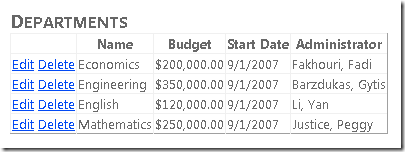](using-the-entity-framework-and-the-objectdatasource-control-part-1-getting-started/_static/image25.png)

Notice that although you did not specify a format string in the *Departments.aspx* page markup for the **Budget** or **Start Date** columns, default currency and date formatting has been applied to them by the `DynamicField` controls, using the metadata that you supplied in the *Department.cs* file.

## Adding Insert and Delete Functionality

Open *SchoolRepository.cs*, add the following code in order to create an `Insert` method and a `Delete` method. The code also includes a method named `GenerateDepartmentID` that calculates the next available record key value for use by the `Insert` method. This is required because the database is not configured to calculate this automatically for the `Department` table.

[!code[Main](using-the-entity-framework-and-the-objectdatasource-control-part-1-getting-started/samples/sample7.xml)]

### The Attach Method

The `DeleteDepartment` method calls the `Attach` method in order to re-establish the link that's maintained in the object context's object state manager between the entity in memory and the database row it represents. This must occur before the method calls the `SaveChanges` method.

The term *object context* refers to the Entity Framework class that derives from the `ObjectContext` class that you use to access your entity sets and entities. In the code for this project, the class is named `SchoolEntities`, and an instance of it is always named `context`. The object context's *object state manager* is a class that derives from the `ObjectStateManager` class. The object contact uses the object state manager to store entity objects and to keep track of whether each one is in sync with its corresponding table row or rows in the database.

When you read an entity, the object context stores it in the object state manager and keeps track of whether that representation of the object is in sync with the database. For example, if you change a property value, a flag is set to indicate that the property you changed is no longer in sync with the database. Then when you call the `SaveChanges` method, the object context knows what to do in the database because the object state manager knows exactly what's different between the current state of the entity and the state of the database.

However, this process typically does not work in a web application, because the object context instance that reads an entity, along with everything in its object state manager, is disposed after a page is rendered. The object context instance that must apply changes is a new one that's instantiated for postback processing. In the case of the `DeleteDepartment` method, the `ObjectDataSource` control re-creates the original version of the entity for you from values in view state, but this re-created `Department` entity does not exist in the object state manager. If you called the `DeleteObject` method on this re-created entity, the call would fail because the object context does not know whether the entity is in sync with the database. However, calling the `Attach` method re-establishes the same tracking between the re-created entity and the values in the database that was originally done automatically when the entity was read in an earlier instance of the object context.

There are times when you don't want the object context to track entities in the object state manager, and you can set flags to prevent it from doing that. Examples of this are shown in later tutorials in this series.

### The SaveChanges Method

This simple repository class illustrates basic principles of how to perform CRUD operations. In this example, the `SaveChanges` method is called immediately after each update. In a production application you might want to call the `SaveChanges` method from a separate method to give you more control over when the database is updated. (At the end of the next tutorial you will find a link to a white paper that discusses the unit of work pattern which is one approach to coordinating related updates.) Notice also that in the example, the `DeleteDepartment` method does not include code for handling concurrency conflicts; code to do that will be added in a later tutorial in this series.

### Retrieving Instructor Names to Select When Inserting

Users must be able to select an administrator from a list of instructors in a drop-down list when creating new departments. Therefore, add the following code to *SchoolRepository.cs* to create a method to retrieve the list of instructors using the view that you created earlier:

[!code[Main](using-the-entity-framework-and-the-objectdatasource-control-part-1-getting-started/samples/sample8.xml)]

### Creating a Page for Inserting Departments

Create a *DepartmentsAdd.aspx* page that uses the *Site.Master* page, and add the following markup in the `Content` control named `Content2`:

[!code[Main](using-the-entity-framework-and-the-objectdatasource-control-part-1-getting-started/samples/sample9.xml)]

This markup creates two `ObjectDataSource` controls, one for inserting new `Department` entities and one for retrieving instructor names for the `DropDownList` control that's used for selecting department administrators. The markup creates a `DetailsView` control for entering new departments, and it specifies a handler for the control's `ItemInserting` event so that you can set the `Administrator` foreign key value. At the end is a `ValidationSummary` control to display error messages.

Open *DepartmentsAdd.aspx.cs* and add the following `using` statement:

[!code[Main](using-the-entity-framework-and-the-objectdatasource-control-part-1-getting-started/samples/sample10.xml)]

Add the following class variable and methods:

[!code[Main](using-the-entity-framework-and-the-objectdatasource-control-part-1-getting-started/samples/sample11.xml)]

The `Page_Init` method enables Dynamic Data functionality. The handler for the `DropDownList` control's `Init` event saves a reference to the control, and the handler for the `DetailsView` control's `Inserting` event uses that reference to get the `PersonID` value of the selected instructor and update the `Administrator` foreign key property of the `Department` entity.

Run the page, add information for a new department, and then click the **Insert** link.

[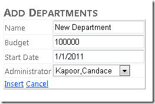](using-the-entity-framework-and-the-objectdatasource-control-part-1-getting-started/_static/image27.png)

Enter values for another new department. Enter a number greater than 1,000,000.00 in the **Budget** field and tab to the next field. An asterisk appears in the field, and if you hold the mouse pointer over it, you can see the error message that you entered in the metadata for that field.

[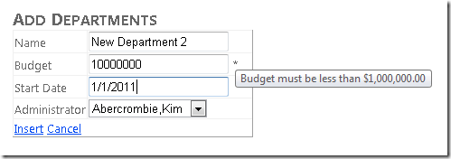](using-the-entity-framework-and-the-objectdatasource-control-part-1-getting-started/_static/image29.png)

Click **Insert**, and you see the error message displayed by the `ValidationSummary` control at the bottom of the page.

[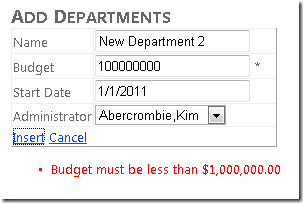](using-the-entity-framework-and-the-objectdatasource-control-part-1-getting-started/_static/image31.png)

Next, close the browser and open the *Departments.aspx* page. Add delete capability to the *Departments.aspx* page by adding a `DeleteMethod` attribute to the `ObjectDataSource` control, and a `DataKeyNames` attribute to the `GridView` control. The opening tags for these controls will now resemble the following example:

[!code[Main](using-the-entity-framework-and-the-objectdatasource-control-part-1-getting-started/samples/sample12.xml)]

Run the page.

Delete the department you added when you ran the *DepartmentsAdd.aspx* page.

## Adding Update Functionality

Open *SchoolRepository.cs* and add the following `Update` method:

[!code[Main](using-the-entity-framework-and-the-objectdatasource-control-part-1-getting-started/samples/sample13.xml)]

When you click **Update** in the *Departments.aspx* page, the `ObjectDataSource` control creates two `Department` entities to pass to the `UpdateDepartment` method. One contains the original values that have been stored in view state, and the other contains the new values that were entered in the `GridView` control. The code in the `UpdateDepartment` method passes the `Department` entity that has the original values to the `Attach` method in order to establish the tracking between the entity and what's in the database. Then the code passes the `Department` entity that has the new values to the `ApplyCurrentValues` method. The object context compares the old and new values. If a new value is different from an old value, the object context changes the property value. The `SaveChanges` method then updates only the changed columns in the database. (However, if the update function for this entity were mapped to a stored procedure, the entire row would be updated regardless of which columns were changed.)

Open the *Departments.aspx* file and add the following attributes to the `DepartmentsObjectDataSource` control:

- `UpdateMethod="UpdateDepartment"`
- `ConflictDetection="CompareAllValues"`   
 This causes old values to be stored in view state so that they can be compared with the new values in the     `Update` method.
- `OldValuesParameterFormatString="orig{0}"`   
 This informs the control that the name of the original values parameter is     `origDepartment` .

The markup for the opening tag of the `ObjectDataSource` control now resembles the following example:

[!code[Main](using-the-entity-framework-and-the-objectdatasource-control-part-1-getting-started/samples/sample14.xml)]

Add an `OnRowUpdating="DepartmentsGridView_RowUpdating"` attribute to the `GridView` control. You will use this to set the `Administrator` property value based on the row the user selects in a drop-down list. The `GridView` opening tag now resembles the following example:

[!code[Main](using-the-entity-framework-and-the-objectdatasource-control-part-1-getting-started/samples/sample15.xml)]

Add an `EditItemTemplate` control for the `Administrator` column to the `GridView` control, immediately after the `ItemTemplate` control for that column:

[!code[Main](using-the-entity-framework-and-the-objectdatasource-control-part-1-getting-started/samples/sample16.xml)]

This `EditItemTemplate` control is similar to the `InsertItemTemplate` control in the *DepartmentsAdd.aspx* page. The difference is that the initial value of the control is set using the `SelectedValue` attribute.

Before the `GridView` control, add a `ValidationSummary` control as you did in the *DepartmentsAdd.aspx* page.

[!code[Main](using-the-entity-framework-and-the-objectdatasource-control-part-1-getting-started/samples/sample17.xml)]

Open *Departments.aspx.cs* and immediately after the partial-class declaration, add the following code to create a private field to reference the `DropDownList` control:

[!code[Main](using-the-entity-framework-and-the-objectdatasource-control-part-1-getting-started/samples/sample18.xml)]

Then add handlers for the `DropDownList` control's `Init` event and the `GridView` control's `RowUpdating` event:

[!code[Main](using-the-entity-framework-and-the-objectdatasource-control-part-1-getting-started/samples/sample19.xml)]

The handler for the `Init` event saves a reference to the `DropDownList` control in the class field. The handler for the `RowUpdating` event uses the reference to get the value the user entered and apply it to the `Administrator` property of the `Department` entity.

Use the *DepartmentsAdd.aspx* page to add a new department, then run the *Departments.aspx* page and click **Edit** on the row that you added.

> [!NOTE] You will not be able to edit rows that you did not add (that is, that were already in the database), because of invalid data in the database; the administrators for the rows that were created with the database are students. If you try to edit one of them, you will get an error page that reports an error like `'InstructorsDropDownList' has a SelectedValue which is invalid because it does not exist in the list of items.`

If you enter an invalid **Budget** amount and then click **Update**, you see the same asterisk and error message that you saw in the *Departments.aspx* page.

Change a field value or select a different administrator and click **Update**. The change is displayed.

[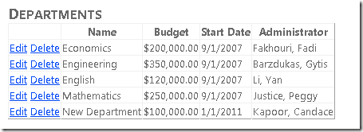](using-the-entity-framework-and-the-objectdatasource-control-part-1-getting-started/_static/image37.png)

This completes the introduction to using the `ObjectDataSource` control for basic CRUD (create, read, update, delete) operations with the Entity Framework. You've built a simple n-tier application, but the business-logic layer is still tightly coupled to the data-access layer, which complicates automated unit testing. In the following tutorial you'll see how to implement the repository pattern to facilitate unit testing.

>[!div class="step-by-step"]
[Next](using-the-entity-framework-and-the-objectdatasource-control-part-2-adding-a-business-logic-layer-and-unit-tests.md)