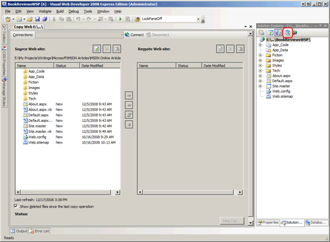
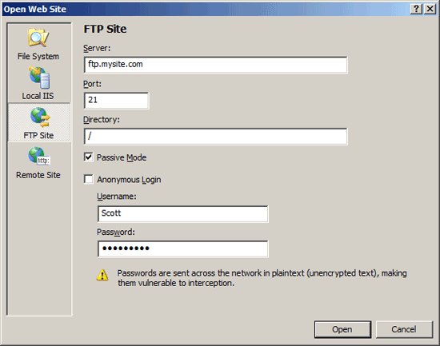
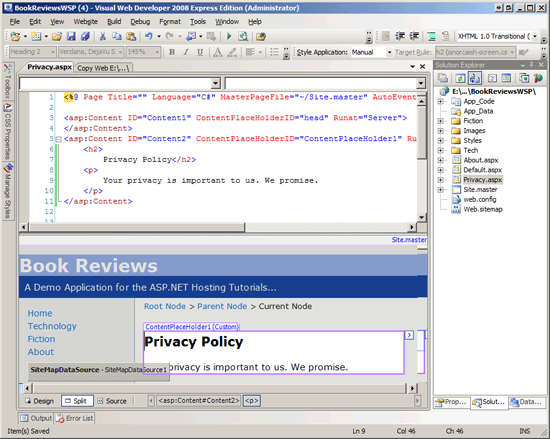
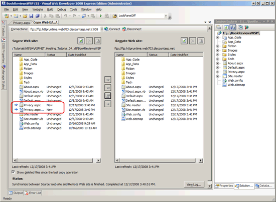
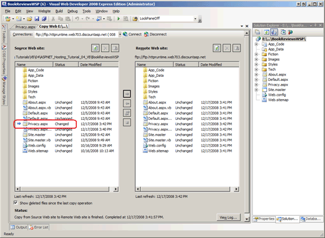
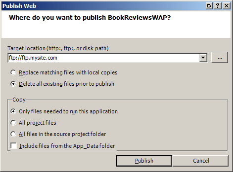
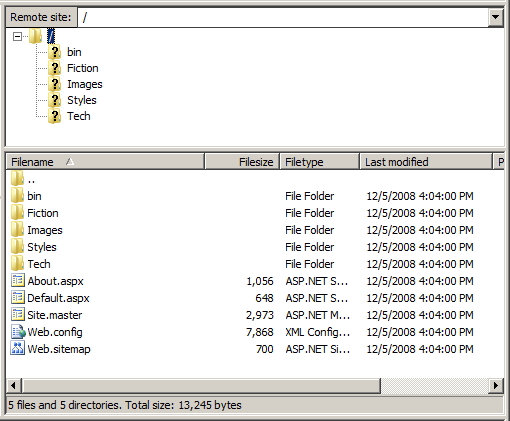

[Edit .md file](C:\Projects\msc\dev\Msc.Www\Web.ASP\App_Data\github\web-forms\overview\older-versions-getting-started\deploying-web-site-projects\deploying-your-site-using-visual-studio-vb.md) | [Edit dev content](http://www.aspdev.net/umbraco#/content/content/edit/25141) | [View dev content](http://docs.aspdev.net/tutorials/web-forms/overview/older-versions-getting-started/deploying-web-site-projects/deploying-your-site-using-visual-studio-vb.html) | [View prod content](http://www.asp.net/web-forms/overview/older-versions-getting-started/deploying-web-site-projects/deploying-your-site-using-visual-studio-vb) | Picker: 33357

Deploying Your Site Using Visual Studio (VB)
====================
by [Scott Mitchell](https://twitter.com/ScottOnWriting)

[Download Code](http://download.microsoft.com/download/4/5/F/45F815EC-8B0E-46D3-9FB8-2DC015CCA306/ASPNET_Hosting_Tutorial_04_VB.zip) or [Download PDF](http://download.microsoft.com/download/E/8/9/E8920AE6-D441-41A7-8A77-9EF8FF970D8B/aspnet_tutorial04_DeployingViaVS_vb.pdf)

> Visual Studio includes tools for deploying a website. Learn more about these tools in this tutorial.

## Introduction

The preceding tutorial looked at how to deploy a simple ASP.NET web application to a web host provider. Specifically, the tutorial showed how to use an FTP client like FileZilla to transfer the necessary files from the development environment to the production environment. Visual Studio also offers built-in tools to facilitate deployment to a web host provider. This tutorial examines two of these tools: the Copy Web Site tool, where you can move files to and from a remote web server using FTP or FrontPage Server Extensions; and the Publish tool, which copies the entire website to a specified location.

> [!NOTE] Other deployment-related tools offered by Visual Studio include [Web Setup Projects](https://msdn.microsoft.com/en-us/library/wx3b589t.aspx) and [Web Deployment Projects](https://www.microsoft.com/downloads/details.aspx?FamilyId=0AA30AE8-C73B-4BDD-BB1B-FE697256C459&amp;displaylang=en) Add-In. Web Setup Projects package a website's contents and configuration information into a single MSI file. This option is most useful for websites that are deployed within an intranet or for companies that sell a pre-packaged web application that customers install on their own web servers. The Web Deployment Projects Add-In is a Visual Studio Add-In that facilitates specifying configuration differences between builds for development environments and production environments. Web Setup Projects are not discussed in this tutorial series; Web Deployment Projects are summarized in the [*Common Configuration Differences Between Development and Production*](common-configuration-differences-between-development-and-production-vb.md) tutorial.

## Deploying Your Site Using the Copy Web Site Tool

Visual Studio's Copy Web Site tool is similar in functionality to a stand-alone FTP client. In a nutshell, the Copy Web Site tool allows you to connect to a remote web site through FTP or FrontPage Server Extensions. Similar to FileZilla's user interface, the Copy Web Site user interface consists of two panes: the left pane lists the local files while the right pane lists those files on the destination server.

> [!NOTE] The Copy Web Site tool is only available for Web Site Projects. Visual Studio does offer this tool when you are working with a Web Application Project.

Let's take a look at using the Copy Web Site tool to publish the Book Review application to production. Because the Copy Web Site tool only works with projects that use the Web Site Project model we can only examine using this tool with the BookReviewsWSP project. Open that project.

Launch the Copy Web Site tool project by clicking the Copy Web Site icon in the Solution Explorer (this icon is circled in Figure 1); alternatively, you can select the Copy Web Site option from the Website menu. Either approach launches the Copy Web Site user interface shown in Figure 1; only the left pane in Figure 1 is populated because we have yet to connect to a remote server.

**Figure 1**: The Copy Web Site Tool's User Interface is Divided Into Two Panes ([Click to view full-size image](deploying-your-site-using-visual-studio-vb/_static/image3.png))

In order to deploy our site we need to first connect to the web host provider. Click the Connect button at the top of the Copy Web Site user interface. This displays the Open Web Site dialog box shown in Figure 2.

You can connect to the destination website by selecting one of the four options from the left:

- **File System** - select this to deploy your site to a folder or network share accessible from your computer.
- **Local IIS** - use this option to deploy the site to the IIS web server installed on your computer.
- **FTP Site** - connect to a remote web site using FTP.
- **Remote Site** - connect to a remote website using FrontPage Server Extensions.

Most web host providers support FTP, but fewer offer FrontPage Server Extension support. For that reason, I've selected the FTP Site option and then entered the connection information as shown in Figure 2.

**Figure 2**: Specify the Destination Website ([Click to view full-size image](deploying-your-site-using-visual-studio-vb/_static/image6.png))

After you connect, the Copy Web Site tool loads the files at the remote site in the right pane and indicates the status of each file: New, Deleted, Changed, or Unchanged. You can copy a file from the local site to the remote site, or vice-a-versa.

Let's add a new page to the BookReviewsWSP project and then deploy it so that we can see the Copy Web Site tool in action. Create a new ASP.NET page in Visual Studio in the root directory named `Privacy.aspx`. Have the page use the master page `Site.master` and add your site's privacy policy to this page. Figure 3 shows Visual Studio after this page has been created.

**Figure 3**: Add a New Page Named `Privacy.aspx` to the Website's Root Folder ([Click to view full-size image](deploying-your-site-using-visual-studio-vb/_static/image9.png))

Next, return to the Copy Web Site user interface. As Figure 4 shows, the left pane now includes the new files - `Policy.aspx` and `Policy.aspx.vb`. What's more, these files are marked with an arrow icon and a Status of New, indicating that they exist on the local site but not on the remote site.

**Figure 4**: The Copy Web Site Tool Includes the New `Privacy.aspx` Page in its Left Pane ([Click to view full-size image](deploying-your-site-using-visual-studio-vb/_static/image12.png))

To deploy the new files select them and then click the arrow icon to transfer them to the remote site. After the transfer completes the `Policy.aspx` and `Policy.aspx.vb` files exist on both the local and remote sites with the status Unchanged.

Along with listing new files, the Copy Web Site tool highlights any files that differ between the local and remote sites. To see this in action, return to the `Privacy.aspx` page and add a few more words to the privacy policy. Save the page and then return to the Copy Web Site tool. As Figure 5 shows, the `Privacy.aspx` page in the left pane has a status of Changed indicating that it is out of sync with the remote site.

**Figure 5**: The Copy Web Site Tool Indicates that the `Privacy.aspx` Page has been Changed ([Click to view full-size image](deploying-your-site-using-visual-studio-vb/_static/image15.png))

The Copy Web Site tool also indicates if a file has been deleted since the last copy operation. Delete the `Privacy.aspx` from the local project and refresh the Copy Web Site tool. The `Privacy.aspx` and `Privacy.aspx.vb` files remain listed in the left pane, but have a Deleted status indicating that they have been removed since the last copy operation.

## Publishing a Web Application

Another way to deploy your web application from within Visual Studio is to use the Publish option, which is accessible via the Build menu. The Publish option explicitly compiles the application and then copies all of the necessary files up to the specified remote site. As we'll see shortly, the Publish option is more blunt than the Copy Web Site tool. Whereas the Copy Web Site tool lets you examine the files on the local and remote sites and permits you to upload or download individual files as needed, the Publish option deploys the entire web application.

In addition to copying all of the needed files to the specified remote site, the Publish option also explicitly compiles the application. Given that Web Application Projects need to be explicitly compiled it should come as no surprise that the Publish option is available for Web Application Projects. What may be a bit surprising is that the Publish option is also available for Web Site Projects. As noted in the [*Determining What Files Need to Be Deployed*](determining-what-files-need-to-be-deployed-vb.md) tutorial, Web Site Projects can be explicitly compiled through a process referred to as *pre-compilation*. This tutorial focuses on using the Publish option with Web Application Projects; a future tutorial will explore pre-compilation, at which point we'll return to look at using the Publish option with Web Site Projects.

> [!NOTE] While the Publish option is available in Visual Studio for both Web Site Projects and Web Application Projects, Visual Web Developer only offers the Publish option for Web Application Projects.

Let's look at deploying the Book Reviews application using the Publish option. Start by opening BookReviewsWAP (the Web Application Project) in Visual Studio. From the Publish menu choose the Build BookReviewsWAP project. This brings up a dialog box that prompts for the target location, among other configuration options (see Figure 6). Much like with the Copy Web Site tool you can enter a location that points to a local folder, a local website on IIS, a remote website that supports FrontPage Server Extensions, or an FTP server address. You can choose whether to replace the files on the remote web server with the deployed files or to delete all of the content on the remote site before publishing. You can also specify whether to copy:

- Only the files in the project needed to run the application, which omits the unneeded source code and project-related files.
- All project files, which includes the source code files and Visual Studio project files like the Solution file.
- All files in the source project folder, which copies all files in the source project folder regardless of whether they're included in the project.

There's also an option to upload the contents of the `App_Data` folder.

**Figure 6**: Specify the Destination Website ([Click to view full-size image](deploying-your-site-using-visual-studio-vb/_static/image18.png))

For the Book Review application the remote site contains the files deployed when copying the BookReviewsWSP project via the Copy Web Site tool. Therefore, let's have the Publish option start by deleting all existing content. Also, let's just copy the necessary files rather than cluttering the production environment with unneeded source code and project files. After specifying these options, click the Publish button. Over the next several seconds Visual Studio will deploy the necessary files to the destination site, displaying its progress in the Output window.

Figure 7 shows the files on the FTP site after the Publish operation has completed. Note that only the markup pages and the necessary sever- and client-side support files have been uploaded.

**Figure 7**: Only the Needed Files Were Published to the Production Environment ([Click to view full-size image](deploying-your-site-using-visual-studio-vb/_static/image21.png))

The Publish option is a less nuanced tool than the Copy Web Site tool. Whereas the Copy Web Site tool allows you to inspect the files on the local and remote sites and see how they differ, the Publish option provides no such interface. Moreover, the Copy Web Site tool enables you to make one-off changes, uploading or deleting individual files. The Publish option does not allow such fine-grained control; instead, it publishes the *entire* application. This behavior has its pros and cons. On the plus side, you know when using the Publish option you won't be forgetting to upload an important file. But consider what happens if you have made a small change to a very large website - with the Publish option you cannot update that page or two that has been modified, but instead you must wait while Visual Studio deploys the entire site.

It's not uncommon for there to be certain files whose content differs between the production and development environments. A key example is the application's configuration file, `Web.config`. Because the Publish option blindly copies the web application files it overwrites the production environment's customized configuration files with the version in the development environment. The subsequent tutorial explores this topic further and offers tips for deploying a web application when such differences exist.

## Summary

Deploying a website involves copying the necessary files from the development environment to the production environment. The previous tutorial showed how to transfer files using an FTP client like FileZilla. This tutorial examined two deployment tools in Visual Studio: the Copy Web Site tool and the Publish option. The Copy Web Site tool is similar to an FTP client in that it has a two-paned interface listing the files on the local computer and a specified remote computer that makes it easy to upload or download files between the two computers. The Publish option is a more blunt tool that explicitly compiles the project and then deploys the entire application to the specified destination.

Happy Programming!

### Further Reading

For more information on the topics discussed in this tutorial, refer to the following resources:

- [Copying Web Site with the Copy Web Site Tool](https://msdn.microsoft.com/en-us/library/1cc82atw.aspx)
- [How Do I: Deploy a Web Site Using the Copy Web Site Tool](../../../videos/how-do-i/how-do-i-deploy-a-web-site-using-the-copy-web-site-tool.md) (Video)
- [How To: Publish Web Application Projects](https://msdn.microsoft.com/en-us/library/aa983453.aspx)
- [How To: Publish Web Sites](https://msdn.microsoft.com/en-us/library/20yh9f1b.aspx)
- [Setup and Deployment Projects in Visual Studio](https://msdn.microsoft.com/en-us/library/wx3b589t.aspx)

>[!div class="step-by-step"] [Previous](deploying-your-site-using-an-ftp-client-vb.md) [Next](common-configuration-differences-between-development-and-production-vb.md)