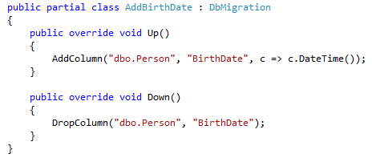
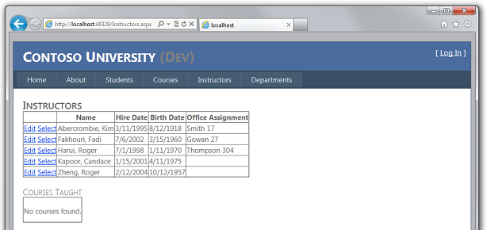
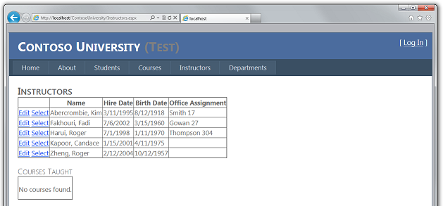
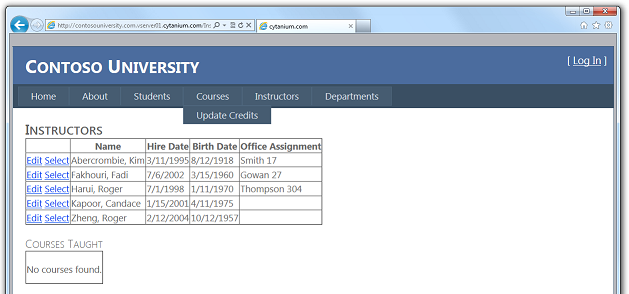

Deploying an ASP.NET Web Application with SQL Server Compact using Visual Studio or Visual Web Developer: Deploying a Database Update - 9 of 12
====================
by [Tom Dykstra](https://github.com/tdykstra)

[Download Starter Project](http://code.msdn.microsoft.com/Deploying-an-ASPNET-Web-4e31366b)

> This series of tutorials shows you how to deploy (publish) an ASP.NET web application project that includes a SQL Server Compact database by using Visual Studio 2012 RC or Visual Studio Express 2012 RC for Web. You can also use Visual Studio 2010 if you install the Web Publish Update. For an introduction to the series, see [the first tutorial in the series](deployment-to-a-hosting-provider-introduction-1-of-12.md).
> 
> For a tutorial that shows deployment features introduced after the RC release of Visual Studio 2012, shows how to deploy SQL Server editions other than SQL Server Compact, and shows how to deploy to Azure App Service Web Apps, see [ASP.NET Web Deployment using Visual Studio](../../deployment/visual-studio-web-deployment/introduction.md).

## Overview

In this tutorial, you make a database change and related code changes, test the changes in Visual Studio, then deploy the update to both the test and production environments.

Reminder: If you get an error message or something doesn't work as you go through the tutorial, be sure to check the [troubleshooting page](deployment-to-a-hosting-provider-creating-and-installing-deployment-packages-12-of-12.md).

## Adding a New Column to a Table

In this section, you add a birth date column to the `Person` base class for the `Student` and `Instructor` entities. Then you update the page that displays instructor data so that it displays the new column.

In the *ContosoUniversity.DAL* project, open *Person.cs* and add the following property at the end of the `Person` class (there should be two closing curly braces following it):

    [DisplayFormat(DataFormatString = "{0:d}", ApplyFormatInEditMode = true)]
    [Display(Name = "Birth Date")]
    public DateTime? BirthDate { get; set; }

Next, update the Seed method so that it provides a value for the new column. Open *Migrations\Configuration.cs* and replace the code block that begins `var instructors = new List<Instructor>` with the following code block which includes birth date information:

    var instructors = new List<Instructor>
    {
        new Instructor { FirstMidName = "Kim",     LastName = "Abercrombie", HireDate = DateTime.Parse("1995-03-11"), BirthDate = DateTime.Parse("1918-08-12"), OfficeAssignment = new OfficeAssignment { Location = "Smith 17" } },
        new Instructor { FirstMidName = "Fadi",    LastName = "Fakhouri",    HireDate = DateTime.Parse("2002-07-06"), BirthDate = DateTime.Parse("1960-03-15"), OfficeAssignment = new OfficeAssignment { Location = "Gowan 27" } },
        new Instructor { FirstMidName = "Roger",   LastName = "Harui",       HireDate = DateTime.Parse("1998-07-01"), BirthDate = DateTime.Parse("1970-01-11"), OfficeAssignment = new OfficeAssignment { Location = "Thompson 304" } },
        new Instructor { FirstMidName = "Candace", LastName = "Kapoor",      HireDate = DateTime.Parse("2001-01-15"), BirthDate = DateTime.Parse("1975-04-11") },
        new Instructor { FirstMidName = "Roger",   LastName = "Zheng",       HireDate = DateTime.Parse("2004-02-12"), BirthDate = DateTime.Parse("1957-10-12") }
    };

In the ContosoUniversity project, open *Instructors.aspx* and add a new template field to display the birth date. Add it between the ones for hire date and office assignment:

    <asp:TemplateField HeaderText="Birth Date" SortExpression="BirthDate">
        <ItemTemplate>
            <asp:Label ID="InstructorBirthDateLabel" runat="server" Text='<%# Eval("BirthDate", "{0:d}") %>'></asp:Label>
        </ItemTemplate>
        <EditItemTemplate>
            <asp:TextBox ID="InstructorBirthDateTextBox" runat="server" Text='<%# Bind("BirthDate", "{0:d}") %>'
                Width="7em"></asp:TextBox>
        </EditItemTemplate>
    </asp:TemplateField>

(If code indentation gets out of sync, you can press CTRL-K and then CTRL-D to automatically reformat the file.)

Build the solution, and then open the **Package Manager Console** window. Make sure that ContosoUniversity.DAL is still selected as the **Default project**.

In the **Package Manager Console** window, select **ContosoUniversity.DAL** as the **Default project**, and then enter the following command:

    add-migration AddBirthDate

When this command finishes, Visual Studio opens the class file that defines the new `DbMIgration` class, and in the `Up` method you can see the code that creates the new column.

Build the solution, and then enter the following command in the **Package Manager Console** window (make sure the ContosoUniversity.DAL project is still selected):

    update-database

When the command finishes, run the application and select the Instructors page. When the page loads, you see that it has the new birth date field.

## Deploying the Database Update to the Test Environment

In **Solution Explorer** select the ContosoUniversity project.

In the **Web One Click Publish** toolbar, select the **Test** publish profile, and then click **Publish Web**. (If the toolbar is disabled, select the ContosoUniversity project in **Solution Explorer**.)

Visual Studio deploys the updated application, and the browser opens to the home page. Run the Instructors page to verify that the update was successfully deployed. When the application tries to access the database for this page, Code First updates the database schema and runs the `Seed` method. When the page displays, you see the expected **Birth Date** column with dates in it.

## Deploying the Database Update to the Production Environment

You can now deploy to production. The only difference is that you'll use *app\_offline.htm* to prevent users from accessing the site and thus updating the database while you're deploying changes. For production deployment perform the following steps:

- Upload the *app\_offline.htm* file to the production site.
- In Visual Studio, choose the Production profile in the **Web One Click Publish** toolbar and click **Publish Web**.
- Delete the *app\_offline.htm* file from the production site.

> [!NOTE] While your application is in use in the production environment you should be implementing a backup plan. That is, you should be periodically copying the *School-Prod.sdf* and *aspnet-Prod.sdf* files from the production site to a secure storage location, and you should be keeping several generations of such backups. When you update the database, you should make a backup copy from immediately before the change. Then, if you make a mistake and don't discover it until after you have deployed it to production, you will still be able to recover the database to the state it was in before it became corrupted.

When Visual Studio opens the home page URL in the browser, the *app\_offline.htm* page is displayed. After you delete the *app\_offline.htm* file, you can browse to your home page again to verify that the update was successfully deployed.

You've now deployed an application update that included a database change to both test and production. The next tutorial shows you how to migrate your database from SQL Server Compact to SQL Server Express and SQL Server.

>[!div class="step-by-step"] [Previous](deployment-to-a-hosting-provider-deploying-a-code-only-update-8-of-12.md) [Next](deployment-to-a-hosting-provider-migrating-to-sql-server-10-of-12.md)