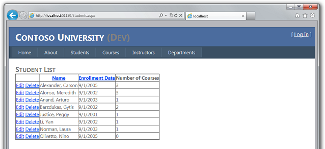
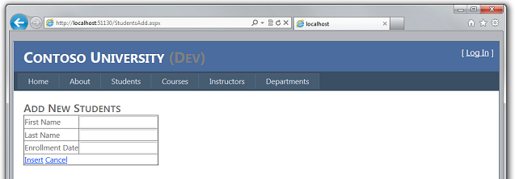

[Edit .md file](C:\Projects\msc\dev\Msc.Www\Web.ASP\App_Data\github\web-forms\overview\older-versions-getting-started\deployment-to-a-hosting-provider\deployment-to-a-hosting-provider-introduction-1-of-12.md) | [Edit dev content](http://www.aspdev.net/umbraco#/content/content/edit/34114) | [View dev content](http://docs.aspdev.net/tutorials/web-forms/overview/older-versions-getting-started/deployment-to-a-hosting-provider/deployment-to-a-hosting-provider-introduction-1-of-12.html) | [View prod content](http://www.asp.net/web-forms/overview/older-versions-getting-started/deployment-to-a-hosting-provider/deployment-to-a-hosting-provider-introduction-1-of-12) | Picker: 36390

Deploying an ASP.NET Web Application with SQL Server Compact using Visual Studio: Introduction - 1 of 12
====================
by [Tom Dykstra](https://github.com/tdykstra)

[Download Starter Project](http://code.msdn.microsoft.com/Deploying-an-ASPNET-Web-4e31366b)

> This series of tutorials shows you how to deploy (publish) an ASP.NET web application project that includes a SQL Server Compact database by using Visual Studio 2012 RC or Visual Studio Express 2012 RC for Web. You can also use Visual Studio 2010 if you install the Web Publish Update.
> 
> For a tutorial that shows deployment features introduced after the RC release of Visual Studio 2012, shows how to deploy SQL Server editions other than SQL Server Compact, and shows how to deploy to Azure App Service Web Apps, see [ASP.NET Web Deployment using Visual Studio](../../deployment/visual-studio-web-deployment/introduction.md).
> 
> These tutorials guide you through deploying first to IIS on your local development computer for testing, and then to a third-party hosting provider. The application that you'll deploy uses an application database and an ASP.NET membership database. You start off using SQL Server Compact and deploying to SQL Server Compact, and later tutorials show you how to deploy database changes and how to migrate to SQL Server.
> 
> The tutorials assume you know how to work with ASP.NET in Visual Studio. If you don't, a good place to start is a [basic ASP.NET Web Forms Tutorial](../tailspin-spyworks/tailspin-spyworks-part-1.md) or a [basic ASP.NET MVC Tutorial](../../../../mvc/overview/older-versions/getting-started-with-aspnet-mvc3/cs/intro-to-aspnet-mvc-3.md).
> 
> If you have questions that are not directly related to the tutorial, you can post them to the [ASP.NET Deployment forum](https://forums.asp.net/26.aspx/1?Configuration+and+Deployment).

## Overview

These tutorials guide you through deploying first to IIS on your local development computer for testing, and then to a third-party hosting provider. The application that you'll deploy uses an application database and an ASP.NET membership database. You start off using SQL Server Compact and deploying to SQL Server Compact, and later tutorials show you how to deploy database changes and how to migrate to SQL Server.

The number of tutorials – 11 in all plus a troubleshooting page – might make the deployment process seem daunting. In fact, the basic procedures for deploying a site make up a relatively small part of the tutorial set. However, in real-world situations, you often need information about some small but important extra aspect of deployment — for example, setting folder permissions on the target server. We've included many of these additional techniques in the tutorials, with the hope that the tutorials don't leave out information that might prevent you from successfully deploying a real application.

The tutorials are designed to run in sequence, and each part builds on the previous part. However, you can skip parts that aren't relevant to your situation. (Skipping parts might require you to adjust the procedures in later tutorials.)

## Intended Audience

The tutorials are aimed at ASP.NET developers who work in small organizations or other environments where:

- A continuous integration process (automated builds and deployment) is not used.
- The production environment is a third-party hosting provider.
- One person typically fills multiple roles (the same person develops, tests, and deploys).

In enterprise environments, it's more typical to implement continuous integration processes, and the production environment is usually hosted by the company's own servers. Different people also typically perform different roles. For information about enterprise deployment, see [Deploying Web Applications in Enterprise Scenarios](../../deployment/deploying-web-applications-in-enterprise-scenarios/deploying-web-applications-in-enterprise-scenarios.md).

Organizations of all sizes can also deploy web applications to Azure, and most of the procedures shown in these tutorials apply also to Azure App Services Web Apps. For an introduction to Azure, see [https://azure.microsoft.com](https://azure.microsoft.com).

## The Hosting Provider Shown in the Tutorials

The tutorials take you through the process of setting up an account with a hosting company and deploying the application to that hosting provider. A specific hosting company was chosen so that the tutorials could illustrate the complete experience of deploying to a live website. Each hosting company provides different features, and the experience of deploying to their servers varies somewhat; however, the process described in this tutorial is typical for the overall process.

The hosting provider used for this tutorial, Cytanium.com, is one of many that are available, and its use in this tutorial does not constitute an endorsement or recommendation.

## Deploying Web Site Projects

Contoso University is a Visual Studio web application project. Most of the deployment methods and tools demonstrated in this tutorial do not apply to [Web Site Projects](https://msdn.microsoft.com/en-us/library/dd547590.aspx). For information about how to deploy web site projects, see [ASP.NET Deployment Content Map](https://msdn.microsoft.com/en-us/library/bb386521.aspx#deployment_for_web_site_projects).

## Deploying ASP.NET MVC Projects

For this tutorial you deploy an ASP.NET Web Forms project, but everything you learn how to do is applicable to ASP.NET MVC as well. A Visual Studio MVC project is just another form of web application project. The only difference is that if you're deploying to a hosting provider that does not support ASP.NET MVC or your target version of it, you must make sure that you have installed the appropriate ([MVC 3](http://nuget.org/packages/AspNetMvc/3.0.20105.0) or [MVC 4](http://nuget.org/packages/aspnetmvc)) NuGet package in your project.

## Programming Language

The sample application uses C# but the tutorials do not require knowledge of C#, and the deployment techniques shown by the tutorials are not language-specific.

## Troubleshooting During this Tutorial

When an error happens during deployment, or if the deployed site does not run correctly, the error messages don't always provide a solution. To help you with some common problem scenarios, a [troubleshooting reference page](deployment-to-a-hosting-provider-creating-and-installing-deployment-packages-12-of-12.md) is available. If you get an error message or something doesn't work as you go through the tutorials, be sure to check the troubleshooting page.

## Comments Welcome

Comments on the tutorials are welcome, and when the tutorial is updated every effort will be made to take into account corrections or suggestions for improvements that are provided in tutorial comments.

## Prerequisites

Before you start, make sure that you have Windows 7 or later and one of the following products installed on your computer:

- [Visual Studio 2010 SP1](https://www.microsoft.com/web/gallery/install.aspx?appsxml=&amp;appid=VS2010SP1Pack)
- [Visual Web Developer Express 2010 SP1](https://www.microsoft.com/web/gallery/install.aspx?appsxml=&amp;appid=VWD2010SP1Pack)
- [Visual Studio 2012 RC or Visual Studio Express 2012 RC for Web](https://go.microsoft.com/fwlink/?LinkId=240162)

If you have Visual Studio 2010 SP1 or Visual Web Developer Express 2010 SP1, install the following products also:

- [Azure SDK for .NET (VS 2010 SP1)](https://go.microsoft.com/fwlink/?LinkID=208120) (includes the Web Publish Update)
- [Microsoft Visual Studio 2010 SP1 Tools for SQL Server Compact 4.0](https://www.microsoft.com/web/gallery/install.aspx?appid=SQLCEVSTools)

Some other software is required in order to complete the tutorial, but you don't have to have that loaded yet. The tutorial will walk you through the steps for installing it when you need it.

## Downloading the Sample Application

The application you'll deploy is named Contoso University and has already been created for you. It's a simplified version of a university web site, based loosely on the Contoso University application described in the [Entity Framework tutorials on the ASP.NET site](https://asp.net/entity-framework/tutorials).

When you have the prerequisites installed, download the [Contoso University web application](https://code.msdn.microsoft.com/Deploying-an-ASPNET-Web-4e31366b). The *.zip* file contains multiple versions of the project and a PDF file that contains all 12 tutorials. To work through the steps of the tutorial, start with ContosoUniversity-Begin. To see what the project looks like at the end of the tutorials, open ContosoUniversity-End. To see what the project looks like before the migration to full SQL Server in tutorial 10, open ContosoUniversity-AfterTutorial09.

To prepare to work through the tutorial steps, save ContosoUniversity-Begin to whatever folder you use for working with Visual Studio projects. By default this is the following folder:

`C:\Users\<username>\Documents\Visual Studio 2012\Projects`

(For the screen shots in this tutorial, the project folder is located in the root directory on the `C`: drive.)

Start Visual Studio, open the project, and press CTRL-F5 to run it.

The website pages are accessible from the menu bar and let you perform the following functions:

- Display student statistics (the About page).
- Display, edit, delete, and add students.
- Display and edit courses.
- Display and edit instructors.
- Display and edit departments.

Following are screen shots of a few representative pages.

## Reviewing Application Features that Affect Deployment

The following features of the application affect how you deploy it or what you have to do to deploy it. Each of these is explained in more detail in the following tutorials in the series.

- Contoso University uses a SQL Server Compact database to store application data such as student and instructor names. The database contains a mix of test data and production data, and when you deploy to production you need to exclude the test data. Later in the tutorial series you'll migrate from SQL Server Compact to SQL Server.
- The application uses the ASP.NET membership system, which stores user account information in a SQL Server Compact database. The application defines an administrator user who has access to some restricted information. You need to deploy the membership database without test accounts but with one administrator account.
- Because the application database and the membership database use SQL Server Compact as the database engine, you have to deploy the database engine to the hosting provider, as well as the databases themselves.
- The application uses ASP.NET universal membership providers so that the membership system can store its data in a SQL Server Compact database. The assembly that contains the universal membership providers must be deployed with the application.
- The application uses the Entity Framework 5.0 to access data in the application database. The assembly that contains Entity Framework 5.0 must be deployed with the application.
- The application uses a third-party error logging and reporting utility. This utility is provided in an assembly which must be deployed with the application.
- The error logging utility writes error information in XML files to a file folder. You have to make sure that the account that ASP.NET runs under in the deployed site has write permission to this folder, and you have to exclude this folder from deployment. (Otherwise, error log data from the test environment might be deployed to production and/or production error log files might be deleted.)
- The application includes some settings that must be changed in in the deployed *Web.config* file depending on the destination environment (test or production), and other settings that must be changed depending on the build configuration (Debug or Release).
- The Visual Studio solution includes a class library project. Only the assembly that this project generates should be deployed, not the project itself.

In this first tutorial in the series, you have downloaded the sample Visual Studio project and reviewed site features that affect how you deploy the application. In the following tutorials, you prepare for deployment by setting up some of these things to be handled automatically. Others you take care of manually.

>[!div class="step-by-step"] [Next](deployment-to-a-hosting-provider-deploying-sql-server-compact-databases-2-of-12.md)