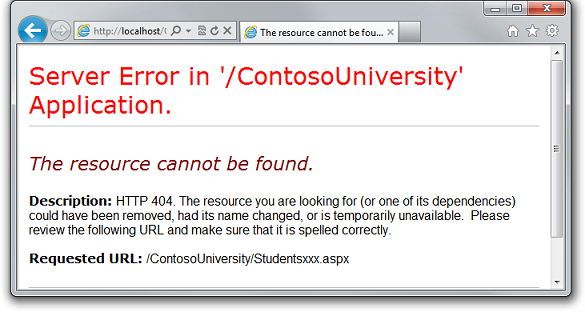
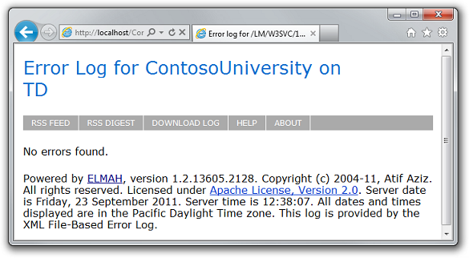
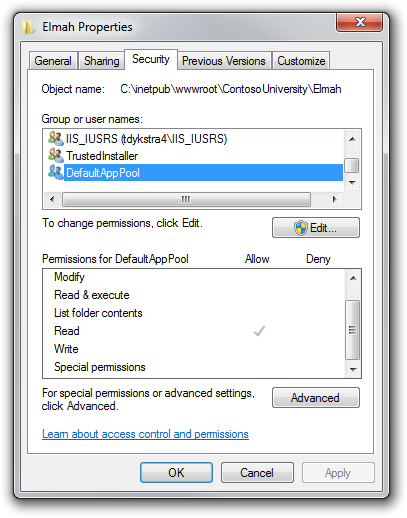
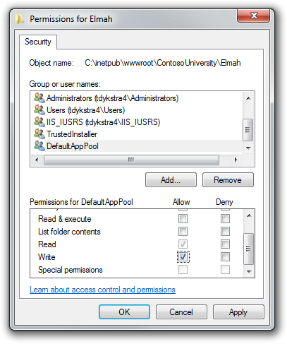
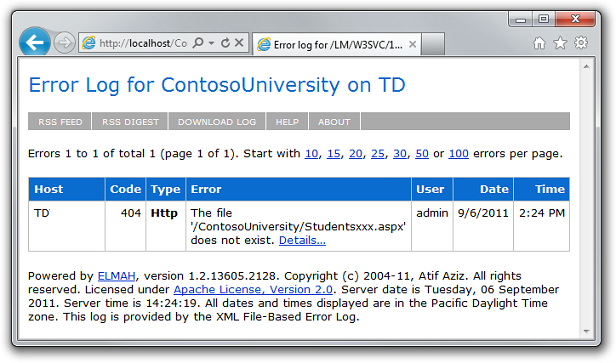

Deploying an ASP.NET Web Application with SQL Server Compact using Visual Studio or Visual Web Developer: Setting Folder Permissions - 6 of 12
====================
by [Tom Dykstra](https://github.com/tdykstra)

[Download Starter Project](http://code.msdn.microsoft.com/Deploying-an-ASPNET-Web-4e31366b)

> This series of tutorials shows you how to deploy (publish) an ASP.NET web application project that includes a SQL Server Compact database by using Visual Studio 2012 RC or Visual Studio Express 2012 RC for Web. You can also use Visual Studio 2010 if you install the Web Publish Update. For an introduction to the series, see [the first tutorial in the series](deployment-to-a-hosting-provider-introduction-1-of-12.md).
> 
> For a tutorial that shows deployment features introduced after the RC release of Visual Studio 2012, shows how to deploy SQL Server editions other than SQL Server Compact, and shows how to deploy to Azure App Service Web Apps, see [ASP.NET Web Deployment using Visual Studio](../../deployment/visual-studio-web-deployment/introduction.md).

## Overview

In this tutorial, you set folder permissions for the *Elmah* folder in the deployed web site so that the application can create log files in that folder.

When you test a web application in Visual Studio using the Visual Studio Development Server (Cassini), the application runs under your identity. You are most likely an administrator on your development computer and have full authority to do anything to any file in any folder. But when an application runs under IIS, it runs under the identity defined for the application pool that the site is assigned to. This is typically a system-defined account that has limited permissions. By default it has read and execute permissions on your web application's files and folders, but it doesn't have write access.

This becomes an issue if your application creates or updates files, which is a common need in web applications. In the Contoso University application, Elmah creates XML files in the *Elmah* folder in order to save details about errors. Even if you don't use something like Elmah, your site might let users upload files or perform other tasks that write data to a folder in your site.

Reminder: If you get an error message or something doesn't work as you go through the tutorial, be sure to check the [troubleshooting page](deployment-to-a-hosting-provider-creating-and-installing-deployment-packages-12-of-12.md).

## Testing Error Logging and Reporting

To see how the application doesn't work correctly in IIS (although it did when you tested it in Visual Studio), you can cause an error that would normally be logged by Elmah, and then open the Elmah error log to see the details. If Elmah was unable to create an XML file and store the error details, you see an empty error report.

Open a browser and go to `http://localhost/ContosoUniversity`, and then request an invalid URL like *Studentsxxx.aspx*. You see a system-generated error page instead of the *GenericErrorPage.aspx* page because the `customErrors` setting in the Web.config file is "RemoteOnly" and you are running IIS locally:

Now run *Elmah.axd* to see the error report. You see an empty error log page because Elmah was unable to create an XML file in the *Elmah* folder:

## Setting Write Permission on the Elmah Folder

You can set folder permissions manually or you can make it an automatic part of the deployment process. Making it automatic requires complex MSBuild code, and since you only have to do this the first time you deploy, this tutorial only shows how to do it manually. (For information about how to make this part of the deployment process, see [Setting Folder Permissions on Web Publish](http://sedodream.com/2011/11/08/SettingFolderPermissionsOnWebPublish.aspx) on Sayed Hashimi's blog.)

In **Windows Explorer**, navigate to *C:\inetpub\wwwroot\ContosoUniversity*. Right-click the *Elmah* folder, select **Properties**, and then select the **Security** tab.

(If you don't see **DefaultAppPool** in the **Group or user names** list, you probably used some other method than the one specified in this tutorial to set up IIS and ASP.NET 4 on your computer. In that case, find out what identity is used by the application pool assigned to the Contoso University application, and grant write permission to that identity. See the links about application pool identities at the end of this tutorial.)

Click **Edit**. In the **Permissions for Elmah** dialog box, select **DefaultAppPool**, and then select the **Write** check box in the **Allow** column.

Click **OK** in both dialog boxes.

## Retesting Error Logging and Reporting

Test by causing an error again in the same way (request a bad URL) and run the **Error Log** page. This time the error appears on the page.

You also need write permission on the *App\_Data* folder because you have SQL Server Compact database files in that folder, and you want to be able to update data in those databases. In that case, however, you don't have to do anything extra because the deployment process automatically sets write permission on the *App\_Data* folder.

You have now completed all of the tasks necessary to get Contoso University working correctly in IIS on your local computer. In the next tutorial, you will make the site publicly available by deploying it to a hosting provider.

## More Information

In this example, the reason why Elmah was unable to save log files was fairly obvious. You can use IIS tracing in cases where the cause of the problem is not so obvious; see [Troubleshooting Failed Requests Using Tracing in IIS 7](https://www.iis.net/learn/troubleshoot/using-failed-request-tracing/troubleshooting-failed-requests-using-tracing-in-iis) on the IIS.net site.

For more information about how to grant permissions to application pool identities, see [Application Pool Identities](https://www.iis.net/learn/manage/configuring-security/application-pool-identities) and [Secure Content in IIS Through File System ACLs](https://www.iis.net/learn/get-started/planning-for-security/secure-content-in-iis-through-file-system-acls)on the IIS.net site.

>[!div class="step-by-step"]
[Previous](deployment-to-a-hosting-provider-deploying-to-iis-as-a-test-environment-5-of-12.md)
[Next](deployment-to-a-hosting-provider-deploying-to-the-production-environment-7-of-12.md)